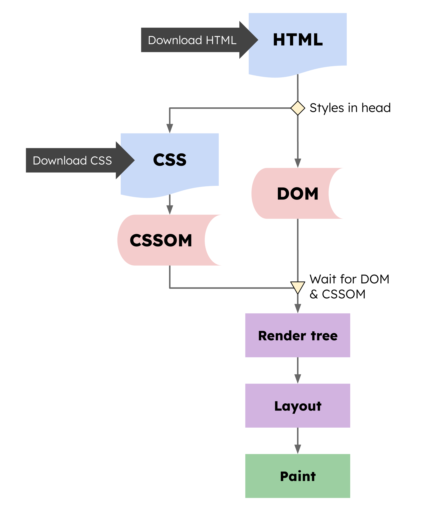
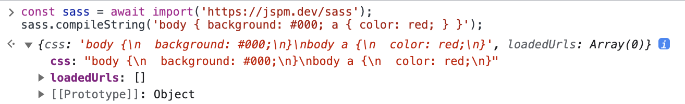
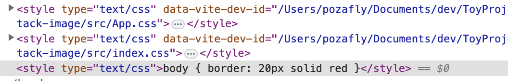
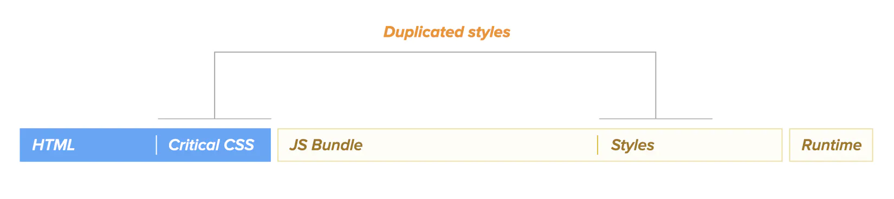
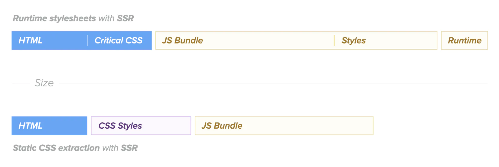
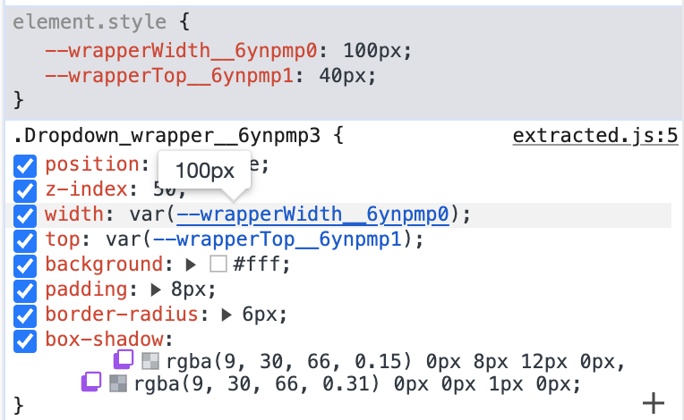
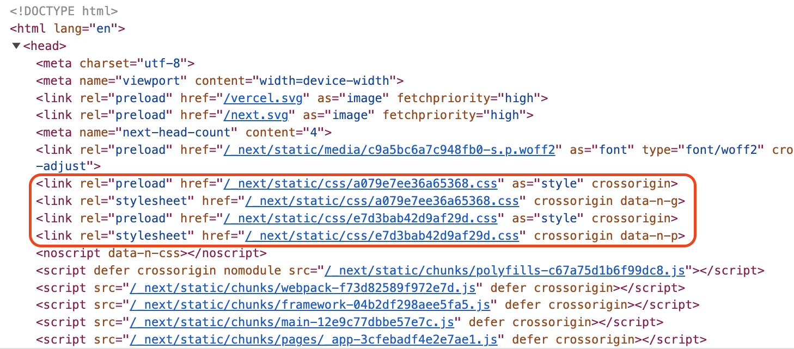

모던 웹 개발 생태계에서 CSS를 제작할 수 있는 다양한 방법이 있다. JavaScript 웹 프레임워크 분야는 거의 React가 대부분을 차지하고 있다. CSS 프레임워크(혹은 라이브러리)도 React의 영향 때문인지, 프로덕션에 CSS-in-JS인 styled-components 또는 Emotion을 사용하고 있는 것 같다.

웹 어플리케이션 크기가 커질 수록 성능이 중요하기 마련이다. React 및 Angular, Vue가 나왔을 때 SPA 환경에서의 성능 문제 혹은 여러 문제 때문에 SSR 환경이 중요하게 되었고, 마찬가지로 SPA를 사용할 당시의 CSS-in-JS 라이브러리는 런타임 시점에 스타일을 동적으로 입히는 방식이었지만, 점차 성능 문제가 대두되기도 한다. 재미있는 것은 SSR은 새로운 개념처럼 이야기하지만, 기존의 PHP와 같은 방식(서버에서 템플릿 엔진을 사용한)으로 되돌아 간 것이기도 하고(내부 구현은 다르지만), CSS도 마찬가지로 zero-runtime 이라는 새로운 용어를 이야기하지만, 빌드 시점에 스타일을 생성해 고전적인 방식으로 브라우저에 전달하는 방식으로 되돌아오는 것을 볼 수 있다.

CSS-in-JS에서 어떤 방식으로 런타임에 스타일을 입히는지 알아보고, 성능 측면에서 CSS-in-JS의 zero-runtime은 어떤 것을 말하는지 알아보자.

<br/>

## CRP (Critical Rendering Path)

CSS 적용 방법을 알아보기 전에 브라우저에 대해 짚고 넘어가자. 브라우저는 **HTML**, **CSS**, **JS** 파일을 통해 화면을 그린다. 따라서, HTML, CSS, JS 파일 외 다른 파일은 알지 못한다. 아래 이미지를 보자.



1. 먼저 브라우저에서 사용자가 URL을 입력하고 접속하면 웹 서버에서 HTML 파일을 브라우저로 내려준다.
2. 브라우저가 HTML 파일을 파싱한다. 파싱하면서 DOM을 생성한다.
3. `<link>` 태그를 만나면 외부 리소스를 다운로드한다.
4. CSS 외부 리소스를 다운로드하면 CSS 파일로 CSSOM을 생성한다.
5. `<script>` 태그를 만나면 JavaScript 파일을 다운로드한다.
6. DOM + CSSOM을 합쳐 Render Tree를 만든다.
7. Element의 위치와 간격을 계산하는 Layout 과정이 일어난다.
8. 레이어 별로 실제 그리기 작업을 수행하는 Paint 과정이 일어난다.

이때 CSS와 JS는 **렌더링 차단 리소스**이다. CSS가 다운로드 되지 않으면 CSSOM을 만들 수 없고, CSSOM을 만들 수 없으면 Render Tree 가 만들어지지 않아 다음 순서를 진행할 수 없기 때문이다. JavaScript는 렌더링 차단 리소스이면서, DOM 파싱도 차단한다. `defer` 또는 `async` 속성을 사용한다면 이야기는 달라질 수 있다. 어쨌듯, 중요한 사실은 CSS는 렌더링 차단 리소스라는 것이다. 이는 성능에 영향을 줄 수 있다는 사실을 기억하고 넘어가도록 하자.

<br/>

## CSS가 브라우저에 적용되는 3가지 방법

기초적으로 짚고 넘어가야 할 부분이다. CSS는 브라우저에 적용되기 위해 3가지 방법이 있는데, 이는 섞어 사용할 수도 있고 하나의 방법만으로도 사용할 수 있다.

- Inline(인라인) CSS
- Internal(내부) CSS
- External(외부) CSS

### Inline CSS

초기에 HTML은 문서를 전달하기 위해 만들어졌다. HTML로만 문서를 전달하다 보니 중요한 콘텐츠에 강조 표시를 하거나, 레이아웃을 다르게 하고 싶은 요구가 생겨났다. 그래서 HTML의 태그에 `style` attribute를 작성하면 글자 색상을 변경시키거나, 폰트 크기를 변경시킬 수 있었다.

```html
<p style="color: blue; font-size: 18px;">
  content here
</p>
```

이런 방식으로 CSS를 입히는 것을 Inline CSS라고 한다.

### Internal CSS

Inline CSS로 스타일을 입히는 방식이 코드 중복이 많아지고 HTML을 읽을 경우 한눈에 파악하기 어렵다는 단점이 있어 나타난 개념이다.

```html
<head>
  <style>
    body {
      color: blue;
      font-size: 18px;      
    }
  </style>  
</head>
```

`<head>` 태그에 `<style>` 태그를 작성하고, 그 안에 Selector를 사용해서 스타일을 입힐 수 있다.

### External CSS

CSS 파일을 외부 리소스로 빼는 방법이다. Internal CSS 같은 경우는, `<style>` 태그 내의 모든 CSS가 정의되어야 한다. 따라서 어느 섹션의 어느 부분이 스타일이 입혀지고 있는지 파악하기 어렵다. 따라서, 여러 개의 CSS 파일을 만들고 구역별로 CSS를 여러 개 작성하면 개발자가 코드를 파악하기 쉬워진다.

```html
<head>
  <link rel="stylesheet" type="text/css" href="./main.css">
  <link rel="stylesheet" type="text/css" href="../side/side.css">
</head>
```

`<link>` 태그에 외부 경로를 작성하면 된다. 브라우저가 HTML을 파싱하면서 `<head>`의 `<link>`를 만나면 href 경로를 통해 외부 `.css` 파일을 다운로드하기 시작한다.

> ※ `<link>` 태그로 외부 CSS 파일을 로드할 경우, HTML을 파싱하는 과정은 멈추지 않는다. 다만 Rendering만 Block 될 뿐이다. [링크](https://www.mo4tech.com/does-css-block-dom-parsing.html)

---

3가지 방법으로 브라우저는 웹 페이지에 스타일을 입힐 수 있는데, 이 부분에서 CRP를 다시 상기시켜 보자. 화면이 그려지는 과정은 HTML 파일을 파싱하여 DOM Tree가 그려지고, CSS를 통해 CSSOM이 그려져야 Render Tree를 만들 수 있다는 점이다.

따라서, 어떤 방법을 사용하든 CSS가 모두 파싱 된 후, **CSSOM이 만들어져야 브라우저가 화면을 그릴 수 있다**.

<br/>

## Critical CSS

CSS 파일이 커지면 당연히 브라우저에서 다운로드 받아야 할 파일 크기가 커지고, 파일 크기가 커지면 CSS 파일을 다운로드 받는 시간이 늘어나며 브라우저가 CSSOM을 만들기 위해 소모되는 시간도 늘어난다. 그렇다면 어떻게 효율적으로 CSS를 적용할 수 있을까?

[Critical CSS](https://web.dev/i18n/ko/extract-critical-css/)란, 사용자에게 가능한 한 빠르게 콘텐츠를 렌더링하기 위해 스크롤 없이 볼 수 있는 콘텐츠에 대한 CSS를 추출하는 것을 말한다.


웹페이지는 스크롤 없이 볼 수 있는 영역과 스크롤 해야 볼 수 있는 부분으로 나눌 수 있다. Critical CSS에서는 스크롤 없이 볼 수 있는 영역을 `above-the-fold`라는 용어를 사용한다. 브라우저에서 URL을 입력하고 접속하면, 눈에 바로 보이는 영역이 스크롤 없이 볼 수 있는 영역이고, 스크롤 아래는 스크롤을 내리지 않는 한 아직은 보이지 않는다.

Critical CSS는 눈에 보이는 **스크롤 없이 볼 수 있는 영역에 대한 CSS만 미리 추출해서 렌더링**하는 것을 말한다. 사용자가 웹페이지에 접속할 때, 웹페이지끼리 전부 연결된 Global 한 CSS를 모두 가지고 있을 필요가 없고, 가시적인 부분의 CSS만 가지고 저 부분을 그릴 수 있다면 성능이 좋다고 말할 수 있을 것이다.

처음에 알아봤듯, 기본적으로 CSS는 [렌더링 차단 리소스](https://developer.chrome.com/docs/lighthouse/performance/render-blocking-resources/)다. Render Tree가 만들어져야 브라우저에서 Paint 과정으로 이어지기 때문이다. Critical CSS를 사용하면, [FCP(First Contentful Paint)](https://web.dev/fcp/) 지표를 올릴 수 있다.

그렇다면, 위에서 알아본 CSS를 브라우저에 적용하는 3가지 방법 중 어떤 방법을 통해 Critical CSS를 웹페이지에 적용할 수 있을까? 구현하기에 따라 다르겠지만, 일반적으로는 **Internal(내부) CSS** 방법을 사용한다.

- Inline(인라인) CSS는 HTML 인라인에 일일이 CSS를 작성해주어야 하므로 코드 중복이 많거나, HTML과 CSS 코드 덩어리가 함께 있기 때문에 가독성이 좋지 않기 때문에 Critical CSS에 어울리지 않는다.
- External(외부) CSS는 외부 리소스 파일이므로, 브라우저가 HTML을 다운로드한 후, 또다시 네트워크로 CSS 파일을 다운로드해야 하므로 Critical CSS에 적합하지 않다.

Internal CSS는 HTML 파일의 `<style>` 태그에 이미 속해있기 때문에 HTML이 다운로드되는 즉시 사용할 수 있다. 물론 눈에 보이는 부분의 CSS만 Internal CSS로 작성되기 때문에 크기가 크면 안 된다. web.dev에 따르면 14kB 미만의 CSS를 권장한다고 한다.

### 최적화

눈에 보이는 부분 외, 스크롤을 내려야만 보이는 영역(below-the-fold)의 CSS는 어떻게 가져올 수 있을까? 여러 방법이 있겠지만, 일반적으로는 External CSS를 통해 비동기로 CSS 파일을 가져와 적용할 수 있다.

```html
<link href="styles.css">
```

위 코드를 적용하면 브라우저는 아래 이미지와 같은 결과를 보여준다. link 태그에 **다른 attribute 없이** css 파일을 가져오면, FCP(First Contentful Paint)가 외부 CSS 파일을 다운로드한 뒤 발생한다.


하지만, Critical CSS를 Internal CSS로 넣은 후, External CSS를 사용해 비동기로 CSS 파일을 가져오면 FCP 이후에 외부 CSS 파일을 다운로드할 수 있다.

```html
<style type="text/css">
.accordion-btn {background-color: #ADD8E6;color: #444;cursor: pointer;padding: 18px;width: 100%;border: none;text-align: left;outline: none;font-size: 15px;transition: 0.4s;}.container {padding: 0 18px;display: none;background-color: white;overflow: hidden;}h1 {word-spacing: 5px;color: blue;font-weight: bold;text-align: center;}
</style>

<link rel="preload" as="style" href="styles.css" onload="this.onload=null;this.rel='stylesheet'">
<noscript><link rel="stylesheet" href="styles.css"></noscript>
```

`<style>` 내부는 above-the-fold 영역의 CSS이고, Internal CSS로서 바로 적용된다. `<link>`의 href로 걸린 부분은 Critical CSS를 제외한 영역인 below-the-fold 부분의 CSS다. `<link>` 의 attribute로 `rel="preload"`가 사용되었다. 조금 더 자세히 보자.

- `rel="preload"`와 `as="style"` 속성은 CSS 파일을 비동기적으로 요청한다.
  - preload : CRP(Critical Rendering Path)에 필요한 리소스를 미리 로드한다. as와 묶여서 사용된다.
  - as : style, media, fetch, font 등의 리소스 종류를 넣을 수 있으며 중요도를 브라우저가 판단하게 한다. style은 최우선 순위이다. 종류는 [mdn](https://developer.mozilla.org/ko/docs/Web/HTML/Element/link#%ED%8A%B9%EC%84%B1)에서 확인할 수 있고, as의 중요도는 [Chrome의 Preload, Prefetch 우선순위 블로그](https://medium.com/reloading/preload-prefetch-and-priorities-in-chrome-776165961bbf)에서 확인할 수 있다.
  - 또한, CSS를 적용하기 위해서는 `rel="preload"`가 아닌, `rel="stylesheet"`가 되어야 한다. 따라서, 초기에는 stylesheet로 인식하지 않기 때문에 로드해 와도 CSS로서 역할을 하지 못한다.
- `onload` : 외부 CSS 파일이 다운로드가 끝나면 실행되는 이벤트다. JavaScript 구문이 실행된다.
  - 이때, `rel="preload"` attribute를 `rel="stylesheet"`로 바꿔주어 CSS로서 동작할 수 있게 한다.
  - 또한, `onload=null`로 바꾸어 버리는데, `rel="stylesheet"` attribute가 바뀌면서 다시 onload 함수가 실행될 수 있기 때문에 `null`로 치환해 주는 과정이다.

`<noscript>` 태그는 JavaScript를 실행하지 않는 브라우저에서 대체 수단으로 사용하기 위해 명시한 것이다.


FCP와 동시에 외부 CSS 파일 로딩이 시작되는 것을 볼 수 있다.

위 내용은, 아래 내용을 더욱 쉽게 이해하기 위한 기본 지식이었다. 그렇다면 이제 CSS 관련 라이브러리 및 도구가 어떤 방식으로 CSS를 적용하는지 알아보자.

<br/>

## Sass

CSS로만 웹 페이지 화면에 스타일을 입히다 보니 불편한 점이 많았기 때문에 Sass가 등장했다. 순수한 CSS 파일에 다양한 기능을 추가해 쉽게 CSS를 작성할 수 있다.

> Sass is the most mature, stable, and powerful professional grade CSS extension language in the world. ([Sass](https://sass-lang.com/))

CSS 확장(extension) 언어(language)로 소개하고 있다. 조금 뜯어보자. (Sass의 자세한 문법 내용은 생략한다)

### 확장

CSS에는 중첩(nesting) 구문을 사용할 수 없다. 하지만, Sass는 중첩 구문을 사용할 수 있다. 중첩 구문을 사용함으로써 선택자 구조 파악이 훨씬 쉬워지고, 코드양 자체도 훨씬 줄어들었다. 또한, 모듈을 지원한다. CSS를 하나의 파일에만 전부 넣는 것이 아니라, 여러 파일에 모듈화하여 작성하고 나중에 하나로 합칠 수 있다. 믹스인으로 코드 뭉치를 하나로 사용할 수 있는 기능도 있다.

따라서 Sass는 CSS의 superset이라고 볼 수 있다.

### 언어

언어로써의 의미는, 트랜스파일(혹은 컴파일) 되는 언어라는 뜻이다. TypeScript가 JavaScript로 트랜스파일링 되듯, Sass는 CSS로 트랜스파일링 된다. Sass는 **전처리기**(pre-processor)다. 브라우저는 CSS 파일밖에 알지 못하기 때문에 `.sass` 또는, `.scss` 확장자를 가진 파일 자체를 브라우저가 해석할 수 있도록 `.css` 파일로 만들어 주어야 한다. 전처리기가 그 역할을 하고 있다.

브라우저는 HTML, CSS, JS 밖에 알지 못하므로 Sass에 확장 구문을 사용해 DX를 높이고 이를 브라우저가 이해할 수 있도록 전처리(트랜스파일) 하는 것이다.

처음 Sass가 등장했을 때는, Ruby 언어로 웹을 만드는 일이 많았기 때문에 [Ruby Sass](https://github.com/sass/ruby-sass) 라이브러리를 통해 Ruby 언어를 통해 SCSS를 CSS로 변환하여 브라우저에 전달했다. 후에 [LibSass](https://github.com/sass/libsass)가 나오게 된다. LibSass는 C/C++로 SCSS를 CSS 파일로 변환시키는 라이브러리다. LibSass는 JavaScript나, Go, Python, Java 등의 언어로 한번 감싸서 다양한 환경에서 컴파일 할 수 있는 core 로직이다.

JavaScript로 Sass를 컴파일 하고 싶을 때, LibSass 라이브러리의 한 종류인 [node-sass](https://github.com/sass/node-sass)가 있다. node-sass 라이브러리를 까보면 package.json 파일에 `lib/index.js` 파일이 진입점이며, `src` 디렉토리 내부에는 `.cpp`, `.hpp` 등의 파일이 존재한다. 즉 Sass는 `C++` 언어로 작성된 라이브러리다. 하지만, Ruby Sass와 LibSass 라이브러리는 2019년에 deprecated 되었다. dart 언어로 동작하는 [Dart Sass](https://github.com/sass/dart-sass)가 등장했고, 앞으로는 dart를 사용해 컴파일하기 때문이다.

신기하게 2023년 7월 Sass Blog에 [Sass in the Browser](https://sass-lang.com/blog/sass-in-the-browser/)라는 글이 올라왔다. Sass는 브라우저에서 컴파일하는 것이 아니라, 서버에서 컴파일해 주어 CSS 파일이 브라우저로 전달되는 구조로 되어 있었지만, 이제 브라우저에서도 Sass를 컴파일할 수 있다.

```js
const sass = await import('https://jspm.dev/sass');
sass.compileString('body { background: #000; a { color: red; } }');
```



브라우저 Dev Tool에 위 소스 코드를 입력해 보면, 정상적으로 컴파일된 CSS 문자열을 받아볼 수 있다. 따라서, Sass 공식 문서에 [playground](https://sass-lang.com/playground/) 페이지를 넣을 수 있게 되었다. 즉, 컴파일러 자체를 ESM으로 만드는 데 성공한 것이다. 라이브러리 자체는 아직 공개되지는 않은 것 같다.

어쨌든, Sass는 한 시대를 풍미했던 강력한 라이브러리이자 **언어**다. Sass 문법은 계속해서 많은 곳에서 사용되고 있다.

<br/>

## PostCSS

후처리기이다. CSS를 JavaScript 환경으로 가져와서 코드를 변환하는 도구이다.

> A tool for transforming CSS with JavaScript. ([PostCSS](https://postcss.org/))

Sass와는 다르게 Langauge 개념이 붙어있지 않다. 따라서 확장된 nesting 문법을 사용하거나 변수를 쓰는 개념이 아닌 CSS 차제에 추가적인 가공을 할 수 있다는 개념이다. PostCSS는 Plugin 단위로 코드를 가공할 수 있고 Plugin을 붙일 수 있는 환경만 제공한다. 주로 사용되는 플러그인은 아래와 같다.

- [Autoprefixer](https://github.com/postcss/autoprefixer) : 브라우저에 맞게 vendor prefix (`-moz`, `-webkit` 등) 를 붙여준다. 따라서 다양한 브라우저에서 CSS 오류 없이 하나의 코드만 작성하면 호환이 가능해지게 해준다.
- [postcss-preset-env](https://github.com/csstools/postcss-plugins/tree/main/plugin-packs/postcss-preset-env) : CSS 현대 문법에 맞게 작성해도 구형 브라우저가 이해할 수 있도록 변환해 준다. JavaScript의 Babel과 같은 역할이라고 볼 수 있다. 특히 flex, grid 문법은 IE에서 지원하지 않는데, IE에서 이해할 수 있는 구문으로 변환해 준다. 심지어 Polyfill도 가능하게 해주며, W3C에 제안으로 올라온 기능 또한 사용할 수 있도록 해준다.
- [css-modules](https://github.com/css-modules/css-modules) : JavaScript의 global scope가 문제가 되었듯 CSS도 global scope가 문제가 되었는데, 이를 scope 단위로 나누어 CSS를 작성할 수 있도록 해주는 라이브러리다. 엄밀히 말하면 PostCSS에만 종속되는 개념은 아니다. 하지만 주로 [PostCSS-modules](https://github.com/madyankin/postcss-modules)과 함께 사용한다.

위와 같이 CSS에 작성된 코드를 단순히 트랜스파일링 해줄 뿐이다. 이는 전처리기와 마찬가지로 빌드 타임에 동작하게 되는데, postcss-preset-env 플러그인에서 지원하는, 브라우저 호환성을 위한 Polyfill 같은 도구는 런타임에 동작하게 된다. Babel도 마찬가지로 빌드타임에 동작하며, Polyfill을 추가하게 되면 런타임에 동작하게 된다.

PostCSS는 우리가 모르게 아주 많이 사용되고 있다. 특히 [CRA/postcss](https://create-react-app.dev/docs/post-processing-css)에서, [Next.js/postcss](https://nextjs.org/docs/pages/building-your-application/configuring/post-css) 등 여러 프레임워크에서 기본적으로 PostCSS를 통해 CSS를 생성해 주고 있다. [vue-loader/postcss](https://vue-loader.vuejs.org/guide/pre-processors.html#postcss)에서는 15 버전부터는 기본적으로 제공이 되지는 않고 직접 설정해 주어야 한다. 기본적으로 제공하는 PostCSS는 주로 가장 널리 사용되는 Autoprefixer가 포함되어 있다.

<br/>

## 전처리기와 후처리기

한가지 짚고 넘어가야 할 부분이 있다. 바로 전처리기(pre-processor)와 후처리기(post-processor)이다. 이전에 전처리기와 후처리기에 대한 개념이 매우 헷갈렸던 적이 있었다. 전처리기는 `.scss` 및 `.less` 파일을 빌드 타임에 `.css` 파일로 바꾸는 것인데 그렇다면 후처리기는 빌드된 파일이 브라우저상의 JavaScript로 클라이언트 측에서 다시 트랜스파일링 되는 것일까?

답은 **아니다**. 후처리기도 마찬가지로 **빌드 타임에 동작**한다. (일반적으로 빌드 타임이라 하면, Node.js 환경일 것이다) 전처리기라는 개념이 먼저 등장했으며 나중에 후처리기 개념이 등장했다. 하지만, 전처리기가 먼저 순수 CSS 파일이 아닌 `.scss` 와 같은 파일은 `.css` 파일로 변환 후, 그다음 `.css` 파일을 다시 어떤 처리를 해서 최종적으로 브라우저에 넘겨줄 `.css` 파일을 만드는 과정이 후처리 과정이다.

후처리 과정이라는 단어가 헷갈리지만, 빌드 타임에 동작하는 프로세서(처리기)이다.


위 이미지가 잘 설명해 주고 있다. Not CSS는 `.scss` 와 같은 개발자가 직접 작성한 파일이다. Sass를 통해 `.css` 파일로 변환된다. 그런 후 PostCSS를 통해 추가 기능이 포함된 `.css` 파일이 완성된다.

CSS-Module 같은 경우 PostCSS를 Plugin으로 사용하지만, nesting 문법이 존재하지 않는 순수 CSS를 이용한다. 즉, 모듈 개념만 포함된 CSS를 사용한다. 전처리 과정이 없는 것이다. 이렇듯 전처리를 사용할 수도 있고, 사용하지 않을 수도 있다. 또 후처리 하나만 사용할 수도 있으며 아예 사용하지 않을 수도 있다. 이 과정을 포함하는 것은 번들 사이즈 및 브라우저에 전달되는 파일 사이즈와 관련이 있으며 빌드 타임도 상관이 있기 때문에 잘 고려해 선택해야 할 것이다.

전처리기, 후처리기 모두 빌드시 CSS 형태로 추출되기 때문에 webpack과 같은 빌드 툴에 물려 사용할 수 있다. 빌드 툴에서 처리기 설정을 통해 외부 CSS 파일로 생성할지, HTML의 `<style>` 태그에 CSS를 넣을지 선택할 수 있다. webpack의 경우 [MiniCssExtractPlugin](https://webpack.js.org/plugins/mini-css-extract-plugin/)은 외부 CSS 파일로 만들어주며, [style-loader](https://webpack.kr/loaders/style-loader/)는 `<style>` 태그로 만들어준다.

참고로 PostCSS 경우 후처리기이지만 빌드 타임에 동작하기 때문에 종종 전처리기라고 불리기도 한다.

<br/>

## CSS-in-JS

CSS-in-JS는 JavaScript 코드에서 CSS를 작성하는 방식을 말한다. 후처리기인 PostCSS가 JavaScript로 CSS 구문을 들고 와 새로운 `.css` 파일을 생성하는데, 아예 처음부터 JavaScript 파일에다 CSS를 작성하는 방법이다. PostCSS에서 지원하는 Autoprefix 같은 기능들은 모든 CSS-in-JS 라이브러리에서 지원한다.

CSS-in-JS는 JavaScript 코드 내부에 템플릿 리터럴을 통해 CSS 코드가 존재하며 이 코드는 브라우저로 JavaScript 번들링된 소스 코드에 포함되어 전달되고 **런타임**에 해석되는 방식이다. 하지만, 요즘은 SSR 환경에서도 사용할 수 있도록 CSS를 미리 추출하는 기술을 추가로 제공하는 라이브러리가 많아졌다.

모던 웹 JavaScript 프레임워크가 대부분 Component 개발 방식을 따르게 되면서 컴포넌트 단위로 CSS를 작성할 수 있도록 하는 요구사항이 존재했다. style 코드와 컴포넌트 코드가 서로 멀리 떨어져 있는 것을 생각해 보자.

```
src
 ┣ styles
 ┃ ┣ some
 ┃ ┃ ┗ componentCSS.css  // 컴포넌트의 스타일이 적용될 css 파일
 ┗ components
   ┣ some
   ┣ some
   ┣ some
   ┣ some
   ┣ some
   ┣ some
   ┗ some
     ┣ some
     ┗ Component.jsx // CSS를 적용할 컴포넌트
```

위와 같은 코드 구조를 가진다고 가정하면, 스타일과 컴포넌트가 서로 멀리 떨어진 구조이기 때문에 찾는 데 오래 걸리게 되는 것이다. [코로케이션](https://kentcdodds.com/blog/colocation)(colocation)이란, 가능한 관련된 위치에 가깝게 코드를 배치하는 것이다. vue와 react는 이런 요구사항에 맞게 서로 다른 방식을 택했다.

vue는 SFC(Single File Component)로 묶어 `.vue` 파일 내 `<style>` 태그를 두고 Sass 문법을 통해 CSS를 사용할 수 있는 형태를 취했다. `.vue` 파일은 vue-loader를 통해 JavaScript로 변환되기 때문에 마찬가지로 JavaScript에서 CSS 파일이 번들링 된다. 따라서 한 파일에서 컴포넌트를 정의하고, 해당 컴포넌트의 스타일은 컴포넌트 파일 하나에 속하도록 했다.

react는 라이브러리의 정체성을 가지고 있기 때문에 다양한 CSS 방법을 적용할 수 있었다. react와 함께 사용할 수 있는 대중적인 CSS-in-JS 라이브러리로는 [styled-components](https://styled-components.com/) 또는 [Emotion](https://emotion.sh/docs/introduction)이 존재한다. styled-components는 컴포넌트 자체를 스타일만 입힐 수 있는 컴포넌트로 만들어 적용하고자 하는 컴포넌트 상위에 감싸서 사용한다. 이는 한 파일 안에 컴포넌트를 정의해 적용할 수 있고, 스타일 컴포넌트만 따로 파일로 분리해 적용할 수도 있다.

### SSR 환경에서 CSS-in-JS의 Critical CSS

웹 어플리케이션을 만들 때 흔히 사용하는 CSS-in-JS에서는 Critical CSS를 어떻게 사용하고 있을까? [andreipfeiffer/css-in-js](https://github.com/andreipfeiffer/css-in-js/blob/main/README.md#-critical-css-extraction)에 따르면, CSS-in-JS에서 말하는 Critical CSS는 처음 알아봤던 Critical CSS와는 조금 다르게 사용되고 있다.

- SSR에서는, 웹페이지 전체의 가시적인 부분(visible)의 CSS를 생성한다.
- 동적 렌더링 또는 지연 로딩(lazy loaded)되는 element에 CSS를 생성하지 않는다.

위 두 개념으로 사용된다. 즉, 스크롤 없이 볼 수 있는 영역(above-the-fold)을 고려하지 않고 static한 전체 페이지 자체의 CSS만을 생성한다는 뜻이다. 대부분의 CSS-in-JS 라이브러리에서 개발 모드에서는 `<style>` 태그를 통해 스타일을 주입하고 있으며(Internal CSS), 프로덕션 모드에서는 라이브러리마다 다른 전략으로 스타일을 생성한다. `<style>` 태그를 사용해 스타일을 입히기도 하고, 외부 CSS 파일을 네트워크 요청으로 가져오는 방법(External CSS)을 사용하기도 한다.

> 📍 번들러 환경에서 개발 모드에서 `<style>` 태그를 사용하는 이유는 무엇일까?
>
> [Webpack5 JavaScript 보일러플레이트 만들기](https://pozafly.github.io/environment/webpack-boilerplate/#Mode%ED%99%98%EA%B2%BD-%EB%B6%84%EB%A6%AC)에서 살펴봤듯, webpack의 production 모드에서는 `MiniCssExtractPlugin`을 사용해 외부 CSS 파일로 만들어서 사용하며, dev 모드에서는 `style-loader`를 통해 `<style>` 태그를 통해 스타일을 입힌다.
>
> 이유는 효율성에 있다. webpack과 같은 번들러는 dev 모드에서 HMR(Hot Module Replacement)를 지원한다. 소스 코드를 변경했을 때, 외부 CSS 파일을 사용한다면 브라우저에서 매번 새로고침을 해주어야 하지만, style 태그는 HTML에 적용되어 있기 때문에 HTML만 Replacement 해준다면 새로고침 하지 않아도 자동으로 변경된 화면을 볼 수 있기 때문이다.

어쨌든, SSR 환경의 CSS-in-JS에서는, 구글의 web.dev에서 말하는 Critical CSS 개념을 사용하지는 않고(above-the-fold 영역 고려하지 않음) 현재 웹 페이지에서 사용될 스타일 전체를 Critical CSS로 말하고 있다.

### CSS-in-JS 브라우저 적용 방법

CSS-in-JS는 브라우저에서 스타일을 적용하는 방법은 크게 봤을 경우 2가지다.

- 런타임 스타일시트(Runtime stylesheets)
- 정적 CSS 추출(Static CSS extraction 또는 zero-runtime)

#### 런타임 스타일시트

CSS-in-JS는 번들링 된 JavaScript 파일이 브라우저에서 실행되면서 스타일이 입혀진다. 대부분의 CSS-in-JS 라이브러리가 채택하는 방식이다. HTML 파일이 브라우저에 로드되었을 때는 `<style>` 태그 및 외부 CSS 링크가 없는 상태로 로드된다. 그리고, JavaScript 파일안에 스타일 관련 소스파일이 있고, 일련의 과정을 거쳐 스타일을 입히게 된다.

런타임 스타일시트 방법은 또다시 2가지 방법으로 스타일을 줄 수 있다.

- `<style>` 태그를 추가한 후, Element에 스타일을 집어넣는 방식.
- CSSOM에 직접 스타일 rule을 추가하는 방식. ([CSSStyleSheet.insertRule()](https://developer.mozilla.org/en-US/docs/Web/API/CSSStyleSheet/insertRule))

코드로 표현하면 아래와 같다.

##### `<style>` 태그를 추가한 후, Element에 스타일을 집어넣는 방식

```js
const css = 'body { border: 20px solid red; }';
const head = document.head || document.getElementsByTagName('head')[0];
const style = document.createElement('style');

head.appendChild(style);

style.type = 'text/css';
style.styleSheet.cssText = css;
```



CSSOM에 직접 스타일 rule을 추가하는 방식보다는 성능이 좋지 않다. 하지만, 디버깅 측면에서 더 선호하는 방식이다.

##### CSSOM에 직접 스타일 rule을 추가하는 방식

```javascript
const sheet = document.styleSheets[0];
sheet.insertRule(
  'body{ border-bottom: 1px solid #CCC; color: #FF0000; }',
  0
);
```

`CSSStyleSheet.insertRule()` 메서드를 사용하면 CSSOM에 바로 스타일을 넣을 수 있다. 그러면 style 태그에 따로 추가되지는 않지만, CSS가 적용되는 것을 볼 수 있다. 즉, CSSOM 트리에 해당 규칙을 새로 생성하여 넣어준 것이다.

이는 **stitches.js** 와 같은 zero-runtime 라이브러리에서 동적으로 스타일 규칙을 삽입할 때 사용하는 방법이다. 이 방법은 DOM에 transition이 걸려있다면 단순 규칙만 추가되는 것이므로 CSS-in-JS에서도 자연스럽게 잘 동작한다.

CSSOM에 rule을 추가하는 방법은, `<style>` 태그를 조작하는 방법보다 성능이 더 뛰어난 방법이다. 따라서 production 모드에서 더 선호되는 방법이다.

---

런타임 스타일시트는 어쨌든 JavaScript가 모두 로드된 후 런타임 환경에서 스타일을 생성해 내기 때문에 번들링 된 JavaScript 파일이 브라우저에서 실행 이후에 스타일 생성이 된다. 따라서 스타일을 생성하는 **런타임 스타일 코드**가 필요하며, 이는 번들 파일에 포함이 된다.

런타임 스타일시트는 SSR 환경에서는 중복된 스타일 코드를 가질 수 있다. 우리는 CSS-in-JS 환경에서 최적화를 위해 Critical CSS를 사용하는 방법을 짚었고, CSS-in-JS의 Critical CSS의 Critical CSS는 페이지 전체의 CSS를 가져온다고 했다. 그렇다면, CSS-in-JS에 Critical CSS가 HTML을 통해 전달되었고, 런타임 스타일시트는 JavaScript 파일로 인해 두 번 생성된다. 아래 이미지와 같다.



#### 정적 CSS 추출

CSS-in-JS가 나온 이후, 런타임에서 스타일을 만드는 작업이 오버헤드가 존재하기 때문에 더욱 속도를 높이기 위해서는 **빌드 시점에 CSS를 생성**하고, 생성된 CSS를 브라우저에 전달하여 적용하는 작업의 개념이 나오게 된다. 이를 **zero-runtime**이라고 한다. 이는 사실 아래에서 살펴볼 Sass에서 이미 사용되는 개념이며 새로운 개념은 아니다. 단지 SPA 시대가 등장하며 CSS-in-JS를 통한 런타임 스타일 시트 방식에서 SSR 개념이 확대되면서 다시 CSS 자체를 서버에서 빌드하는 필요성이 생겨 zero-runtime이라는 용어가 등장했을 뿐이다.

정적 CSS 추출은 말 그대로 서버에서 빌드될 때 CSS 파일이 생성되어 브라우저에 전달된다. 생성된 CSS 파일은 `<link>` 태그를 통해 브라우저로 다운로드 된다.

정적 CSS 추출은 가장 기초적인 HTML, CSS, JS를 웹서버에서 브라우저로 서빙하는 형태를 그대로 갖추었다. 그래서 정적 CSS 추출 방식은 런타임 비용이 전혀 들지 않는다.

Critical CSS를 사용한다면, 런타임 스타일시트 방식에서는 두 번 스타일을 입히게 되는 작업이 발생해야 하지만, 정적 CSS 추출은, [Critical](https://github.com/addyosmani/critical)과 같은 라이브러리를 통해 above-the-fold 영역의 Critical CSS를 따로 추출하여 사용할 수 있다. 하지만, 극한의 성능을 끌어올려야 하는 경우가 아니라면 사용되는 곳은 생각보다 적은 듯하다.

### 런타임 스타일시트와 정적 CSS 추출 성능 비교

아래는 SSR 환경에서 런타임 스타일시트 방식과 정적 CSS 추출이 가지는 파일의 사이즈다.



정적 CSS 추출을 사용하면 파일 사이즈가 작은 것을 확인할 수 있다. 하지만, 파일 사이즈를 떠나, 브라우저의 First Paint 과정은 어떻게 될까?


이미지에서는 정적 CSS 추출이 First Paint가 늦다. 이유는, External CSS 적용 방법은 `.css` 파일을 생성해 내는 것이고 외부 CSS 파일은 렌더링 차단 요소이기 때문이다.

반면 런타임 스타일시트 방식은 HTML과 Critical CSS를 먼저 다운로드받아 파싱하면서 렌더 트리를 그 즉시 그릴 수 있고 First Paint를 바로 실행할 수 있다. 그렇기 때문에 더 빠르게 보일 수 있다. 다만, 이렇게 된다면 TTI(Time To Interactive)는 늦어지게 된다. JavaScript 파일이 로드되고 실행되어야 하기 때문인데, 런타임 스타일시트 방식은 정적 CSS 추출보다 JavaScript 파일 크기가 크기 때문이다.

다만, 위 이미지는 정적 CSS 추출 방식에서 Critical CSS를 사용하고, 외부 CSS 파일을 비동기로 로드한다면 First Paint 시점이 달라질 수 있을 것이다. 정적 CSS 추출에서도 Critical CSS에서 알아봤듯 비동기로 CSS 파일을 로드할 수 있다.

따라서, 최선의 선택은 SSR 환경에서, Critical CSS를 적용한 정적 CSS 추출이 가장 파일 크기가 작으며 First Paint가 빠르고 TTI 또한 빠르다고 결론 내릴 수 있다. 처음 로드 성능이 크게 중요하지 않은 CSR과 같은 렌더링 방식을 사용하는 어플리케이션이라면 런타임 스타일시트로 특정 설정 없이 개발하는 것이 좋을 듯하다.

[(번역) 우리가 CSS-in-JS와 헤어지는 이유](https://junghan92.medium.com/%EB%B2%88%EC%97%AD-%EC%9A%B0%EB%A6%AC%EA%B0%80-css-in-js%EC%99%80-%ED%97%A4%EC%96%B4%EC%A7%80%EB%8A%94-%EC%9D%B4%EC%9C%A0-a2e726d6ace6) 글에 따르면, Emotion의 메인테이너는 런타임 스타일시트 방식의 런타임 환경에서의 오버헤드와 번들 크기의 증가 등의 성능 문제로 Sass 또는 tailwindCSS(utility-first CSS)로 회귀한다는 글이다. 특히 런타임 성능 비용이 너무 높다는 말을 강조한다. CSS-in-JS의 DX는 좋지만 말이다.

### 동적 변수

#### runtime에서의 동적 변수

CSS-in-JS의 특별한 이점은, 상태 값에 따라 스타일을 동적으로 생성할 수 있다는 것에 있다. JavaScript 파일 내에 CSS를 작성하고 브라우저 환경에서 동작하기 때문에 JavaScript의 변수에 css 값을 담고, 상태 값이 변경되면 변수의 값을 변경시켜 스타일을 변경시키는 방식이다. 따라서 런타임 환경이 반드시 필요했다.

이 글의 윗부분에서 이야기했던, 런타임 스타일시트 방식과 정적 CSS 추출에서 CSS-in-JS는 일반적으로 런타임 스타일시트 방식을 사용한다. 따라서 런타임 오버헤드가 존재한다. 만약 컴포넌트 스타일 로직이 길거나 복잡한 경우 스타일 계산 비용이 커지기 때문에 효율성이 떨어지게 된다.

방식은 `CSSStyleSheet.insertRule()` 을 사용한 방식이다.

#### zero-runtime에서의 동적 변수

그렇다면, 런타임 환경이 아닌 빌드 타임의 모든 값이 결정되는 zero-runtime에서 동적 변수는 어떻게 생성하는 것일까? 일반적으로는 [CSS 변수](https://developer.mozilla.org/ko/docs/Web/CSS/var)를 이용해 해결한다.

vanilla-extract 같은 경우를 보자.

```ts
// some.css.ts
import { createVar, style } from '@vanilla-extract/css';

export const accentVar = createVar();

export const blue = style({
  vars: {
    [accentVar]: 'blue',
  }
});

export const pink = style({
  vars: {
    [accentVar]: 'pink',
  }
});
```

빌드 결과는 CSS 파일에 아래와 같은 값이 나타난다.

```css
.accent_blue__l3kgsb1 {
  --accentVar__l3kgsb0: blue;
}
.accent_pink__l3kgsb2 {
  --accentVar__l3kgsb0: pink;
}
```

하지만, 런타임에 계산되어야만 하는 값이 있을 수 있다. 그럴 때는 `@vanilla-extract/dynamic` 패키지의 도움을 받을 수 있다. CSS 변수명만 생성해 두고, 런타임에서 값을 계산한 후, inline으로 CSS 변수를 바로 등록해 스타일을 입힌다.

```tsx
// some.css.ts
import { createVar, style } from '@vanilla-extract/css';

export const wrapperWidth = createVar();
export const wrapperTop = createVar();

export const wrapper = style({
  width: wrapperWidth,
  top: wrapperTop,
  ...
});
```

```tsx
// Some.tsx
import { assignInlineVars } from '@vanilla-extract/dynamic';

export default function Some({
  // 값 계산
  const width = ... 
  const targetHeight = ...
  const offset = ...
  
  return (
    <div
      className={style.wrapper}
      style={assignInlineVars({
        [style.wrapperWidth]: width, // 계산된 동적 값
        [style.wrapperTop]: `${targetHeight + offset}px`, // 계산된 동적 값
      })}
    >
      {children}
    </div>
  );
}
```



`@vanilla-extract/dynamic` 패키지는 1kb밖에 되지 않는 vanilla-extract monorepo 내부의 패키지이므로 성능 저하가 거의 없다. zero-runtime 라이브러리에도 엄밀히 말하면 런타임이 존재할 수 있다.

<br/>

## Atomic CSS

Atomic CSS는 웹사이트의 시각적 요소를 작은 단위로 나누고, 단위별로 이름을 지정해 CSS를 작성하는 방법을 말한다. 위에서 살펴봤던 코드는 작성하는 만큼 JavaScript 번들이나 CSS 파일에 포함되게 된다. 하지만 재사용되는 코드는 브라우저로 전송되는 코드양에 포함되게 하는 것이 아니라 재사용한다면 번들 사이즈도 줄일 수 있다.

Atomic CSS 중 유명한 프레임워크는 [TailwindCSS](https://tailwindcss.com/)가 있다.

```html
<figure class="md:flex bg-slate-100 rounded-xl p-8 md:p-0 dark:bg-slate-800">
  
  <div class="pt-6 md:p-8 text-center md:text-left space-y-4">
    <blockquote>
      <p class="text-lg font-medium">
        “Tailwind CSS is the only framework that I've seen scale
        on large teams. It’s easy to customize, adapts to any design,
        and the build size is tiny.”
      </p>
...
```

위와 같이 class에 적용할 스타일을 가지고 있는 값을 입력하면 스타일이 적용된다. 따라서 코드를 직접 타이핑할 일이 많지 않다. 이를 빌드 후 프로덕션 모드에서 확인해 보면 아래 이미지와 같이 `.css` 파일을 만들고 외부 링크로 preload 해오는 것을 볼 수 있다.



### 성능

TailwindCSS 빌드 결과를 보면 성능이 좋은 이유를 단숨에 이해할 수 있다.

```css
.p-24 {
  padding: 6rem;
}
.p-8 {
  padding: 2rem;
}
.px-5 {
  padding-left: 1.25rem;
  padding-right: 1.25rem;
}
.py-4 {
  padding-top: 1rem;
  padding-bottom: 1rem;
}
.pb-6 {
  padding-bottom: 1.5rem;
}
.pt-8 {
  padding-top: 2rem;
}
```

이렇게 미리 정의된 CSS 파일을 통해 className만 잘 적어주면 적용이 되는 형태이기 때문에 실제 CSS 코드양이 얼마 되지 않는다. 계속해서 className으로 재사용하기 때문이다. 따라서 class 의미론적 이름짓기가 아닌, 시각적 기능 기반 이름 짓기 방식으로 정의해 둔 CSS 파일 자체 사이즈를 줄임으로써 성능이 좋을 수밖에 없다.

TailwindCSS는 사용하지 않는 CSS를 `purge` 옵션을 통해 제거한다. (TailwindCSS가 3버전으로 올라오면서 purge 옵션은 `content` 옵션으로 [변경](https://tailwindcss.com/docs/upgrade-guide#configure-content-sources)되었다.) 따라서 대규모 프로젝트의 경우 CSS 파일 크기 자체라 10kB 미만이 된다고 한다. 이렇게 작은 크기의 CSS만을 남겨둘 수 있는 이유는 className을 연속으로 중첩해서 다양한 CSS 속성을 결합하는데, 이 CSS가 연속해서 코드에 들어가지 않기 때문에 가능한 것이다. 빌드 툴의 Tree Shaking 개념과 동일하다고 생각하면 된다.

TailwindCSS는 [just in time mode](https://v2.tailwindcss.com/docs/just-in-time-mode)(JIT 모드)를 사용한다. 2.1 버전 이상부터는 이 모드를 사용하는데, default로 이 모드가 사용된다. 빠른 빌드 시간을 갖고, 개발 모드에서 성능이 향상된다고 한다.

빌드 시 최종 CSS 파일 크기가 작기 때문인지 페이지 별로 다른 Critical CSS 옵션은 제공하지 않고 있다.

### 동적 변수

TailwindCSS는 런타임에 동적 값을 계산할 수 없다. JIT 모드에서는 아래와 같이 동적 값을 사용할 수 있는데, 이는 빌드시 CSS 값이 계산되어 나오는 형태다.

```jsx
// 사용 가능
<div className={size === 'lg' ? 'text-[22px]' : 'text-[110px]'}>
```

```css
/* 빌드 후 CSS 결과 */
.text-\[110px\] {
  font-size: 110px;
}
.text-\[22px\] {
  font-size: 22px;
}
```

위와 같이 22px, 110px은 값이 지정되어 있고, 둘 중 선택하는 것이기 때문에 build가 가능했다. 하지만 계산이 되어야 한다면 어쩔 수 없이 인라인 스타일을 사용하라고 한다.

```jsx
// class는 동적으로 매칭 불가능. build 타임에 CSS를 생성할 수 없기 때문이다.
<div class="bg-[{{ userThemeColor }}]"></div>
// style을 사용했기 때문에 사용 가능
<div style="background-color: {{ userThemeColor }}"></div>
```

<br/>

## 정리

- 브라우저에 스타일을 입히는 방법은 Inline, Internal, External 방식이 있다.
- Inline, Internal 방식은 HTML과 함께 즉시 다운로드 되므로 External 방식보다는 속도가 빠르다.
- Critical CSS는 스크롤을 내리지 않고 바로 보이는 영역(above-the-fold)의 CSS를 미리 적용해 성능을 높이는 방식이다.
  - 따라서 Cricical CSS는 Inline 및 Internal 방식을 활용한다.
  - 단, 대부분의 CSS-in-JS 라이브러리의 Critical CSS는 스크롤 영역과 상관없이 현재 페이지의 CSS를 말한다.
- Sass는 전처리기이자 언어다. 빌드 시점에 `.scss` 등의 파일을 `.css` 파일로 변환한다.
- PostCSS는 후처리기이며, 빌드 된 css 파일 자체를 가공한다.
- CSS-in-JS는 런타임 스타일시트 방식과 정적 CSS 추출(zero-runtime) 방식이 있다.
  - 프로덕션 환경에서 런타임 스타일시트는 **런타임**에 동적으로 `CSSStyleSheet.insertRule()` 을 통해 스타일을 적용한다.
  - 따라서 비교적 복잡한 런타임에서 오버헤드가 발생한다.
  - 정적 CSS 추출은 **빌드 타임**에 스타일을 완성해 브라우저로 전송하기 때문에 런타임 오버헤드가 존재하지 않는다.
  - 따라서, SSR 환경에서 런타임 스타일시트 방식보다는 zero-runtime 방식이 효율이 높다.
- Atomic CSS는 CSS를 잘게 쪼개어 재사용할 수 있게 해 파일 사이즈 자체를 줄여 사용하기 때문에 성능이 좋다.

<br/>

## 마치며

Sass부터 Atomic CSS까지 알아보며 모던 웹 어플리케이션에서 어떻게 CSS를 효율적으로 다루기 위해 노력해 왔는지 알아보았다. 생각보다 방대한 내용 때문에 알아야 할 지식이 많았다. 많은 기업에서 여전히 styled-components 또는 Emotion을 통해 스타일을 입히고 있다. 나 또한 vue를 사용했었을 때 [vue-styled-components](https://github.com/styled-components/vue-styled-components)를 사용해 런타임에서 스타일을 입히는 방식으로 개발했었다. 점차 느려지는 어플리케이션에서 zero-runtime 개념을 통해 CSS-in-JS의 빌드 타임에 CSS를 추출할 방법을 적용하면 성능적으로 좋은 서비스를 제공할 수 있겠다고 생각했다.

누군가는 Sass도 빌드 타임에 CSS를 생성하고, zero-runtime 또한 빌드 타임에 CSS를 생성하는데 이전 방식으로 회귀하는 모습이 오버 엔지니어링 같다고 했다. 하지만, 템플릿 엔진을 사용하던 모습에서 SSR 방식으로 이어져 온 것처럼 CSS-in-JS는 DX 자체를 올려주는 좋은 도구라고 생각한다.

추가로 zero-runtime인 vanilla-extract는 떠오르는 zero-runtime 라이브러리다. TypeScript를 활용해 CSS Property에 타입으로 자동완성을 활용할 수 있어서 버그를 예방할 수도 있다. 하지만 코로케이션을 지원하지 않고, 공통되는 요소를 선택할 때 반드시 `globalStyle()` 함수를 활용해야 한다는 점(nesting 문법 불가능)이 아쉬웠다. [panda-css](https://panda-css.com/docs/concepts/writing-styles#nested-styles)는 nesting 문법을 지원하고, inline으로 스타일을 직접 넣을 수 있는 등 조금 더 기능이 많은 라이브러리 같다. 추가로 React Server Component도 빠르게 지원했다. 역시 빠르게 React 생태계를 잡을 수 있다면 사용자가 생길 수밖에 없는 것 같다.

Atomic CSS인 TailwindCSS는 이번 글을 작성하면서 처음 접하게 된 프레임워크다. HTML 자체가 class로 더럽혀지는 것이 마음에 들지 않았고, 사용하려면 CSS에 대응된 class를 외워야 하기 때문에 거부감이 심했었는데 파일 사이즈 자체를 줄이면서 성능을 끌어올린 사례를 보니 사용해 보는 것도 나쁘지 않겠다는 생각이 든다.

마지막으로 [A thorough analysis of CSS-in-TS](https://github.com/andreipfeiffer/css-in-js/blob/main/README.md) 저장소를 한번 읽어볼 것을 추천한다. CSS-in-JS 라이브러리들을 서로 잘 비교해 두었다. 어떤 것을 지원하는지, 가벼운지, SSR 및 TypeScript를 지원하는지 등 라이브러리를 선택할 때 도움이 될 것이다.

<br/>

> 참고
>
> - [render-blocking-resources](https://sia.codes/posts/render-blocking-resources/)
> - [defer-non-critical-css](https://web.dev/defer-non-critical-css/)
> - [Sass Guidelines](https://sass-guidelin.es/ko/#section)
> - [css-in-js/critical-css-extraction](https://github.com/andreipfeiffer/css-in-js/blob/main/README.md#-critical-css-extraction)
> - [Deconfusing Pre- and Post-processing](https://medium.com/@ddprrt/deconfusing-pre-and-post-processing-d68e3bd078a3)
> - [(번역) 우리가 CSS-in-JS와 헤어지는 이유](https://junghan92.medium.com/%EB%B2%88%EC%97%AD-%EC%9A%B0%EB%A6%AC%EA%B0%80-css-in-js%EC%99%80-%ED%97%A4%EC%96%B4%EC%A7%80%EB%8A%94-%EC%9D%B4%EC%9C%A0-a2e726d6ace6)
> - [CSS-in-JS, 무엇이 다른가요?](https://so-so.dev/web/css-in-js-whats-the-defference/)
> - [css-in-js 라이브러리 코드로 파악해보는 css-in-js의 이모저모](https://ideveloper2.dev/blog/2022-01-25--emotion%EC%9C%BC%EB%A1%9C-%ED%8C%8C%EC%95%85%ED%95%B4%EB%B3%B4%EB%8A%94-css-in-js%EC%9D%98-%EC%9D%B4%EB%AA%A8%EC%A0%80%EB%AA%A8/)
> - [Jamstack에서 스타일시트를 최적화하는 법](https://blog.cometkim.kr/posts/css-optimization-in-jamstack/)
> - [CSS-in-JS 라이브러리들에 대한 고찰](https://bepyan.github.io/blog/2022/css-in-js)
> - [내가 하면 더 잘 만들 것 같아서 만들어 본 세상 귀여운 on-demand Atomic CSS Library](https://tech.kakao.com/2022/05/20/on-demand-atomic-css-library/)
