컴퓨터는 캐시를 활용해 가까운 곳에서 데이터를 전달받거나, 이미 생산된 데이터를 만들기 위해 똑같은 작업을 반복하지 않아도 만들어둔 데이터를 캐시에서 꺼내 쓸 수 있다. 캐시에 저장된 데이터를 사용해 반복 작업으로부터 벗어나면 그만큼 기다려야 하는 시간을 벌 수 있다.

캐시란, **데이터나 값을 미리 복사해 놓는 임시 장소**를 가리킨다. 캐시는 로컬 컴퓨터에도 물리적으로 있고, 네트워크상에도 CDN과 같은 플랫폼에 존재한다. CI 환경에서도 캐시를 지원하고 있고. 또, 캐시라는 단어는 임시 장소를 가리키기도 하지만, 장소에 저장된 데이터 자체를 말하기도 한다.

예전에 Travis CI를 사용해 보면서 가상 환경에서 프로젝트를 빌드하고 서빙하는 과정을 겪어본 적이 있다. CI 환경에서 캐시란, 주로 프로젝트에 필요한 의존성 파일을 캐시에 저장 후, 빌드할 때 꺼내쓰는 것을 말한다. 이번에 GitHub Actions로 CI 환경을 만들어 보면서, 캐시 설정 중 `restore-keys` 라는 옵션이 있는데, 이 옵션이 존재하는 이유가 궁금했다.

캐시에서 가장 중요하게 생각되는 부분은 무효화(invalidate)다. 캐시 무효화가 되지 않아 개인정보가 노출되는 사건이 있을 수 있고, 배포가 제대로 반영되지 않는 현상도 있을 수 있기 때문이다. `restore-keys` 는 복원 키라고도 말하는데, 캐시에 변동 사항이 생겨 캐싱 된 의존성 파일이 쓸모없어졌고, 새로운 캐시를 생성해야 하는 상황에서 기존 캐시를 불러오는 기능이다. 그렇다면, 무효화 되지 않은 캐시를 어디에 사용해야 하는 것일까?

이번 글은, GitHub Actions에서 의존성과 관련된 캐시를 어떻게 다루고 있고, 이를 어떻게 더 성능이 좋게 관리할 수 있는지에 대한 이야기다. 패키지 매니저는 npm을 기준으로 설명한다. GitHub Actions의 기본적인 문법은 자세하게 이야기하지 않는다.

---

## 알아야 할 배경

우선 GitHub Actions에서 돌아가는 워크플로우(Workflow)는 가상 환경임을 알아야 한다. 이 환경을 러너(Runner)라고 한다. 러너는 몇 가지 OS를 선택할 수 있으며 주로 CI 환경에 적합한 것은 Linux다. GitHub Actions는 yml 파일로 이루어진 명령어 조합으로 동작하며, 워크플로우 안에 있는 Job(작업) 단위로 러너가 각각 만들어지고, 각 러너에서 새롭게 시작한다. 따라서, 의존성 파일은 Job 별로 새로 만들어져야 한다.

npm 패키지 설치 시 생성되는 **npm 캐시**는 Linux 기준으로 `~/.npm` 디렉토리에 전역으로 존재하며, GitHub Actions의 캐시와는 다른 npm 만의 캐시다. 이 캐시는 `npm install, npm ci` 등의 명령어로 패키지를 설치 할 때 속도를 더 빠르게 해준다. 이 npm 캐시 자체를 GitHub Actions 환경의 캐시로도 저장할 수 있다.

<br/>

## GitHub Actions Cache

GitHub Actions에서 캐시를 사용하려면, GitHub에서 만들어 둔 [actions/cache](actions/cache) 액션을 사용하면 간편하게 사용할 수 있다.

```yml
steps:
  - uses: actions/cache@v3
    with:
      path: ~/.something
      key: something
```

steps에서 `uses` 키워드를 사용해 액션을 가져오고, 액션에 필요한 인자를 `with` 키워드로 넘겨줄 수 있다.

npm의 `node_modules` 의존성 파일을 캐시 해두고 CI 환경에서 다시 설치하지 않고 빠르게 사용하는 것이 GitHub Actions 캐시 사용의 목적이다. 이 캐시는 저장될 때, key가 생성되고, 다시 GitHub Actions가 동작하면 이전 워크플로우가 돌 때 설치되었던 node_modules가 캐시가 되어있다면 그것을 사용한다. 따라서 key는 매우 중요한 역할이라고 볼 수 있다.

<br/>

## 캐시 적용

우선에는 테스트하고자 하는 디렉토리에서 CRA를 사용해 react를 설치하고 `.github/workflow` 디렉토리에 `cache-test.yml` 파일을 생성했다.

- local 파일에 react 패키지 설치
- 캐싱 경로는 `~/.npm`
- key는 `package-lock.json` 파일 기준으로 생성
- npm ci 설치
- build

```yaml{14}
name: Cache Test
on: push
jobs:
  cache:
    runs-on: ubuntu-latest
    steps:
      - uses: actions/checkout@v3 # repository에서 소스 파일을 러너의 디렉토리에 가져온다.
      - uses: actions/setup-node@v3 # 버전에 맞게 node.js 설치
        with:
          node-version-file: '.nvmrc' # .nvmrc 파일을 기준으로 삼는다.
          cache: npm
      - uses: actions/cache@v3
        with: # actions/cache에 넘겨줄 변수 사용 키워드
          path: ~/.npm # 경로에 있는 파일이 캐시가 된다
          key: ${{ runner.os }}-node-${{ hashFiles('**/package-lock.json') }} # 캐시 키 이름
      - run: npm ci # node clean install
      - run: npm run build
```

actions/cache 액션에서 알아야 할 키워드는 `path` 다. [GitHub Actions의 공식 문서](https://docs.github.com/en/actions/using-workflows/caching-dependencies-to-speed-up-workflows#example-using-the-cache-action)에서는 위 코드와 같이 `path: ~/.npm` 이라고 예시에 명시되어 있다. 이 의미가 처음에는 node.js의 의존성인 node_modules 디렉토리가, 러너의 `~/.npm` 경로에 캐싱이 되는 줄 알았다. 하지만 그렇지 않다. **path에 명시되어 있는 경로에 있는 파일**이 캐싱이 되고, 캐싱된 파일을 재사용할 경우 path에 명시되어 있는 경로에 다시 옮겨져 실행된다.

그도 그럴 것이 사용하는 도구가 npm이기 때문에 node_modules를 알고 있는 것이지, java 개발자가 gradle 같은 빌드 툴을 이용한다면 node_modules와는 상관없을 것이기 때문에 당연한 것이다.

어쨌든, node_modules 자체가 캐싱이 되는 것이 아닌, path에 명시한 경로에 해당하는 파일이 캐시에 저장된다는 사실을 기억하자.

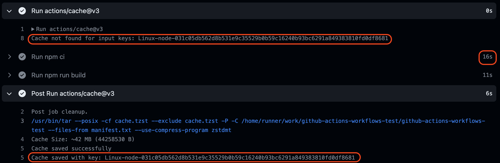

의존성 설치에 16s가 소요 되었다. Post cache actions step은, GitHub Actions의 step이 종료되면 `actions/cache` 패키지가 워크플로우를 종료하면서 추가로 마무리하는 action이다. 이 step에서, 캐시가 저장되었음을 캐시 key와 함께 알려주고 있다. 그러면 캐시가 실제로 GitHub에 저장되어 있는지 확인해 보자. GitHub Repository의 Actions -> Caches 탭을 통해 캐시 저장소로 들어가 본다.

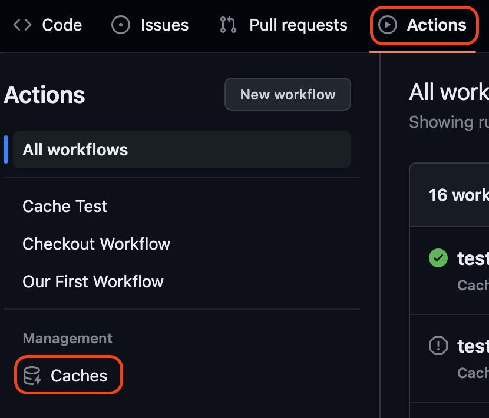

그러면 방금 설치한 의존성 파일이 캐시 된 것을 확인할 수 있다.

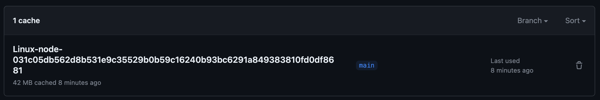

workflow에서 생성된 캐시 key와 동일한 네이밍을 가지고 있는 것을 볼 수 있다. 그리고 오른쪽에 휴지통 아이콘이 있는 것으로 봤을 때 직접 UI에서 캐시를 삭제해 줄 수 있다는 것을 알 수 있다. (물론 CLI로 삭제도 가능하다)

이번에는 저장된 캐시가 잘 동작하는지 보기 위해 `src` 파일 내부의 소스 코드를 하나 수정하고 push 한다. yml 파일은 수정하지 않았다.

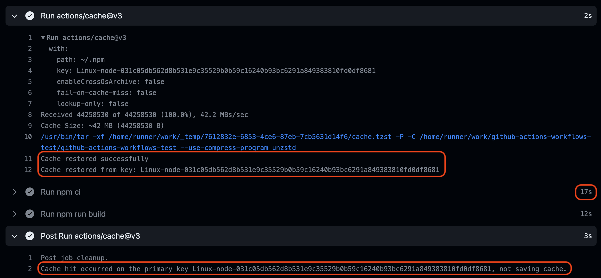

상단의 Run actions/cache@v3에 따르면 캐시가 정상적으로 복원되었다고 명시되어 있다. 이유는, 첫 번째 GitHub Actions가 동작할 때 만들어 둔 캐시가 있기 때문이고, 그를 복원시켰기 때문이다.

하지만 캐시가 존재하지만, 다시 `Run npm ci` step이 실행되었다. 총 17s가 소요되었다. 캐시를 적용하든 하지 않든 거의 동일한 결과라고 볼 수 있다. 이유는 캐시가 있다고 해도 `run` 명령어가 조건 없이 실행되도록 yml 파일에 설정되어 있기 때문이다. 그러면, 조건에 따라 npm ci를 건너뛰어도 되지 않을까? 그러면, step에 `if`를 사용해 캐시가 존재하면 패키지를 설치하지 않도록 해보자.

```yaml{6}
- uses: actions/cache@v3
  id: npm-cache
  with:
    path: ~/.npm
    key: ${{ runner.os }}-node-${{ hashFiles('**/package-lock.json') }}
- if: ${{ steps.npm-cache.outputs.cache-hit != 'true' }}
  run: npm ci
- run: npm run build
```

if 문을 사용하기 위해 9번째 라인에는 `id`를 명시 해주었다. id는 if 문에 `steps.npm-cache`로 사용되며, step의 결과물로 cache-hit를 얻기 위해 사용되었다.

그리고, if 문으로 `cache-hit` 이 false일 경우에만, `npm ci`를 실행하도록 변경했다.

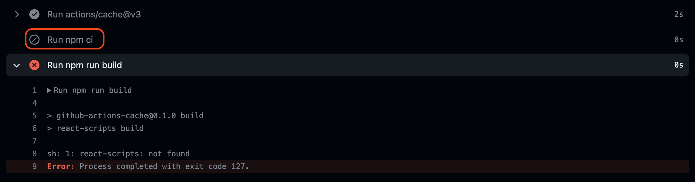

워크플로우가 실패했다. 패키지를 설치하지 않도록 if 문을 사용한 부분은 의도대로 되었지만, build 부분에서 실패한 것이다. 이유는, `node_modules`가 없기 때문이다. GitHub Actions 러너는 Job이 실행될 때마다 새로운 러너 환경을 가진다. 즉, 컴퓨터가 새롭게 세팅되는 것이다.

위에서 살펴봤던 `path` 옵션을 떠올려 보자. `path` 옵션은, node_modules가 저장될 경로를 명시하는 것이 아니라, 캐시 할 파일의 경로를 주는 옵션이다. 지금 path는 `~/.npm` 이다. `~/.npm` 경로에는 무엇이 있을까?

<br/>

## ~/.npm

로컬 컴퓨터의 `~/.npm` 디렉토리에 들어가보았다.

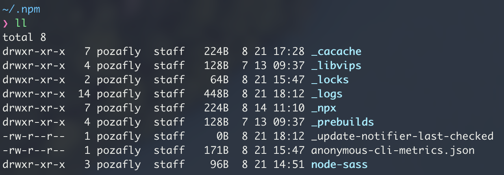

[npm-cache](https://docs.npmjs.com/cli/v9/commands/npm-cache)에 설명 되어 있듯, `~/.npm` 에는 npm 자체에서 사용하는 캐시 파일이 들어있다. 이는 `npm install` 혹은 `npm ci` 명령어를 사용해 패키지를 설치할 때 사용할 캐시 된 파일이 들어있는 곳이다. npm 패키지를 설치할 때 해당 경로에 있는 캐시를 가져와 설치를 돕는다. 단, `~/.npm` 경로는 OS 별로 저장 경로가 다르다.

그러면 GitHub Actions의 공식 문서에서 권장하는 것처럼 `key: ${{ runner.os }}` 부분에 `runner.os` 가 명시되어 있는 이유도, 러너를 다른 환경에서 돌리게 된다면 key가 무효화 되어야 하기 때문임을 알 수 있다. [참고](https://github.com/actions/cache/blob/main/examples.md#node---npm)

결론적으로 `~/.npm` 경로에는 node_modules가 존재하는 것이 아니라 패키지 설치 시 더 빠르게 도와주는 npm의 캐시 된 파일이 캐시되어 있었다. [공식 문서](https://docs.github.com/en/actions/using-workflows/caching-dependencies-to-speed-up-workflows#example-using-the-cache-action)에서도 아래 코드와 같이 예제가 존재한다.

```yml
- if: ${{ steps.cache-npm.outputs.cache-hit != 'true' }}
  name: List the state of node modules
  continue-on-error: true
  run: npm list

- name: Install dependencies
  run: npm install

- name: Build
  run: npm run build
```

`npm install` 명령어는 캐시 히트와 상관 없이 실행된다. 새롭게 node_modules가 존재해야만 build를 할 수 있기 때문이다.

캐시를 적용하기 위해 다시 if 문을 제거하고 반드시 패키지를 설치하도록 해봤다. 정상적으로 빌드까지 완료되었다. 하지만, 패키지를 설치하는 과정이 포함되어 있기 때문에 캐시를 사용하지 않고 워크플로우를 사용하는 시간과 거의 동일한 시간이 걸리는 것을 볼 수 있다. 따라서 캐시를 사용하는 이유가 없어 보인다.

그러면, path에 명시된 `~/.npm` 파일 말고, `node_modules` 자체를 캐시 하면 어떨까? Gtihub Actions에 cache 탭에 들어가서 휴지통 아이콘을 클릭하고 캐시를 지웠다. 그리고 아래와 같이 yml 파일을 수정하고 적용했다.

```yml{4}
- uses: actions/cache@v3
  id: npm-cache
  with:
    path: **/node_modules
    key: ${{ runner.os }}-node-${{ hashFiles('**/package-lock.json') }}
- if: ${{ steps.npm-cache.outputs.cache-hit != 'true' }}
  run: npm ci
- run: npm run build
```

`path`를 node_modules로 변경했고, if 문을 추가 했다. push 해서 캐시를 만들고, 한 번 더 push해서 캐시가 잘 사용되는지 확인했다. 즉, node_modules가 복원되어 설치 하지 않는지 확인하기 위해 src 아래의 코드를 수정하고 push를 한 번 더 했다.

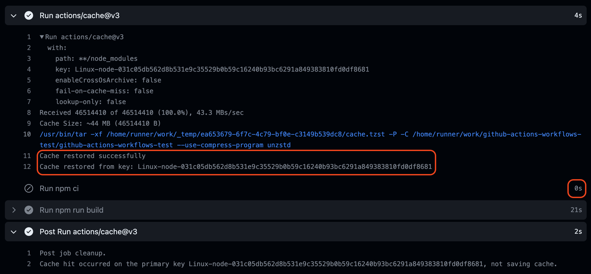

정상적으로 `node_modules`가 패키지 내로 들어왔으며 cache-hit이 true가 되면서 npm ci가 실행되지않았다. 캐시 덕분에 시간을 아낄 수 있었다.

<br/>

## restore-keys

드디어 restore-keys 옵션이다. restore-keys 옵션은 기본 키와 일치하는 캐시를 찾을 수 없는 경우, restore-key를 사용해 최근에 생성된 가장 가까운 일치하는 캐시를 다운로드할 수 있다. 이렇게 하면 빌드/설치 단계에서 최신 의존성 몇 개만 추가로 가져오면 되므로 빌드 시간을 절약할 수 있는 기능이다.

```yml
restore-keys: |
  npm-feature-${{ hashFiles('package-lock.json') }}
  npm-feature-
  npm-
```

1. 캐시 미스가 발생하면 restore-keys에 해당하는 캐시를 찾는다. 정확히 일치하는 항목이 있으면 이 작업은 캐시에 있는 파일을 path 디렉터리로 가져온다. 정확히 일치하는 항목이 없으면 작업은 복원 키의 부분 일치 항목을 검색한다.
   작업이 부분적으로 일치하는 항목을 찾으면 가장 최근 캐시가 경로 디렉터리에 복원된다.
2. 캐시 작업이 완료되고 작업의 다음 단계가 실행된다.
3. 작업이 완료되면 이 작업은 경로 디렉토리의 내용으로 새 캐시를 자동으로 생성한다.

---

일반적으로 생각할 때 캐시 미스가 발생하면 기존의 캐시는 버리고 새로 의존성을 다운받아 새로운 캐시로 설정하는 것을 생각하기 쉽다. 위에서 작업했던 결과물은 key가 일치하지 않으면 새로운 의존성를 다운받고 다운받은 의존성을 캐시에 저장했다. 이것이 일반적으로 생각하는 캐시 형태다. 그렇다면 restore-keys 속성은 도대체 어떨 때 사용하는 것일까? 테스트해 보자.

### 캐시 무효화

캐시 무효화는 중요하다. 의존성을 새로 설치하면 캐시에 저장된 기존 의존성을 무시하고 다시 설치해야 한다. `key` 라는 설정으로 이미 캐시 무효화 설정이 되어 있다.

이제, 하나의 모듈을 설치해서 다시 액션을 실행시켜 보자. 나는 `lodash` 패키지를 그냥 하나 설치하고 push 했다.

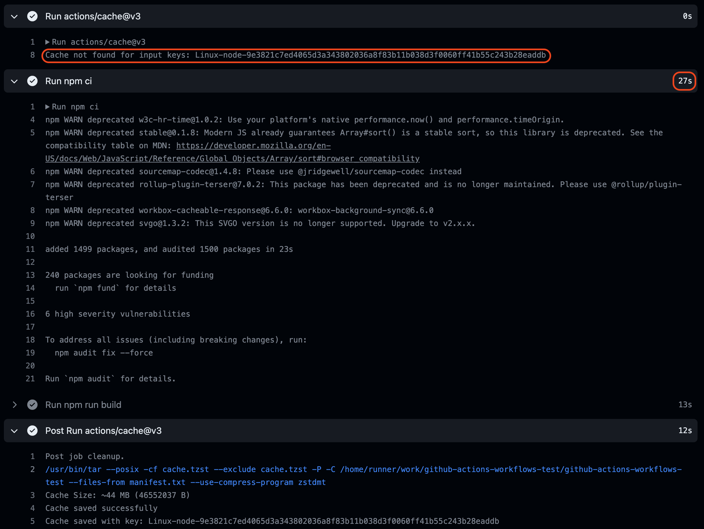

결과를 보면, 로컬에 있는 package-lock.json이 npm 패키지를 설치하면서 변경되었고, 캐시 key가 변경되었기 때문에 GitHub Actions에서는 캐시 키를 찾을 수 없다는 것을 말해주고 있다. 마찬가지로 GitHub 러너에서 npm 패키지를 새롭게 다운받는다. 총 20s가 소요된 것을 볼 수 있다.

이마저도 조금 더 빠르게 만들 수 없을까? restore-keys 옵션을 사용해 보자.

### restore-keys 적용

```yaml{6-8}
- uses: actions/cache@v3
  id: npm-cache
  with:
    path: **/node_modules
    key: ${{ runner.os }}-node-${{ hashFiles('**/package-lock.json') }}
    restore-keys: |
      ${{ runner.os }}-node-
      ${{ runner.os }}
- if: ${{ steps.npm-cache.outputs.cache-hit != 'true' }}
  run: npm ci
```

restore-keys 옵션은, list 형식으로 여러 prefix를 붙여줄 수 있다. 그러면 prefix 기준으로 단계별로 cache에 저장된 key의 prefix를 포함하는 단어가 있는지 찾고, 이 단어 기준 포함하는 key가 있다면 가장 최근의 해당 캐시를 가져온다.

restore-keys 옵션을 사용하기 위해, key를 새롭게 생성해주어야 하기 때문에 npm 패키지를 아무거나 새로 설치해 준다.

- emotion npm 패키지 설치
- yml 파일에 restore-keys 추가

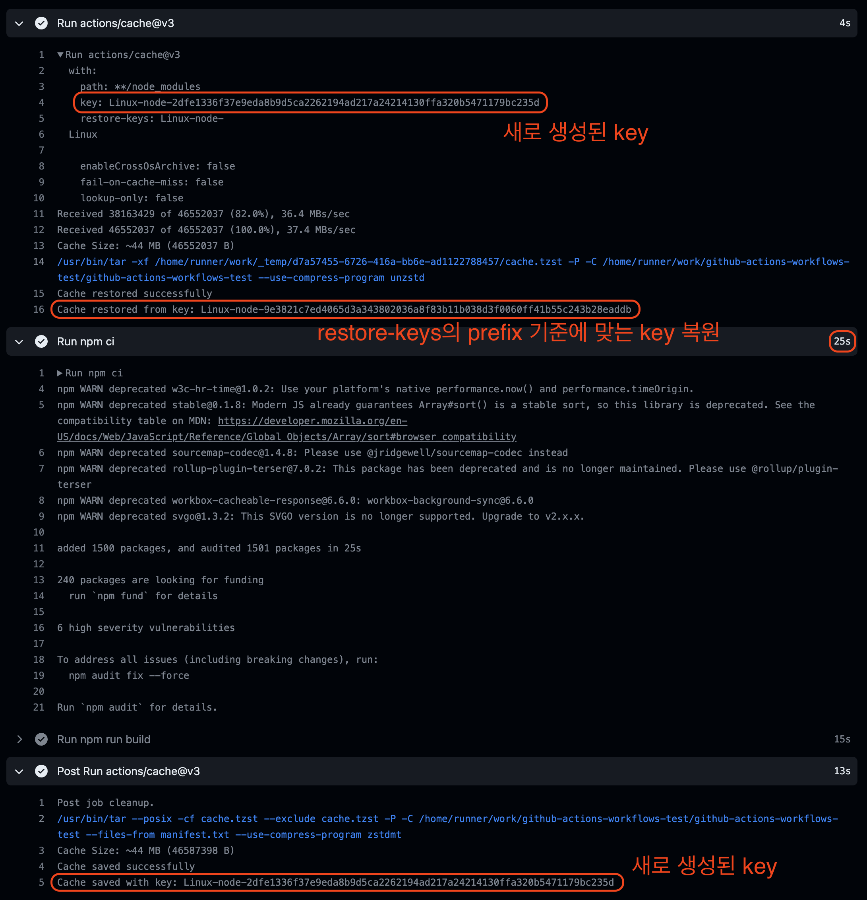

재미있는 현상이 발생한다.

#### cache action step

- package-lock.json 파일이 수정되었기 때문에 새로운 key가 생성됨. 따라서 캐시 **미스** 상태.
- restore-keys에 따라 기존 GitHub Actions를 통해 생성했던 캐시를 prefix 기준, 가장 최신 캐시를 복원(restore)한다. 즉, node_modules를 복원한다.

#### Run npm ci step

- 패키지를 설치한다. -> package.json.lock 파일이 변경 되었고 새로운 패키지가 설치되어야 하기 때문이다.
- 25s가 소요 되었다. (생각보다 오래 걸림)

#### Post cache actions step

- 기존 cache size는 42MB로, 이번에 npm 패키지를 추가하면서 43MB로 변경되었다.
- 새로 만든 key로 캐시를 저장한다.

캐시에서 node_modules를 복원했지만, 패키지를 다시 설치하면서 25s가 소요 되었다. 우리가 원한 것은, 캐시에서 node_modules를 가져왔고, `npm install` 명령어로 패키지를 설치하면 빠르게 설치 될 것을 예상했지만, 그렇지 않았다. 이유는 `npm ci` 때문이다.

### npm ci -> npm install

[npm ci](https://docs.npmjs.com/cli/v9/commands/npm-ci)는 clean 설치로, `node_modules` 디렉토리를 삭제한 뒤 `package-lock.json` 파일 기준으로 모든 의존성을 새롭게 설치한다. npm 공식 문서에 따르면 npm ci를 사용하는 이유는 2가지다. ( `npm ci`는 Continuous Integration이 아닌, clean install 줄임말임)

> **속도**
>
> `npm install` 명령어와 비슷하지만, npm install 보다 2배 정도 빠르며 이를 통해 CI / CD에서 유용하게 사용된다. 하지만, 공식 문서 예전 버전 `npm ci` 설명에서 속도와 관련한 이야기가 존재했지만, 최근 버전에서는 그 말이 사라졌다. 즉, `npm install` 또한 마찬가지로 `npm ci`에 비해 큰 차이를 보이지는 않는다.
>
> **안정성**
>
> `npm install` 명령은, 시맨틱 버전에 따라 package.json 파일에 명시된 버전 범위에 따라 [다른 버전이 설치](https://docs.npmjs.com/downloading-and-installing-packages-locally#installing-an-unscoped-package)된다. 물론 버저닝 기호에 따라 큰 범위를 벗어나지는 않지만, 레지스트리에 업로드된 npm 패키지가 업데이트 된 경우 GitHub Actions 러너에 다른 버전이 깔릴 가능성이 있다. 하지만, npm ci는 package-lock.json 파일을 바라보고 있기 때문에 정확한 버전을 설치해 준다. 또한, node_modules 디렉토리가 기존에 존재하면 지우고 새롭게 다운받아 주기 때문에 안정성이 높다.

마지막 결과에서 보듯 복원된 캐시인 node_modules가 디렉토리에 존재해도, 오랜 시간만큼 걸리기 때문에 여전히 우리가 원하는 결과를 가져오지 못했다. 그렇다면, `npm install` 명령어로 바꿔보자. 그래야 restore-keys를 사용해 기존 캐시를 가져오고, npm install로 node_modules를 제거하지 않으면서 이번에 추가된 패키지만을 추가로 설치할 수 있을 것 같다.

이번에도 다른 패키지를 설치한 다음 push 해보자.

```yml{10}
- uses: actions/cache@v3
  id: npm-cache
  with:
    path: **/node_modules
    key: ${{ runner.os }}-node-${{ hashFiles('**/package-lock.json') }}
    restore-keys: |
      ${{ runner.os }}-node-
      ${{ runner.os }}
- if: ${{ steps.npm-cache.outputs.cache-hit != 'true' }}
  run: npm install
- run: npm run build
```

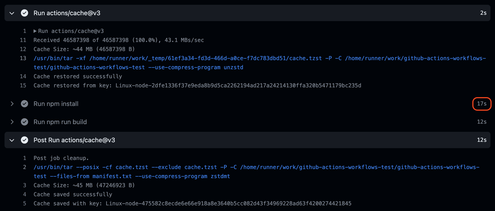

패키지 설치가 17s로 약간은 줄긴 했지만, 큰 효과는 아니다. local에서 node_modules 디렉토리가 있는 상태로 패키지를 따로 추가하지 않고 npm install을 하면 2s 밖에 걸리지 않는다. 왜냐하면 새로 설치할 패키지가 없기 때문이다. 그 정도 효과를 기대했지만, 측정 값은 그렇지 않다.

<br/>

## 여러 개의 path

마지막으로 `~/.npm` 캐시와 `**/node_modules` 모두를 캐시 해서 사용하면 어떻게 될까?

```yml{4-6}
- uses: actions/cache@v3
  id: npm-cache
  with:
    path: |
      **/node_modules
      ~/.npm
    key: ${{ runner.os }}-node-${{ hashFiles('**/package-lock.json') }}
    restore-keys: |
      ${{ runner.os }}-node-
      ${{ runner.os }}
- if: ${{ steps.npm-cache.outputs.cache-hit != 'true' }}
  run: npm install
- run: npm run build
```

path에 node_modules와 npm 캐시 두 경로 모두 포함시켰다.

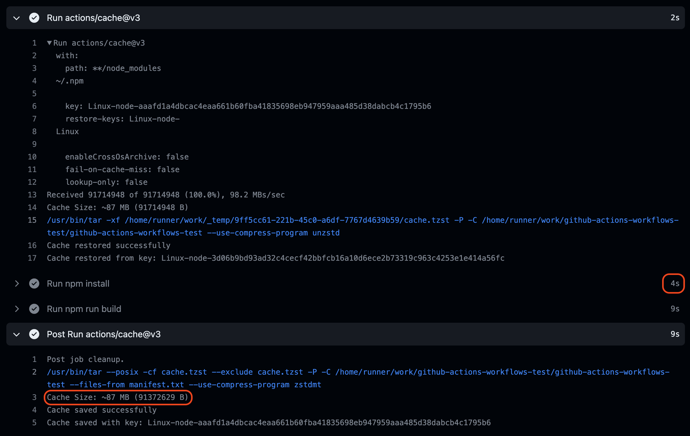

가장 효과가 좋았다. 패키지 설치가 놀랍게도 4s만 소요되었다. GitHub Actions 공식 예제에서 `~/.npm` path만 캐시에 저장한 것을 미루어 봤을 때, npm install 및 npm ci 명령어는 `~/.npm` 캐시를 참조하고 있음을 알 수 있으며, node_modules가 존재하면 npm install 명령어는 node_modules에 존재하지 않는 새로운 패키지만 추가로 설치한다는 가설이 검증되었다.

그리고, path가 1개일 때 캐시 사이즈는 43MB 정도였지만, 사진에는 그 두배인 87MB로 표기되고 있다.

이 때, `node_modules` path를 사용할 때, 공식 문서 예제에는 `'` 로 `'node_modules'` 와 같이 되어 있지만, path를 2개 이상 적어줄 경우 `'` 를 빼고 적어주어야 한다.

> ※ [actions/cache](https://github.com/actions/cache/blob/main/examples.md#node---npm)에 따르면 node_modules를 캐시하는 것은 권장되지 않는다고 한다. 노드 버전에 따라 중단될 수 있고, `npm ci` 에서 동작하지 않기 때문이라고 한다. (npm ci는 node_modules를 제거하고 다시 설치하기 때문)

결론적으로 새로운 패키지를 설치하고 GitHub Actions의 워크플로우를 실행시켰을 때,

- `node_modules` 디렉토리와, `~/.npm` 디렉토리 모두를 캐시
- `npm install` 명령어로 패키지 설치

조건을 만족했을 경우 패키지 설치 속도가 가장 빨랐다. 따라서, restore-keys 옵션을 사용할 때, restore-keys로 복원된 캐시 데이터는 그 캐시 데이터만으로 작업하는 것이 아니라, 캐시 기반 추가적인 작업이 존재해야 원하는 효과를 얻을 수 있다.

하지만, 이렇게 설정할 경우에도 주의점(단점)은 존재한다.

<br/>

## 주의점

### 안정성

`npm install` 명령어를 사용했기 때문에 네트워크를 통해 npm 레지스트리의 버전이 변경되었을 경우, 원하지 않는 버전이 설치되어 오류가 발생할 가능성이 있다. 이 부분은 npm 버저닝을 틸트(~) 및 캐럿(^)을 사용하지 않도록 함으로 예방할 수 있다. 그렇지 않더라도 주로 캐럿을 사용할 것이고, 이는 하위 호환성이 보장되기 때문에 크게 걱정할 필요는 없다.

### 권장 방식 아님

위에서 봤듯이 `node_modules` 캐싱은 actions/cache 액션을 만든 메인테이너가 권장하는 방식은 아니다.

### 스노우 볼

캐시 설정을 할 때, 가장 주의해야 하는 경우이다. `~/.npm` 경로에 있는 npm 캐시는, 패키지를 삭제해도 용량이 줄지 않는다. 즉, `npm uninstall [패키지명]` 명령어로 패키지를 삭제해도 `~/.npm` 캐시의 용량은 줄어들지 않고 누적된다. 이는 npm이 캐시를 다루는 방식이기 때문이다. [링크](https://glebbahmutov.com/blog/do-not-let-npm-cache-snowball/)

따라서, GitHub Actions 워크플로우가 실행될 때마다 큰 용량의 `~/.npm` 캐시를 다시 러너로 가져온다. 프로젝트가 노후화될수록 빌드 시간이 늘어날 상황이 생길 수 있다.

만약, 스노우 볼을 방지하기 위해서는 `restore-keys` 옵션을 사용하지 않는다면 해결할 수 있다. 캐싱은 `key`로 하되 `key`에 맞지 않는다면, restore-keys로 복원하지 않고 마음 편안하게 `npm ci` 로 clean 설치해 주면 그만이기 때문이다.

---

위와 같은 주의점이 있을 수 있지만, 나는 문제가 발생하기 전까지는 `~/.npm`, `node_modules` 를 캐시에 저장하고, `npm install` 명령어로 패키지를 설치하는 방법을 선택할 것 같다.

<br/>

## 정리

```yml
name: Cache Test
on: push
jobs:
  cache:
    runs-on: ubuntu-latest
    steps:
      - uses: actions/checkout@v3
      - uses: actions/setup-node@v3 # 버전에 맞게 node.js 설치
        with:
          node-version-file: '.nvmrc' # .nvmrc 파일을 기준으로 삼는다.
          cache: npm
      - uses: actions/cache@v3
        id: npm-cache
        with:
          path: |
            **/node_modules
            ~/.npm
          key: ${{ runner.os }}-node-${{ hashFiles('**/package-lock.json') }}
          restore-keys: |
            ${{ runner.os }}-node-
            ${{ runner.os }}
      - if: ${{ steps.npm-cache.outputs.cache-hit != 'true' }}
        run: npm install
      - run: npm run build
```

- `~/.npm` 데이터와, `node_modules` 데이터 모두를 GitHub Actions에 캐시 한다.
- 워크플로우가 트리거 되면 두 데이터 모두 러너 환경에 복원된다.
- 만약 의존성이 변경되었다면 `npm install` 명령어로 의존성 설치가 시작된다.
- node_modules가 러너 환경에 존재하기 때문에 `npm ci` 명령어보다 `npm install` 명령어가 빠르게 패키지를 설치한다.
- 추가로 `~/.npm` 데이터가 있기 때문에 `npm install` 로 의존성을 설치하면 npm 캐시로 인해 더 빠르게 패키지를 설치한다.

결과: CRA와 가벼운 몇몇 패키지 설치 시 27s에서 4s로 줄임. **85%** 가량의 효율성 확보.

<br/>

## Gatsby 블로그 GitHub Actions로 배포하기

```yml
- uses: actions/cache@v3
  id: npm-cache
  with:
    path: |
      **/node_modules
      **/.cache
      **/public
    key: ${{ runner.os }}-node-${{ hashFiles('**/package-lock.json') }}
    restore-keys: |
      ${{ runner.os }}-node-
      ${{ runner.os }}
- if: ${{ steps.npm-cache.outputs.cache-hit != 'true' }}
  run: npm install
- run: npm run build
- uses: peaceiris/actions-gh-pages@v3
  with:
    github_token: ${{ secrets.GH_TOKEN }}
    publish_dir: ./public
    publish_branch: master
```

GitHub Actions를 사용하면서, Gatsby로 만든 블로그도 로컬에서 빌드하지 않고 GitHub Actions로 배포해보기로 했다. 몇 번의 실험 결과 path에 `.cache` 파일과 `public` 파일을 추가해주면 빌드속도가 비약적으로 상승한다. `.cache` 파일과 `public` 파일은 `gatsby build` 명령어로 빌드할 때의 캐시 파일이기 때문이다. 빌드 시간이 5분에서 28초가 되었다.

`~/.npm` 을 제외시킨 이유는 Gatsby는 패키지 설치 명령어가 실행되는 경우가 드물기 때문이다. 빌드할 때, node_modules는 빌드시 필요하기 때문에 포함시켰다.

<br/>

### 번외 - GitHub Actions의 캐시 매커니즘

GitHub에서 워크플로우가 실행될 때 사진의 파란색 부분은 러너에서 실제로 CLI로 실행되는 명령어의 log를 나타내고 있다. 마지막 Post cache actions step의 명령어를 보자.

첫 번째 step인 cache action이 실행될 때 restore-keys에 명시된 캐시를 찾았을 때 `unzstd` 명령어를 통해 압축된 파일을 푼다. 그리고 마지막 Post cache action step에서는 `zstdmt` 라는 명령어를 통해 다시 압축한다.

두 명령어 모두 Zstandard라는 압축 프로그램이다. Facebook에서 개발한 고속 압축 알고리즘으로, 다양한 응용 분야에서 데이터 압축을 효율적으로 수행할 수 있도록 설계되었다. 따라서, 캐시를 사용할 때, node_modules 디렉토리를 직접 캐싱하는 것이 아니라, 위 명령어로 압축한 파일을 풀고 다시 저장한다.

<br/>

> 참고
>
> - https://docs.travis-ci.com/user/caching/
> - https://github.com/orgs/community/discussions/25027
> - https://glebbahmutov.com/blog/do-not-let-npm-cache-snowball/
> - https://fe-developers.kakaoent.com/2022/220106-github-actions/
> - https://blog.banksalad.com/tech/github-action-npm-cache/
