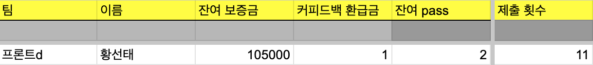
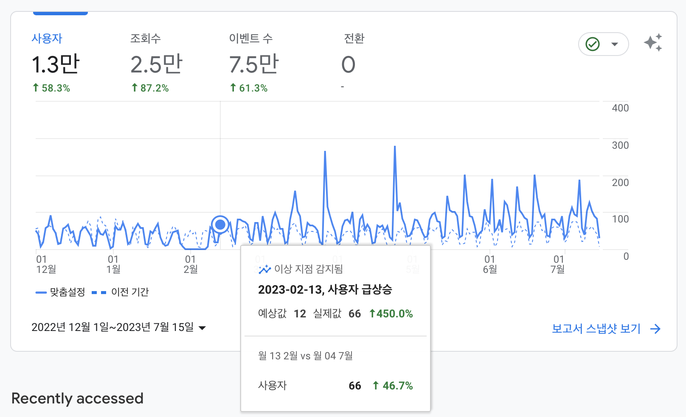
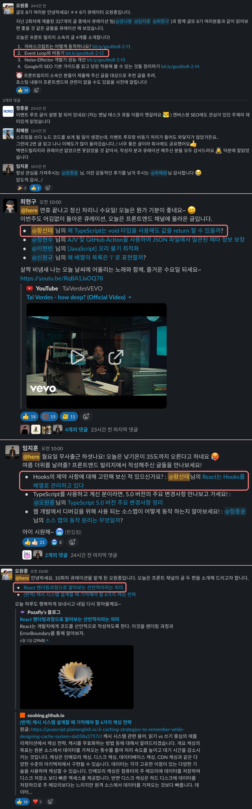
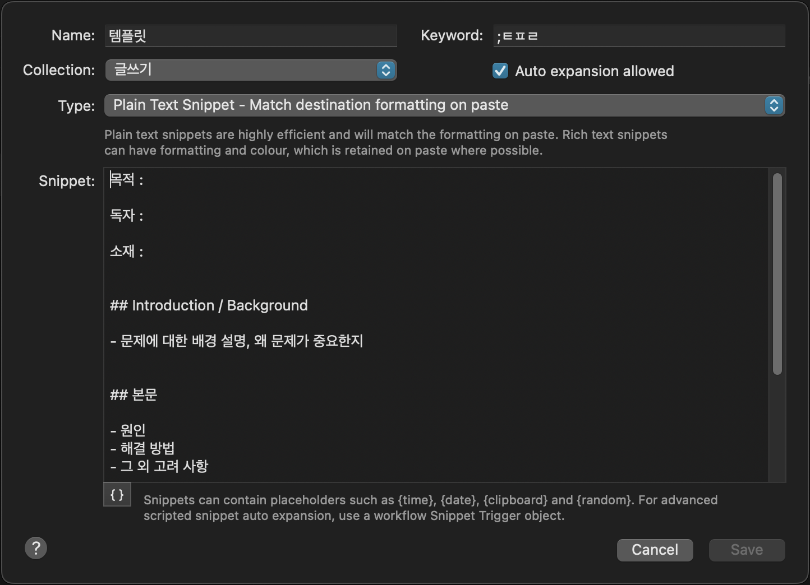

퇴사를 하면서 [함께 일했던 분](https://jodnddus.blog/)이 글또라는 모임을 추천해주셨다. 글또는 글 쓰는 개발자 모임이자 커뮤티니다.

글또에 참여하게 되면 예치금을 미리 내고, 2주에 한 번 글을 작성해 제출하지 못하면 예치금이 깎이는 형식이다. 예치금을 사수하는 목적은 그렇게 크지는 않았고, pass 권을 사용하지 않고 6개월간 글을 한번도 빠지지 않고 좋은 퀄리티로 작성하는 것을 목표로 시작했다.

개발에 대한 글을 쓰면서 실력을 키우고 싶은 목적도 있었지만, 외부 활동을 몇 번 해보지 않았었기 때문에 다른 개발자 분들과 활동을 해불 수 있다는 점이 매력적으로 다가왔다. 그리고 다른 분들은 글을 어떻게 작성하는지, 또 좋은 글은 어떻게 작성해야하는지 궁금했다. 좋은 글을 많이 읽고 싶었다. 그런 부분이 글또의 목표와 취지가 나와 맞다는 생각 때문에 활동하게 되었다.

개발을 하면서 항상 기초가 부족하다는 느낌이 들었다. 그래서 퇴사 후 기본기를 다지면서 과정을 글로 담으면 좋겠다고 생각했기 때문에 글또와 공부를 병행하고 싶었다.

글또의 자세한 소개 페이지는 [이곳](https://www.notion.so/zzsza/ac5b18a482fb4df497d4e8257ad4d516)에 잘 나와있다.

 

## 시작

글또를 처음 시작할 때, '**삶의 지도**'라는 글을 써서 제출 했었던 것이 생각난다. 이번 기수부터 글또에 참여하기 위한 필수 조건이었다. 나라는 사람에 대한 메타 인지를 올릴 수 있으며, 누군가에게 자신을 소개할 때에도 도움이 될 것이라고 했다.

글또에 꼭 참여하고 싶었기 때문에 주말 동안 카페에서 공들여 썼던 기억이 있다. 내용은 부끄러워 공개하지는 않았지만, 초등학교 시절부터 지금까지 나를 돌아볼 수 있는 계기가 되었던 것 같다. 처음에는 삶의 지도 글의 퀄리티와 정성으로 글또에 참여할 수 있는지 없는지 판별하는 과정이라고 생각했지만, 그렇지는 않은 것 같다.

글또를 시작하기 전에 블로그 스타일을 전반적으로 손봤다. 예전 부터 거슬렸던 디테일을 조금 잡아주고, Gatsby 엔진을 5버전 대로 올렸다. 조금 더 손봐야 할 부분이 보이지만, 이 과정에서 초반에 힘을 너무 많이 빼면 글 쓰기 전부터 지칠 것 같았기 때문에 적당한 수준으로 시작하기로 했다.

 

## 글 작성 성과

총 제출 횟수는 11개. 잔여 pass를 사용하지 않았다. 커피드백(네트워킹)은 3번 중 1번 참여했다. 글또에 참여할 때의 목표는 pass를 한번도 쓰지 않고 글 제출을 한 번도 빠지지 않는 것이었다. 처음 목표한대로 잘 이루어졌다.

### 글 작성 갯수

글또 기간 6개월 동안 작성한 글을 세어봤다. 갯수는, 해당 주차에 제출 후 다음 제출 주차가 오지 않아 제출 할 수 없는 글을 포함해서 총 19개의 글을 작성했다. 그 중 글또 제출 글은 11개. 지금 작성하고 있는 이번 글을 포함하면 6개월 간 총 20개의 글을 작성했고, 제출 글은 12개가 된다.

비율을 보니 JavaScript 관련 글이 약 50% 되는 수치로 작성되었다. 개인적으로 JavaScript 기본기를 다졌다는 의미가 있다.

### 방문자 추이

아래 사진은 글또를 하기 전과 후의 방문자 추이이다.

2022년 12월 1일과 비교했을 때 사용자는 58.3%가 증가했다. 조회수는 87.2%. 2022년 12월 1일로 기준을 잡은 이유는, 글또를 2023년 2월 12일 부터 시작했고 12월 1일에는 글을 작성하고 있지 않았기 때문에 어림 잡아 기준을 정했다.

2월 13일에 사용자가 급상승 했는데 글또에 글을 제출한 이후에 급상승 한 것으로 보인다. (작고 귀여운 수치이지만..) 따라서 글또 분들이 방문해주셨기 때문에 꽤 높은 수치가 나오지 않았을까 예상해볼 수 있다. Surfit에서도 글을 큐레이션 해주셨다.

### 큐레이션

글또의 운영진에서, 읽어보면 괜찮은 글을 큐레이션 해주는 채널이 있다. 감사하게도 글또의 큐레이션 채널에 나의 글 4개가 큐레이션 되었다.

큐레이션 된 글은 아래와 같다.

- [Event Loop와 비동기](https://pozafly.github.io/javascript/event-loop-and-async/)
- [왜 TypeScript는 void 타입을 사용해도 값을 return 할 수 있을까?](https://pozafly.github.io/typescript/why-can-typescript-return-any-value-using-void/)
- [React는 Hooks를 배열로 관리하고 있다](https://pozafly.github.io/react/react-is-managing-hooks-as-an-array/)
- [React 렌더링과정으로 알아보는 선언적이라는 의미](https://pozafly.github.io/react/declarative-meaning-of-react-rendering-process/)

큐레이션 된 글의 주제나 내용을 생각해보면, 기술을 사용하면서 굳이 찾아보지 않아도 되는 부분을 중점적으로 찾고 기록한 주제가 선정이 되었다. 학습하면서 기술의 동작원리를 생각해볼 때, 왜 이렇게 동작하는지 궁금했던 부분을 찾아 기록했다.

글또에 제출한 글의 내용을 처음부터 살펴봤을 때, 약간의 변화가 생겼음을 알게되었다. 추이는 아래와 같다.

- 기본적인 개념 위주의 글에서 기술을 조금 더 깊이있게 파보는 글로 변화
- 나의 생각을 적지 않았었는데, 글의 중간이나 끝에 나의 생각을 넣는 글로 변화
- 독자가 글에 관심을 가질 수 있도록 글 도입 부분에, 개념 소개를 신경써서 적는 글로 변화

### 약간의 실험

글을 쓸 때, 몇몇 실험도 해봤다. 글의 iFrame을 사용해서 유튜브 동영상을 삽입해보기도 하고, [CodePen](https://codepen.io/)과 같은 도구를 활용해서 페이지에 임베드 시켜보기도 했다. 또, 글의 초반에 요약본을 넣어보기도 하고, 썸네일을 unsplash의 괜찮아보이는 이미지를 가져오거나, 이미지를 직접 제작해서 제목을 넣어 보거나. 하지만 Google Analytics에 방문자 수가 얼마나 찍히는지 매번 확인해봤지만, 모수 자체가 작아서 유의미한 차이점을 볼 수 있지는 않았다. 따라서 글을 어떤 스타일로 작성했는지와 상관없이 글의 퀄리티에 따라 달라지는 것 같다.

### 아쉬운 점

여러 편의 글을 쓰면서 생각하기에 조금 아쉬운 부분이 있다. 제출 글의 퀄리티가 좋지 못한 글이 있다. 시간이 부족해서 퀄리티가 만족스럽지 못하더라도 일단 제출한 글이다.

또, 글을 쓸 때 시간이 꽤 오래 걸린 점이다. 한 편의 글을 쓰기 위해 평균 13시간 정도가 소요되었다. 퀄리티도 놓치지 않으면서 비교적 시간을 적게 들인 글은 기존부터 고민해온 주제의 글이었고, 시간이 오래걸린 글은 작성하는 시점부터 조사를 했으며 조사 결과도 믿을 수 있는 자료인지 실제 코드로 검증하며 고찰한 글이다.

글또 주최자인 변성윤님이 [퇴사 후의 삶](https://zzsza.github.io/diary/2023/04/06/2022-retrospective/) 글을 3시간 만에 작성하셨다고 하셨다. 생각을 정리하고 나의 언어로 글을 표현한다는 것은 꽤 에너지와 시간을 많이 잡아먹는 일인데, 어떻게 이정보 분량이 되는 글을 3시간만에 적었는지 궁금해서 여쭈어봤다. 평소에 글감과 글감에 대한 요소를 미리 생각해두신다고 하셨다. 글쓰기를 습관화 해두고 이를 연습해야 한다고 하셨다. 또 글 작성 시간을 측정해서 글쓰기 시간을 의식적으로 줄여보는 연습을 한다고 하셨다.

커피드백에 많이 참여하지 못한 점도 아쉬운 부분이다. 네트워킹을 하고 싶었지만, 바쁘다는 이유로 한번 밖에 하지 못한 점이 아쉽다. 다음에는 같이 모여 글을 작성하는 모임도 참여해보고 싶다.

 

## 글에 대하여

개발을 잘 하는 사람은 글을 잘 쓰는 사람이라는 이야기가 있다. 글을 잘 작성하는 사람이 되고 싶었다.

그렇다면 글을 잘 작성하는 사람은 어떤 사람인가? 내가 생각하기에 체계적으로 글을 쓰고, 틀이 있으며 다른 사람이 이해하기 쉽게 글을 작성하는 사람이다.

글을 쉽게 작성하려는 측면은, 나만 이해하고 나만 볼 수 있는 글을 작성하고 싶지 않기 때문에 어느정도 노력하고 있는 부분이라고 생각된다. 다른 이들에게도 도움이 되는 글을 작성하고 싶기 때문이다.

하지만 체계적으로 글을 쓰려는 측면은, 적합한 사람인지에 대한 의문이 생긴다. 내 성향이 체계적인 성향의 사람이라고 생각되지는 않기 때문이다. 글또 과정 중간에 글또에서 진행하는 글 쓰는 팁을 알려주는 강의를 들었었는데, 글을 적기 전에 template을 만들어두고 그 틀에 맞게 채워가는 형식으로 글을 적으면 좋다는 이야기를 들었다.

사진과 같이 Alfred 스니펫으로 등록해두었지만, 생각보다 잘 활용이 되지 않았다. 개발 스타일도 마찬가지다. 이 부분을 진행했다가 또 다른 부분 생각이 나면 다른 부분을 고쳤다가 하는 경향이 있다. 앞으로 어떻게 하면 이렇게 체계화 된 시스템 안에서 일할 수 있을까를 조금 더 고민해야겠다고 생각했다.

글 작성도 개발과 마찬가지로 트레이드 오프가 있다. 위에서 말했던, 퀄리티와 제출 기간 사이이다. 시간을 들이면 들인 만큼의 퀄리티가 나오고, 시간을 들이지 않으면 들이지 않은 만큼의 퀄리티가 나온다. 하지만, 시간을 들인다고 해서 항상 좋은 퀄리티가 나오지는 않는다. 이번 글또에 참여하면서 글을 작성할 때, 너무 집중한 나머지 글을 완성했을 때, 이명이 들린 적이 몇 번 있었다. 이런 식으로 무리해서 몰입하면 앞으로 작업을 이어갈 수 있을지 고민이 되었다.

지금은 회사에 다니지 않고 공부를 하고 있기 때문에 글을 쓰는데 많은 시간을 투자할 수 있지만, 회사를 다니게 되면 글을 쓸 수 있는 시간이 무척 줄게 될텐데 어떤 부분을 어떻게 트레이드 오프 해야하는지, 목표를 어떻게 잡을 것인지 다시 고민해야할 것 같다. 무작정 시간을 투자하면 번아웃이 올 수 있으니까.

시니어 개발자와 주니어 개발자의 차이는 문제를 만났을 때 차이가 난다고 한다. 시니어 개발자는 자기가 생각한 Best Practice가 머리에 존재하기 때문에 빠르게 문제를 좋은 방향으로 해결하지만, 주니어 개발자는 어떻게 문제를 해결해야할지 조사하고 고민하는 시간이 길기 때문에 느리게 해결한다는 말이다. 경험과 능숙도의 차이이다. 글을 작성하는 부분도 마찬가지다.

앞으로도 글을 작성하는데 트레이드 오프를 고려해야겠지만, 트레이드 오프를 고민하지 않아도 되는, 조금 더 능숙하고 꾸준한 사람이 되고 싶다.
