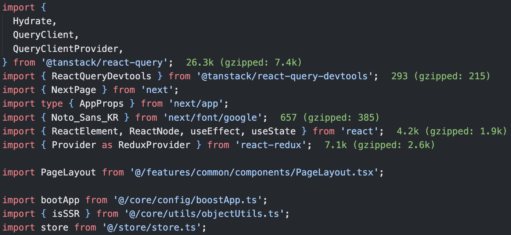

<br/>

프로젝트를 진행하다 보면 하나의 파일에 import 대상이 많아질 때가 있다. import 문이 많으면 어떤 모듈이 import 되었는지 파악하기가 쉽지 않고 지저분해 보인다.


위의 이미지는 Next.js 프로젝트의 `_app.tsx` 파일의 import 구문이다. 어떤 부분은 상대 경로를 사용했고, 어떤 부분은 절대 경로를 사용했다. 어떤 부분은 확장자를 사용하지 않았다. 어떤 기준에 의해 순서도 맞춰지지 않아서, import 구문이 이렇게 길 경우 어떤 종속성이 생기는지 한눈에 파악하기 쉽지 않다.

그렇다면 import 모듈 대상을 종류별로 묶어 순서를 맞춰줄 수도 있고, 개행 규칙 등을 정해서 좀 더 깔끔하게 만들 수 있다. 규칙을 가지고 import 구문이 정리된다면, 해당 파일에서는 어떤 종속성을 가지고 있고 어떤 기능을 사용하는지 한 눈에 파악하기 쉬울 것이다. 하지만, 이런 규칙을 만들었다고 해서 문제가 해결된 것은 아니다. 개발자가 일일이 import 구문을 타이핑한다면 규칙 문서를 확인하고 규칙에 맞게 정렬 및 수정을 따로 해주어야 해서 생산성에 문제가 생길 가능성이 농후하다.

이를 개발자가 타이핑하여 관리하지 않고 자동화한다면, 생산성 면에서 그리고 코드 가독성 면에서 좋을 것이다. 그 부분을 ESLint를 통해 자동화할 수 있다. 자동화한다면 얻게 되는 이점이 하나 더 있다. 협업을 할 경우 특정 규칙이 강제 되어 있다면 코드 리뷰 시, Git Diff가 생기지 않는 효과도 함께 가져갈 수 있다. 예를 들어, 특정 라이브러리에서 가져온 변수가 필요 없다고 생각해서 지우고, 다시 생각해 봤더니 필요해서 import 한 경우다. 이런 경우 import 구문의 순서가 바뀔 수 있으며, 순서가 바뀌어도 Diff가 생기게 되는데 순서 규칙이 존재하면 순서에 따라 변수가 정렬되기 때문에 Diff가 생기지 않도록 방지할 수 있다.

따라서, 이번 포스팅은 ESLint 규칙 및 ESLint 플러그인을 사용해 import 문을 사용하는 데 몇 가지 규칙을 지정해 볼 것이다.

아래의 글을 읽으면 import 문에 아래의 규칙을 지정할 수 있게 된다. 그리고 VSCode의 자동완성과, ESLint의 cli에서 `--fix` 옵션을 사용해 규칙을 자동화 할 수 있게 된다.

- 확장자를 반드시 포함시키기
- 상대 경로 대신 절대 경로(모듈 별칭) 사용하기
- 그룹에 맞게 순서 맞추기

<br/>

## eslint-plugin-import

[eslint-plugin-import](https://github.com/import-js/eslint-plugin-import)는 JavaScript 프로젝트에서 모듈과 `import` 문에 관련된 다양한 규칙을 검사하는 ESLint 플러그인이다. 주로 모듈 시스템과 `import/export` 문을 사용하는 환경에서 코드 품질과 가독성을 향상시키기 위해 사용된다.

플러그인을 사용하면 코드 베이스에서 모듈과 `import` 문을 더 통일된 규칙을 강제하여 작성하도록 도와준다. 코드의 가독성을 향상시키고 잠재적인 오류를 사전에 방지하는 데 도움이 된다.

[ESLint의 공식 블로그](https://eslint.org/blog/2022/02/paying-contributors-sponsoring-projects/#supporting-the-community)에 따르면, `typescript-eslint`, `eslint-plugin-import` 등 ESLint 관련 플러그인을 후원하고 있는 것을 볼 수 있다. 이는 커뮤니티 플러그인인데, ESLint에서 공식적으로 만든 플러그인이 아니라 커뮤니티 플러그인이다. eslint-plugin-import 또한 마찬가지로 ESLint의 공식 플러그인이 아니지만, ESLint 팀에서 인정한 플러그인이라는 뜻으로 볼 수 있다.

아래에서 알아볼 규칙은, `eslint-plugin-import`에서 가져와 사용하는 것도 있으며, [ESLint 공식 규칙](https://eslint.org/docs/latest/rules/)에서 사용하는 것도 있다. `eslint-plugin-import`는 단순히 공식 규칙에서 제공하지 않는 규칙을 추가할 플러그인일 뿐이다.

설치는 아래와 같다.

```sh
$ npm i -D eslint-plugin-import
```

```javascript
// .eslintrc.json
{
  "plugins": ["import"],
  (...)
}
```

<br/>

## 확장자를 반드시 포함시키기

TypeScript 5버전부터 확장자 명시를 권장하고 있다. [TypeScript-allowImportingTsExtensions](https://pozafly.github.io/typescript/typescript-env/#allowImportingTsExtensions-TypeScript-version-5-%EB%B6%80%ED%84%B0)에서 자세히 설명했지만, 이는 Node.js의 모듈 관련 히스토리와 연관이 있다.

가볍게 짚고 넘어가 보자. TypeScript 컴파일러인 `tsc` 는 Node.js 환경에서 동작하며, Node.js는 CommonJS 모듈을 사용한다. CommonJS는 모듈을 불러올 때 확장자를 생략해도 불러올 수 있다.

```js
const some = require('./some');
```

Node.js 창시자인 Ryan Dahl도 [해당 동영상](https://www.youtube.com/watch?v=M3BM9TB-8yA&t=835s)에서 `require`을 사용해 모듈을 불러올 때 확장자를 생략해도 불러오는 것을 후회한다고 했다. 이는 ESM을 사용하는 브라우저에서는 동작하지 않기 때문이다. 점차 ESM이 활성화 되어감에 따라 TypeScript에서도 `ts` 확장자를 사용할 수 있게 만든 컴파일 옵션이 바로 `allowImportingTsExtensions` 였다.

IDE 상의 프로젝트에서는 확장자를 사용하지 않아도 webpack으로 빌드도 되고 tsc로 타입 체킹도 된다. `allowImportingTsExtensions` 옵션은 확장자를 사용할 수 있게 만들어주는 TypeScript의 옵션이었기 때문이다. (강제하지 않는다)

따라서, TypeScript가 `allowImportingTsExtensions` 옵션을 추가해 준 것 같이 앞으로 ESM 방식으로 확장자를 붙일 것인데 이를 eslint-plugin-import를 사용해 강제할 수 있다. [(공식 문서)](https://github.com/import-js/eslint-plugin-import/blob/v2.28.1/docs/rules/extensions.md)

```json
"rules": {
  "import/extensions": [<severity>, "never" | "always" | "ignorePackages"]
}
```

`severity`에는 `error`, `warn` 등의 엄격도가 들어간다.

- never : 확장자 사용을 금지한다. 확장자가 붙어 **있다면** 에러.
- always : 모든 구문에 확장자를 사용해야 한다. 확장자가 붙어있지 **않다면** 에러.
- ignorePackages : **라이브러리 패키지 구문을 제외하고** 확장자를 사용해야 한다.

우리의 목적은 확장자를 반드시 명시하기 위해 플러그인을 사용할 것이기 때문에, `ignorePackages` 를 사용하도록 한다.

```json
"rules": {
  "import/extensions": ["error", "ignorePackages"]
}
```


확장자를 명시하지 않은 import 구문에 에러가 발생한다. 확장자를 붙여 에러를 없애주면 성공이다. 아쉽지만 `import/extensions`는 fix 옵션이 존재하지 않기 때문에 수동으로 고쳐줄 수밖에 없다. 폴더에 `a.js`, `a.json` 과같이 확장자가 여러 개일 가능성이 있기 때문에 fix 옵션이 존재하지 않는다.

VSCode를 사용하는 경우, import 대상에서 자동완성을 해주고 있는데, 자동완성을 통해 import 하면 확장자가 포함되지 않는 경우가 있을 수 있다. (따로 설정하지 않았다면 자동완성 단축키는 맥에서 `⌘(command) + I` 이다)


그러면, VSCode 설정에서 이를 바꿔줄 수 있다.


Import Module Specifier Ending 옵션에서 `.js / .ts`를 선택하면 자동완성으로 import 할 경우 자동으로 확장자를 붙여준다. JavaScript, TypeScript 설정 모두 있으니 잘 보고 설정하자.

<br/>

## 상대 경로 대신 절대 경로(모듈 별칭) 사용하기

프론트엔드 프레임워크에서 모듈 별칭(module-aliases)를 사용하면 상대 경로 대신, 절대 경로를 사용할 수 있다. 상대 경로를 사용하면 import 할 때 `../../` 와 같은 prefix가 매우 길어질 수 있으며, 가져오고자 하는 모듈 import 구문을 복사해 다른 파일에 붙여넣기 할 때 상대 경로로 다시 지정해 주어야 하기 때문에 번거롭다. 따라서 절대 경로를 사용하는 것이 좋은 방법이다. 또, 주로 코드를 `src` 파일 밑에서 작업하기 때문에 절대 경로 상 앞부분을 제외하고 `@` 와 같은 것으로 alias를 지정해서 사용하곤 한다.

예를 들면 Next.js 같은 경우 `create-next-app` 을 통해 프로젝트를 생성할 때, 모듈 별칭을 사용하면 절대 경로를 처음에 지정해 줄 수 있다. 만약, 처음에 지정하지 않았다면 `tsconfig.json` 파일에서 아래와 같이 지정해 줄 수 있다.

```json
{
  "compilerOptions": {
    "paths": {
      "@/*": ["./src/*"]
    }
  }
}
```

하지만, 이렇게 지정해 준다고 해도, 여전히 상대 경로를 사용할 수 있다. 이 부분도 모두 절대 경로가 아니면 ESLint 오류가 나도록 설정해 줄 수 있다. 이번에는 `eslint-plugin-import` 플러그인에 있는 기능은 아니다. 해당 플러그인에는 이 기능이 없고, [ESLint 공식 rule](https://eslint.org/docs/latest/rules/no-restricted-imports)에 존재한다.

```json
"rules": {
  "no-restricted-imports": [
    "error",
    {
      "patterns": [".*"],
    }
  ],
}
```

사실, no-restricted-imports 규칙은, 특정 경로를 막는 방법이다. 상대 경로와는 상관없는 규칙이다. 하지만, [stackoverflow](https://stackoverflow.com/questions/65670432/eslint-only-allow-absolute-import-paths-not-relative)에서 말하길, patterns에서 경로 전체를 막고 모듈 별칭을 사용하면 막히지 않도록 설정할 수 있다.

no-restricted-imports을 patterns를 통해 사용하고 싶지 않다면, [eslint-plugin-absolute-imports](https://www.npmjs.com/package/eslint-plugin-absolute-imports)를 사용해도 된다. 해당 플러그인은 fix 기능까지 존재한다. 하지만, 하나의 패키지를 더 설치하는데 부담스럽기 때문에 위의 방법을 사용하겠다.


사진과 같이 상대 경로를 사용한 곳에서 error가 발생했다. 이제 고쳐보자.

마찬가지로 VSCode를 사용하는 경우, import 대상에서 자동완성을 해주고 있는데, 자동완성에서 상대 경로로 경로가 잡히는 경우가 있다.


이를 고치려면 Import Module Specifier에서 `non-relative` 를 선택해 주자. tsconfig.json 또는 jsconfig.json의 path 또는 baseUrl을 기반으로 한 절대 경로(모듈 별칭)를 자동완성 해줄 것이다.


한 가지 팁은, React가 17 버전으로 업데이트되면서, `import React from 'react';` 구문을 사용하지 않아도 동작하게끔 [변경](https://pozafly.github.io/react/declarative-meaning-of-react-rendering-process/#Rendering)되었다. 이 부분도 `no-restricted-imports` 규칙을 통해 막을 수 있다.

```json{6-13}
"rules": {
  "no-restricted-imports": [
    "error",
    {
      "patterns": [".*"],
      "paths": [
        {
          "name": "react",
          "importNames": ["default"],
          "message": "import React from 'react' makes bundle size larger."
        }
      ]
    }
  ],
}
```

<br/>

## 그룹에 맞게 순서 맞추기

가장 중요한 import 구문의 순서(order)에 대해서 알아보자. ESLint에서 공식적으로 사용하는 `sort-imports`로 순서 규칙을 걸 수 있고, `eslint-plugin-import` 플러그인에서 제공하는 `import/order` 규칙을 사용해 순서 규칙을 걸 수 있다. 즉, 2가지 방법 모두 순서 규칙을 사용할 수 있다. 또한, 두 규칙 모두 fix를 지원하기 때문에 자동 저장 혹은 cli를 통해 코드를 자동으로 변경할 수 있다.

ESLint 공식 규칙인 [sort-imports](https://eslint.org/docs/latest/rules/sort-imports)를 사용해 순서 규칙을 지정해 보자.

```json
"rules": {
  "sort-imports": [
    "error",
    {
      "ignoreCase": false,
      "ignoreDeclarationSort": false,
      "ignoreMemberSort": false,
      "memberSyntaxSortOrder": ["none", "all", "multiple", "single"],
      "allowSeparatedGroups": false
    }
  ],
}
```

아주 많은 파일에서 에러가 나기 시작했고, 이를 고치기 위해 cli를 사용했다. fix가 가능하니, 코드가 자동으로 변경되길 원했다. 따라서, cli에 `--fix` 옵션을 붙인 명령어를 사용했다.


고쳐지지 않는다. Rule Details에 보면 아래와 같이 적혀있다.

> The `--fix` option on the command line automatically fixes some problems reported by this rule: multiple members on a single line are automatically sorted (e.g. `import { b, a } from 'foo.js'` is corrected to `import { a, b } from 'foo.js'`), but multiple lines are not reordered.

한 줄에 있는 멤버 변수(`{b, a}`)는 자동으로 고쳐지지만, 여러 줄의 순서 규칙은 자동으로 지정되지 않는다는 뜻이다. sort-imports도 수정하면, 역할을 계속하고 있기 때문에 그대로 두고 `eslint-plugin-import` 플러그인에 있는 `import/sort` 규칙을 추가로 사용해 보자.

```json
"rules": {
  "import/order": ["error"],
}
```

그리고 cli를 실행하면 문제없이 import 문이 자동으로 고쳐진다.

이제 상세하게 설정해 보자. 주요 개념은 `groups`이다. `groups`로 묶인 종류는 종류 별로 묶인다.

```json
"rules": {
  "import/order": [
    "error",
    {
      "groups": ["builtin","external","internal",["parent", "sibling"],"index","object","type","unknown"],
      "pathGroups": [
        {
          "pattern": "next",
          "group": "builtin",
          "position": "before"
        },
        {
          "pattern": "@/core/**",
          "group": "unknown"
        },
        {
          "pattern": "@/feature/**",
          "group": "unknown",
          "position": "after"
        },
        {
          "pattern": "**/*.css.ts",
          "group": "unknown",
          "position": "after"
        },
        (...)
      ],
      "newlines-between": "always",
      "alphabetize": {
        "order": "asc",
        "caseInsensitive": true
      }
    }
  ],
}
```

- groups : 그룹을 정의하는 방법 및 순서.
- pathGroups : 주로 필요한 경로별로 그룹화하려면 별칭 pathGroups를 정의할 수 있음.
  - pattern : 이 그룹에 포함될 경로에 대한 최소 일치 패턴.
  - group : `groups` 중 하나를 선택하면 해당 그룹을 기준으로 배치됨.
  - position: 그룹 주위에 위치할 위치를 정의하며, `after` 또는 `before`를 선택할 수 있음.
- newlines-between : 가져오기 그룹 간에 새 줄을 적용하거나 금지함.
- alphabetize : 각 그룹 내 순서를 알파벳 순으로 정렬함.
  - order(asc | desc) : 정렬 차순
  - caseInsensitive : 대소문자 정렬 여부

이처럼 가독성이 좋게, 또 코드 리뷰에서 Diff가 생기지 않도록 잘 수정되었다.



전체 코드는 [GitHub](https://github.com/pozafly/jiary/blob/6f8ac45f201248ec097f102690e09888514261e2/.eslintrc.json#L34)에서 확인할 수 있다.

<br/>

> 참고
>
> - https://seohyun0120.tistory.com/entry/ESLint-importsexports-%EA%B5%AC%EB%AC%B8%EC%9D%98-%EC%88%9C%EC%84%9C-%EC%9E%90%EB%8F%99-%EC%A0%95%EB%A0%AC%ED%95%98%EA%B8%B0
> - https://www.kimcoder.io/blog/eslint-import-order
> - https://yceffort.kr/2022/06/how-to-write-my-own-eslint-rules
> - https://dev.to/otamnitram/sorting-your-imports-correctly-in-react-213m
