예전에 간단한 JavaScript를 사용해 페이지를 만들어볼 목적으로 webpack 기반 보일러플레이트를 만든 적이 있다. 유용하게 잘 써먹었지만, webpack을 처음부터 하나 하나 뜯어보며 설정했던 것은 아니다.

사실 요즘은 webpack 보다는 vite를 많이 사용하는 추세라고 한다. 하지만 vite를 사용하기 전 모듈 번들러가 어떤 역할을 해주고 있으며 어떤 기능이 있는지 알게 된다면 vite를 사용할 때, 혹은 다른 번들러를 사용하게 될 때 도움이 될 것이라고 생각한다.

추가적으로, webpack 설정 뿐 아니라 lint 설정과 babel 설정에 대해 이야기할 것이다. 모던 프론트엔드 웹 개발에 필요한 세팅을 직접 해보면서 어떤 옵션과 기능이 있는지 알아보자.

모든 결과물은 [Repository](https://github.com/pozafly/2023-webpack-javascript-bolierplate)에 있다.

## 목차

1. ESLint / Prettier
2. Husky(pre-commit), lint-staged
3. Github Template
4. Entry, Output
5. Loader
6. Plugin
7. Mode(environment)
   - webpack-merge
   - dotenv
8. Babel
9. Postcss(autofreefixer)
10. Browserlist

<br/>

## 환경

- macOS (intel)
- Node.js ^15
- VSCode

<br/>

## 모듈 번들러

JavaScript에서의 **모듈(Module)** 은, 코드의 scope를 가지는 단위다. ES5 이하는 코드의 변수 유효 범위는 함수 스코프였다. 하지만 ES6로 넘어오면서 블록 스코프로 변했다. 하지만 여전히 전역 단위의 스코를 사용할 수 있다. 코드가 거대해질 수록 전역에 선언된 변수가 겹치는 문제가 있었고, 이를 해결하기 위해 [IIFE](https://developer.mozilla.org/ko/docs/Glossary/IIFE)(즉시실행함수)를 이용해 코드의 유효 범위를 좁혔다.

ESM(ECMAScript Module)이 나오기 전에는 CJS(CommonJS), AMD(Asynchronous Module Definition)등의 모듈로 개발을 했었다고 한다. [이곳](https://beomy.github.io/tech/javascript/cjs-amd-umd-esm/)에서 CJS, AMD, ESM등의 모듈 관련 정보를 얻을 수 있다.

Webpack에서는 JavaScript를 한 파일로 모아주어 모듈 별로 코드를 작성해도 전역 scope를 오염시키지 않는다. 따라서 CJS, AMD 같은 라이브러리를 사용하지 않고 전역 scope를 더럽히지 않을 수 있다. 나중에 작성된 .js 코드를 webpack이 하나의 .js 파일로 모아줄 것이기 때문이다.

그렇다면 Webpack에서의 모듈이란 무엇일까? Webpack에서는 웹 프로그래밍에 필요한 모든 단위를 모듈로 본다. JavaScript 파일 뿐 아니라 html 파일, css 파일, 이미지 파일, 폰트 파일 등 네트워크로 자원을 요청할 수 있는 모든 것을 모듈로 본다.

**번들(Bundle)** 이란, 영어로 묶음이라는 뜻이다. Webpack 공식 문서에서 볼 수 있는 아래 사진을 보면 `.js`, `.sass`, `.jpg` 등의 확장자를 하나로 묶어주는 것을 볼 수 있다. 따라서 정리를 해보자면 Webpack은 웹 어플리케이션에 필요한 모든 자원을 묶어주는 도구라고 볼 수 있다.

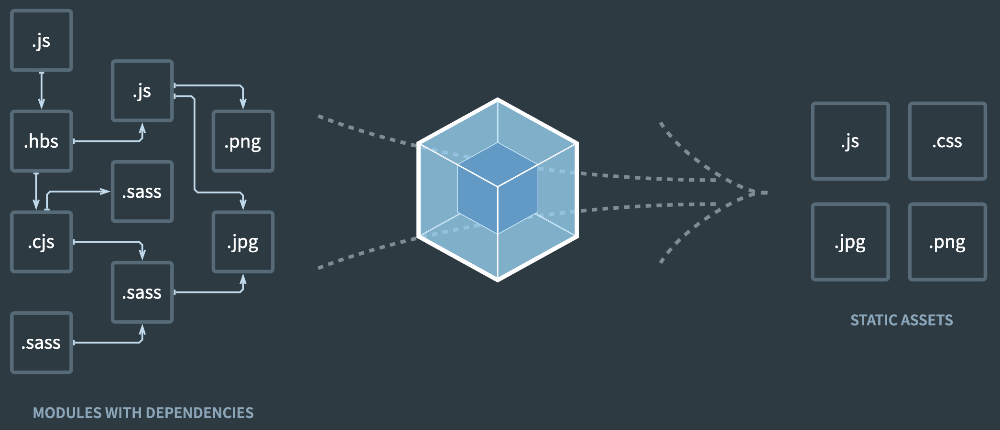

그렇다면, 단순히 전역 scope를 module로 바라보고 개발하기 위해 모듈 번들링을 해야할까? 그렇지 않다. 더 중요한 이유가 있다. 바로 HTTP 1.1의 스펙 때문에 그렇다. HTTP의 간단한 요청 프로세스를 알아보자.

HTTP 요청을 하기 위해서는 TCP/IP 스펙에 따라 3way-handshake 과정을 통과하고, network 전송을 받고 다시 커넥션을 닫기 위해 4way-handshake 과정을 거친다. 또한, HTTPS 프로토콜은 기본이기 때문에 HTTPS Handshake 과정은 당연하게 거쳐야 한다. 서버와 브라우저가 처음 연결되어 HTTP GET 요청으로 html 파일을 받아보기까지 꽤나 많은 처리들이 이루어지고 있다.

GET 요청이 성공해 브라우저가 html 파일을 받았다. 브라우저는 html 파일을 파싱하면서 `<script>` 태그를 만나면 다시 서버로 network 요청을 보낼 것이다. JavaScript를 로드하고 실행하기 전까지 브라우저는 멈춘다. 후에 또다시 여러 개의 `<script>` 태그를 만나거나 CSS를 요청하는 `<link>` 태그, Image 혹은 Font를 요청하는 태그를 만나면 그때마다 브라우저는 서버에 다시 resource를 받아오는 network 요청을 보낼 것이다. 또는, JavaScript에서 서버로 API를 통해 JSON을 요청할지도 모른다.

브라우저는 HTTP 1.1에서 network 동시 요청 숫자가 정해져있다. 크롬 같은 경우 동시에 요청할 수 있는 횟수는 최대 6개이다. 여러 개의 JavaScript파일을 하나로 묶는다면 네트워크 요청이 다수에서 하나로 변할 것이고, 이는 당연히 사용자가 웹 어플리케이션을 사용할 때 더 빠른 속도로 화면과 상호작용할 수 있다는 것을 뜻한다.

그렇기 때문에 다수의 HTTP 요청 보다는 작은 양의 요청을 보내기 위해 모듈 번들링을 해주는 것이 웹 어플리케이션을 효율적으로 구동시키기에 좋은 것이다.

Webpack에서는 개발에 필요한 유용한 도구도 지원한다. dev-server가 그 중 한가지다. 내가 만든 코드를 브라우저에서 바로 동작 할 수 있도록 컴퓨터에서 개발 서버를 띄워줘서 서빙해주는 역할도 하며, 또 proxy를 사용해 port 번호를 변경하거나, 코드를 변경하고 저장하면 브라우저를 새로고침하지 않아도 변경된 모듈만 교체하여 다시 보여주는 것(HMR)도 지원한다.

Vue2(Vue3는 Vite)도, React도 이런 모듈 번들러 위에서 동작하며, 아래에서 다루어볼 Webpack 필수 설정들은 프레임워크에서 자신의 입맛대로 커스텀해 숨겨두었다. (react 같은 경우 eject 명령어로 이를 해체해 재설정할 수 있다. Vue는 vue.config.js 파일에서)

생각해보면 react의 JSX나 Vue의 SFC(단일 파일 구성 요소)는 브라우저에서 이해할 수 없는 문법으로 되어있다. 브라우저는 JavaScript밖에 알지 못하기 때문이다. 하지만 브라우저에서 JSX 문법 혹은 .vue 파일이 동작할 수 있는 것은, Webpack 혹은 Babel을 통해 브라우저에서 동작하는 JavaScript 코드로 변환시키기 때문에 가능한 것이다.

Webpack에서는 JSX compiler를 통해 바벨과 함께 트랜스파일링하여 pure한 JavaScript 문법으로 만든다. 또한, Vue에서는 Template 코드 및 단일 파일 구성요소를 vue-loader를 통해 파싱하여 pure한 JavaScript파일로 만들어 브라우저에 제공한다. 이런 역할도 모두 모듈 번들러가 처리하고 있다.

따라서 개발할 수 있는 환경을 만들고, 배포에 필요한 여러 도구를 직접 만져보는 것이 중요하다. 적어도 내가 만든 코드가 어디서 어떻게 변환되어 돌아가는지 알아야 문제가 생겼을 때 대처할 수 있기 때문이다. 물론, 권장되고 기본 세팅이 된 Webpack을 사용하면서 필요할 때 공식 홈페이지에 들러 필요한 옵션을 사용하면 된다.

한가지 짚고 넘어갈 것은, Webpack은 Node.js 환경에서 동작한다는 것이다. JavaScript는 브라우저에서 동작하기도 하지만 Node.js 런타임 환경에서도 동작한다. 우리의 컴퓨터에서 JavaScript를 실행해서 모듈 번들링을 해야한다고 생각하면 쉽다. Webpack은 자원(모듈)을 모두 JavaScript 안으로 들고와서 Node.js 환경에서 조작할 것이다. 이것이 빌드다.

---

## init

폴더를 하나 만들고 terminal에서 아래 명령어를 실행한다. (Node.js가 설치되어 있다는 것을 가정한다)

```sh
$ npm init -y
```

package.json 파일이 생성 되었다. `-y` 옵션은 따로 meta 데이터를 설정하지 않는 다는 것을 말한다. `scripts` 부분을 보자. `npm run [명령어]` 를 사용하면 자동으로 적힌 코드를 터미널에서 실행시켜주는 옵션이다.

이제 코드 환경설정 부터 해보자. 이는 개발자와 회사의 선호에 따라 달라질 수 있다.

<br/>

## ESLint / Prettier

eslint와 prettier는 코드의 품질을 높여주는 도구다. IDE에서 자동으로 코드 포매팅을 도와주고, cli 명령어로 코드의 스타일을 잡아주는 도구다. 이것이 필요한 이유는 개발자 개인의 코드 스타일에도 영향을 미치지만, 협업시 개발자마다 코드를 작성하는 방식이 다르기 때문에 통일시켜주기 위해 사용한다.

이를 사용하면, 개발자는 포매팅 등 중요하지 않은 것에 에너지를 낭비하지 않고 핵심적인 로직에 집중할 수 있게 된다.

### 차이점

eslint는 코드의 들여쓰기 부분이나 개행 스타일의 포매팅을 잡아주기도 하지만, 문법이 틀렸다면 이를 표시해주는 역할이다. 즉 `코드 문법 검사 + 포매팅` 의 역할을 한다. prettier는 `포매팅` 만 한다. 예전에는 prettier의 포매팅이 eslint의 포매팅보다 나아서, eslint의 포매팅을 끄고 문법검사만 하며, prettier만으로 포매팅을 했지만 요즘은 eslint로 문법 검사와 포매팅을 하는 경우가 많아진다고 한다. 우리는 둘 다 사용할 것이다.

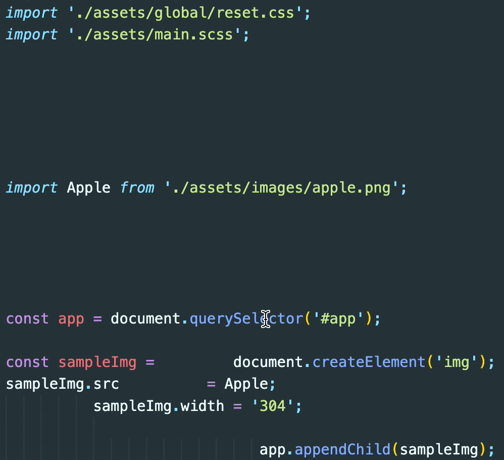

위의 사진은 저장을 했을 때 자동으로 IDE 차원에서 포매팅을 해준 모습이다.

### ESLint

```sh
$ npm i -D eslint prettier
```

먼저 설치를 했다면 설정 파일이 필요하다. `eslintrc.js` 파일을 만들자.

```js
// eslintrc.js
module.exports = {
  env: {
    browser: true,
    node: true,
    es2022: true,
  },
  extends: [
    'eslint:recommended',
    'eslint-config-airbnb-base',
    'eslint-config-prettier',
  ],
  parserOptions: {
    ecmaVersion: 'latest',
    sourceType: 'module',
  },
  rules: {
    // 화살표 함수 매개변수 1개일 때 괄호 빼줌.
    'arrow-parens': ['error', 'as-needed'],
    (...)
  },
};
```

- `env` : eslint의 문법 검사의 환경을 지정한다. 나는 broswer에서 사용할 코드, 그리고 node.js 환경에서 사용할 코드, ECMAScript 2022 기준으로 코드를 작성할 것을 명시했다.
- `rules` : eslint의 핵심이다. 어떤 규칙을 적용할지 설정해줄 수 있다. 공식 홈페이지에서 다양한 규칙을 지원하니 보고 적용시켜주면 된다. 각 스타일에 맞게 어떤 규칙은 error를 띄워줄 수도 있고, warning만 띄워줄 수도 있다. `extends`의 규칙을 무시하고 rules가 우선순위를 가진다.
- extends : rules의 묶음 세트다. rules를 권장하는 대로 실행시킬 수 있다. 권장되는 rules를 가진 라이브러리라고 생각하자. 이녀석들을 사용하기 위해서는 npm 에서 패키지를 다운받아야 한다. `$ npm i -D eslint-config-airbnb-base eslint-config-prettier`

> 📌 extends 유의사항
>
> - `eslint-config-` 는 prefix로 생략해도 무방하다.
> - `eslint-config-airbnb-base` 는 airbnb에서 사용하는 eslint 패키지다. `eslint-config-airbnb`와 헷갈리지 말자. base가 붙지 않은 패키지는 react lint까지 함께 딸려온다. warning을 뿜어낼꺼다. base는 JavaScript lint 패키지만 가져온다.
> - `eslint-config-prettier` : prettier도 eslint도 포매팅을 함께 사용한다고 했다. 그러면 prettier와의 충돌이 나지 않게 해주는 패키지다.

- parserOptions : 구문 분석 옵션이다. eslint는 우리가 작성한 코드를 파싱해서 이게 맞는지 틀린지 판단한다. [링크](https://eslint.org/docs/latest/use/configure/language-options#specifying-parser-options)

이제 package.json 파일에 아래와 같이 적어주자.

```json
"scripts": {
  "lint": "eslint",
},
```

JS 파일 하나를 만들어두고 약간 엉망인 코드를 작성하자. 그리고 `npm run lint` 명령어를 사용해보자. 기본적인 것은 이 구조다. IDE에서만 eslint를 사용해 바로 포매팅 혹은 문법 검사를 해주는게 아니다.

하나 팁은, 코드 크기가 커지고 파일이 많아질 수록 lint 체크 하는 것은 시간이 걸릴 것이다. 이때 캐시를 사용할 수 있다. `eslint --cache .` 를 위 scripts 에 붙여주자. `"lint": "eslint --cache ."` 그리고 명령어를 실행하면 `.eslintcache` 파일이 생성된 것을 볼 수 있다. 이제, lint를 돌릴 때마다 파일이 변경되지 않았다면 이 캐시에 있는 lint 결과를 꺼내 쓸 것이고, 새로 생성되거나 수정되었다면 새롭게 체크를 해줄 것이다. (캐시 파일은 gitignore에 등록해주자.)

그리고 eslint 설정에 위배되면서, eslint 스스로 고칠 수 있는 규칙이 있다. 만약 그런 규칙들도 고치고 싶다면 `--fix` 옵션을 함께 포함해 명령하면 코드까지 함께 고쳐준다. `"lint": "eslint --fix --cache ."`

lint 체크를 하고 싶지 않은 파일이 있다면 `.eslintignore` 파일에 적어주도록 하자. dist와 node_nodules는 반드시 포함해주자. 안해주면 디렉토리 내부에 있기 때문에 안에 있는 종속성 파일 모두 체크를 해버린다.

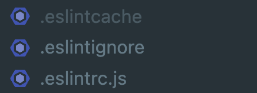

이제 IDE에서도 문법이 틀린 것을 바로바로 표시해줄 수 있도록 마켓플레이스에서 ESLint 플로그인을 깔면된다. VSCode 기준으로 아래의 것이다.

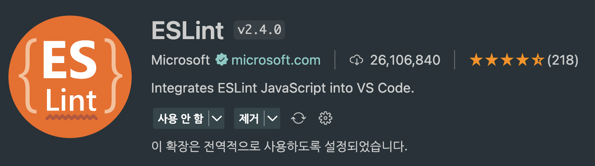

## Prettier

```sh
$ npm i -D prettier
```

prettier는 포매팅만 해준다. 따라서 설정 파일이 간단하다.

```js
module.exports = {
  printWidth: 80,
  tabWidth: 2,
  useTabs: false,
  semi: true,
  singleQuote: true,
  trailingComma: 'all',
  bracketSpacing: true,
  // 화살표 함수 매개변수 1개일 때 괄호 빼줌.
  arrowParens: 'avoid',
};
```

단순 코드 포매팅 옵션만 잘 설정해주면 된다. 또, 포매팅을 적용하고 싶지 않다면 `.prettierignore` 파일을 통해 제외시키자. 마찬가지로 node_modules, dist 폴더는 포함시켜주자.

```json
"scripts": {
  "lint": "eslint --fix --cache .",
  "format": "prettier",
},
```

package.json 파일에 위와 같이 적어주고 돌려보자. 그러면 어떤 코드 포맷이 틀렸는지 표시해준다. 단, 수정해주지는 않는다. 여기에 필요한 것은 `--write` 옵션이다. `prettier --write` 으로 변경 후 돌려보면 코드 포맷이 수정까지 된 것을 볼 수 있다.

또한 cache를 사용할 수 있다. 최종은 `prettier --write --cache .` 이 되겠다.

```json
// 최종
"scripts": {
  "lint": "eslint --fix --cache .",
  "format": "prettier --write --cache .",
},
```

여기서 주의할 점은, eslint의 캐시 파일은 디렉토리 최 상단에 생성되었지만 prettier 캐시는 node_modules에 생성된다는 점이다.

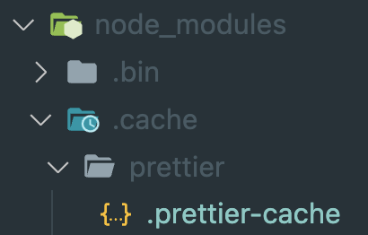

위와 같다. 여기서 꺼내 쓸 것이다. 이제, cli는 모두 구성했으니 마찬가지로 마켓 플레이스에서 prettier를 검색해 설치하자.

처음 gif 사진과 같이 IDE 차원에서 코드 포매팅이 자동으로 되고 싶다면, VSCode의 설정 -> Format On Save 검색 -> 체크를 해주면 된다.


만약 되지 않는다면 VSCode의 `default formatter`가 어떻게 되어있는지 봐야 한다. prettier로 되어 있는지 확인.


만약 그래도 되지 않는다면 setting.json 파일에 format-on-save, default-formatter가 다른 것으로 지정되어 있는지 살펴보자.

<br/>

## Husky / lint-staged

### Husky

이제, eslint와 prettier를 husky를 통해 자동화를 해볼 것이다. 뭐든 cli를 통해 명령을 내릴 수 있는 것들은 자동화가 가능하다. [husky](https://typicode.github.io/husky/#/)는 git hook을 쉽게 만들어주는 패키지다. 우리는 commit을 하기 전에 eslint와 prettier를 실행시켜 문제가 생기면 commit을 하지 못하게 만들 것이다.

```sh
$ npm i -D husky
```

패키지를 깔면 아래 명령어로 Git Hook을 활성화 해야 한다.

```sh
$ npx husky install
```

실행하면 `.husky` 폴더가 생성된 것을 볼 수 있다. 이제, 훅 명령어를 만들어보자.

```sh
$ npx husky add .husky/pre-commit "npm run lint"
$ npx husky add .husky/pre-commit "npm run format"
```

두 명령어를 실행하면 아래 사진과 같이 .husky/pre-commit에 생성되었다.

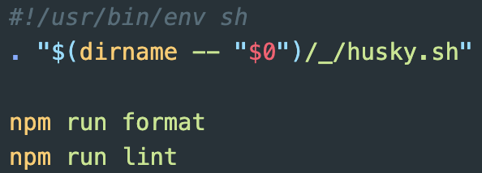

이제 git commit을 실행할 때마다 eslint와 prettier가 자동으로 실행되고, error가 발생하면 commit을 멈춘다.

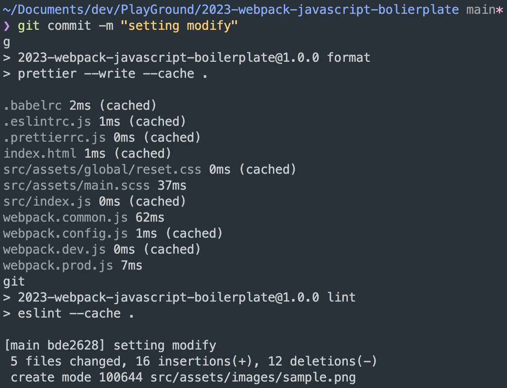

다른 개발자가 repository를 clone 받는다면 `.husky` 파일도 함께 clone 받아도 husky install이 안되어 있을 수 있다. 따라서 package.json 파일에 install할 수 있는 명령어를 넣어주자.

```json
"scripts": {
  (...)
  "prepare": "husky install"
}
```

prepare는 `npm install` 명령어 이후에 실행되는 스크립트다. ※ yarn은 preinstall을 사용해야 한다.

husky는 사실 개인 프로젝트에서 설정해줄 필요는 없다. 단, 개발자들 간에 협업을 할 경우 husky를 통해 컨벤션을 강제할 수 있어 좋다.

### lint-staged

lint-staged는 Git에 스테이징된 파일들에 대해서만 코드 검사나 포매팅 등의 작업을 수행할 수 있도록 도와주는 도구다. 즉 `git add` 명령어로 추가된 파일은 git의 stage에 들어가게 되는데, **stage에 들어간 파일만** 대상으로 명령을 실행할 수 있도록 할 수 있다.

> husky로 lint 체크를 할 수 있는데 왜 lint-staged를 사용하는지 궁금했다. 둘 다 git hook을 사용하기 때문에 다른게 없어 보였기 때문이다. 하지만 아래와 같은 이유로 함께 사용한다. <br/>
> husky는 pre-commit을 촉발 시키는 역할만 하며, 명령어로 `eslint` 와 같은 것을 실행시킬 수 있지만, `eslint` 명령어는 모든 파일을 검사한다. 하지만, lint-staged를 사용하면 stage에 올라온 파일만 검사하므로 훨씬 효율적으로 lint 검사를 할 수 있는 것이다.

주로 다음과 같은 흐름으로 사용된다.

1. Husky를 설정하여 pre-commit 훅을 트리거해, lint-staged를 실행시킴.
2. lint-staged가 스테이징된 파일들을 가져와서 설정된 작업을 수행함.

설치해보자.

```sh
$ npm i -D lint-staged
```

이제 lint-staged 설정 파일을 만들자. 설정은 package.json 파일에서 해도 되지만, 나는 따로 파일로 분리시키고 싶어 `.lintstagedrc.js` 파일을 생성했다.

```js
module.exports = {
  'src/**/*.{js,jsx,ts,tsx}': ['npm run lint', 'npm run format'],
};
```

어떤 파일 확장자를 검사할 것인지 적어주고, 배열에 차례로 실행할 명령어를 적어주면 된다.

그리고 husky에 설정한 pre-commit의 명령어를 lint-staged를 실행시키도록 변경해보자. .husky/pre-commit 파일을 아래와 같이 수정한다.

```
#!/usr/bin/env sh
. "$(dirname -- "$0")/_/husky.sh"

npx lint-staged
```

이제 commit을 하면 lint-staged가 실행되고, lint-staged가 완료 되어야만 정상적으로 commit이 이루어질 것이다.

<br/>

## Github Template

Github Template은 issue나, PR을 할 때 템플릿을 설정해준다. 소스 저장소를 Github을 사용한다면 설정해볼만 하다. 이를 통해 이슈를 생성할 때마다 어떤 틀을 가지고 설정해야 하는지, PR을 올릴 때 어떤 주제로 글을 작성해야하는지 틀을 지정할 수 있다. `.github` 디렉토리를 생성하고 아래 두 파일 정도를 템플릿으로 지정해두면 좋다.

`ISSUE_TEMPLATE.md` 을 만들자.

```
## 이슈 목적

- 이슈를 생성한 목적을 적는다.

## (optional) 발생한 문제

- 발생한 문제점에 대해 적는다.

## (optional) 이슈에 대한 상세 내용

- 어떤 작업을 할 것인지 세분화 해서 적는다.

## 예상되는 결과

- 이슈를 해결했을 때 얻는 결과를 적는다.
```

이 파일이 repository에 올라갔다면 아래 사진과 같이 이슈를 등록하려고 들어가면 템플릿이 만들어져 있다.

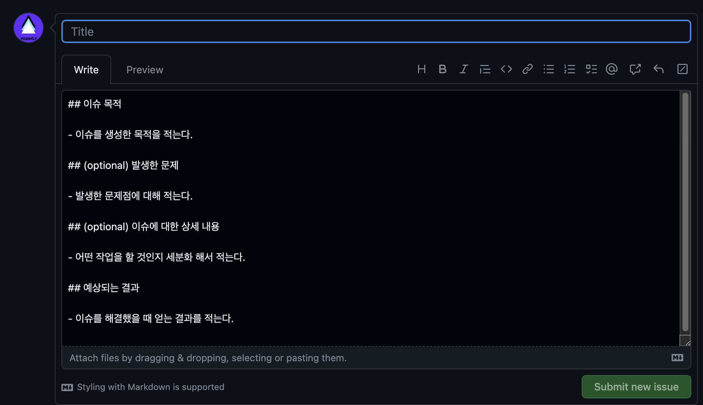

`PULL_REQUEST_TEMPLATE.md`은 아래와 같다.

```
## 주제

- PR 주제에 대한 간략한 설명을 적는다.

## 작업 내용

- 어떤 작업을 했는지 작성한다.

## (optional) 예상되는 결과

- 이슈를 해결했을 때 얻는 결과를 적는다.

## (optional) 스크린샷

- 필요하다면 스크린 샷을 이미지로 보여준다.
- PR이 적용되기 전과 후의 화면 스크린샷이면 좋다.

## ⭐️ 검토 필요

- 검토가 필요한 내용을 적는다.

## (optional) 관련 자료

- 작업하는데 도움이 되었던 링크 혹은 자료를 남긴다.
```

이정도 틀이라면 개발자들끼리 소통하는데 좋은 템플릿이 될 수 있다.

여기까지 코드와 관련된 유용한 설정이었다. 아래부터는 Webpack 설정이다.

---

<br/>

## Webpack

Webpack을 설치한다.

```sh
$ npm i -D webpack webpack-cli
```

가장 먼저 해야할 일은 `webpack.config.js` 파일을 만드는 것이다. 위에서 Webpack은 Node.js라는 JavaScript 런타임 환경에서 동작한다고 했다. 이 파일의 설정 옵션을 보고 Webpack이 내부적으로 번들링을 처리할 것이다. (Webpack5 버전 기반)

### Entry / Output

- Entry : 진입점
- Output : 결과물

웹팩은 모듈 번들러라고 했다. 코드를 묶기 위해서는 진입점이 필요하다. 어떤 파일을 기준으로 연관 있는 코드를 묶을 것인지, 또 번들링이 완료된 묶인 파일은 어떻게 나올 것인지부터 정의해주자.

```js
module.exports = {
  entry: {
    main: './src/index.js',
  },
};
```

기본적으로 Entry를 설정해주면, Webpack은 `import` 키워드를 통해 묶여있는 파일을 찾는다. 파일을 찾아 연관성을 파악해 번들링 해준다. index.js 파일에 import 문구를 적어주어 파일을 묶어주자.

이제 output을 정의할 것이다.

```js
const path = require('path');

module.exports = {
  entry: {
    main: './src/index.js',
  },
  output: {
    path: path.resolve(__dirname, 'dist'),
    filename: '[name]_[chunkhash:8].js',
  },
};
```

- path : 번들링 결과물이 나올 경로
  - Node.js의 path 라이브러리를 가져와 컴퓨터에 있는 경로를 지정해준다. 여기서 `dist`란, 번들링 후 결과물이 들어갈 폴더다.
- filename : 번들링 된 파일의 이름
  - [name] : entry의 `main`이 여기 들어간다.
  - [chunkhash:8] : chunkhash 전략을 사용한다. 8자만 해시 이름을 붙여준다.

> ⭐️ Webpack의 hash
>
> Webpack으로 번들링 된 파일은 결국 브라우저에서 HTTP 요청을 보내면 파일을 내려줄 것이다. 이때, **브라우저 캐시**와 (CDN을 사용한다면) **CDN 캐시**가 문제 될 수 있다. 배포후, 다음 릴리즈 때 다시 웹팩으로 번들링 할 것이고 filename이 동일한 파일로 되어 있다면 브라우저는 동일한 파일을 요청하는지 알고 브라우저 혹은 CDN 캐시에서 JavaScript 파일을 꺼내 쓸 것이다.
>
> 즉, 캐시로 인해 열심히 만든 새로운 기능이 캐시 때문에 제대로 다운로드 되지 않을 것이다. 이때 hash가 필요하다. 빌드 할 때마다 파일 이름에 붙은 hash 값이 변경된다면 브라우저, CDN은 다른 파일의 요청이기 때문에 수정된 번들 파일을 새로 요청할 것이다. Webpack의 해시는 3가지로 설정할 수 있다.
>
> - [hash] : 빌드할 때마다 모든 파일에 똑같은 hash가 붙는다. (webpack5에서 deprecated)
> - [chunkhash] : 변경된 `entry 기준`으로 묶여있는 chunk만 hash가 변경된다. (주로 JS 파일에 설정)
> - [contenthash] : 변경된 `파일만` hash가 변경된다. (주로 CSS, Image 파일에 설정)
>
> 위와 같은 캐시 버스팅을 해주었다 하더라도 결국 JS 파일을 요청하는 index.html 파일은 절대 캐시 되면 안된다. html의 meta 태그에 아래와 같이 설정해주자.
>
> ```html
> <meta
>   http-equiv="cache-control"
>   content="no-cache, no-store, must-revalidate"
> />
> ```
>
> `http-equive="cache-control"` 같은 경우는 표준이 아니라고는 하지만, 붙여주는것이 좋아보인다. 위 content에 들어가는 내용은 서버에서 index.html 파일을 보내줄 때, response header, cache-control에 들어갈 수 있는 내용이다.
>
> - no-cache : 캐시는 하되, 원서버(CDN을 지나)에 검증을 받아라.
> - no-store : 캐시를 하지말라.
> - must-revalidate : 원서버에서 응답이 없으면 error를 발생시켜라.
>
> 캐시 header에 대해서 더 많은 이야기가 있지만 나중에 쓰도록 하자... [토스-웹 서비스 캐시 똑똑하게 다루기](https://toss.tech/article/smart-web-service-cache) 이곳에서 더 많은 정보를 얻을 수 있다.

여기까지 설정이 되었다면 이제 빌드를 해볼 수 있다. package.json에 아래와 같이 build script를 만들자.

```json
"scripts": {
  (...)
  "build": "webpack",
}
```

이제 `npm run build` 명령어로 번들링 명령을 내릴 수 있다. 실행하면 `dist` 폴더에 번들링된 파일이 생성된 것을 볼 수 있다.

> chunk란?
>
> chunk는 번들링된 코드를 분할하면 나오는 덩어리로 이해하면 쉽다. 프로젝트가 거대해질 수록 번들링 된 JS 파일의 크기가 매우 커진다. 그러면 현재 보여질 페이지에서 사용하지 않는 파일도 모두 한 덩어리로 나오게 되는데, 이때 지금 필요없는 JS 파일은 따로 나중에 불러오기 위해 이를 나누는 작업이다. 이를 lazy loading 이라고 한다. 또, 변경될 일이 없는 node_modules에 있는 라이브러리 파일을 vendor라는 이름으로 chunk를 나누기도 한다. 이는 캐싱 전략에도 좋다.
>
> 우리가 설정한 entry는 지금 `main`으로 하나밖에 없지만 여러개가 될 수 있는데, 이는 각각 하나의 chunk를 생산한다.
>
> Webpack에서는 CommonsChunkPlugin을 사용해 chunk를 나눌 수 있는데, webpack4에서 deprecated 되었고, [SplitChunksPlugin](https://webpack.kr/plugins/split-chunks-plugin/)을 사용한다고 한다.

<br/>

### Loader / Plugin

Loader는 JavaScript가 아닌 자원을 JavaScript가 해석할 수 있게 도와주는 옵션이다. 무슨 말이냐면, Webpack은 기본적으로 CSS, Images, Fonts등의 파일을 알지 못한다. 왜냐면 Node.js 위에서 돌아가는 프로그램이기 때문이다. 따라서 파일을 해석할 수 있게 Loader를 사용해 Webpack이 알 수 있도록 변환하는 작업을 한다.

#### CSS 설정

css 관련 loader를 설치해보자.

```sh
$ npm i -D css-loader sass sass-loader style-loader
```

- style-loader : html의 head 태그 내부에 `\<style>` 태그로 css 파일을 주입한다. (빠르게 로드하므로 개발모드에서만 사용)
- css-loader : JavaScript 파일 내부의 import문으로 css 파일을 불러온다.
- sass : sass를 전처리 하기 위한 패키지.
- sass-loader : sass 또는 scss 파일을 JavaScript 파일로 불러오며, css 파일로 전처리 한다.

```js
module.exports = {
  (...)
  module: {
    rules: [
      {
        test: /\.(sa|sc|c)ss$/,
        use: [
          'style-loader',
          'css-loader',
          'sass-loader',
        ],
      },
    ],
  },
}
```

webpack.config.js 파일에 `module` 이란 이름 하위에 들어가는 녀석들이 loader들이다. use에 적힌 loader들은 가장 끝에서 부터 시작한다. 위의 순서를 보면 `sass-loader` -> `css-loader` -> `style-loader` 순으로 로더들이 처리되는 구조다.

순서를 생각해보면, sass-loader가 sass(scss) 파일을 css 파일로 변환하고, css-loader가 css파일을 JavaScript에서 인식할 수 있게 바꾸어 준다. 즉, 순서가 맞다.

```js
// index.js
import './reset.css';

console.log('css loaded');
```

css 파일을 JavaScript 파일에서 `import` 문으로 가져올 수 있다. 만약 loader 없이 css를 import 하려하면 에러가 발생했겠지만 이제는 아니다. 나중에 세팅할 devServer를 실행시키면 `style-loader`는 html 파일에 style 태그로 css 내용을 넣어주는 역할을 하고 있다.

#### HtmlWebpackPlugin

Plugin은, 번들링된 결과물을 바꾸는 역할을 하고 있다. Loader와의 차이점은, Loader는 파일을 해석하고 변환하지만 Plugin은 결과물을 변경한다. devServer를 실행시키기 위해 HtmlWebpackPlugin을 설치해보자.

```sh
$ npm i -D html-webpack-plugin
```

```json
const HtmlWebpackPlugin = require('html-webpack-plugin');

module.exports = {
  (...)
  plugins: [new HtmlWebpackPlugin()],
}
```

build를 해보면, 이번에는 dist 폴더에 없던 index.html 파일이 생성된 것을 볼 수 있다. `script` 태그로 우리가 번들링한 index.js 파일이 담겨있는 것을 볼 수 있다. 기초가 되는 html 파일을 내가 만든 파일로 설정해야 한다.

프로젝트 루트에 index.html 파일을 생성하고, plugin 설정을 바꾸어주자.

```json
module.exports = {
  (...)
  plugins: [new HtmlWebpackPlugin(
    template: 'index.html',
  )],
}
```

HtmlWebpackPlugin안에는 여러 설정이 있다. 브라우저 타이틀을 넣어줄 수 있고, favicon을 설정할 수도 있다. [여기](https://github.com/jantimon/html-webpack-plugin)서 확인해볼 수 있다.

이제 index.html 파일 기준으로 build가 되도록 세팅되었다. index.html 파일이 생성되었기 때문에 devServer를 띄워볼 수 있다.

```sh
$ npm i -D webpack-dev-server
```

package.json 파일에 아래와 같이 설정해주자.

```json
"scripts": {
  (...)
  "dev": "webpack serve --open",
}
```

그리고 `npm run dev` 명령어를 터미널에서 실행하면 브라우저에서 우리가 생성한 파일의 결과물을 볼 수 있다. `--open` 명령어는 브라우저를 자동으로 띄워주는 역할을 한다.

Webpack5에서는 devServer에서 Hot Module Replacement가 기본 설정 값이기 때문에 코드 변경이 일어나면 새로고침 없이 변경된 모듈만 브라우저에서 바로 변경된다. 이를 줄여서 HMR이라고 한다.

개발자 도구를 띄워 확인해보면 `style-loader` 때문에 html에 style태그에 박힌 css를 확인할 수 있을 것이다. 이번엔 style태그로 변환하는 것이 아니라, css 파일 자체로 불러와보자.

```sh
$ npm i -D mini-css-extract-plugin
```

이 플러그인은 번들링된 css 파일을 외부 파일로 만들어준다. 주로 배포 모드에서 사용하는데, 이유는 각각 나누어진 파일을 lazy-loading 할 수 있기 때문이다. style-loader 같은 경우는 한번에 모두 불러오기 때문에 비효율적일 수 있다. 따라서 모드 별로 다르게 설정해주도록 하자.

> 처음에는 MiniCssExtractPlugin을 도대체 왜 사용할까 고민했다. 왜냐하면 css 파일을 js로 들고와 다시 한번 css 외부 파일로 만드는 행위가 비효율적이라고 생각했다. css 파일이 여러 개라면, 페이지별로 css를 http로 요청할 경우 각기 다른 파일을 가져오도록 하고, 이를 웹서버에서 적절히 내려주면 되는 문제 아닌가?
>
> 하지만 css를 js로 들고오는 이유는 다양하다. 특히 sass 같은 경우 독단으로 브라우저에서 사용할 수 없다. sass를 css로 변환하는 과정이 따로 필요하며, js에서 이를 css로 트랜스파일링 해준다. 이를 Webpack에 위임함으로 자동화가 이루어졌다. 또한 postcss를 통해 css에 후처리도 해줄 수 있다.
>
> 이렇게 css, image, fonts를 js로 가져오는 행위는 resource를 가공하기 위해서이다.

```js
const MiniCssExtractPlugin = require('mini-css-extract-plugin');

const devMode = process.env.NODE_ENV !== 'production';

module.exports = {
  module: {
    rules: [
      {
        test: /\.(sa|sc|c)ss$/,
        use: [
          devMode ? 'style-loader' : MiniCssExtractPlugin.loader,
          'css-loader',
          'sass-loader',
        ],
      },
    ],
  },
};
```

이렇게. `process.env.NODE_ENV` 는 Webpack 즉, Node.js가 빌드할 때 모드 별로 들어가는 text다.

최종적으로 package.json은 아래와 같다.

```json
"scripts": {
  "build": "webpack --progress --mode production",
  "dev": "webpack serve --open --progress --mode development",
}
```

`--progress` 옵션을 넣어주었는데, 이는 터미널에서 빌드 진행 상황을 나타내 준다.

#### 이미지 처리

Webpack4 버전 까지는 이미지를 처리하기 위해 url-loader와 file-loader 외부 패키지를 다운 받아 사용해야 했었다. webpack5에서는 url-loader, file-loader의 역할을 기본으로 지원한다.

먼저 file-loader의 역할은, 단순히 image 외 다른 파일을 js 파일로 가져올 수 있다. 그리고 url-loader는 이미지를 Data Uri Scheme 형태로 만들준다. base64로 인코딩 된 형식이다. 이를 html img 태그에 src 속성으로 넣어줄 수도 있고, css에서 사용하면 `url(...)` 에 넣어주어 활용할 수 있다.

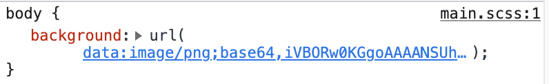

url-loader 같은 경우 주로 크기가 작은 svg 파일을 사용한다.

기존에 Webpack4에서 이미지의 크기 설정에 따라 크기가 작다면 url-loader로 처리하고, 이미지가 크다면 file-loader로 외부에서 받아올 수 있도록 설정이 권장 되었는데, 이는 url-loader가 크기가 커질 수록 변환 시간이 오래 걸리기도 하고 html 파일을 불러오는데 기하급수적으로 이미지 크기가 커지기 때문이다.

이번엔 Webpack5에서의 처리를 보자. 빌트인 로더를 사용한다. 종류는 4가지다.

- asset/resource : `file-loader`와 동일하다. 파일을 output(dist)로 내보내고 경로를 번들에 추가해준다.
- asset/inline : `url-loader`와 동일하다. Data Uri Scheme을 생성한다.
- asset/source : `raw-loader`와 동일하다. 파일의 소스 코드를 그대로 내보낸다. 주로 txt 파일 등을 사용한다.
- asset : 조건에 따라 asset/resource, asset/inline 모듈 중 자동으로 선택해 내보낸다.

asset 로더 같은 경우는 기본으로 `8kb`이하는 inline(Data Uri Scheme)으로, 이상은 resource(외부 파일)로 처리한다. webpack4 사용 당시 file-loader, url-loader를 섞어 사용할 때와 같은 모습이다.

```json
module.exports = {
	module: {
    rules: [
      {
        test: /\.(png|svg|jpe?g|gif|webp)$/i,
        type: 'asset', // 기본적으로 8kb 이하라면 url-loader로, 이상이면 file-loader로 동작
        parser: {
          dataUrlCondition: {
            maxSize: 4 * 1024, // 기준으로 4kb 로 변경
          },
        },
        generator: {
          filename: 'assets/images/[name]_[contenthash:8][ext]',
        },
      },
    ]
  }
}
```

parser.dataUrlCondition.maxSize를 사용하면 용량 기준을 정해줄 수 있다. 그렇다면, 하위의 generator.filename은 무엇일까? build 했을 경우 dist 폴더 하위의 경로를 정해주고, 파일 명을 정해줄 수 있다.

- [name] : output과 동일하게 entry 파일 기준이다.
- [contenthash:8] : 파일이 변경되면 hash가 변경된다. (위에서 살펴봤던 hash 정책을 보면 된다)
- [ext] : 확장자명

#### build시 새로운 파일로

build를 하면 dist 폴더에 번들링된 파일들이 차곡차곡 쌓이고 있다. hash값이 다르기 때문에 파일을 덮어쓰는 것이 아니라 계속 쌓이고 있는 것이다. build 하면 변경된 파일이 있을 경우 dist 폴더에 남아있는 찌꺼기를 알아서 삭제해주는 `clean-webpack-plugin` 을 설치해보자.

```sh
$ npm i -D clean-webpack-plugin
```

이 녀석은 webpack.config.js 파일의 `plugin` 목록에 포함시킬 필요는 없다. 대신, output에 아래와 같이 명시해주면 된다.

```js
module.exports = {
  output: {
    (...)
    clean: true,
  },
}
```

이제 build를 하면 dist 폴더는 최신 파일만 깔끔하게 남게 된다.

<br/>

### Mode(환경 분리)

이때까지는 build와 devServer가 거의 동일한 결과물로 나타났다. 하지만, 여러 옵션과 최적화를 사용하려면 Webpack 번들링에 필요한 loader 혹은 plugin이 달라진다. 따라서 환경 분리가 필수적이며, Webpack이 Mode에 따라 내부적으로 번들링하는 옵션 또한 달라지기 때문에 해주어야 한다.

#### webpack-merge

위에서 NODE_ENV를 이용해 `const devMode = process.env.NODE_ENV !== 'production';` 이렇게 분리해도 되지만, 아예 파일을 나누는 것을 권장한다. 왜냐하면 webpack.config.js 파일이 나중에는 비대해져 가독성이 매우 떨어지기 때문이다. 어쩔 수 없이 중복코드가 생기더라도 가독성이 우선이기 때문에 나눠 주도록 하자. 총 4개의 파일로 나눌 것이다.

- webpack.dev.js : devServer 환경. 즉 개발 환경.
- webpack.prod.js : build 환경. 즉 배포 환경.
- webpack.common.js : dev, prod에 공통으로 적용될 환경.
- webpack.config.js : `dev + common` 혹은 `prod + common` 이 최종적으로 나타날 환경.

결과적으로 Webpack은 config.js 파일을 바라보지만, `webpack-merge` 패키지를 통해 이를 나눌 것이다.

```sh
$ npm i -D webpack-merge
```

먼저 dev 환경이다.

```js
// webpack.dev.js
module.exports = {
  mode: 'development', // mode
  devtool: 'inline-source-map', // 다름 🔥
  module: {
    rules: [
      {
        test: /\.(sa|sc|c)ss$/,
        use: [
          'style-loader', // 다름 🔥
          'css-loader',
          (...)
        ],
      },
    ],
  },
  (...)
};
```

prod 환경이다.

```js
// webpack.prod.js
module.exports = {
  mode: 'development', // mode
  devtool: 'source-map', // 다름 🔥
  module: {
    rules: [
      {
        test: /\.(sa|sc|c)ss$/,
        use: [
          MiniCssExtractPlugin.loader, // 다름 🔥
          'css-loader',
          (...)
        ],
      },
    ],
  },
  (...)
};
```

common 공통 환경이다.

```js
// webpack.prod.js
module.exports = {
  entry: {
    main: './src/index.js',
  },
  output: {
    path: path.resolve(__dirname, 'dist'),
    filename: '[name]_[chunkhash:8].js',
    clean: true,
  },
  (...)
};
```

이제 webpack-merge를 통해 묶어주도록 하자.

```js
// webpack.config.js
const { merge } = require('webpack-merge');

const commonConfig = require('./webpack.common.js');
const productionConfig = require('./webpack.prod.js');
const developmentConfig = require('./webpack.dev.js');

module.exports = (env, args) => {
  switch (args.mode) {
    case 'development':
      return merge(commonConfig, developmentConfig);
    case 'production':
      return merge(commonConfig, productionConfig);
    default:
      throw new Error('No matching configuration was found!');
  }
};
```

merge를 통해 `dev + common`, `prod + common` 환경을 구축했다. `args.mode` 에는 각 환경에 맞는 텍스트가 포함되게 되는데, 이는 package.json의 script를 수정해 주어야 한다.

```json
"scripts": {
  "build": "webpack --mode production",
  "dev": "webpack serve --open --mode development",
}
```

`--mode` 를 통해서 주입해줄 수 있다. 아주 깔끔하게 잘 나누어졌다.

webpack.dev.js, webpack.prod.js 파일에 `mode` 옵션은 반드시 환경에 따라 'development', 'production' 텍스트를 넣어주자. Webpack이 명령어를 실행할 때 내부적으로 최적화 하는 정도가 달라진다.

#### dotEnv

dotEnv는 `.env` 파일에 있는 텍스트를 Node.js가 빌드 시 `process.env....` 를 이용해 환경 별로 다른 값을 넣어줄 수 있도록 도와주는 패키지다. 예를 들면, base-url 같은 것을 예로 들 수 있다. 개발 환경에서는 api 서버를 localhost로 지정하지만, 프로덕션 환경에서는 실제 주소를 적어주어야 하는 경우다.

```sh
$ npm i -D dotenv-webpack
```

그리고 env 폴더를 만들고, `.env.development`, `.env.production` 파일을 각각 만들자.

```
// .env.development
ENV_TEST=localhost

// .env.production
ENV_TEST=https://production.com
```

여기의 값을 환경에 따라 집어넣을 것이다.

```js
const Dotenv = require('dotenv-webpack');

module.exports = {
  (...)
  plugins: [new Dotenv({ path: './env/.env.development' })], // 또는 .env.production
}
```

이제 JavaScript 파일에서 `process.env.ENV_TEST` 로 접근하면 환경에 따라 다른 값이 나타나는 것을 볼 수 있다. process.evn는 Node.js가 빌드할 때 넣어주는 값인데, vite에 와서는 `import.meta` 를 사용한다고 한다.

#### 최적화

production 모드에서 추가적으로 최적화 해주면 좋은 것들이 있다.

- CssMinimizerPlugin : CSS 파일을 공백을 제거 등의 압축을 해준다.
- TerserPlugin : JS 파일의 코드를 난독화 및 압축

```js
// webpack.prod.js
const CssMinimizerPlugin = require('css-minimizer-webpack-plugin');
const TerserPlugin = require('terser-webpack-plugin');

module.exports = {
  (...)
  optimization: {
    minimizer: [new CssMinimizerPlugin(), new TerserPlugin()],
  },
}

```

웹 브라우저는 보안에 아주 취약하다. 개발자 도구를 열어보면 어떻게 비즈니스 로직을 작성했고, 스타일은 어떤 것을 사용했는지, html 구성을 어떻게 되어있는지 전부 볼 수 있다. JS 같은 경우 변수명까지 전부 노출되기 때문에 TerserPlugin으로 변수 명을 전부 의미 없는 것으로 변경 시키는 난독화를 해줄 수 있다.

압축에서 공백을 제거해주는 것만 해도 사용자에게 전달될 파일 크기가 작아진다. 네트워크 상황이 좋지 않은 환경에서는 필수라고 생각한다. 이렇게 구성하고 파일을 build 해보면 파일이 한줄로, 또 난독화가 되어있는 것을 볼 수 있다. 난독화 과정을 mangling(맹글링) 이라고 한다.

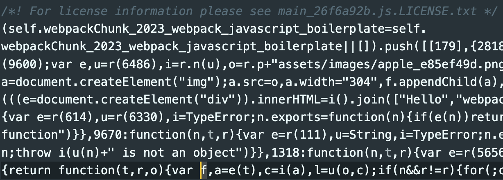

#### 소스맵

소스맵이란, 코드를 디버깅 할 수 있도록 도와주는 자료다. 여기서 자료라고 한 이유는, 소스맵 설정을 어떻게 하는지에 따라 번들링 된 파일 내부에 소스맵이 있을 수도 있고, `.map` 파일로 생성될 수도 있기 때문이다. Webpack에서는 소스맵을 생성하는 다양한 방식을 지원한다.

소스맵에 대해서 더 이야기해보자. 소스맵은, 브라우저에서 개발자도구를 켜면 `source` 탭에서 보이도록 해주는 녀석이다. 즉, JS, CSS 등의 어떤 언어 차원이 아닌 브라우저 스펙이다. 브라우저에서 소스맵을 읽어들이면 console log가 어느 소스코드에서 찍혔는지, 런타임 에러가 어디에서 발생했는지 개발자 도구를 통해 알려줄 수 있다.

또한, 에러 로깅을 위해 Sentry를 사용한다면 이곳에도 소스맵을 올려주어 디버깅을 용이하게 해줄 수 있다. 이전에 작성한, [Sentry 에러 로깅 시스템 도입](<https://pozafly.github.io/tripllo/(11)vue-sentry-error-monitoring-system/>) 글을 보면 소스맵도 함께 올려주는 것을 볼 수 있다.

- dev : `devtool: 'inline-source-map',`
- prod : `devtool: 'source-map',`

Webpack에서 권장하는 대로 위와 같이 설정해주었다.

> style-loader를 설정할 때, singletonStyleTag를 사용했었다.
>
> ```js
> {
>     loader: "style-loader",
>     options: { injectType: "singletonStyleTag" },
> },
> ```
>
> 이 옵션은 css 파일 별로 `<style>` 태그가 여러개 생기지 않고 하나로 묶이는 옵션이다. 하지만 singletonStyleTag 옵션을 사용할 경우, css 관련 소스맵이 작동하지 않는다.
>
> 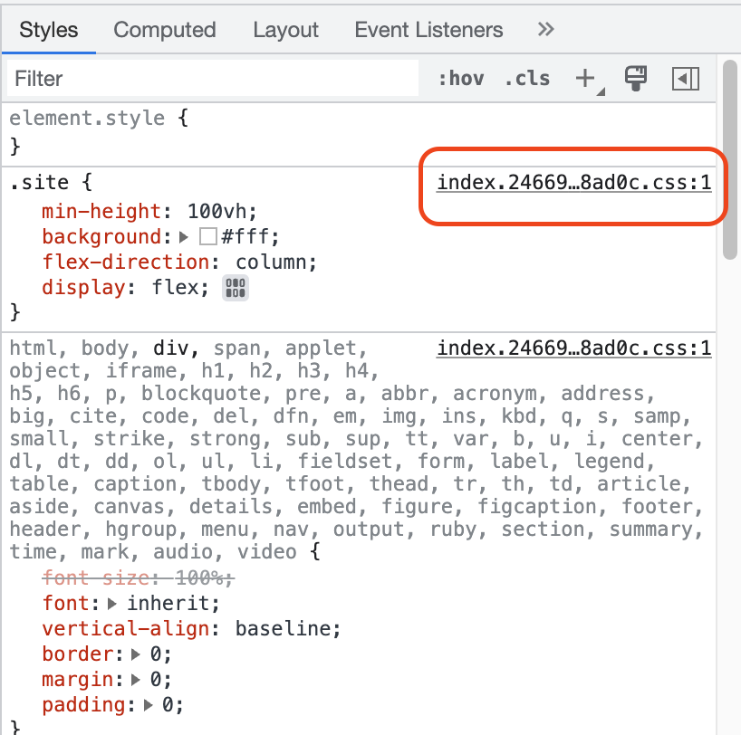
>
> 위 사진은 css 소스맵이 적용되었지만, singletonStyleTag는 빨간색 부분이 존재하지 않는다. 소스맵이 없어도 css는 적용한 스타일이 개발자도구에서 보이긴 하지만, 나중에 사용할 소스맵을 위해 옵션을 제거해주었다.

자세한 자료는 [Webpack공문](https://webpack.kr/configuration/devtool/), 또는 [Source Map 에 대한 고찰](https://medium.com/%EC%98%A4%EB%8A%98%EC%9D%98-%ED%94%84%EB%A1%9C%EA%B7%B8%EB%9E%98%EB%B0%8D/source-map-%EC%97%90-%EB%8C%80%ED%95%9C-%EA%B3%A0%EC%B0%B0-part-1-5a3f6d5ab48a)을 참고하자.

#### stats

stats는 번들링을 진행하면 터미널에 어떤 번들된 정보를 표시할지 지정하는 옵션이다. 이 옵션을 설정하지 않으면 번들 정보가 꽤 많이 나타나는데, 옵션을 통해 번들 정보를 아예 보이지 않게 만들어줄 수도 있고, 가볍게 나타내보일 수도 있다. [공식 홈피](https://webpack.kr/configuration/stats/)에 나와 있는대로 preset을 설정해보면서 맞는 옵션을 찾아보면 좋다.

```json
// webpack.common.js
module.exports = {
  (...)
  stats: {
    preset: 'minimal',
    moduleTrace: true, // 종속성 경고/에러 표시
    errorDetails: true, // 에러 세부 정보
    chunks: true,
  },
}
```

나는 위와 같이 설정해주었다.

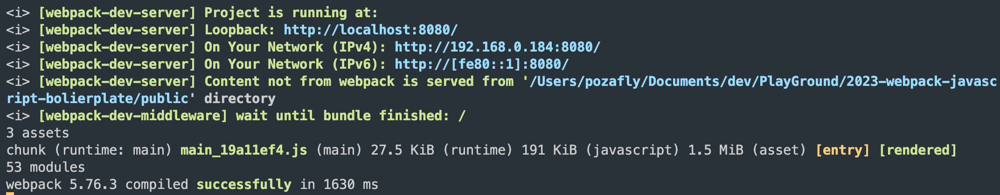

<br/>

## Babel 설정

Babel은 브라우저 하위 호환성을 위해서 만들어졌다. 최신 브라우저에서는 ECMAScript에 명세된 스펙을 준수하지만, 오래된 브라우저에서는 ECMAScript 버전이 낮게 개발되어 있어 최신 문법은 적용이 되지 않는다. Babel은 이를 해결하기 위해서 나타났다. 재미있는 것은 Babel 어원이다. 성경에 바벨탑이 나오는데, 사람들이 탑을 높게 쌓아서 하나님이 되려하자 하나님이 사람들의 언어를 다 다르게 만들어버렸다. 이를 다시 하나로 만들기 위해 Babel 이라는 이름을 사용한 것 같다.

어쨌든, Babel은 브라우저 하위 호환성을 위해 크게 2가지 역할을 하고 있다.

- 트랜스파일링
- 폴리필 제공

트랜스파일링은 말 그대로 JavaScript 문법을 이전 문법으로 변환시켜준다. JavaScript는 ES6에서 문법이 크게 변했다. ES6 이상 문법을 사용하면서 구 브라우저를 지원하기 위해 Babel을 사용할 수 있다. react에서는 심지어 ECMAScript tc39에 제안사항으로 올라온 문법을 Babel을 사용해 변환하기도 한다.

폴리필은, 트랜스파일링과 다르게 문법을 변환하는 것이 아니라 구현체를 제공한다. 예를 들면 `Promise` 객체가 있을 수 있다. 구 브라우저에서 Promise 객체가 구현이 되지 않았지만 폴리필에서 Promise를 옛 문법을 이용해 구현한 코드를 제공한다. 폴리필은 `core-js` 라이브러리에 기반하고 있다. 따라서 Babel에서 폴리필을 사용하기 위해 core-js 라이브러리가 필요하다. 설정해보자.

```sh
$ npm i -D @babel/core @babel/preset-env babel-loader core-js
```

- @babel/core : 바벨이 동작할 수 있게 하는 core
- @babel/preset-env : 쉽게 바벨을 설정할 수 있도록 패키지를 모아둔 라이브러리
- babel-loader : Webpack에서 Babel을 사용할 수 있게 도와줌
- core-js : 폴리필을 제공할 라이브러리

이제 `.babelrc` 파일을 만들자.

```js
{
  "presets": [
    [
      "@babel/preset-env",
      {
        "targets": "ie 11",
        "useBuiltIns": "usage", // 폴리필 사용 방식 지정
        "corejs": {
          "version": 3 // 폴리필 버전 지정
        }
      }
    ]
  ]
}
```

presets은 babel 설정이 들어있는 패키지다. 예전에는 `@babel/preset-env` 대신 사용하던 라이브러리는 `@babel/polyfill` 이다.

이제는 core-js와 regenerator-runtime이 더 이상 필요하지 않게 되었다. 이전에는 @babel/polyfill이 필요한 기능을 대체하기 위해 core-js와 regenerator-runtime을 내부적으로 사용했지만, 최신 버전의 Babel에서는 이러한 기능이 기본적으로 포함되어 있기 때문에 @babel/polyfill은 더 이상 필요하지 않다. 따라서, @babel/preset-env를 사용한다.

target은 지원하고자 하는 브라우저가 들어간다. ie 뿐 아니라 firefox, chrome 버전을 명시해줄 수 있다. 아래에서 살펴볼 browserlist의 내용이 들어갈 수 있다.

여기서 중요한 옵션은 `useBuiltIns` 옵션이다. useBuiltIns에는 아래 3가지 옵션이 들어갈 수 있다.

- entry : 전역 네임 스페이스에 필요 폴리필을 import 한다.
- usage : 필요한 모듈 혹은 scope에 필요 폴리필을 import 한다.
- false : 폴리필을 사용하지 않는다.

예전에 babel을 사용할 때는 무조건 폴리필이 전역에 import 되어 전역 네임스페이스를 더렵혔다.

만약, 프로덕트가 SDK로 다른 업체에 제공되는 프로덕트라고 가정해보자. SDK에서 폴리필이 전역 네임스페이스를 더럽히면, 다른 업체에서 사용하는 전역 변수와 겹칠 가능성이 생긴다. 아주 우연찮게 겹치게 되면 폴리필이 새로운 변수 혹은 함수로 대체되어 사용할 수 없게 되어버린다.

하지만, 필요한 곳에서 import해 사용하는 것이 아니라 전역에 폴리필을 깔면 필요한 부분을 찾을 비용이 들지 않기 때문에 퍼포먼스적으로 좋을 수 있다. usage를 사용하면, 필요한 모듈에 폴리필을 깔아준다.

참고 : [Babel7과 corejs3 설정으로 전역 오염 없는 폴리필 사용하기](https://tech.kakao.com/2020/12/01/frontend-growth-02/), [you don't know polyfill](https://so-so.dev/web/you-dont-know-polyfill/)

이제, webpack.common.js 파일에 babel-loader를 설정해주자.

```js
module.exports = {
  (...)
  module: {
    rules: [
      (...)
      {
        test: /\.js$/,
        exclude: /node_modules/,
        use: {
          loader: 'babel-loader',
          options: {
            cacheDirectory: true,
          },
        },
      },
    ],
  },
};
```

- exclude : 제외할 폴더
- options.cacheDirectory : 바벨 캐시 설정

이제 build를 해보면 .babelrc 파일에 설정된 target 브라우저에 맞게 트랜스파일링과 polyfilling이 된 것을 확인해볼 수 있다. 캐시 설정을 해주었는데, prettier와 마찬가지로 node_modules에 캐시가 생성된다.

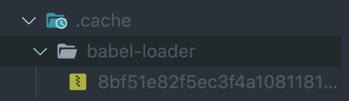

<br/>

## browserlist

브라우저 리스트는, 웹 개발에 필요한 라이브러리가 하위호환성을 참고할 때, 어떤 브라우저 기준으로 설정해야할지 지정할 수 있는 옵션이다. 우리는 babel의 target 브라우저는 .babelrc 파일에 설정했다. 하지만, `.browserslistrc` 파일을 만들어 제공해도 되고, package.json의 `browserslist` 를 통해 명시해줄 수 있다.

[browswerlist](https://github.com/browserslist/browserslist)는 [caniuse](https://caniuse.com/)의 데이터를 참고한다. 웹 개발에 호환성 확인으로 빠질 수 없는 페이지다. 아래에서 postcss 설정을 할 것이기 때문에 .babelrc 파일의 target을 제거하고 package.json 파일에 담아보자.

```json
{
  (...)
  "browserslist": [
    "ie 11",
    "chrome 111",
    "firefox 111"
  ]
}

```

last 2 versions 같은 값을 사용해 브라우저 별로 최근 2개의 버전까지 지원 가능하도록 만들 수도 있다.

<br/>

## postcss

postcss는 css를 후처리 할 수 있도록 도와주는 패키지다. sass는 전처리이다. 빌드 시점에 sass를 css로 변환한다고 해서 '전처리'라는 이름이 붙었다. postcss의 경우는 완성된 css 파일에 추가적인 처리를 한다고 해서 '후처리' 라는 이름이 붙었다. 마치 Webpack의 loader와 plugin같다. postcss는 여러 유용한 것을 제공하지만, Autoprefixer를 지원한다.

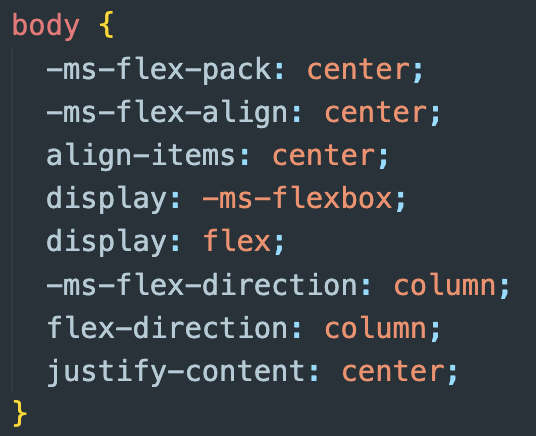

`-ms-flex` 라는 prefix가 붙었다. 이는 브라우저마다 지원하는 vendor prefixer가 다르기 때문이다. css 코드 중 구 브라우저를 지원하기 위해 이런 prefix를 붙여주는 것이다.

```sh
$ npm i -D postcss postcss-preset-env
```

postcss와 postcss-preset-env를 설치했다.

webpack.common.js 파일에 아래와 같이 작성하자.

```json
const postcssPresetEnv = require('postcss-preset-env');

(...)
{
  test: /\.(sa|sc|c)ss$/,
  use: [
    'style-loader',
    'css-loader',
    {
      loader: 'postcss-loader',
      options: {
        postcssOptions: {
          // autoprefix를 사용하기 위한 플러그인
          plugins: [postcssPresetEnv()],
        },
      },
    },
    'sass-loader',
  ],
},
```

로더에 위와 같이 postcssPresetEnv 설정을 해주었다. postcss 설정을 생각보다 간단하다.

<br/>

## dependencies vs devDependencies

npm으로 설치한 패키지들은 모두 `-D` 옵션을 붙여 package.json의 dependencies에 설치한 것이 아니라, devDependencies에 설치했다. `-D`옵션은 `--save-dev` 옵션을 주어 설치한 것과 동일하다. 만약, `-D` 옵션을 주지 않으면 dependencies에 설치된다.

- dependencies : 프로덕션 환경에 필요한 어플리케이션에 필요한 패키지
- devDependencies : 로컬 개발 환경에 필요한 패키지

Webpack, ESLint, Babel 등 이번에 설치한 패키지들은 모두 로컬 개발환경에 필요한 패키지다. 만약 배포될 어플리케이션에 필요한 `axios` 같은 http 통신 라이브러리 같은 경우는 `-D` 옵션이 붙지 않은 dependencies에 설치되어야 할 것이다. dependencies에 설치된 패키지는 빌드할 때 코드가 함께 번들링 된다. 즉, dist 폴더에 소스코드가 함께 포함된다.

`$ npm ci` 를 실행하면, lock 파일에 설정된 패키지 버전을 명확하게 설치해준다. ci/cd 환경에서는 `$ npm i` 보다는 clean install을 사용해주도록 하자.

---

배포 환경을 고려해 Webpack으로 개발환경을 구성해보았다. Vite 같은 경우 사전 번들링을 esbuild로 사용하고, Native ESM을 이용해 브라우저에 제공한다고 한다. Webpack의 import 구문은 기본적으로 Native ESM이 아니다(Chunk가 나누어지면 ESM으로 사용할 수 있다). import 구문을 통해 Webpack은 하나의 결과물로 나타내기 때문이다.

당연히 Vite가 더 빠를 수 밖에 없을 것 같다. 다음 번엔 Vite에 대해서 알아보려고 한다. 모던 모듈 번들러가 생각보다 많은 처리를 하고 있고, 자동화를 하고 있다. 앞으로도 모듈 번들러가 해주는 역할은 크게 변할 것 같지는 않다.
