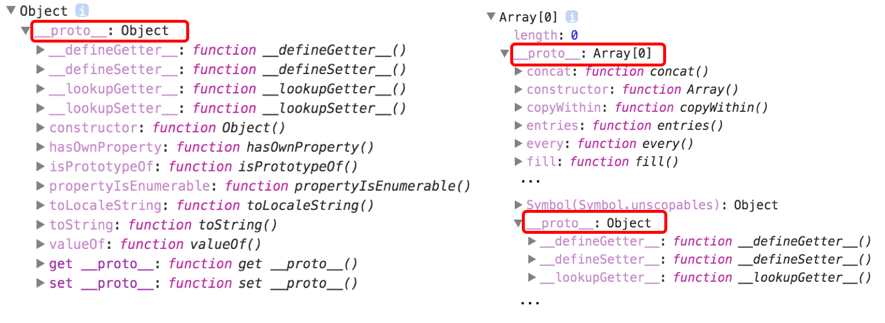

## 요약

- 자바스크립트에서 배열은 인덱스를 키로 갖고 있고, length 프로퍼티를 갖는 특수한 객체다.
- 배열의 prototye은 객체를 가리키고 있고, 객체 기반으로 만들어졌으므로 배열은 객체다.
- 유사 배열 객체는 배열의 구조와 비슷하게 생긴 객체다. 객체의 프로퍼티로 index와 length를 가지고 있다.
- 배열과 유사 배열 객체의 차이점은 length 프로퍼티가 열거 가능한지 여부와 Array의 내장 메서드를 사용할 수 있는가의 여부다.

<br/>

## 자바스크립트에서의 배열

`자바스크립트에서의 배열은 [mdn 배열](https://developer.mozilla.org/ko/docs/Learn/JavaScript/First_steps/Arrays#%EB%B0%B0%EC%97%B4%EC%9D%B4%EB%9E%80)에서 말하기를 '리스트같은 객체(list-like objects)'라고 기술된다. 배열은 리스트에 저장된 다수의 값들을 포함하고 있는 하나의 객체다.

자료구조에서 말하는 배열은, 동일한 크기의 메모리 공간이 빈틈없이 연속적으로 나열된 구조를 말한다. 즉, 배열 안에 들어가는 요소는 동일한 데이터 타입이며 그렇기 때문에 동일한 크기의 메모리 공간을 차지한다. 순서가 있고 순서에 따라 값을 가져올 수 있도록 하기 위해 서로 연속적으로 메모리에 인접해있다.

따라서 인덱스를 통해 한 번의 연산으로 임의의 요소에 접근할 수 있다. 하지만, 정렬되지 않은 배열의 경우 특정 요소를 발견할 때까지 차례대로 검색해야 한다. 즉 아래 코드와 같이 원하는 요소를 찾아야 한다.

```js
function linearSearch(array, target) {
  for (let i = 0; i < array.length; i++) {
    if (array[i] === target) {
      return i;
    }
    return -1;
  }
}
```

자바스크립트의 배열은 위의 자료구조에서 말하는 배열과는 다르다. 배열의 요소를 위한 각각 메모리 공간은 동일한 크기를 갖지 않아도 되며(배열의 타입이 달라도 된다), 연속적으로 이어져 있지 않을 수도 있다.

```js
const arr = ['a', 'b', 'c', 'd'];
console.log(arr[1]); // b
console.log(arr.length); // 4
console.log(typeof arr); // object
```

위의 배열을 객체 리터럴로 표현하면 아래와 같다.

```js
const obj = {
  '0': 'a',
  '1': 'b',
  '2': 'c',
  '3': 'd',
  'length': 4,
};
console.log(obj[1]); // b
console.log(obj.length); // 4
console.log(typeof obj); // object
```

`console.log`에 평가되는 값은 arr, obj 모두 동일하다. 두 객체의 차이는 배열 리터럴 `arr`의 프로토타입 객체는 `Array.prototype` 이지만, 객체 리터럴 `obj`의 프로토타입 객체는 `Object.prototype`이라는 것이다.

```js
const emptyArr = [];
const emptyObj = {};
console.dir(emptyArr.__proto__);
console.dir(emptyObj.__proto__);
```

따라서, 배열은 인덱스를 키로 갖고 있고, length 프로퍼티를 갖는 특수한 객체이다. 또한 자바스크립트의 배열은 일반적인 배열의 동작을 흉내 낸 특수한 객체다.

<br/>

일반적인 배열과 자바스크립트 배열의 장단점

- 일반적인 배열은 인덱스로 요소에 빠르게 접근할 수 있다. 하지만 특정 요소를 검색하거나 요소를 삽입 또는 삭제하는 경우에는 효율적이지 않다.
- 자바스크립트 배열은 해시 테이블로 구현된 객체이므로 인덱스로 요소에 접근하는 경우 일반 배열보다 성능적인 면에서 느리다. 하지만 특정 요소를 검색하거나 요소를 삽입 또는 삭제하는 겨우, 일반적인 배열보다 빠른 성능을 기대할 수 있다.

하지만, 인덱스로 접근할 때 일반적인 배열보다 느릴 수밖에 없는 구조 개선을 위해 모던 자바스크립트 엔진은 일반 객체와 구별하여 좀 더 배열처럼 동작하도록 최적화 해서 구현되었다.

```js
const arr = [];
console.time('Array Performance Test');
for (let i = 0; i < 10000000; i++) {
  arr[i] = i;
}
console.timeEnd('Array Performance Test');
// 약 340ms

const obj = {};
console.time('Object Performance Test');
for (let i = 0; i < 10000000; i++) {
  obj[i] = i;
}
console.timeEnd('Object Performance Test');
// 약 600ms
```

<br/>

## 유사 배열 객체와 배열의 차이점

유사 배열(array-like)은 인덱스와 length 프로퍼티가 있어서 배열처럼 보이는 객체다. 위에서 배열은 객체라는 사실을 알기 위해 프로퍼티를 0부터 시작하는 숫자와 length를 포함하는 객체를 만들었다. 그것이 유사 배열이다.

JavaScript에서 Array는 Object의 프로토타입을 상속받아 구현되었다. 그렇다면 Object의 `Object.getOwnPropertyDescriptors()` 를 통해 프로퍼티 디스크립터를 알아보자.

```js
console.log(Object.getOwnPropertyDescriptors([]));
console.log(Object.getOwnPropertyDescriptors({}));

// {
//   '0': { value: 'a', writable: true, enumerable: true, configurable: true },
//   '1': { value: 'b', writable: true, enumerable: true, configurable: true },
//   '2': { value: 'c', writable: true, enumerable: true, configurable: true },
//   '3': { value: 'd', writable: true, enumerable: true, configurable: true },
//   length: { value: 4, writable: true, enumerable: false, configurable: false }
// }
// {
//   '0': { value: 'a', writable: true, enumerable: true, configurable: true },
//   '1': { value: 'b', writable: true, enumerable: true, configurable: true },
//   '2': { value: 'c', writable: true, enumerable: true, configurable: true },
//   '3': { value: 'd', writable: true, enumerable: true, configurable: true },
//   length: { value: 4, writable: true, enumerable: true, configurable: true }
// }
```

차이점은, length에 있다. arr는 \[\[enumerable\]\], \[\[\configurable]\]이 false이고, obj는 true다. 즉, 배열 리터럴로 생성한 객체의 length는 새로운 값을 넣을 수는 있지만, 반복문에서 빠지며 프로퍼티 어트리뷰트를 수정 및 삭제할 수 없다.

```js
const arr = ['a', 'b', 'c'];
const obj = {
  0: 'a',
  1: 'b',
  2: 'c',
  length: 3,
};
for (let key in arr) {
  console.log(key); // a b c
}
for (let key in obj) {
  console.log(key); // a b c length
}
```

obj에서 `for in` 구문으로 나온 결과는 length라는 값이 추가 되어 나왔다. for in은 객체의 모든 열거 가능한 속성에 대해 반복이기 때문이다.

---

배열과 유사배열을 구분해야 하는 이유는, 유사 배열의 경우 배열의 메서드를 사용할 수 없기 때문이다.

```js
obj.forEach(v => console.log(v)); // obj.forEach is not a function
```

이럴 때는 배열의 프로토타입에서 배열 메서드를 빌려서 사용할 수 있다. call, apply, bind를 사용해서.

```js
Array.prototype.forEach.call(obj, v => console.log(v));
```

> 참고로, document.querySelectorAll로 가져온 NodeList도 유사 배열 객체이지만 NodeList의 prototype에는 forEach(), entries(), keys() 등의 메서드가 내장되어 있다.

또, `Array.from()` 메서드를 사용해서 유사 배열 객체를 얕게 복사해 새로운 객체로 만드는 방법이 있다.

```js
const newObj = Array.from(obj);
newObj.forEach(v => console.log(v));
```

> 참고
>
> - https://developer.mozilla.org/ko/docs/Learn/JavaScript/First_steps/Arrays
> - https://poiemaweb.com/js-array-is-not-arrray
> - https://www.zerocho.com/category/JavaScript/post/5af6f9e707d77a001bb579d2
