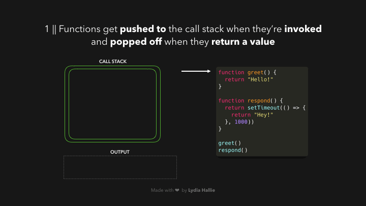
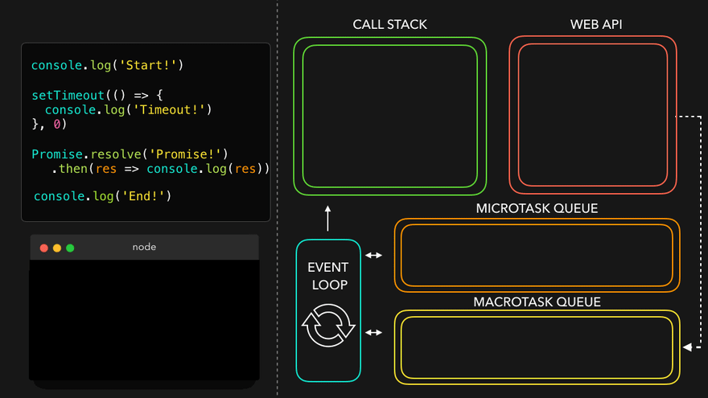
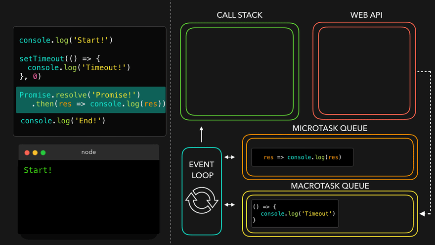

## 요약

- JavaScript는 싱글 스레드 언어이다. 하지만 멀티 스레드 처럼 동작하는데 이는 Event Loop 때문이다.
- Event Loop는 JavaScript Runtime Environment에 있으며 Web API와 Call Stack, Task Queue, MicroTask Queue 등이 있다. 단, Call Stack은 JavaScript 엔진 내부에 있다.
- Call Stack은 함수를 실행할 때마다 쌓이는 공간이며 함수의 실행 순서를 제어한다.
- 비동기 코드는 non blocking으로, 코드의 실행이 완료되지 않아도 다음 코드를 실행하는 것을 말한다. 따라서 JavaScript가 여러 일을 처리할 수 있도록 한다.
- Web API는 Task Queue에 콜백 함수를 쌓는다. 이는 Call Stack이 비어있을 경우 Event Loop가 다시 Call Stack으로 넘겨주어 처리된다.
- Promise는 콜백 지옥을 피하기위해 만들어져 비동기 코드를 가독성 있게 다룰 수 있도록 한다.
- Promise는 MicroTask Queue에 담긴다.
- MicroTask Queue는 Task Queue보다 우선순위가 높아 Event Loop가 Task Queue보다 먼저 접근한다.
- MicroTask Queue는 Task Queue와 다르게 queue에 쌓인 녀석들이 모두 Call Stack으로 넘어간 뒤 Event Loop가 다시 돌기 시작한다.
- async / await는 Promise를 더 쉽게 다룰 수 있도록 한다.
- async / await도 마찬가지로 MicroTask Queue에 담긴다.
- await 키워드를 만나면 async가 붙은 함수 전체가 MicroTask Queue에 담긴다.

<br/>

JavaScript는 싱글 스레드 언어다. 한 번에 하나의 작업만 실행할 수 있다. JavaScript로 30초가 걸리는 작업을 해야한다고 가정해보자. 이 작업을 시작하면 유저는 30초 동안 ui에서 할 수 있는 일이 없다. 단지 기다려야 할 뿐이다. 이를 블로킹이라고 한다.

> ※ 스레드란,
>
> - 스레드는 어떠한 프로그램이 실행되는 작업을 말한다.
> - 싱글 스레드는 한 번에 하나의 작업만 수행할 수 있으며, 멀티 스레드는 한 번에 여러 개의 작업을 수행할 수 있다.

하지만, 웹 어플리케이션에서는 동시에 다른 무언가를 할 수있다. 예를 들면, 브라우저에서는 파일을 다운로드 받고 있으면서 다른 링크로 이동한다던지, Node.js에서는 HTTP 요청을 처리하기도 한다. V8과 같은 JavaScript 엔진은 단일 호출 스택(Call Stack)을 사용하며, 요청이 들어올 때마다 해당 요청을 순차적으로 Call Stack에 담아 처리할 뿐이다.

JavaScript 언어 자체에는 Multi Threading을 할 수 없지만, JavaScript가 동작하고 있는 '**브라우저**'(브라우저라는 프로그램)에서는 여러 스레드를 활용할 수 있다. 브라우저에서 지원하는 Web API를 사용하는 것이다. Web API는 JavaScript엔진 자체가 제공하지 않는, 브라우저에서 제공하는 API다. DOM API, `setTimeout`, HTTP 요청 등이 여기에 포함된다. JavaScript Runtime Environment(브라우저 or Node.js)에는 Event Loop가 있다. 이 Event Loop를 통해 여러 처리를 동시에 할 수 있는 것이다. 브라우저 환경을 그림으로 표현하면 다음과 같다.


JavaScript 엔진에는 **Memory Heap**과 **Call Stack**이 있다.

- Memory Heap : 데이터를 만들 때(변수선언 및 할당) 저장이 되는 공간.
- Call Stack : 함수를 실행할 때마다 쌓이는 공간. 함수 실행 순서를 제어한다.

비동기 호출을 위해 사용하는 `setTimeout`, `fetch` 같은 함수는 자바스크립트 엔진이 아니라 Web APIs 영역에 따로 정의 되어 있다. 또한 Event Loop나 Task Queue 같은 장치도 자바스크립트 엔진 외부에 구현되어 있다. 아래 사진은 Node.js 환경이다.


이 그림에서도 브라우저 환경과 비슷하다. Node.js는 비동기 IO를 지원하기 위해 `libuv` 라이브러리를 사용하고, libuv에서 Event Loop를 제공한다. 자바스크립트 엔진은 비동기 작업을 위해 Node.js API를 호출하고, 이때 넘겨진 콜백은 libuv의 Event Loop를 통해 스케줄되고 실행된다.

확실한 것은, 자바스크립트가 '단일 스레드' 기반의 언어라는 것은, '자바스크립트 엔진이 단일 Call Stack을 사용한다'는 관점에서만 사실이다. **실제 자바스크립트가 실행되는 환경(브라우저, Node.js)에서는 주로 여러 개의 스레드가 사용**되고, 이런 구동 환경이 Call Stack을 사용하는 자바스크립트 엔진과 상호 연동하기 위해 사용하는 장치가 '이벤트 루프'인 것이다. 즉, 브라우저, Node.js환경은 자바스크립트 엔진의 Wrapper 역할을 하고 있다.

<br/>

## Run-to-Completion

자바스크립트 함수의 특징이 있다. 하나의 함수가 실행되면 함수의 실행이 끝날 때까지 다른 작업이 중간에 끼어들지 못한다. 자바스크립트는 하나의 Call  Stack을 사용하기 때문이다.


위 코드를 실행하면 브라우저 프로세스가 죽어버린다. console 창에 'Will it be print?' 라는 문장은 나타나지 않을 것이다. 다만, 'Running...1234837' 이라는 문구만 console에 나타난다. 그리고 브라우저가 동작하지 않는다는 alert이 뜬다.

<br/>

## Call Stack

함수를 호출하면 Call Stack에 함수가 추가된다. Call Stack은 '자바스크립트 엔진' 안에 있다. Stack 구조로 되어있는데 가장 나중에 들어간 것이 가장 먼저 나오는 자료구조다. 이것을 LIFO(Last In First Out)이라고 한다. FILO라고도 한다. 함수가 값을 return하면 Call Stack에서 제거된다. 아래 그림을 보자.



greet 함수가 먼저 쌓였고 실행되어 Call Stack에서 제거되었다. 그리고 response 함수가 차례로 Call Stack에 쌓인 후 실행이 완료되어 Call Stack에서 제거 되었다. 하지만 respond 함수 내부에 `setTimeout` 이라는 Web API가 있다. 이를 통해 메인 스레드를 차단하지 않고 작업을 지연시킬 수 있다. setTimeout에 전달한 콜백함수가 Web API에 추가된다. 그 동안 setTimeout 함수와 respond 함수는 Stack에서 제거된 것이다.


Web API에서 1000ms 동안 타이머가 돌고, 후에 setTimout에 전달한 콜백 함수는 Call Stack으로 다시 들어가는 것이 아니라 `Task Queue` 라는 곳으로 전달된다. ※사진에서는 Queue라고 표기되어 있다.


Call Stack으로 들어간 것이 아니라 **Task Queue**로 들어간 것이다! Event Loop가 이제 Task Queue에 있는 함수를 다시 Call Stack으로 옮길 것이다. 단, 이 경우에는 Call Stack이 비어있는 경우만 해당한다. 즉, Call Stack에서 실행중인 코드가 있다면 Event Loop는 Task Queue의 함수를 Call Stack으로 옮기지 않는다.

※ Queue란, 자료구조의 한 종류로 FIFO(First In First Out)의 특성을 가지고 있다. 아래와 같이 먼저 들어온 녀석이 먼저 나가는 구조이다.


콜백 함수가 Call Stack에 추가되고, 호출되고, 값을 반환하고 Call Stack에서 제거된다.


```js
const foo = () => console.log("First");
const bar = () => setTimeout(() => console.log("Second"), 500);
const baz = () => console.log("Third");

bar();
foo();
baz();
```

이 코드의 실행결가는 어떻게 될까? First -> Third -> Second 순서대로 출력된다.


1. bar 함수를 Call Stack에 넣었다.
2. setTimeout이 있으므로 Web API에 집어넣고 bar 함수는 Call Stack에서 제거된다.
3. Web API에서 타이머가 실행되는 동안 foo가 호출되어 Call Stack에 쌓였다. console을 찍는다.
4. baz가 호출되었고 console을 찍고 제거된다.
5. 그 동안 Web API에서는 Task Queue에 setTimeout에 있던 콜백을 집어넣는다.
6. Event Loop는 Call Stack에서 아무것도 없음을 확인한 후 Task Queue에 있던 콜백을 Call Stack에 넣는다. 그리고 실행.

이런 식으로 Event Loop는 실행할 함수를 관리하는 역할로 Call Stack과 Task Queue의 함수를 계속 확인한다. 이렇게 반복되는 매 순회(iteration)를 `tick` 이라고 부른다.

```js
function delay() {
    for (var i = 0; i < 100000; i++);
}
function foo() {
    delay();
    bar();
    console.log('foo!'); // (3)
}
function bar() {
    delay();
    console.log('bar!'); // (2)
}
function baz() {
    console.log('baz!'); // (4)
}

setTimeout(baz, 10); // (1)
foo();
```

출력은 어떤 순서로 될까? `delay` 함수는 10만의 연산을 해야하므로, 꽤 올래 걸리기 때문에 baz가 가장 먼저 찍힐까? 아니다. setTimout이 Task Queue에 넣은 후, Call Stack이 비어있을 경우 Event Loop가 Task Queue에 있는 baz를 Call Stack으로 넘겨줄 것이기 때문에 baz가 가장 나중에 찍힌다. setTimeout의 두번째 인자인 `10` 은 10ms 라는 의미를 가진다. 즉, 0.01초다. 그럼에도 불구하고 10ms 보다 더 늦게 실행될 것이다. 즉, 자바스크립트의 타이머는 정확한 타이밍을 보장해주지 않는다.

다시 정리하면, Event Loop는 '현재 실행중인 태스크가 없는지'와 '태스크 큐에 태스크가 있는지'를 반복적으로 확인한다.

- 모든 비동기 API들은 작업이 완료되면 콜백 함수를 Task Queue에 추가한다.
- 이벤트 루프는 '현재 실행중인 태스크가 없을 때(Call Stack이 비워졌을 때)' Task Queue의 첫 번째 Task를 꺼내와 실행한다.

---

### setTimeout

`setTimeout(fn, 0)` 과 같은 코드가 있다. 0초 이후에 실행을 한다는 것은 실제로 그냥 실행한다는 것과 다를게 없는데 무슨 뜻일까? 하지만 이 코드는 그냥 fn을 실행한다는 것과는 다른 의미다. `setTimeout` 은 콜백 함수를 바로 실행하는것이 아닌 Task Queue에 추가한다.

```js
setTimeout(() => {
  console.log('A');
});
console.log('B');
```

결과는 `B -> A` 순으로 출력된다. Call Stack이 비워진 후 실행되기 때문이다. 이는 렌더링 엔진과 관련해서 유용하다. 브라우저 환경에서는 자바스크립트 엔진 뿐아니라 다른 여러 프로세스가 함께 동작하고 있다. 렌더링 엔진의 Task는 대부분 브라우저에서 자바스크립트 엔진과 동일한 단일 Task Queue를 통해 관리된다.

```js
const button = document.querySelector('button');
button.addEventListener(function() {
  showWaitingMessage();
  longTakingProcess();
  hideWaitingMessage();
  showResult();
});
```

addEventListener 함수도 마찬가지로 Web API이며 비동기로 동작한다.

`longTakingProcess()` 는 오래 걸리는 작업이다 따라서, 그 전에 `showWaitingMessage()` 함수로 로딩 메세지를 보여주고 싶다. 하지만 이 코드를 실행해보면 로딩 메시지는 나타나지 않는다. 이유는 `showWaitingMessage()` 함수의 실행이 끝나고 렌더링 엔진이 렌더링 요청을 보내도 해당 요청은 Task Queue에서 이미 실행중인 태스크가 끝나기를 기다리고 있기 때문이다. 실행중인 태스크가 끝나는 시점은 Call Stack이 비워지는 시점인데, 그 때는 이미 `showResult()` 까지 실행이 끝나 있을 것이기 때문이고, `hideWaitingMessage()` 로 인해 로딩 메시지가 숨겨진 상태이기 때문이다. 그때 setTimeout을 활용할 수 있다.

```js
const button = document.querySelector('button');
button.addEventListener(function() {
  showWaitingMessage();
  setTimeout(() => {
    longTakingProcess();
    hideWaitingMessage();
    showResult();    
  }, 0);
});
```

이 경우에는 `longTakingProcess()` 가 바로 실행되지 않고 Task Queue에 추가될 것이다. 하지만 `showWaitingMessage()`로 인해 Task Queue에는 렌더링 요청이 먼저 추가되기 때문에 `longTakingProcess()`는 그 다음 순서로 Task Queue에 추가될 것이다.

또한, 렌더링 관련이 아니더라도, 실행이 오래 걸리는 코드가 있다면 setTimeout을 사용해 적절하게 다른 태스크로 나누어주면 전체 어플리케이션이 멈추거나 스크립트가 너무 느리다고 경고창이 뜨는 상황을 방지할 수도 있다. 혹은, 같은 줄에 작성된 여러 코드중 어디에 선언 되어 있든지 상관없이 가장 마지막에 실행시키고 싶은 코드가 있다면 역시 setTimeout 0을 통해 제어할 수 있다.

<br/>

## Promise

Promise 객체는 비동기 작업이 맞이할 미래의 완료 또는 실패와 그 결과 값을 나타낸다([mdn](https://developer.mozilla.org/ko/docs/Web/JavaScript/Reference/Global_Objects/Promise)). 이는 **콜백 지옥**(Callback Hell)을 피하기 위해 만들어졌다. Promise를 만들어 console에 찍어보자.


내부에는 `[[PromiseState]]`와 `[[PromiseResult]]` 라는것이 있다. PromiseState는 상태값을 나타낸다. 아래의 3가지 상태가 있다.

- 대기*(pending)*: 이행하지도, 거부하지도 않은 초기 상태.
- 이행*(fulfilled)*: 연산이 성공적으로 완료됨. 오류가 나지 않음.
- 거부*(rejected)*: 연산이 실패함.

Promise는 콜백함수를 받는데, 콜백 함수의 첫번째 인자로 `resolve`, 두번째 인자로 `reject`를 받는다. 그 콜백 안에서 성공적으로 작업이 이행되었다면 `resolve()` 함수를 호출하면 되고, 문제(error)가 생겼다면 `reject()` 를 호출해주면 된다. resolve 인자로 데이터를 넘겨줄 수 있으며, reject에는 주로 error객체를 넘긴다.


만약, resolve 되었다면, Promise는 `.then()` 구문을 사용해 이어서 다른 작업을 할 수 있다. `.then()` 인자로 다시 콜백 함수를 받고, 콜백 함수의 인자는 resolve에 매개변수로 넘겨주었던 데이터가 넘어온다.

```js
function getImage(file) {
  return new Promise((resolve, reject) => {
  try {
      const data = readFile(file);
      resolve(data);
    } catch {
      reject(new Error(err));
    }
  });
}
```

`getImage` 함수는 비동기 코드인 `readFile` 을 실행한 후 data를 넘겼다. 그럼 아래에서 받는 코드를 보자.

```js
getImage(file)
 .then(data => console.log(data))
 .catch(error => console.log(error))
 .finally(() => console.log('Done!'));
```

이렇게 처리해줄 수 있다.

<br/>

## MicroTask Queue

아래 코드를 실행해보면 어떤 순서로 찍힐까?

```js
setTimeout(function() { // (A)
    console.log('A');
}, 0);
Promise.resolve().then(function() { // (B)
    console.log('B');
}).then(function() { // (C)
    console.log('C');
});
```

Promise도 비동기로 실행되니까 Task Queue에 추가되어 순서대로 A -> B -> C로 찍힐까? 아니다 답은, B -> C -> A다. 이유는 바로 Promise가 MicroTask Queue를 사용하기 때문이다.

MicroTask Queue는 일반 Task Queue보다 더 높은 우선순위를 갖는 태스크다. Task Queue에 대기중인 태스크가 있더라도 MicroTask Queue가 먼저 실행된다. `setTimeout`은 콜백 A를 Task Queue에 추가하고 Promise의 `then()` 메서드는 콜백 B를 Task Queue가 아닌 **MicroTask Queue**에 추가한다. 콜백 B가 실행되고 나면 두번째 `then()` 메서드가 콜백 C를 MicroTask Queue에 추가한다. Event Loop는 다시 MicroTask Queue를 확인하고, 큐에 있는 콜백 C를 실행한다.

이후에 MicroTask Queuerk 비었음을 확인한 다음 Task Queue에서 콜백 A를 꺼내와 실행한다. 즉, MicroTask Queue에는 Promise가 담기며 Event Loop가 Task Queue 보다 먼저 실행한 후, 다시 then 절이 있는지 확인하고 다시 MicroTask Queue에 집어넣었다.

MicroTask Queue에는 Promise뿐 아니라, Observer API, Node.js의 process.nextTick 등이 그 대상이 된다.


위 사진과 같이 실행이 되는데 사진의 MacroTask Queue는 Task Queue라고 생각하자.

```js
console.log('Start!');

setTimeout(() => {
  console.log('Timeout!');
}, 0);

Promise.resolve('Promise!')
 .then(res => console.log(res));

console.log('End!');
```

이 코드를 시각화 하면 아래와 같다.







시각화 자료에서 보듯, MicroTask Queue는 MicroTask Queue를 하나 하나 Call Stack으로 이동하지만, 모든 MicroTask Queue에 있는 작업들이 Call Stack에서 지워져야 Task Queue 차례로 넘어가는 것을 볼 수있다.

<br/>

## Async/Await

Async/Await 문법은 ES8에서 적용되었다. Promise를 더 쉽게 다룰 수 있다. `async` 키워드로 Promise를 반환하는 비동기 `await` 함수를 만들 수 있다.

```js
Promise.resolve('Hello!');

// 위 코드는 아래 코드와 같다.

async function greet() {
 return 'Hello!'
}
```

비동기 함수가 Promise를 반환하는데 `await` 키워드를 비동기 함수 앞에 붙여주면 비동기 함수가 Promise를 반환할 때까지 코드를 일시 중지 할 수 있다. 다음 코드가 어떻게 실행되는지 살펴보자.

```js
const one = () => Promise.resolve('One!');

async function myFunc() {
  console.log('In function!');
  const res = await one();
  console.log(res);
}

console.log('Before function!');
myFunc();
console.log('After function!');
```

- Before function!
- In function!
- After function!
- One!

Before function!이 실행되었고, myFunc 함수 내부의 In function!이 먼저 찍혔다.

 

이제 위 사진처럼 `myFunc`가 실행된다. `myFunc` 첫째줄의 console이 찍힌다. `myFunc`가 Call Stack에 들어갔지만 `one` 함수를 만나 `myFunc`을 제거하기 전에  `one`이 Call Stack에 담겼다.


`one`은 Promise를 리턴하기 이전에 함수다. Call Stack에 담긴 one을 실행하면서 Call Stack에서 제거되었다. 하지만 `one`함수는 `await` 키워드가 앞에 붙어있다. await 키워드를 만나면, `async` 가 붙어있는 함수 자체가 기능이 일시 중지 된다. 즉, async가 붙어있는 `myFunc` 함수 자체는 Call Stack에서 MicroTask Queue로 이동한다.


그리고 async가 붙어있는 함수에서 벗어나 아래의 코드를 실행한다(After function!). 이제 Event Loop가 CallStack MicroTask Queue에 있는 `myFunc`를 다시 Call Stack으로 옮긴다. `console(res)` 를 실행하고 myFunc는 종료된다.


이 과정으로 `Promise.then` 과 `async` 함수의 차이점을 알 수 있다.

- `async` 함수에서는 `await` 를 만나면 함수가 중단되고 MicroTask Queue로 들어간다.
- Promise는 곧바로 MicroTask Queue에 들어간다.

마지막으로 아래 코드 실행 결과를 예측해보자.

```js
function a() {
    console.log('a1');
    b();
    console.log('a2');
}

function b() {
    console.log('b1');
    c();
    console.log('b2');
}
  
async function c() {
    console.log('c1');
    setTimeout(() => console.log('setTimeout'), 0);
    await d();
    console.log('c2');
}

function d() {
    return new Promise(resolve => {
      console.log('d1');
      resolve();
      console.log('d2');
    })
    .then(() => console.log('then!'));
}

a();
```

1. a 함수 호출, console.log 실행, 출력 → a1

2. b 함수 호출, console.log 실행, 출력 → b1

3. c 함수 호출, console.log 실행, 출력 → c1

4. setTimeout이 Task Queue에 쌓임.

5. d 함수 호출, 첫 번째 console.log 실행, 출력 → d1 (비동기X)

6. 두 번째 console.log 실행, 출력 → d2 (비동기X)

7. .then 콜백은 백그라운드를 거쳐 마이크로 태스크 큐에 쌓임

8. d 함수 호출 완료 후 await를 만나고 async 함수 c는 중단

   async 함수의 나머지는 마이크로 태스크 큐에 쌓임

9. c 함수를 호출한 실행 컨텍스트(b함수)로 돌아가서 console.log 실행, 출력 → b2

10. b 함수를 호출한 실행 컨텍스트(a함수)로 돌아가서 console.log 실행, 출력 → a2

11. Call Stack이 모두 비워지고, Event Loop가 MicroTask Queue를 확인.
    then 콜백, async 함수가 쌓여있음.

12. .then 콜백 실행, console.log 출력 → then!

13. async 함수 중단된 곳부터 이후로 실행, console.log 출력 → c2

14. 또다시 Event Loop가 Task Queue를 확인, setTimeout의 콜백이 쌓여있음.
    setTimeout의 콜백을 Call Stack으로 옮겨 실행 및 출력 → setTimeout

```js
a1
b1
c1
d1
d2
b2
a2
then!
c2
setTimeout
```

> 참고
>
> - <https://meetup.nhncloud.com/posts/89>
> - <https://dev.to/lydiahallie/javascript-visualized-promises-async-await-5gke>
> - <https://codingsalon.tistory.com/59>
> - <https://engineering.linecorp.com/ko/blog/dont-block-the-event-loop/>
> - <https://junhyunny.github.io/information/javascript/microtask-macrotask-in-javascript/>
> - <https://www.howdy-mj.me/javascript/asynchronous-programming>
> - <https://web.dev/optimize-javascript-execution/>
