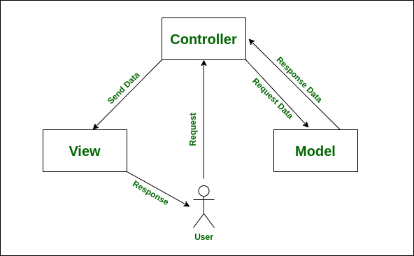
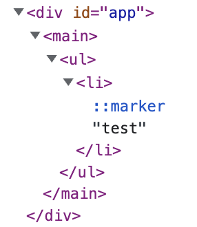
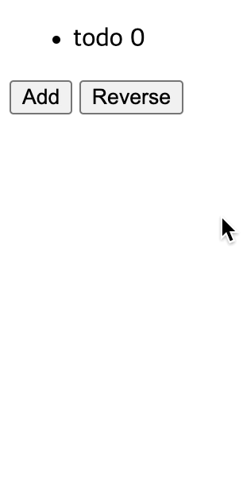
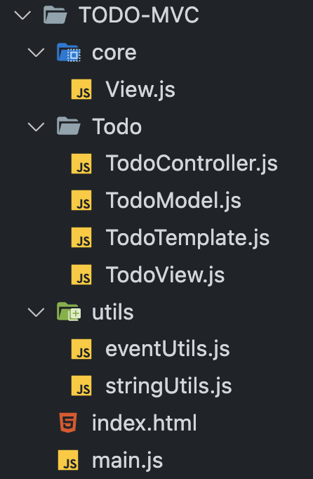

모던 JavaScript 프레임워크는 여러 패턴을 따른다. MVVM 패턴, Flux 패턴, Component 패턴 등. 다양한 문제를 해결하기 위해 다양한 패턴이 생겨났다. 이번에는 예전부터 사용되어온 MVC 패턴을 JavaScript에서 구현해보면서 모던 JavaScript 프레임워크를 사용할 때 MVC의 어떤 어려운 점을 해결했는지 간접적으로 알아보자.

아래의 글은, 기본적인 JavaScript 지식이 있는 사람, react or Vue.js를 사용해본 사람이 읽기 편하다.

오래전 개발자들은 소프트웨어를 개발할 때 패턴을 가지지 않고 구조화 되지 않은 상태로 실행되는 코드를 작성했다고 한다. 프로그램은 데이터와 알고리즘으로 이루어져 있었고, 절차를 따르면 데이터를 가공해 저장 할 수 있으면 되었다. 이것을 절차지향 프로그래밍이라고 한다.

하지만 절차지향적으로 코드를 작성하다보니 기존에 작성했던 알고리즘을 다시 사용해야하는 경우가 생겼다. 따라서 특정 코드 위치로 이동하는 GOTO문을 많이 사용하고, 코드가 길어지고 어디서부터 읽어야할지 모르는 난해한 코드가 생성된다는 단점이 있었다.

개발자들은 재사용성을 굉장히 중요하게 생각한다. 코드가 길어질 수록 읽기 힘들고 유지보수하기 힘들어지기 때문이다. 따라서 코드를 역할에 따라 분류하고 재사용할 수 있는 프로그래밍 패턴을 만들어냈는데, 그 중 하나가 MVC 패턴이다.

웹 프로그래밍에서는 알고리즘과 데이터 뿐 아니라 화면을 보여줄 코드와, 사용자의 입력을 받는 통로의 역할을 하는 코드가 필요했다. 이를 적절히 나누어 작성하면 유지보수 하기 쉽고, 다른 개발자와의 협업 또한 쉬워진다. 이를 패턴화 한 것이 MVC 패턴이다.

프론트엔드 개념이 생기기 전에 웹 개발자들은 서버에서 모든 처리가 이루어졌다. 사용자의 입력을 받고, 서버에서 Database에 데이터를 가공 혹은 적재하고, 모든 처리를 마친 후 화면에 적절히 데이터를 보여주는 작업이 모두 서버에서 이루어졌다. 그 때의 MVC 패턴의 역할이 매우 효과적이었기 때문에 아직도 사용되며 대부분의 아키텍쳐에 선택되는 패턴의 근간이 되는 것 같다.

MVC 패턴은 모델-뷰-컨트롤러 역할을 나눈 패턴이다. 소프트웨어의 비즈니스 로직과 화면을 구분하는데 중점을 두고 있다.

- Model : 데이터를 다루는 부분. 비즈니스 로직을 포함한다.
- View : 레이아웃과 화면을 다루는 부분.
- Controller : 사용자의 명령을 받아 Model과 View 부분을 이어주는 부분.

서버의 입장에서 간단히 보자.

1. 사용자가 브라우저에서 웹 페이지 주소를 입력해 서버로 HTTP GET 요청을 보낸다.
2. 서버는 Controller에서 HTTP GET 요청을 받는다.
3. Model(Service)에서 비즈니스 로직을 처리한다.
4. Model은 Controller로 화면에 필요한 데이터를 넘겨준다.
5. Controller는 받아온 데이터를 View에 넘겨주어 HTML 페이지를 만든다.
6. Controller에서 만들어진 HTML 파일을 브라우저에게 넘겨준다.
7. 브라우저는 HTML 파일을 렌더링한다.



[출처](https://www.geeksforgeeks.org/benefit-of-using-mvc/)

기존 웹 MVC 패턴에서는 View는 단순히 HTML파일을 만들어주는 역할만 담당했다. HTML 안에는 JavaScript 파일도 함께 존재하기 때문에 사용자의 요청 혹은 앵커 태그로부터 다시 서버에 HTTP 요청을 보낼 수 있는 구조였다.

이제, 모던 웹 프론트엔드 프레임워크는 AJAX 기술이 생겨난 이후 많은 발전을 거듭하며 서버에서 다루는 비지니스 로직과 데이터, 그리고 화면을 그려줄 수 있는 View의 역할까지 감당할 수 있을 정도로 발전했다.

※ 물론 중요한 데이터는 프론트엔드에서 처리하기 보다는 서버에서 처리되어야 한다. 프론트엔드는 언제나 탈취에 취약하기 때문이다.

이번에는 only JavaScript로 MVC 패턴을 구현해보면서 SPA 어플리케이션을 만들어보자.

<br/>

## init

SPA를 만들기 위해서는 뼈대가 되는 html 파일이 필요하다.

```html
<!DOCTYPE html>
<html>
  <head>
    <meta charset="UTF-8" />
    <meta http-equiv="X-UA-Compatible" content="IE=edge" />
    <meta name="viewport" content="width=device-width, initial-scale=1.0" />
    <title>Document</title>
  </head>
  <body>
    <div id="app">
      <main></main>
    </div>
    <script defer type="module" src="./main.js"></script>
  </body>
</html>
```

id가 app태그 하위로 main 태그가 있다. main 태그를 타겟으로, JavaScript를 이용해 화면을 동적으로 그려줄 것이다. 그리고 main.js 파일을 만들었다. 이를 `type="module"`을 이용해 ESM을 이용할 것이다.

```js
// main.js
import Controller from './Controller.js';
import View from './View.js';
import Model from './Model.js';

new Controller(new View(), new Model());
```

model과 view를 각각 선언하고, Controller로 넘겨주었다. Controller에서는 model, view를 주입 받아 사용할 수 있도록 만들어주자.

```js
// Controller.js
export default class Controller {
  constructor(view, model) {
    this.view = view;
    this.model = model;
  }
}
```

이제, model을 정의하자. 어플리케이션에서 사용할 Data를 가지고 있는 곳이다.

```js
// Model.js
export default class Model {
  constructor() {
    this.todoList = [
      {
        id: 0,
        text: 'todo',
      },
    ];
  }
}
```

그리고 화면을 처리할 View를 만들자.

```js
// View.js
export default class View {
  constructor() {
    const target = document.querySelector('main');
    this.$newEl = target.cloneNode(true);
    this.$newEl.innerHTML = this.getTemplate();
    target.replaceWith(this.$newEl);
  }

  getTemplate() {
    return `<ul></ul>`;
  }
}
```

- main을 target으로 잡는다.
- target을 복사한다
- 복사한 Node에 innerHTML로 템플릿 코드를 넣어 DOM 형태로 만들어준다.
- 그리고 target에 새로 만든 DOM으로 교체한다.

<br/>

## 데이터로 렌더링

이제 컨트롤러에서 Model로 부터 데이터를 받아 화면에 나타내는 코드를 만들어보자.

```js
// View.js
export default class View {
  (...)
  displayTodo(todoList) {
    const ul = this.$newEl.querySelector('ul');
    ul.innerHTML = `${todoList
      .map(
        todo => `
          <li data-id="${todo.id}">
            ${todo.text} ${todo.id}
          </li>
        `
      )
      .join('')}`;
  }
}
```

todoList 배열을 전달받아 ul 하위로 text를 뿌려주도록 만들었다. 또한, dataset을 사용해, DOM에 id를 부착시켰다.

```js
// Controller.js
export default class Controller {
  constructor(view, model) {
    this.view = view;
    this.model = model;
    this.#render();
  }

  #render() {
    const { todoList } = this.model;
    this.view.displayTodo(todoList);
  }
}
```

컨트롤러에서는 `#render` 메서드를 만들고, model로 부터 todoList를 받아 view에 전달한다. Live Server로 화면을 열어보면 아래와 같이 렌더링 되었다.



html 파일은 `<div id="app"></div>` 밖에 작성하지 않았지만, JavaScript 코드로 DOM을 생성한 것이다. View.js 파일의 `$newEl`은 react와 vue에서 사용하는 Virtual DOM이다.

> Virtual DOM이란, 가상의 DOM으로 메모리에 저장되어 있는, 아직 실체화 되지 않은 DOM이다. 따라서, JavaScript를 통해 DOM을 만들었으며 DOM을 실제로 브라우저에 부착하기 전까지는 메모리상에 존재하기만 한다.
>
> react, vue 같은 경우, state를 통해 가상 DOM을 조작한 후 batch 프로세스를 통해 모든 조작이 끝난 후 한번에 실제 DOM에 부착시킨다. 왜냐하면 실제 DOM에 부착 후 조작이 일어나면 repaint, reflow 등의 작업이 일어나며 브라우저 메인 스레드를 정지시키기 때문에 효율이 떨어지기 때문이다. 자세한 것은 아래 링크에 있다.
>
> [왜 Virtual DOM 인가?](https://velopert.com/3236)

<br/>

## 기능 추가

### Model 조작

MVC를 파악하기 위해 기능을 더 추가해보자. 추가하는 버튼을 만들고, 버튼을 클릭하면 TodoList를 추가할 것이다. 또, TodoList의 순서를 뒤집어 보여줄 수 있는 기능도 넣어보자.

```js
// Model.js
export default class Model {
  (...)
  addTodo(todo) {
    this.todoList = [...this.todoList, todo];
  }

  get reverseTodoList() {
    return [...this.todoList].reverse();
  }
}
```

Model은 데이터를 조작할 수 있는 함수가 포함될 수 있다. 또한 getter 접근자 프로퍼티를 활용해 단순히 데이터를 가공해 보여줄 수도 있다.

> Spring같은 서버단 웹 프레임워크에서는 데이터를 가공하거나 집어넣는 로직은 Service라는 곳에서 처리한다. Model을 더 안전하게 보호하거나 관심사의 분리 때문에 그렇다. Angular에서도 Service를 통해 Model을 조작한다고 한다.
>
> 사실 Model class에서 데이터를 가공해 직접 집어넣는 작업이 이곳에서 이루어져도 될까 고민을 많이 했지만, 작은 프로젝트에서는 Service를 만드는 것이 오히려 가독성을 더 좋지 않게 만들 수 있지 않을까 생각해 이곳에 구현했다.
>
> 또한, 데이터를 추가하거나 가공할 경우 불변성을 지켜주면 좋다. 주로 데이터는 레퍼런스 타입일 것이고 데이터를 직접 만지는 곳이기 때문에 데이터 추적이 수월하게 이루어지려면 불변성을 지키자. 불변성에 관련한 것은 [이전 포스팅](https://pozafly.github.io/javascript/shallo-copy-and-deep-copy/)에 적혀있다.

### Controller와 Model

이제 Controller에서 Model에서 만든 메서드를 사용할 수 있도록 선언해주자.

```js
// Controller.js
export default class Controller {
  constructor(view, model) {
    (...)
    this.view.addEvent({
      handleAddTodo: this.handleAddTodo.bind(this),
      handleReverseTodo: this.handleReverseTodo.bind(this),
    });
  }

  handleAddTodo(todo) {
    this.model.addTodo(todo);
    this.#render();
  }

  handleReverseTodo() {
    const { reverseTodoList } = this.model;
    this.view.displayTodo(reverseTodoList);
  }
  (...)
}
```

handleAddTodo, handleReverseTodo 메서드가 새롭게 생성되었고, 이는 View에서 DOM 이벤트가 일어나면 실행시킬 메서드다. 차례로, todo를 추가해주며, 순서가 반대인 todo를 렌더링 해주는 메서드이다.

그리고, constructor에서는 view의 AddEvent 메서드를 실행시킨다. AddEvent는 DOM에서 일어나는 이벤트 리스너를 초기화하는 함수가 실행될 것이다.

> 1. handle prefix가 붙은 이유는, 사용자 이벤트가 일어날 경우 실행되는 함수명은 관례적으로 `handle...` 또는 `on...` 으로 짓는다. 특히 react에서는 이제 `handle` 이라는 prefix를 사용한다. 따라서 handle prefix가 붙은 메서드는 DOM 이벤트와 연관이 있다는 규칙을 부여함으로 다른 개발자에게 간접적으로 알려줄 수 있다.
> 2. `.bind(this)` 가 붙은 이유는, handleAddTodo, handleReverseTodo 메서드가 View에서 실행이 될텐데 View에서 실행되는 this는 Controller의 this와 다르기 때문에 명시적 바인딩을 해주었다.
> 3. 이론 상 Controller는 사용자의 요청을 받는 곳이다. 그렇다면 SPA JavaScript MVC의 Controller의 역할은 사용자의 행동(이벤트)을 받는 곳이 아닌가 고민했다. 하지만 결론적으로 View에서 이벤트를 받도록 했다. View에서 DOM 조작이 계속해서 일어날 것이고 그때마다 eventListener가 새롭게 달려야 했기 때문에 View가 적당하다고 판단했다.

### Controller에서 View로

```js
// View.js
export default class View {
  (...)
  addEvent(handlers) {
    this.$newEl.addEventListener('click', this.#runDomEvents(handlers), true);
  }

  #runDomEvents({ handleAddTodo, handleReverseTodo }) {
    return ({ target }) => {
      if (target.classList.contains('add_button')) {
        const $lastElement = this.$newEl.querySelector('li:last-child');
        const nextId = Number($lastElement.dataset.id) + 1;
        const todo = {
          id: nextId,
          text: `todo`,
        };
        handleAddTodo(todo);
      }
      if (target.classList.contains('reverse_button')) {
        handleReverseTodo();
      }
    };
  }

  getTemplate() {
    return `
      <ul></ul>
      <button class="add_button">Add</button>
      <button class="reverse_button">Reverse</button>
    `;
  }
}
```

**AddEvent**

- Controller에서 실행된 `addEvent` 메서드가 있다. 위의 handlers 매개변수로 Controller에서 바인딩한 메서드들이 넘어올 것이다.
- `$newEl` 에서는 사용자의 이벤트를 받아 처리한다.
  - 3번째 인자로 `true`를 넘겨준 이유는 **이벤트 위임**을 사용하기 위해서 넣어주었다. true는 이벤트 캡쳐링을 통해 이벤트가 전파된다.
  - 이벤트 위임은 list같이 많은 양의 이벤트를 각각의 DOM에 걸어주기보다 한 곳에서 처리할 수 있도록 도와준다. 이곳에 위임을 사용한 이유는 렌더링 될 때마다 새로운 DOM이 생성되고 부착되기 때문에 Event가 제대로 걸리지 않을 가능성이 있어 위와 같이 처리해주었다.

**runDomEvents**

- click 이벤트가 일어나면, 실행될 메서드다.
- 고차 함수를 활용하여 함수 자체를 return해 이벤트가 동작하면 실행될 코드가 적혀있다.
- add_button을 클릭하면, Controller의 `handleAddTodo` 메서드가 실행된다.
- reverse_button을 클릭하면, Controller의 `handleReverseTodo` 메서드가 실행된다.

> Controller의 `handleReverseTodo`는, 결국 View의 `displayTodo` 를 실행한다. 그렇다면, View에서 굳이 Controller를 거치지 않고 todoList를 받아 가공 후 `this.displayTodo` 를 실행하면 되지 않을까? 라고 생각할 수 있다.
>
> 하지만 MVC 패턴은 역할을 분리시켜둔 패턴이다. 이곳에서 화면과 관계없는 데이터 가공이나 추가적인 로직이 들어가게 되면 View의 역할에 위반되므로 반드시 Model과 View를 이어주는 Controller를 거치도록 해주자.

**getTemplate**

button 2개가 추가되었다.



잘 동작한다.

<br/>

## 몇가지 팁

### Controller에서 handle prefix bind 자동화

지금은 기능이 많지 않기 때문에 코드 자체가 양이 적어보일 수 있다. 하지만 DOM 이벤트 관련 기능이 추가될 수록 `.bind(this)` 의 코드 량이 무척 커질 수 있다. 유틸리티 함수를 만들어 처리하도록 해줄 수 있다.

위에서 이야기했지만, 지금 코드는 DOM 이벤트가 일어날 때 `handle` 이라는 prefix가 붙도록 rule을 정해두었기 때문에 이를 자동화 할 수 있다.

stringUtils와 eventUtils 파일을 만들어 아래와 같이 선언한다.

```js
// stringUtils.js
export const getHasPrefixList = (prefix, names = []) =>
  names.filter(name => {
    if (!name.includes(prefix)) {
      return false;
    }

    let index = 0;
    for (let i = 0; i < name.length; i++) {
      if (name[i] === name[i].toUpperCase()) {
        index = i;
        break;
      }
    }
    return name.slice(0, index) === prefix;
  });
```

prefix와 이름이 담긴 배열을 넘겨주면 prefix가 존재하는 배열만 골라 return 해주는 util 함수다.

```js{6}
// eventUtils.js
import { getHasPrefixList } from './stringUtils.js';

export const bindingMethods = (instance, prefix) => {
  const keys = Object.getOwnPropertyNames(Object.getPrototypeOf(instance));
  const bindMethodNames = getHasPrefixList(prefix, keys);
  const handlers = {};
  bindMethodNames.forEach(name => {
    handlers[name] = instance[name].bind(instance);
  });

  instance.view.addEvent(handlers);
};
```

Controller에서 사용할 bindingMethods다. 위에서 선언한 `getHasPrefixList` 메서드가 6번째 줄에서 사용되었다. 이제 이 함수에 class instance를 넘겨주고, prefix를 넘겨주면, class에 선언된 프로토타입 메서드 중 prefix가 있는 메서드를 골라내어 `.bind(this)` 를 해주는 유틸 함수다. 이걸 이제 Controller에서 사용해보자.

```js{13}
import { bindingMethods } from './utils/eventUtils.js';

export default class Controller {
  constructor(view, model) {
    this.view = view;
    this.model = model;

    this.#render();
    // this.view.addEvent({
    //   handleAddTodo: this.handleAddTodo.bind(this),
    //   handleReverseTodo: this.handleReverseTodo.bind(this),
    // });
    bindingMethods(this, 'handle');
  }
  (...)
}

```

주석 처리된 부분이 앞으로 길어질테지만, 이제 그럴 필요 없이 Controller에 선언된 `handle` 이라는 prefix가 붙은 메서드들은 this가 바인딩 되어 `view.addEvent`로 전달될 것이다.

### View의 부모 클래스

View의 부모 클래스를 만들어 앞으로 View에서 반드시 실행될 녀석을 추상화 해보자.

```js
// TodoView.js
constructor() {
  const target = document.querySelector('main');
  this.$newEl = target.cloneNode(true);
  this.$newEl.innerHTML = this.getTemplate();
  target.replaceWith(this.$newEl);
}

(...)

getTemplate() {
  return `
    <ul></ul>
    <button class="add_button">Add</button>
    <button class="reverse_button">Reverse</button>
  `;
}
```

constructor에 있는 이 코드는 target을 받아 원하는 곳에 가상 DOM을 부착시키는 코드다. 이는 항상 일어날 것이므로 부모에 선언해주도록 하자. 또한, `getTemplate` 메서드에서는 템플릿 코드가 return 되는데, 템플릿은 길어질 수 있기 때문에 TodoTemplate.js 파일로 빼줄 수 있다.

그리고 이름을 View.js -> TodoView.js로 바꾸어 주자.

```js
// View.js
export default class View {
  constructor(target) {
    this.$newEl = target.cloneNode(true);
    this.$newEl.innerHTML = this.getTemplate();
    target.replaceWith(this.$newEl);
  }

  addEvent() {}
  runDomEvents() {}
  getTemplate() {}
}
```

```js
// TodoView.js
export default class TodoView extends View {
  constructor() {
    super(document.querySelector('main'));
  }
  (...)
}
```

### 컴포넌트 만들기

View에서는 또 다양한 시도를 해볼 수 있다. react, vue와 같이 컴포넌트 패턴을 사용해 구현할 수 있다. template 코드에서 Component를 부착할 element template을 만들어두고, querySelector를 사용해 rendering 될 때 그곳에 컴포넌트를 부착시킬 수 있다. 또한 template 코드에서 데이터를 받아 동적으로 변화시킬 수 있는 컴포넌트도 만들 수 있다.

### 도메인 별 MVC 묶기

처음에는 root 폴더에 model, controller, view, utils index.html 파일이 있었지만, 이를 도메인 별로 묶으면 폴더구조가 깔끔해진다.



지금이야 단일 도메인이라 큰 효과는 없어보이지만, 이곳에 페이지를 추가하고, Layout을 관장하는 View, Controller와 여러 도메인이 생기면 Controller끼리, Model끼리, View끼리 묶이게 되면 이곳 저곳을 이동해야하기 때문에 도메인 별로 묶어 관리하는 것을 추천한다.

---

이렇게 가볍게 MVC 패턴을 사용해 Vanilla JavaScript로 SPA를 만들어봤다. 중요한 것은 각 역할 별로 역할에만 맞는 코드를 작성하는 것이다. 그리고 JavaScript SPA MVC에는 정답이 없다. MVC 이론상 Controller에서 사용자의 요청(진입점)을 받는 곳이므로 addEventListener를 달아주어도 되고, 다른 형식으로 문제를 풀 수도 있을 것 같다.

Vanilla JavaScript MVC는 MVC 패턴으로 풀지 않아도 더 좋은 솔류션이 많기 때문에 구글링을 해봐도 자료가 많지는 않다. 하지만, 이렇게 구조를 고민하고 패턴을 적용해보면서, 모던 JavaScript 프레임워크들이 얼마나 많은 문제를 해결해주고 있는지 알 수 있었다.

느꼈던 것은 Model에 관련된 부분이다. 위의 코드상 Model은 Vue.js의 Vuex의 역할을 하며, react의 redux 혹은 ContextAPI 같다. 비록 반응형이 붙어있지는 않아 지금은 일일이 적어주어야 하지만, observer pattern을 통해 반응형을 붙일 수 있을 것이다. 또, Model을 잘게 쪼개어 Component 내부에서만 사용할 수 있는 state를 만들었다는 것이 획기적이다.

프레임워크는, 다른 사람들이 표현하기로 공장 안에 재료만 들고가면 알아서 동작하도록 만들어주는 것이라고 했다. Vue.js는 프레임워크다. react는 공식 홈페이지에서 프레임워크가 아닌 라이브러리라고 하지만, 내가 생각했을 때는 프레임워크다. 왜냐하면 '선언적'인 코드를 사용하도록 강제하기 때문이다.

물론 내가 사용한 코드도 `bindingMethods` 를 통해 prefix rule을 추가했다. 다른 사람이 내가 작성한 코드 위에서 작업을 하기 위해 아주 간단하지만 어쨌든 알고 있어야 하는 부분이 존재하는 것이다.

---

위에서 작업한 모든 코드는 [이곳](https://github.com/pozafly/Simple-Todo-MVC)에 있다. 또, MVC로 만든 프로젝트를 [이곳](https://github.com/f-lab-edu/surviving-developer)에서 작업중이다. Router를 추가로 만들었고 indexedDB를 통해 Model과 연동한 작업도 있으니 궁금하면 살펴보시길..

<br/>

## 레퍼런스

> - [프론트엔드에서 MV\* 아키텍쳐란 무엇인가요?](https://velog.io/@teo/%ED%94%84%EB%A1%A0%ED%8A%B8%EC%97%94%EB%93%9C%EC%97%90%EC%84%9C-MV-%EC%95%84%ED%82%A4%ED%85%8D%EC%B3%90%EB%9E%80-%EB%AC%B4%EC%97%87%EC%9D%B8%EA%B0%80%EC%9A%94)
> - [Understanding MVC-Services for Frontend: VanillaJS](https://dev.to/carlillo/understanding-mvc-services-for-frontend-vanillajs-335h)
> - [프레임워크 없는 프론트엔드 개발 책](http://www.yes24.com/Product/Goods/96639825)
