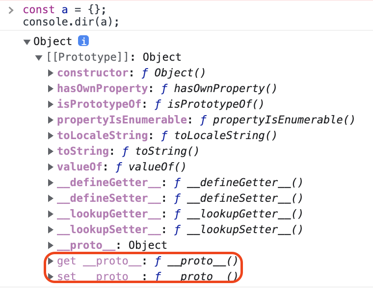

## 객체지향 프로그래밍

객체 지향 프로그래밍(Object-Oriented Programming, OOP)이란 무엇일까?

> 객체 지향 프로그래밍은 컴퓨터 프로그램을 명령어의 목록으로 보는 시각에서 벗어나 여러 개의 독립된 단위, 즉 '객체'들의 모임으로 파악하고자 하는 것이다. 각각의 객체는 메시지를 주고받고, 데이터를 처리할 수 있다.
>
> 장점
>
> - 프로그램을 유연하고 변경이 쉽게 만들기 때문에 대규모 소프트웨어 개발에 많이 사용됨.
> - 소프트웨어 개발과 보수를 간편하게 함.
> - 직관적인 코드 분석을 가능하게 함.
>
> 단점
>
> - 지나친 프로그램의 객체화 경향은 실제 세계의 모습을 그대로 반영하지 못한다는 비판을 받기도 함
>
> [출처](https://ko.wikipedia.org/wiki/%EA%B0%9D%EC%B2%B4_%EC%A7%80%ED%96%A5_%ED%94%84%EB%A1%9C%EA%B7%B8%EB%9E%98%EB%B0%8D)

객체 지향 프로그래밍은 1960년대부터 시작된 개념이지만, 1990년대에 들어와서야 상용화되고 사용되기 시작했다. 객체 지향 프로그래밍에서 프로그램을 '객체(object)'로 나눈다. 그리고 객체 안에서 '메서드와 변수(데이터)' 를 묶어 하나의 역할을 수행하는 단위로 분류한다.

JavaScript로 객체 지향 프로그래밍과 절차 지향 프로그래밍을 비교하기 위해 간단 예시를 보자. 객체 지향 프로그래밍은 주로 Class 형태로 예시를 들지만 prototype과 관련한 내용이 후술될 것이기 때문에 코드는 prototype으로 작성할 것이다.

**객체 지향 프로그래밍 예시**

```js
// 생성자 함수
function Person(name, age) {
  this.name = name;
  this.age = age;
  this.introduce = function () {
    console.log(
      `Hello, my name is ${this.name} and I am ${this.age} years old.`
    );
  };
}

// 인스턴스
let person1 = new Person('선태', 10);
person1.introduce(); // "Hello, my name is 선태 and I am 10 years old."
```

위 코드는 객체 지향 프로그래밍의 예시다. Person 생성자 함수를 사용하여 객체를 생성하며, introduce 메서드를 정의하여 객체의 동작을 구현한다. 이를 통해 객체의 재사용성과 코드의 모듈화를 효과적으로 구현할 수 있다. 객체 지향 프로그래밍에서는 코드를 모듈화하고, 각 생성자 함수(클래스)는 독립적으로 동작할 수 있는 단위로 구현된다.

**절차 지향 프로그래밍 예시**

```js
let name = '선태';
let age = 10;

function introduce(name, age) {
  console.log(`Hello, my name is ${this.name} and I am ${this.age} years old.`);
}

introduce(name, age); // "Hello, my name is 선태 and I am 10 years old."
```

위 코드는 절차 지향 프로그래밍의 예시다. name과 age 변수를 선언하고, introduce 함수를 정의하여 동작을 구현한다. 이러한 방식은 프로그램의 흐름이 함수 호출에 의해 결정되며, 변수와 함수가 서로 연관되어 있지 않기 때문에 코드의 재사용성이 낮다. 절차 지향 프로그래밍에서는 **함수를 중심**으로 코드를 작성하며, 함수는 입력을 받아 출력을 반환하는 단위로 구현된다.

두 코드를 비교했을 때 어떤가? 직관적으로 코드를 파악하기에는 '절차 지향 프로그래밍'이 훨씬 좋다. 단순한 코드로 설명했지만, 여러 객체를 오가며 로직을 파악하는 객체지향보다 한눈에 읽히는 절차 지향이 가독성이 훨씬 좋다. 하지만, 객체 지향의 본질은 유지보수에 있다.

Person이라는 추상화를 통해, 사람의 특성을 프로퍼티로 정의했고 사람이 할 수 있는 행동을 메서드로 정의해두었다. instance는 정의된 프로퍼티와 정의된 메서드를 할 수 있다고 정의한다. 즉, 훗날의 나 혹은 다른 개발자가 와서 정의 된 Person을 보면 어떤 특성과 행동을 할 수 있는 녀석인지 파악할 수 있는 문맥적 인지가 올라갈 수 있는 장점이 있다.

반면, 절차 지향 프로그래밍은 단순히 값을 return하기에는 좋은 코드다. 하지만 코드가 길어지고, 깊어질 수록 많은 코드가 name, age 변수에 접근이 가능하다는 점과 introduce를 다시 선언해 덮어쓴다던가 하는 문제가 생기기 좋은 코드다. 하지만, 반드시 객체 지향만이 좋은 코드는 아닐 수 있다. 혼자 작성한 아주 간단한 코드 작업같은 경우, 가독성이 좋은 장점이 있다.

결국 객체 지향 프로그래밍이란, 코드의 사이즈가 커졌을 때 유지보수 하기 쉽도록 만들어진 패러다임이다.

<br/>

## 객체 지향 프로그래밍의 4가지 특징

### 추상화

추상화는 객체에서 공통적인 속성과 기능을 추출하여 모델을 만드는 과정이다. 강아지와 고양이를 예로 들어보자. 강아지와 고양이의 공통적인 특징은 소리를 낼 수 있고, 4개의 발이 달렸으며, 반려 동물이다. 둘은 큰 범주로 '반려 동물'이다. 그러면 다시, 반려 동물의 특징이 있다. 사람이 키울 수 있는 동물이며, 귀엽다. 사람에게 행복을 줄 수 있다. 다시 큰 범주로 반려 동물은 '동물'이다. 동물의 범주는 야생 동물, 반려 동물 등이 있을 수 있겠다. 이렇게 공통의 속성을 가지는 것을 하나의 범주로 묶을 수 있다. '동물' 이라는 단어를 들었을 때 직관적으로 어떤 특징을 갖고 있으며 어떤 행동을 할 수 있다고 예측할 수 있다. 이것이 추상화다.

```js
function Animal(name, sound) {
  this.name = name;
  this.sound = sound;
  this.makeSound = function () {
    console.log(this.sound);
  };
}

let dog = new Animal('Dog', '왈왈');
let cat = new Animal('Cat', '야옹');

dog.makeSound(); // "왈왈"
cat.makeSound(); // "야옹"
```

위 코드에서 Animal 클래스는 공통적인 속성(name)과 기능(makeSound)을 가지는 추상화 모델이다.

### 캡슐화

캡슐화는 객체의 내부 상태를 보호하기 위해 외부에서 접근을 제한하는 것이다. 캡슐화는 알약을 떠올리면 쉽다. 아주 쓴 약을 캡슐에 싸서 물과 함께 삼키면 쓴맛을 느낄 새도 없이 약을 먹을 수 있다. 약을 먹는다는 것의 목적은, 몸이 낫게 도와주는 것이다. 약을 먹으면서 쓴 맛을 굳이 느끼지 않아도 된다. 목적을 이루기 위해서 안의 내용물까지 알지 않아도 된다는 뜻이다. 객체를 통해 우리가 하고자 하는 것을 하면 되는 것이지 안의 내용까지 알 필요가 없다.

```js
function Animal(name, sound) {
  // private
  var name = name;
  var sound = sound;
  // public
  this.makeSound = function () {
    console.log(sound);
  };
}
let dog = new Animal('Dog', '왈왈');
let cat = new Animal('Cat', '야옹');

console.log(dog.name); // undefined
console.log(cat.name); // undefined
dog.makeSound(); // "왈왈"
cat.makeSound(); // "야옹"
```

생성자 함수의 내부에 `this.name` 대신 `var name`을 사용했다. 그리고 인스턴스 외부에서 name에 접근했을 때 `undefined`가 나타난다. private으로 생성자 함수 외부에서는 접근할 수 없도록 정의된 것이다. 그리고 `makeSound` 는 그대로 this에 바인딩 시켰고, 이는 외부에서도 사용할 수 있음을 의미한다. 즉, public이다. Animal 생성자 함수에 코드가 어떻게 구현되어 있는지 알지 않아도 우리는 강아지와 고양이의 울음소리가 어떤 것인지 알기 위해 실행키실 수 있다.

### 상속

상속은 부모 클래스의 속성과 메서드를 자식 클래스에서 재사용하여 코드를 간결하게 만드는 것이다. 우리는 '동물'을 추상화하는 과정을 거쳤다. 이 '동물'의 공통 속성을 각각 강아지와 고양이가 그대로 물려받아 사용했다. 강아지와 고양이는 생성자 함수로부터 생성된 '객체'일 뿐이다. (생성자 함수는 객체를 생성하는 함수다) 하지만, 강아지도 여러 강아지가 있을 수 있다. 옆집의 강아지, 그리고 내가 키우는 강아지 등. 따라서 이 강아지 자체도 생성자 함수로 만들고 싶다. 강아지의 특징만 가지고 정의하고 싶다. 그러면서 '동물'의 특징도 그대로 가져가고 싶다.

그럴때 부모의 생성자 함수의 특징을 그대로 가지면서 강아지의 특징을 따로 정의할 수 있는 생성자 함수를 만들어보자.

```js
// 부모 생성자 함수
function Animal(name, sound) {
  this.name = name;
  this.sound = sound;
}

// 부모 메서드를 prototype에 추가
Animal.prototype.makeSound = function () {
  console.log(this.sound);
};

// 자식 생성자 함수
function Dog(name) {
  Animal.call(this, name, '왈왈');
}

// 자식 prototype에 부모 클래스의 prototype을 연결
Dog.prototype = Object.create(Animal.prototype);
Dog.prototype.constructor = Dog;

// 인스턴스 생성
let dog = new Dog('Dog');
dog.makeSound(); // "왈왈"
```

prototype이 나왔다. prototype을 통해 자바스크립트에서 상속을 구현할 수 있다. 밑에서 다시 알아볼 것이다.

`Animal` 함수는 부모 클래스로 `name`과 `sound` 속성을 가지며, `makeSound` 메서드를 prototype에 추가한다. `Dog` 함수는 자식 생성자 함수로, `Animal.call` 메서드를 이용하여 부모의 속성을 상속받는다. 또한, `Object.create`를 이용하여 부모 클래스의 prototype을 자식 클래스의 prototype과 연결하고, `Dog.prototype.constructor`를 통해 생성자 함수를 지정한다.

Dog 생성자 함수에 name, sound 데이터와 makeSound 메서드가 없음에도 불구하고 Animal 생성자 함수에서 사용하듯 사용했다. 이것을 상속이라 할 수 있다. 정확하게는 상속이 아닌 위임이다.

### 다형성

다형성은 같은 이름의 메서드가 서로 다른 동작을 수행하는 것이다. '동물'에는 짖는 행위가 존재하지만, 각기 짖는 행위가 다르게 표현될 수 있다. 이런 '행위'를 자식 생성자 함수에서 다르게 표현하는 것이 다형성이다.

makeSound 즉 동물 별로 짖는 행위가 정의되어있다. 강아지는 '왈왈', 고양이는 '야옹'. 부모 생성자 함수에서는 이를 단지 '정의'할 뿐이고 자식 클래스에서는 이 makeSound 메서드를 오버라이딩 해서 다르게 정의해줄 수 있다. 상속에서 사용한 코드에 기반으로 Dog, Cat 생성자 함수를 재구성 해보자.

```js
// 자식 생성자 함수
function Dog(name) {
  Animal.call(this, name);
  this.makeSound = function () {
    console.log('왈왈');
  };
}

// 자식 생성자 함수
function Cat(name) {
  Animal.call(this, name);
  this.makeSound = function () {
    console.log('야옹');
  };
}

// 자식 클래스의 prototype에 부모 클래스의 prototype을 연결
Dog.prototype = Object.create(Animal.prototype);
Dog.prototype.constructor = Dog;
Cat.prototype = Object.create(Animal.prototype);
Cat.prototype.constructor = Cat;

// 인스턴스 생성
let dog = new Dog('Dog');
let cat = new Cat('Cat');
dog.makeSound(); // "왈왈"
cat.makeSound(); // "야옹"
```

makeSound 메서드를 자식 생성자 함수에서 '왈왈'과 '야옹'으로 고정시켜 출력했다. '오버라이딩'이란, 부모의 메서드를 자식에서 다시 재구성해 사용하는 것을 뜻한다.

<br/>

## Prototype

프로토타입은 객체의 원형을 뜻하는 단어로, 어떤 객체의 상위(부모) 객체의 역할을 하는 객체다. 따라서 객체 지향 프로그래밍의 상속과 다형성을 구현할 수 있다.

### 프로토타입 객체

프로토타입 객체는 객체의 상위(부모) 객체의 역할을 하는 객체로서 다른 객체에 공유 프로퍼티를 제공한다. 프로토타입을 상속 받은 하위(자식) 객체는 상위 객체의 프로퍼티를 자신의 프로퍼티처럼 자유롭게 사용할 수 있다.

모든 객체는 **[[Prototype]] 이라는 내부 슬롯**을 가지며, 이 **내부 슬롯의 값은 프로토타입의 참조**(null인 경우도 있음)다. [[Prototype]]에 저장되는 프로토타입은 객체 생성 방식에 의해 결정된다. 예를 들어, 객체 리터럴에 의해 생성된 객체의 프로토타입은 Object.prototype이고 생성자 함수에 의해 생성된 객체의 프로토타입은 생성자 함수의 prototype 프로퍼티에 바인딩 되어있는 객체다. 모든 객체는 하나의 프로토타입을 갖는다. 그리고 모든 프로토타입은 생성자 함수와 연결되어 있다.

먼저 짚고 넘어가야할 부분은 생성자 함수에 관련한 부분이다. OOP의 예시로 들었던 코드다.

```js
function Animal(name, sound) {
  this.name = name;
  this.sound = sound;
  this.makeSound = function () {
    console.log(sound);
  };
}
```

```js
function Animal(name, sound) {
  this.name = name;
  this.sound = sound;
}
Animal.prototype.makeSound = function () {
  console.log(this.sound);
};
```

첫번째 코드는 `makeSound` 메서드가 생성자 함수 안에 있다. 그리고 두번째 코드는 메서드가 생성자 바깥에서 prototype에 선언되었다. 이 둘의 차이는 상속받을 인스턴스의 메서드 차이다.

```js
let dog = new Animal('Dog', '왈왈');
let cat = new Animal('Cat', '야옹');
dog.makeSound(); // "왈왈"
cat.makeSound(); // "야옹"
```

prototype을 사용했건, 사용하지 않았건 두 코드 모두 정상적으로 동작한다. 하지만 첫번째 코드처럼 생성자 함수 내부에 메서드를 정의하면, 인스턴스에 만들어지는 메서드 모두 새롭게 생성된 메서드이다.

```js
// 첫번째 코드
dog.makeSound === cat.makeSound; // false
// 두번째 코드
dog.makeSound === cat.makeSound; // true
```

prototype으로 선언된 메서드는 Animal의 prototype에 선언되어 있다. 따라서, 동일한 메서드라고 나오는 것이다. 다시 선언되지 않았으므로 prototype에 선언된 메서드는 메모리를 효율적으로 사용할 수 있다. 인스턴스를 생성할 때마다 메서드를 생성한다면 퍼포먼스 측면에서 악영향이기 때문이다. 여기서 prototype은 객체를 생성할 때, 새롭게 무언가를 만들기 보다는 **복제**라는 특성을 사용해 자식에게 넘겨준다는 특성이 있다.

---

### \_\_proto\_\_ 접근자 프로퍼티

`[[Prototype]]` 요렇게 생긴 녀석은 내부 슬롯으로, 자바스크립트에서 내부 알고리즘을 이용해 어떤 것을 구현하기 위해 사용하는데 이는 개발자가 직접 접근할 수 없다. 하지만, `__proto__` 이렇게 생긴 녀석은 접근자 프로퍼티고, `[[Prototype]]` 이녀석에게 간접적으로 접근할 수 있다. 브라우저에서 프로토타입에 대한 접근에 대한 지속적인 시도가 있어왔고, 추후에 공식적으로 인정된 케이스다.

따라서, 이 접근자 프로퍼티를 통해 객체의 `[[Prototype]]` 내부 슬롯이 가리키는 객체인 Object.prototype에 접근할 수 있다.

```js
const a = {};
console.log(a.__proto__ === Object.prototype); // true
```

a는 Object의 인스턴스이기 때문이다. `__proto__`는 getter / setter다. a를 콘솔에 찍어보자.



사진에 보면 하단에 `get`, `set` 키워드로 `__proto__` 를 가리키고 있다. getter / setter이므로, `__proto__`에 접근할 경우나 재할당 할 경우 보이지는 않지만 내부적으로 어떤 조치를 취하고 있음을 알 수 있다. 그러면 이녀석을 왜 사용하고 있을까?

`[[Prototype]]` 내부 슬롯의 값, 즉 프로토타입에 접근하기 위해 접근자 프로퍼티를 사용하는 이유는 상호 참조에 의해 프로토타입 체인이 생성되는 것을 방지하기 위해서다.

```js
const parent = {};
const child = {};

child.__proto__ = parent;
parent.__proto__ = child; // TypeError: Cyclic __proto__ value
```

이런 식으로 child와 parent에게 서로의 `__proto__`를 서로로 지정해주었더니 순환 관련 에러가 발생했다. 이런 에러가 없다면 서로가 자신의 프로토타입이 되고 prototype 안의 데이터에 접근하게 되면 서로가 서로를 참조하므로 무한루프가 생성된다. getter / setter에서 이를 방지하기 위해 어떤 조치를 취하고 있을 것으로 추정된다. 하지만 `__proto__` 또한 ES5까지는 비표준 이었기 때문에 지금도 여전히 `__proto__`로 접근하는 것은 권장되지 않는다.

접근자 프로퍼티 대신 프로토타입의 참조를 취득하고 싶은 경우 `Object.getPrototypeOf` 메서드를 사용하고, 프로토타입을 교체하고 싶은 경우에는 `Object.setPrototypeOf` 메서드를 사용할 것을 권장한다. 또 `Object.create` 메서드를 사용해 만들 수 있다.

```js
Dog.prototype = Object.create(Animal.prototype);
Dog.prototype.constructor = Dog;
Cat.prototype = Object.create(Animal.prototype);
Cat.prototype.constructor = Cat;
```

위에서 봤던 이 코드가 바로 그것이다. Object.create의 첫번째 인자는 부모의 프로토타입이 들어가야 한다. 차근차근 보자.

```js
function Animal(name, sound) {
  this.name = name;
  this.sound = sound;
}
Animal.prototype.makeSound = function () {
  console.log(this.sound);
};
function Dog() {
  Animal.call(this);
}

console.log(Dog.prototype);
// ▼ {constructor: ƒ}
//   ► constructor: ƒ Dog()   -> constructor 프로퍼티가 Dog 생성자함수를 가리키고 있다.
//   ► [[Prototype]]: Object
```

이렇게 Dog.prototype의 constructor 즉, 생성자 함수가 Animal이 아닌 Dog로, Animal과 전혀 연결되지 않았다. Dog를 통해 인스턴스를 생성하면 prototype 자체가 그 자신인 생성자 함수이므로 `makeSound` 메서드를 부르면 typeError가 나타날 것이다. 또한, `__proto__` 도 마찬가지로 객체의 최상위 객체인 Object를 가리키고 있다. 전혀 상속이 되지 않았다.

```js
Dog.prototype = Object.create(Animal.prototype);
console.log(Dog.prototype);
// ▼ Animal {}   -> 빈 객체가 만들어졌다! 이전에는 constructor 프로퍼티가 있는 객체였다.
//   ► [[Prototype]]: Object
//     ► makeSound: ƒ ()    -> Animal 프로토타입의 makeSound 메소드가 생긴것을 확인할 수 있다.
//     ► constructor: ƒ Animal(name, sound)
```

주의해야 할 점은, constructor가 사라졌다는 것이다. `Object.create` 메서드는 constructor를 함께 생성해주지 않는다.

이 생성자 프로퍼티(constructor)는 이 함수를 통해 생성된 객체 입장에서 보았을 때 `나를 만들 때 어떤 함수가 호출되었냐?`를 의미한다. 만약 이 연결이 없다면 새로 생성된 객체는 자신을 만들 때 어떤 생성자 함수가 호출되었는지 알 수가 없다. dog 인스턴스는 `__proto__` 자체는 Animal을 바라보고 있지만, constructor 즉, 자신의 생성자 함수도 Animal이 되었다. 하지만 객체를 생성자로 생성했을 때는 문제가 되지 않는다.

```js
function Animal(name, sound) {
  this.name = name;
  this.sound = sound;
}
Animal.prototype.makeSound = function () {
  console.log(this.sound);
};
function Dog(aa) {
  Animal.call(this, 'dog', '왈');
  this.aa = aa;
}
Dog.prototype = Object.create(Animal.prototype);
const dog = new Dog('aa');

console.log(dog.aa); // 'aa'
```

하지만, `const dog2 = new Dog.constructor('aa');` 이런 식으로 constructor로 생성했을 경우 문제가 된다.

```js
const dog2 = new Dog.constructor('aa');
console.log(dog2.aa); // undefined
```

따라서 constructor도 생성자 함수인 자신이 되도록 이어주도록 하자. `Dog.prototype.constructor = Dog;`

---

### 프로토타입 체인

프로토타입 체이닝이란, 객체의 프로퍼티에 접근하려고 할 때 해당 객체에 접근하려는 프로퍼티가 없다면 prototype 참조를 따라 부모 역할을 하는 프로토타입의 프로퍼티를 순차로 검색하는 것을 말한다.

자바스크립트 내의 사용되는 모든 객체들은 전부 이런 프로토타입 기반 방식으로 정의되고 생성된다. 즉, `String`, `Boolean`, `Array`와 같이 우리가 일반적으로 사용하고 있는 빌트인 객체들도 모두 같은 방식을 사용해서 만들었다는 것이다. 자바스크립트 내에 존재하는 모든 것들은 바로 `Object` 함수의 프로토타입인 `Object.prototype`을 시작으로 해서 복제된다.

console에 어떤 값을 넣고 프로토타입을 계속 까보면 결국 Object.prototype이 나타난다. Object.prototype이 최상위 객체이므로 `Object.prototype.__proto__` 는 항상 null 이다.

```js
Object.prototype.__proto__ = '1';
console.log(Object.prototype.__proto__); // null
```

할당 해줘도 null임. 이렇게 프로토타입으로 이루어진 객체들의 관계를 `프로토타입 체인(Prototype Chain)`이라고 한다.

---

### 객체 리터럴에서 직접 상속

Object.create 메서드를 사용해 상속을 구현해도 되지만, 리터럴에서 직접 상속을 구현할 수도 있다. 물론 `__proto__` 가 사용되긴 하지만 말이다.

```js
const animal = {
  name: 'dog',
  sound: '왈',
};
const dog = {
  name: '새로 생긴이름',
  __proto__: animal,
};
/*
위 코드는 주석 코드와 동일하다.
const dog = Object.create(animal, {
	name: {value: '새로 생긴이름', writable: true, enumerable: true, configurable: true},
})
*/

console.log(dog.name, dog.sound); // 새로 생긴이름 왈
console.log(Object.getPrototypeOf(dog) === animal); // true
```

---

### 정적 프로퍼티 / 메서드

정적(static) 프로퍼티/메서드는 생성자 함수로 인스턴스를 생성하지 않아도 참조/호출할 수 있는 프로퍼티/메서드를 말한다.

```js
function Animal(name, sound) {
  this.name = name;
  this.sound = sound;
}

Animal.prototype.makeSound = function () {
  console.log(this.sound);
};

Animal.staticProp = 'static prop';
Animal.staticMethod = function () {
  console.log('static method');
};
const dog = new Animal('dog', '왈왈');

Animal.staticMethod(); // static method
dog.staticMehtod(); // TypeError: me.staticMehtod is not a function
```

생성자 함수는 객체이므로 자신의 프로퍼티 / 메서드를 소유할 수 있음. 정적 프로퍼티 / 메서드는 생성자 함수가 생성한 인스턴스를 참조 / 호출 할 수 없음. static 메서드는 Math 객체에서 자주 쓰인다. Math, Reflect, JSON은 생성자 함수가 없다. 따라서 `const math = new Math()` 라는 문법 자체가 존재하지 않는 것이다.

하지만 `Math.PI` 와 같은 '값'은 존재한다. Math 객체의 static 프로퍼티를 호출했기 때문이다. Math 객체는 상태(변경될 데이터)를 가지고 있지 않으며 수학과 관련된 메서드와 데이터가 존재하는 응집도가 높은 객체가 되었다.

<br/>

## 프로토타입 기반 프로그래밍

### 개념

프로토타입 기반 프로그래밍이란, 객체 지향 프로그래밍의 한 형태의 갈래로 클래스가 없고, 클래스 기반 언어에서 상속을 사용하는 것과는 다르게 객체를 원형(프로토타입)으로 하여 **복제**의 과정을 통해 객체의 동작 방식을 다시 사용할 수 있다.

위에서 살펴본 코드는 모두 class를 사용하지 않고 prototype을 사용해 구현되었다.

> ※ES6 이후에 class 문법이 자바스크립트에도 나타났지만 이는 syntax sugar라는 평이 대부분이다. class는 자바스크립트의 prototype을 기반으로 만들어졌기 때문이다. 다만, ES6의 class를 사용하면서 prototype에서의 복잡한 일들을 해주기 때문에 아니라는 평가 또한 있다. [ES6 Class는 단지 prototype 상속의 문법설탕일 뿐인가?](https://roy-jung.github.io/161007_is-class-only-a-syntactic-sugar/)

그렇다면 클래스 기반 프로그래밍과 프로토타입 기반 프로그래밍에 대해서 비교해보자.

### 클래스 기반 프로그래밍과의 차이

클래스기반 프로그래밍은 개발자가 클래스들 사이의 **분류와 관계에 먼저 초점**을 맞추기 쉽다고 한다. 이와는 달리, 프로토타입 기반 프로그래밍은 개발자가 여러 가지 표본의 **동작 방식에 초점**을 맞추고, 객체들을 클래스와 비슷한 방식의 '객체의 원형'으로 분류하는 것은 나중에 걱정한다.

다시 풀어서 설명하면, 클래스 기반 프로그래밍에서 먼저 객체의 특성을 '분류'하고 객체간 '관계'를 정의한 후, 토대로 class를 정의하고 정의한 class를 변경시키지 않는다. 하지만, 프로토타입 기반 프로그래밍에서는 객체를 먼저 만든 후, 프로토타입을 연결시켜 객체에서 프로토타입에 있는 메서드를 사용할 수 있다. 그리고 인스턴스(객체)에서는 언제든 인스턴스가 참조하고 있는 프로토타입을 변경할 수 있다.

```js
Dog.prototype = Object.create(Animal.prototype);
Dog.prototype.constructor = Dog;
```

이 코드로 Dog의 프로토타입의 링크를 걸어주었던 것을 기억하는가? 이처럼 어느 한 객체의 상속관계가, 다시 **런타임**에 변경될 수 있음을 뜻하는 것이다. 거의 모든 프로토타입 기반 시스템은 동적으로 입력되는 값에 의해 인스턴스의 부모가 변경될 수 있는 여지가 있다는 것이다.

여기서 처음 설명했던 '복제'의 개념이 나온다. 원래 있던 객체의 프로토타입 행동(메서드)을 복제하여 새 객체를 생성하는 과정을 거친다. 새 객체는 원본의 모든 특성을 가진다. 복제된 자식 객체는 명시적으로 프로토타입과 '위임'이나 '닮음'으로 연관되어 있다.

클래스 기반 프로그래밍에서는 객체를 생성한 후 다른 인스턴스를 만들기 위해서는 다시 클래스를 기반으로 인스턴스를 만들어야 한다. 그렇게 되면 메모리에 인스턴스가 복제가 되는 것이 아니라 새롭게 생성되는 것이다. `객체의 생성 비용`이 높다고 할 수 있다. 하지만 복제를 한다고 하면, 객체를 한번 생성 후 자식 인스턴스는 같은 메서드를 바라보고 있기 때문에 메모리 측면에서 효율적이다. 이제 추가로 생성되는 인스턴스는 복제 되었으므로 메서드들이 추가적인 메모리를 잡아먹지 않는다. 또한 다른 생성자 함수의 메서드를 사용하고 싶다면, 프로토타입을 교체하거나 새롭게 메서드를 정의해줄 수 있다.

하지만, 클래스 기반 프로그래밍을 사용하는 측에서는 이를 안정성이 떨어진다고 비평한다. 클래스 기반 프로그래밍은 주로 정적 타입 시스템을 차용한 언어를 사용하며 이는 또 주로 컴파일 언어이다. 프로토타입 기반 프로그래밍은 동적 타입 시스템을 가지고 있으며 주로 인터프리터 언어이다. 정확성, 안정성, 예측성 관점에서 클래스는 타입과 비슷하고, 클래스의 인스턴스는 주어진 방식대로 동작하리라는 확실한 보장이 되기 때문이다.

### 클래스 기반 프로그래밍

클래스 기반 프로그래밍은 객체를 만들기 전에 추상화부터 한다. 즉, 어떤 사물을 정의할 때, 사물의 본질이 무엇인지 정의내리고 시작한다. 눈앞에 실존하는 사물이 있다면 반드시 그것의 본질이 존재한다. 이를 코드로 풀어내면 다음과 같다.

```java
class Chair {
  (...)
}
Chair myChair = new Chair();
```

여기서 Chair 클래스는 본질적이고 추상적인 의자다. 그리고 myChiar은 현실 세계에 존재하는 눈에 보이는 의자다. 이것이 클래스 기반 객체지향 프로그래밍이다. Chiar 클래스는 코드 상으로만 존재하며 실제 메모리에는 존재하지 않는다. 하지만 현실세계에 존재하게 하려면 이를 `new` 키워드를 사용해 인스턴스화 하여 메모리에 올리면 실존하는 존재가 된다. 따라서 클래스 기반 프로그래밍은 본질을 먼저 생각한 뒤 특징을 뽑아내 정의한다.

### 프로토타입(Prototype) 기반 프로그래밍

prototype은 오리너구리와 비슷하다.

<iframe width="560" height="315" src="https://www.youtube.com/embed/a6QHzIJO5a8" title="YouTube video player" frameborder="0" allow="accelerometer; autoplay; clipboard-write; encrypted-media; gyroscope; picture-in-picture; web-share" allowfullscreen></iframe>

<아주 귀여운 오리너구리>

프로토타입 이론은, 분류(Classification)을 정면으로 반박하며 나온 이론이다. 속성은 관점에 따라 달라지기 때문에 분류하기 어렵다. 예를 들면 오리너구리가 있다. 오리 너구리의 부리는 오리를 닮았고, 몸은 수달과 비슷하며, 꼬리는 비버처럼 넓적하다. 오리너구리는 조류가 아니고 조류와 포유류의 중간 단계의 동물도 아닌, 엄연한 포유류다. 또 포유류이지만 독을 사용한다는 특징이 있다. 이 녀석을 어디에 분류하는게 좋을까?

아마 관점에 따라서 달라질 것이다. '부리'에 초점을 맞추면 조류가 될 것이고, 젖이 있어 자식에게 젖을 먹인다는 것을 중요하게 생각하면 포유류가 될 것이다(오리너구리는 포유류임). 즉 관점(맥락-context)에 따라 다르게 정의할 수 있을 것이다. 맥락의 의미를 더 짚어보자. 이 사진 하나면 맥락에 따른 의미가 어떻게 달라지는지 알 수 있다.


<네이버 지식 백과 - 맥락>

이렇게, 프로토타입(원형)은 현실에 존재하는 것 중 가장 좋은 본보기를 원형(prototype)으로 선택한다. 클래스 기반 프로그래밍과 접근 방식이 다르다. 먼저 분류하는 것이 아니라 상황과 맥락 관점에 따라 그 중에 가장 좋은 것을 원형으로 삼는다. 원형에서 파악된 특징은 객체에 전달된다.

프로토타입 기반 OOP 언어의 특징은 아래와 같다.

- 개별 객체(instance) 수준에서 메소드와 변수를 추가
- 객체 생성은 일반적으로 복사를 통해 이루어짐
- 확장(extends)은 클래스가 아니라 위임(delegation)
  \> 현재 객체가 메시지에 반응하지 못할 때 다른 객체로 메시지를 전달할 수 있게 하여 상속의 본질을 지원
- 개별 객체 수준에서 객체를 수정하고 발전시키는 능력은 **선험적 분류의 필요성을 줄이고 반복적인 프로그래밍 및 디자인 스타일**을 장려
- 프로토타입 프로그래밍은 일반적으로 `분류하지 않고 유사성을 활용하도록 선택`
- 결과적으로 설계는 맥락에 의해 평가

그렇다면, 자바스크립트가 가지는 특징들이 전부 물려있다는 사실을 알게 될 것이다. Array를 봐도 그렇다.

```js
// java
String[] beer = {"Kloud", "Cass", "Asahi", "Guinness", "Heineken"};

// javascript
var beer = ['Kloud', "Cass", { ALE: ['벨지안 에일', '페일 에일', '블론드 에일'] }];
```

Array의 타입이 java에서는 String으로 고정되어 있고, 그 외의 타입은 들어올 수 없다. javascript에서는 단지 배열만 선언되어 있고, 그 안에 객체가 들어오든, 다시 배열이 들어오든 상관이 없다. 즉, 배열을 선언할 때의 상황을 변수명으로 짓고, 내부 데이터는 어떤 형태든 상관 없다. javascript는 상황과 맥락에 따라 분류를 새롭게 정의할 수 있는 특징을 가진다.

위임도 마찬가지다. 이때까지 OOP의 중요한 특징 '상속'을 예로 들어왔는데 prototype은 상속처럼 보여지는 위임을 한다. 위에서 이야기했던 런타임에서 prototype 객체를 변경하면 변경된 prototype의 메서드를 위임받아 사용한다. 따라서 자바스크립트는 extend(확장 및 상속)이 아닌 delegation(위임)인 것이다.

또, 자바스크립트는 맥락(Context)을 굉장히 중시하는데, 실행 컨텍스트(execution context), this, 호이스팅의 개념을 여기서 설명할 수 있다. 호이스팅이란, var 로 변수를 선언했을 때 위로 끌어올려지는 **것처럼** 보이는 것을 말하는데, 이는 실행 컨텍스트가 활성화 될 때 Lexical Environment의 EvironmentRecord에서 식별자를 수집하기 때문에 그렇다.

그렇다면 클로저도 마찬가지다. 클로저에서 밖으로 반환된 내부 함수의 자유 변수에 접근할 수 있는 것은 내부 함수가 자유 변수를 바라보고 있기 때문이다. 자유 변수를 외부에서도 참조할 수 있는 이유는 'Lexical Scoping' 때문이다. 선언된 '맥락'에서 변수를 참조하는 것이 달라지는 것이다.

또한, this는 함수로서의 호출과 메서드로서의 호출에따라 this가 바라보는 것이 달라진다. 함수를 부르는 주체에 따라 함수로 불려질지 메서드로 불려질지 다르기 때문이다. 이 또한 주체가 달라진다는 것은 '맥락'에 따라 달라진다는 것을 뜻한다.

---

<br>

어기까지 자바스크립트의 prototype에 대해서 알아보고, prototype 기반 언어의 의미를 알아보았다. 자바스크립트가 만들어진 기반 prototype을 이제는 class 문법이 대체하려고 하며, TypeScript로 java와 같은 클래스 기반 객체지향 프로그래밍에 대한 시도가 주류를 이루어가는 것 같다. 하지만 언어가 가지는 근본적인 철학에 대해 고민해보는 좋은 시간이었다.

<br/>

> 참고
>
> - https://evan-moon.github.io/2019/08/24/what-is-object-oriented-programming/
> - https://evan-moon.github.io/2019/10/23/js-prototype/
> - https://hyeon9mak.github.io/consider-oop/
> - https://ko.wikipedia.org/wiki/%ED%94%84%EB%A1%9C%ED%86%A0%ED%83%80%EC%9E%85_%EA%B8%B0%EB%B0%98_%ED%94%84%EB%A1%9C%EA%B7%B8%EB%9E%98%EB%B0%8D
> - https://medium.com/@limsungmook/%EC%9E%90%EB%B0%94%EC%8A%A4%ED%81%AC%EB%A6%BD%ED%8A%B8%EB%8A%94-%EC%99%9C-%ED%94%84%EB%A1%9C%ED%86%A0%ED%83%80%EC%9E%85%EC%9D%84-%EC%84%A0%ED%83%9D%ED%96%88%EC%9D%84%EA%B9%8C-997f985adb42
> - https://yozm.wishket.com/magazine/detail/1396/
> - https://ko.javascript.info/prototype-inheritance
> - https://poiemaweb.com/js-object-oriented-programming
