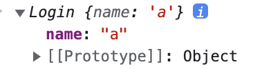
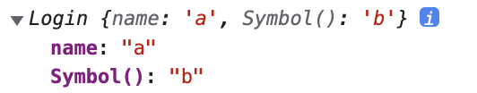
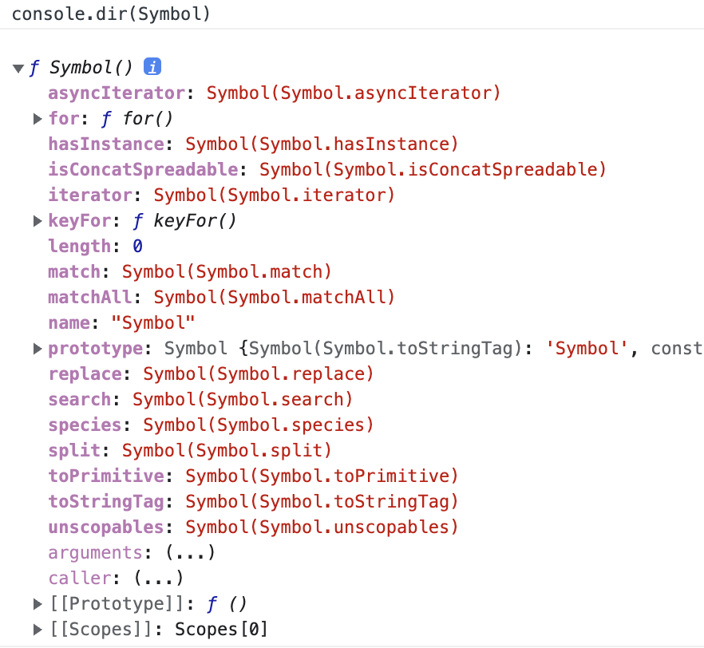
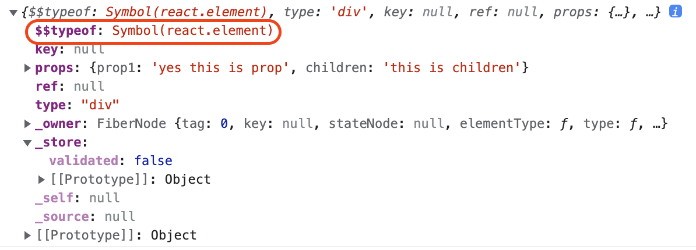

## 요약

- Symbol은 primitive type으로 ES6에서 추가되었다.
- Symbol은 변경 불가능한 원시 값이며, 고유한 ID의 역할을 한다.
- 객체의 속성(프로퍼티)의 key로 사용된다.
- Symbol은 상수의 개념으로 사용할 수 있다. 따라서, class 믹스인 등 동일한 객체 내부 key를 중복되지 않도록 할 수 있다.
- 객체의 private한 변수 혹은 메서드로 사용할 수 있다.
- 라이브러리 등의 meta-level한 property로 사용할 수 있다.
- Symbol 레지스트리가 있어 영역 간에 고유한 Symbol을 사용할 수 있다.
- react에서는 Symbol이 JSON에 담기지 않는 특성을 이용해 xss 공격을 방어하고 있다.

## 1. 새로운 기본형 타입

ECMAScript6에서 새로운 primitive type인 Symbol이 도입되었다. Symbol은 변경 불가능한 원시 값이다. 고유한 ID 역할을 하는 토큰이다. 아래 코드와 같이 Symbol을 생성할 수 있다.

```js
const symbol1 = Symbol();
```

`Symbol()` 코드에는 Symbol을 생성하는데, description(설명)을 넣어줄 수 있다. description은 문자열이 들어가는데 Symbol 생성에 영향을 주지 않으며, 디버깅 용도로만 사용된다.

```js
const symbol2 = Symbol('symbol2');
console.log(String(symbol2)); // Symbol(symbol2)
```

`Symbol()` 을 통해 만들어진 심볼은 고유하며 모든 Symbol에는 고유 ID가 있다. 따라서, Symbol을 생성할 때 description이 동일해도 서로를 다르다고 평가한다.

```js
const a = Symbol('mySymbol');
const b = Symbol('mySymbol');
console.log(a === b); // false
console.log(a == b); // false
```

---

### 1.1 속성의 key로서의 Symbol

Symbol은 객체의 속성(프로퍼티)의 key로 사용할 수 있다.

```js
const MY_KEY = Symbol();
let obj = {};

obj[MY_KEY] = 123;
console.log(obj[MY_KEY]); // 123
```

위 코드처럼 클래스와 객체 리터럴에는 Computed Property를 사용할 수 있다. Computed Property는 객체의 key 값을 표현식(변수, 함수)을 통해 지정하는 문법이다. 다음 객체 리터럴에서는 Computed Property를 사용해 MY_KEY 속성의 키 값을 만들었다.

또, 아래와 같이 Computed Property를 사용해 메서드를 정의할 수 있다.

```js
const FOO = Symbol();
let obj = {
  [FOO]() {
    return 'bar';
  },
};
console.log(obj[FOO]()); // bar
```

---

### 1.2 Symbol과 열거(enumerable)

이제 프로퍼티의 key가 될 수 있는 새로운 값이 String외에 Symbol이 생겼다. 따라서 ES6에서는 다음과 같은 용어가 사용된다.

- 프로퍼티 키는 String 또는 Symbol 타입이 될 수 있다.
- 프로퍼티 이름은 String이다.

하지만 Symbol은 열거(enumerating) 가능할까?

```js
let obj = {
  [Symbol('my_key')]: 1,
  enum: 2,
  nonEnum: 3,
};
Object.defineProperty(obj, 'nonEnum', { enumerable: false });
```

nonEnum이란 값에 Object.defineProperty() 메서드를 사용해, enumerable을 false값을 주었다. 그러면 nonEnum은 열거 불가능하다. [유사 배열 객체와 배열의 차이점](https://pozafly.github.io/javascript/array-is-object/#%EC%9C%A0%EC%82%AC-%EB%B0%B0%EC%97%B4-%EA%B0%9D%EC%B2%B4%EC%99%80-%EB%B0%B0%EC%97%B4%EC%9D%98-%EC%B0%A8%EC%9D%B4%EC%A0%90)에서 Object.getOwnPropertyDescriptors() 메서드를 사용해 프로퍼티의 설명자(descriptor 또는 flag라 불리움)를 알아본 적이 있다. 이때 return 되는 프로퍼티의 설명자 중 enumerable이 있었다. 열거 가능한지의 여부를 나타낸다.

※ `enumerable`은, 후술할 `iterator`와는 다르다. enumerable은 `for ... in` 문법으로 객체를 순회할 경우와 관계가 있다. [참고](https://stackoverflow.com/questions/68647965/what-is-the-difference-between-iterable-and-enumerable-in-js-i-am-going-through)

어쨌든 nonEnum 프로퍼티를 열거 불가능하게 만들었으니 반복했을 때 어떤 결과가 나타나는지 보자.

```js
for (key in obj) {
  console.log(key);
}
// enum
```

Symbol은 나타나지 않고 enum만 찍혔다. Symbol은 기본적으로 열거 불가능한 속성을 가지고 있다.

```js
Object.getOwnPropertyNames(obj); // ['enum', 'nonEnum']
Object.getOwnPropertySymbols(obj); // [Symbol(my_key)]
Object.keys(obj); // ['enum']
```

getOwnPropertyNames() 메서드에서도 Symbol은 나타나지 않지만, getOwnPropertySymbols() 메서드에서는 Symbol이 나타났다. Symbol을 조회하고 싶다면 getOwnPropertySymbols() 메서드를 사용해야 한다. 또한 `Object.keys()` 메서드를 사용할 때는 enumerable이 false 값인 녀석들은 조회가 안되니 주의해야 한다.

<br/>

## 2. Symbol 사용 개념

ES5 이전까지 상수(enum, constant)를 사용할 때는 String을 사용해 아래와 같이 사용했다.

```js
var COLOR_RED = 'red';
var COLOR_ORANGE = 'orange';
var COLOR_YELLOW = 'yellow';
var COLOR_GREEN = 'green';
var COLOR_BLUE = 'blue';
var COLOR_VIOLET = 'violet';
```

상수라는 의미로, 변수명을 전부 대문자로, 그리고 스네이크 케이스를 사용한다. 하지만 String은 그 자체로 고유하지 않다. 이유를 알아보자. 아래는 색상을 주면 다른 색상으로 return하는 함수다. 그리고 color 상수로 정의되지 않은 값을 주면 Error가 발생한다.

```js
function getComplement(color) {
  switch (color) {
    case COLOR_RED:
      return COLOR_GREEN;
    case COLOR_ORANGE:
      return COLOR_BLUE;
    case COLOR_YELLOW:
      return COLOR_VIOLET;
    case COLOR_GREEN:
      return COLOR_RED;
    case COLOR_BLUE:
      return COLOR_ORANGE;
    case COLOR_VIOLET:
      return COLOR_YELLOW;
    default:
      throw new Error('Unknown color: ' + color);
  }
}
```

`getComplement()` 함수는 color를 받아서 상수 값를 return한다. 하지만 이렇게 하더라도 여전히 상수로서의 역할을 하지 못하고 혼란을 줄 수 있다. 예를 들어, 코드에서 아래와 같이 선언했다고 하자.

```js
var MOOD_BLUE = 'blue';
```

기분에 대한 상수를 정의한 것이다. 그렇다면, `COLOR_BLUE` 와 `MOOD_BLUE` 는 동일한 String인 `blue`를 가지고 있기 때문에 상수가 아니게 되어버린다. `getComplement()` 함수에 값을 집어넣으면 Error가 발생하는 것이 아니라, `orange`라는 엉뚱한 값이 나온다. 즉, color 상수와 mood 상수가 동일하게 취급이 되어버렸다.

이러한 문제점을 개선하고자 나온 것이 Symbol이다. 이제 실제 상수를 선언해보자. ES6에서 나온 `const`를 사용해 상수를 선언할 수 있다.

```js
const COLOR_RED = Symbol();
const COLOR_ORANGE = Symbol();
const COLOR_YELLOW = Symbol();
const COLOR_GREEN = Symbol();
const COLOR_BLUE = Symbol();
const COLOR_VIOLET = Symbol();
```

Symbol이 반환하는 값은 고유하므로, 이제 다른 값을 'blue'로 착각할 수 없다. 추가로 `MOOD_BLUE` 값도 Symbol로 상수로 만들어주고, `getComplement()` 메서드에 넣어보자.

```js
const MOOD_BLUE = Symbol();
getComplement(MOOD_BLUE); // Error
```

드디어 Error가 발생했다. `COLOR_BLUE` 와 `MOOD_BLUE` 는 완벽하게 다른 값이며 서로 분리된 상수다.

<br/>

## 3. 프로퍼티 key로서의 Symbol

이처럼 고유한 Symbol은 이제 객체의 key로 들어가면 다른 어떤 key 이름과도 충돌하지 않는다. 다음과 같을 경우 유용하다.

- 서로 다른 개발자가 [믹스인](https://ko.javascript.info/mixins)을 만들때, 동일한 객체 내부 key 이름을 주는 경우 충돌하지(덮어쓰지) 않게 한다.
- 객체의 meta-level(부수적인) 프로퍼티와 base-level(기본적인) 프로퍼티가 충돌하지 않게 한다.

### 3.1 객체에 내재화 된 프로퍼티(private property)

믹스인은 객체 또는 프로토타입의 기능을 보강하기 위해 구성할 수 있는 객체 조각(메서드 집합)이다. 메서드에 Symbol이 key로 있으면 더 이상 다른 메서드(다른 믹스인 또는 추가된 개체)와 충돌할 수 없다.

public 메서드는 믹스인이 추가된 객체를 불러다 쓸 때 함께 사용할 수 있다. 사용 편의성을 위해 이러한 메서드에 String key가 있다. 내부(private) 메서드는 믹스인에게만 알려지거나, 믹스인과 통신하는 데만 필요하다. Symbol를 키로 사용하여 private한 key를 얻을 수 있다. 가령, class 내부에서 class의 변수를 조작하거나 하는 외부에서 사용하지 않는 private 메서드와 비슷한 개념이다.

Symbol은 객체의 Symbol 값 프로퍼티 키를 쉽게 찾을 수 있기 때문에 진정한 프라이버시를 제공하지 않는다. 그러나 프로퍼티 키가 다른 프로퍼티 키와 충돌할 수 없다는 보장만으로도 충분한 경우가 많다. 외부에서 개인 데이터에 액세스하는 것을 진정으로 방지하려면 WeakMap 또는 클로저를 사용해야 한다.

예를 들어:

```js
// private property를 사용하기 위해 WeakMap을 사용했다.
const PASSWORD = new WeakMap();
class Login {
  constructor(name, password) {
    this.name = name;
    PASSWORD.set(this, password);
  }
  hasPassword(pw) {
    return PASSWORD.get(this) === pw;
  }
}
const user = new Login('a', 'b');
```

이때, user를 찍어보면 다음과 같이 나온다.



즉, password가 가려져서 나오지 않는다. 이제 password 멤버변수는 외부로 노출되지 않는다.

Login 인스턴스는 WeakMap `PASSWORD`의 키다. WeakMap은 인스턴스가 가비지 컬렉팅되는 것을 막지 않는다. 키가 더 이상 존재하지 않는 객체인 항목은 WeakMap에서 제거된다.

WeakMap 대신 Symbol 키를 사용하면 다음과 같은 코드가 된다.

```js
const PASSWORD = Symbol();
class Login {
  constructor(name, password) {
    this.name = name;
    this[PASSWORD] = password;
  }
  hasPassword(pw) {
    return this[PASSWORD] === pw;
  }
}
const user = new Login('a', 'b');
```

다시 user를 찍어보자.



이번엔 Symbol이 나타났다. 외부에 노출이 되었다는 뜻이다. 즉, WeakMap은 내부 구현을 다른 개발자에게 숨길 때 유용하다. 절대적인 private이 되었다. Symbol 같은 경우 형태는 존재하나, 어떤 것으로 Symbol이 되었는지 알기 어렵다. 그리고 'password' 라는 key 이름은 이제 충돌하지 않을(덮어써지지 않을) 것이다.

또한, Symbol을 이렇게 사용하면 모듈 스코프 안에서 symbol을 사용할 수 있어 필드나 메서드에 접근할 수 있지만, symbol을 export 하지 않는다면 외부에서는 접근할 방법이 없다. 접근할 필드의 이름이 무엇인지 모르니까 말이다.

---

### 3.2 meta-level 프로퍼티의 Symbol

Symbol은 고유한 키이기 때문에 메타 수준(meta-level)의 키와 일반 키가 충돌되지 않는다. 따라서 '일반' 프로퍼티 키와 다른 수준의 공용 속성의 키로 적합하다. 메타 수준 프로퍼티의 한 가지 예시는, 객체가 라이브러리에서 처리하는 방식을 사용자가 커스텀 할 수 있도록 구현할 수 있는 메서드다. Symbol 키를 사용하면 라이브러리의 normal(일반) 메서드를 custom 메서드로 착각하지 않도록 방지할 수 있다.

> 쉽게 말하면, 라이브러리에서 일반적으로 사용하는 method(일반 메서드)가 있고, 사용자가 새롭게 커스텀해서 구현할 수 있는 메서드 인터페이스가 있다고 하자. 그럴 경우에 사용자(개발자)는 문제를 해결하기위해 보통 일반 메서드를 사용하면 웬만한 문제는 다 해결된다. 하지만, 특수한 경우에 메서드 자체를 새롭게 구현하거나 property를 변경해야할 경우가 생긴다. 이때 커스텀 메서드를 활용해서 라이브러리 내부를 조작할 수 있는 통로를 열어두었다. 근데, 일반 메서드와 커스텀 메서드가 동일하게 표시된다면, 개발자는 커스텀 메서드와 일반 메서드를 혼동해서 사용하지 않아도 될 커스텀 메서드를 override해서 사용한다. 둘을 구분지어줄 필요가 있으며, 구분으로는 Symbol을 사용해 커스텀 메서드와 일반 메서드를 구분짓고, 사용자가 커스텀하게끔 하면 된다.

ECMAScript 6의 이터러블은 그러한 커스텀 메서드 중 하나다. `Symbol.iterator`에 저장된 심볼을 키로 하는 메서드가 있는 객체는 반복 가능하다. 다음 코드에서 obj는 반복 가능하다.

```js
let obj = {
  data: ['hello', 'world'],
  [Symbol.iterator]() {
    const self = this;
    let index = 0;
    return {
      next() {
        if (index < self.data.length) {
          return {
            value: self.data[index++],
          };
        } else {
          return { done: true };
        }
      },
    };
  },
};

console.log(obj);
const result = obj[Symbol.iterator]();
console.log(result.next()); // { value: 'hello' }
console.log(result.next()); // { value: 'world' }
console.log(result.next()); // { done: true }

for (let x of obj) {
  console.log(x);
}
// hello
// world
```

obj는 객체다. 따라서 원래는 iterable이 없기 때문에 `for ... of` 문법을 사용하지 못한다. 배열은 iterable이 존재한다. 따라서 `for ... of` 문법을 사용해 반복 가능하다. 위 코드는 obj 객체에 iterator를 강제로 주입한 사례다. 우리는 iterable과 `for ... of` 가 내부적으로 어떻게 구현되어있는지 알지 못한다. 하지만 obj 객체에서도 `for ... of` 를 통해 반복하고 싶다. iterable을 사용하고 싶다. 즉, 개발자(사용자)가 커스텀하게 iterator를 구현하도록 JavaScript에서 열어둔 것이다. `for ... of` 의 내부 구현을 몰라도 말이다.

여기서 사용된 `iterable, iterator, .next()` 는 다음 포스팅에서 더 상세하게 알아보자.

<br/>

## 4. Symbol을 통해 다른 영역까지

코드 영역은 코드가 영향을 줄 수 있는 범위 안에 있어야 한다. 즉, 해당 스코프에 있어야 영향을 줄 수 있다. 예를 들면, 전역 변수는 전역에 영향을 주고, 어떤 모듈은 어떤 모듈 내부에만 영향을 줄 수 있다. 반드시 해당 코드는 해당 스코프 '**내부**'에 있어야 한다.

예를 들면 브라우저의 각 프레임(iframe)에는 자체 영역이 있다. 하지만, 아래 코드에서는 HTML상으로 한 프레임에서 다른 프레임으로 건너뛸 수 있다.

```html
<head>
  <script>
    function test(arr) {
      var iframe = frames[0];
      // 아래 코드는 iframe의 코드와 다른 영역에 있다.
      // 따라서 Array와 같은 전역 변수 코드는 서로 다른 코드이다.
      console.log(Array === iframe.Array); // false
      console.log(arr instanceof Array); // false
      console.log(arr instanceof iframe.Array); // true

      // 하지만 심볼은 동일하다
      console.log(Symbol.iterator === iframe.Symbol.iterator); // true
    }
  </script>
</head>
<body>
  <iframe srcdoc="<script>window.parent.test([])</script>"> </iframe>
</body>
```

HTML 상의 영역과, iframe 내부 영역은 다른 영역이다. 하지만, Symbol은 동일한 녀석이다. iframe 내부에서 지금 선언된 상위 `test()` 메서드의 인자로 `[]` 배열 리터럴을 넘겼다.

문제는 각 영역에 고유한 Array 복사본이 있고, 객체가 개별 ID를 가지고 있기 때문에 본질적으로 동일한 객체임에도 불구하고 이러한 로컬 복사본이 서로 다른 것으로 간주된다는 것이다. 마찬가지로 라이브러리 및 사용자 코드는 영역당 한 번 로드되며, 각 영역에는 동일한 개체의 다른 버전이 있다.

대조적으로 primitive type인 Boolean, Number 및 String의 값은 개별 ID를 갖지 않으며 동일한 값의 여러 복사본은 문제가 되지 않는다.

Symbol은 개별 ID를 가지므로 다른 primitive type의 값만큼 원활하게 영역을 가로질러 이동하지 **않는다**. 이는 영역 간에 작동해야 하는 `Symbol.iterator`와 같은 심볼의 문제다. 객체가 한 영역에서 반복 가능하면 다른 영역에서도 반복 가능해야 한다. 서로 다른 영역 Symbol이 JavaScript 엔진에서 제공되는 경우(Symbol.iterator와 같이 빌트인인 경우) 엔진은 각 영역에서 동일한 값이 사용되는지 확인할 수 있다.

그러나, 라이브러리의 경우는 다르다. 이때 `심볼 레지스트리`를 활용할 수 있다. 심볼 레지스트리는 쉽게 말해서 다른 영역간의 전역 객체라고 생각하면 쉽다. 심볼 레지스트리에 심볼을 저장하고, 꺼내와서 쓸 수 있다.

``` js
const s1 = Symbol.for('foo');
```

위 코드를 실행하면, 심볼 레지스트리에서 `foo` 라는 문자열을 가진 Symbol을 찾는다. 만약에 'foo' Symbol이 있다면 s1에 담고, 없으면 심볼 레지스트리에 새롭게 Symbol을 생성해 넣고 s1에 할당한다. 따라서, 각 Symbol에 대해 라이브러리는 가능한 한 고유한 문자열을 제공해야 한다.

```js
// foo이름을 가진 Symbol이 없으므로 생성
const s1 = Symbol.for('foo');
// foo를 방금 생성했으므로 다시 생성하지않고 반환
const s2 = Symbol.for('foo');
console.log(s1 === s2); // true
```

그렇다면, 문자열 이름을 어떻게 조회할 수 있을까? `.keyFor()` 을 통해 조회할 수 있다.

```js
Symbol.keyFor(s1); // foo
Symbol.keyFor(s2); // foo
```

구분해야 할 것은, `Symbol()` 로 만든 녀석은 심볼 레지스트리에 저장되지 않은 local Symbol이다. 따라서 keyFor로 검색이 되지 않는다.

```js
const unsharedSymbol = Symbol('foo');
const keyName = Symbol.keyFor(unsharedSymbol);
console.log(keyName); // undefined
```

<br/>

## 5. 안정성 체크

Symbol은 안정성을 위해 JavaScript에서 예외를 발생시켜준다. Symbol을 생성자로 호출하는 것과 Symbol를 문자열로 강제하는 것.

### 5.1 Symbol을 생성자로 호출

다른 모든 primitive type에는 리터럴이 있지만 Symbol 함수를 호출하여 기호를 만들어야 한다. 따라서 실수로 Symbol을 생성자로 호출(new 로 함수를 호출)하기가 상대적으로 쉽다. 따라서 그렇게 하려고 하면 예외가 발생한다.

```js
new Symbol(); // TypeError: Symbol is not a constructor
```

---

### 5.2 Symbol을 문자열로 강제 변환

문자열과 Symbol이 모두 속성 키가 될 수 있어서 실수로 Symbol을 문자열로 변환하지 못하도록 보호해야 한다. 예를 들면 다음과 같다.

```js
let sym = Symbol('My symbol');
console.log('' + sym); // TypeError: Cannot convert a Symbol value to a string
```

하지만, 여전히 명시적으로 Symbol를 문자열로 변환할 수 있다. 따라서 조심해야 함.

```js
console.log(String(sym)); // 'Symbol(My symbol)'
console.log(sym.toString()); // 'Symbol(My symbol)'
```

※ 참고로 `JSON.stringify()` 메서드에서 객체 내에 Symbol이 key로 사용되고 있는 값은 나타나지 않는다.

<br/>

## 6. Well-Known Symbol

Symbol() 함수를 브라우저에서 실행보자.



위의 프로퍼티들은 `length` 프로퍼티를 제외하면 모두 Well-Known Symbol이라고 부른다. 의미는 **자바스크립트가 기본 제공하는 빌트인 심볼**을 말한다. 위 심볼은, 자바스크립트 엔진의 내부 알고리즘에 사용된다.

Well-Known 심볼의 가장 대표적인 예시가 바로 **Symbol.iterator**이다. 반복 가능하게 해주는 녀석으로 이것 또한 자바스크립트가 기본 제공하는 빌트인 심볼로 구현되었다. 다음 포스팅에서 더 자세하게 알아보자.

<br/>

## 7. react에서 Symbol을 활용하는 방법

react에서 jsx를 사용하면 컴포넌트를 호출할 때마다 `React.createElement()` 메서드를 사용하고 있는 것이다.

```js
const jsxMaker = React.createElement(
  'div', // type
  { prop1: 'yes this is prop' }, // props
  'this is children' // children
);
console.log(jsxMaker);
```

react에서 위 코드를 실행해보자.



이 객체를 React Element라고 부른다. 이 객체는 react에게 무엇을 렌더링 할지 알려준다. 여기에는 `$$typeof` 라는 값이 있다. 그리고 `Symbol(react.element)` 라는 Symbol 값이 사용되었다.

결론은 xss 공격에 대비하기 위해서 Symbol을 사용한 것이다. 위에서 말했듯, `JSON.stringify()` 메서드는 Symbol을 문자열로 변환하지 않는다. xss 공격은 해커가 의도적으로 html의 `<script>` 태그를 이용해 자신이 작성한 스크립트를 브라우저에서 실행시켜 정보를 탈취한다.

서버로부터 내려온 JSON 정보가 있다고 가정하자. 만약 이 JSON은, 해커가 악의적으로 심은 JSON이다. 그럼 이 JSON이 `React.createElement()` 메서드에 담겼다.

```jsx
// 서버에 구멍이 생겨 JSON이 저장되었다고 가정하자.
let expectedTextButGotJSON = {
  type: 'div',
  props: {
    dangerouslySetInnerHTML: {
      __html: '/* put your exploit here */',
    },
  },
  // ...
};
let message = { text: expectedTextButGotJSON };

<p>{message.text}</p>;
```

서버로 부터 가져온 JSON이 p 태그에 담겼다. `message.text` 내부에는 `<script>` 태그가 존재했고, 악의적인 코드가 태그 내부에 존재한다. 그러면, 유저의 렌더링 된 페이지에서 스크립트가 실행되고 유저의 정보가 탈취될 것이다.

이를 방지하기 위해 react에서는 `$$typeof` 를 검사한다.

JSON에는 `Symbol`를 넣을 수 없다. **즉, 서버에 보안 구멍이 생겨 텍스트 대신 JSON을 반환한다 하더라도, 그 JSON에는 `Symbol.for('react.element')` 코드를 포함시킬 수 없다.** React는 `element.$$typeof` 를 체크하여, 해당 키가 없거나 무효하면 React element 생성을 거부한다.

<br/>

> 참고
>
> - <https://2ality.com/2014/12/es6-symbols.html>
>
> - <https://poiemaweb.com/es6-symbol>
>
> - <https://developer.mozilla.org/ko/docs/Web/JavaScript/Reference/Global_Objects/Symbol#learn_more>
>
> - <https://developer.mozilla.org/en-US/docs/Web/JavaScript/Reference/Global_Objects/Symbol>
>
> - <https://it-eldorado.tistory.com/149>
>
> - <http://hacks.mozilla.or.kr/2015/09/es6-in-depth-symbols/>
>
> - <https://meetup.nhncloud.com/posts/228>
>
> - <https://velog.io/@scamera/%EC%99%9C-React-Element%EC%97%90%EB%8A%94-typeof-%ED%94%84%EB%A1%9C%ED%8D%BC%ED%8B%B0%EA%B0%80-%EC%9E%88%EC%9D%84%EA%B9%8C>
