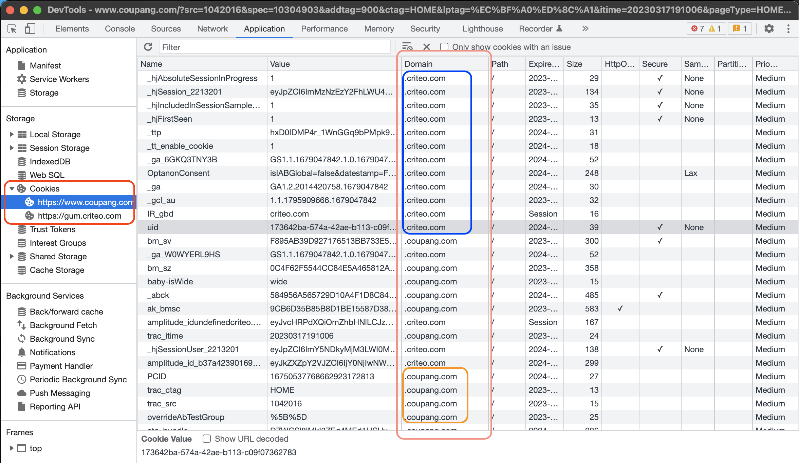

프론트엔드 개발자로 일하면서 다양한 네트워크 용어중 주소에 대한 용어가 항상 헷갈렸다. 하나의 주소 안에도 여러가지 용어가 나온다. `Host`, `Domain`, `Site`, `Origin` 등이 그것이다. 이전에 토이 프로젝트를 호스팅하기 위해 도메인을 구입하고 AWS에서 서버를 띄우는 등, 여러 세팅을 해주었던 기억이 있다. 그 당시 서브 도메인에 대한 개념을 알지 못해서 API 요청 중 CORS 에러 때문에 꽤나 삽질을 한 기억이 있다. 따라서, URI 구조에서 특정 부분 혹은 전체를 나타낼 때마다 헷갈리는 용어를 정리해보도록 한다. 네트워크 용어를 명확하게 정리하면 어느 부분에서 개발자가 원하는대로 명확하게 동작하지 않는지 알 수 있다.

## URI 구조

URI란, Uniform Resource Identifier의 약자로 인터넷에 있는 자원을 나타내는 유일한 주소다.

- Uniform : 리소스를 식별하는 통일된 방식을 말함.
- Resource : 식별 가능한 모든 것. 웹 브라우저 파일뿐 아니라 이미지와 서비스 등 다른 것과 구별할 수 있는 모든 것.
- Identifier : 다른 항목과 구분하기 위해 필요한 정보. ID.

※ 어떤 곳에서는 URI와 URL의 차이점에 대해 이야기 한다. 하지만, RFC3989 정의에 따라 이 둘을 구분하는 것이 무의미해졌다는 이야기가 있다. 따라서 밑의 내용은 URI와 URL을 구분하지 않고 사용하도록 한다.


URI의 구조이다. 


### Scheme(Protocol)

HTTP, HTTPS, FTP와 같은 리소스를 얻기 위해 사용하는 프로토콜을 말한다.

### Host

호스트 주소. 원래 host라는 단어는 '주인', '진행자'라는 의미를 가지고 있다. 네트워크에 연결되어 있는 컴퓨터를 구분할 수 있는 것을 host라고 한다. DNS의 IP주소나 MAC 주소와 같은 기계이름을 대신해 쉽게 이해할 수 있도록 한다.

### Port

포트 번호는 컴퓨터의 각 어플리케이션이 가지고 있는 ID다. 모든 어플리케이션을 포트 번호를 가지는데, 카카오톡은 3000번, 크롬 브라우저는 4000번으로 구분지었다고 가정하자. 컴퓨터가 네트워크 요청을 받았을 때 어떤 어플리케이션에 네트워크 데이터를 전송할지 모른다. 따라서 이를 구분지어준다. 잘 알려진 포트로는 HTTP(80), HTTPS(443)이 있다. Scheme에 HTTP / HTTPS를 사용하고 있다면 이를 생략해도 무방하다.

### Path

디렉토리라고도 하며, 원래는 디렉토리 안의 특정 리소스를 식별하기 위해 서버 상 파일 경로를 지정했다. 최근에는 실제 물리적 경로를 나타내기 보다, 웹 서버에서 추상화하여 보여준다.

### Query String

쿼리 파라미터라고도 한다. 웹 요청 시 URL 뒤에 ? 문자를 붙이고, 이어서 `key=value` 형태의 요청 매개변수를 전달하는 것을 말한다. 예를 들어, `https://example.com/search?q=javascript&page=2`와 같은 URL에서 q=javascript와 page=2는 쿼리 파라미터다. 쿼리 파라미터를 사용하면 클라이언트 측에서 서버로 전달하는 데이터를 쉽게 구성하고, 서버는 이를 통해 동적인 결과를 반환할 수 있다. 주로 웹 검색, 페이징, 필터링 등에서 사용된다.

### Fragment

Hash라고도 한다. 리소스 자체의 다른 부분을 가리키는 앵커다. HTML 문서 상에서 제목에 Fragment를 붙여 해당 지점으로 스크롤을 이동시킬 수 있다. 네트워크 요청을 보내지 않는 특징이 있고, Fragment가 붙은 url로 바로 들어왔을 때 페이지의 스크롤이 해당 부분으로 이동한다. pozalfy.github.io에도 제목 부분에 적용되어 있다. SPA가 url을 변경했을 때, 서버로 요청을 보내지 않는 것은 Fragment의 특성을 살린 것이라고 볼 수 있다.

<br/>

## Host & Domain

Host와 Domain에 대해서 알아보자. 위에서 설명했지만, Host는 네트워크에 연결되어 있는 컴퓨터를 구분할 수 있다. DNS(Domain Name System) 관점으로 이야기해보자.

### Domain & DNS(Domain Name System)

웹사이트에 접속할 때, 우리는 외우기 어려운 IP 주소 대신 도메인 이름을 사용한다. 컴퓨터와 컴퓨터는 1:1로 묶여있어야 통신이 가능하다. 영어로 URL 주소를 입력하면 주소에 해당하는 서비스를 알기 쉽고 직관적이다. 하지만 컴퓨터와의 연결이 하고 싶어 `220.190.031...` 의 IP 주소를 입력해 컴퓨터로 접속하는 것이 어렵기 때문에 이 시스템이 등장했다.

브라우저의 주소창에 주소를 입력하면 브라우저는 가장 먼저 브라우저 DNS 캐시에서 도메인 이름에 해당하는 IP 주소를 찾는다. 이미 브라우저가 한번 해당 IP에 방문한 적이 있다면 브라우저 캐시에서 이를 꺼내 사용한다. (브라우저 DNS 캐시는 브라우저를 닫았을 때 초기화된다.) 만약 없다면, 이번엔 OS 자체 DNS 캐시에서 이를 찾는다. 또 없다면 이번엔 OS에 저장된 `Hosts 파일` 에서 찾는다.

```shell
$ vim /etc/hosts

(※ 수정하려면 sudo를 붙여줘라)
```


이렇게 생긴 파일이다. 맥에서는 `/etc/hosts` 경로에 있다. 사진과 같이 `www.naver.com` 주소를 적어두면 브라우저로 접속했을 때 localhost로 접속한 것과 같은 효과를 가진다. 회사에서 개발 환경 세팅을 할 경우, 또는 프록시 서버를 세팅할 경우 서버를 경유하기 위해, 또 프록시 서버 주소를 외부에 노출하지 않기 위해 적기도 한다.

Hosts 파일에도 존재하지 않는다면 이제 Local DNS Server에 요청을 보낸다. 이는 ISP(Internet Service Provider) DNS Server라고도 하는데, ISP는 인터넷에 접속하는 수단을 제공하는 주체를 가리키는 말이다. 그 주체는 영리를 목적으로 하는 사기업인 경우가 대다수이나 비영리 공동체가 주체인 경우도 있다. 우리나라로 따지면 KT, U+, SK브로드밴드 등이다.

만약 이곳에서도 없다면, ICANN이 관리하는 Root DNS Server에 알려달라고 한다. 이는 전세계적으로 DNS 전체를 관리하는 단체다. Root DNS Server에서는 아래에서 살펴볼 TLD(Top Level Domain)의 주소를 가지고 있으며 우리가 입력한 URL의 뒷 부분인 `.com` 등을 관리하고 있는 TLD의 주소를 가르쳐준다. 그리고 TLD는 SLD(Second Level Domain)의 주소를 가지고 있으며 이곳으로 연결해준다. SLD는 호스팅 서비스를 하고 있는 가비아나, 후이즈, AWS Route 53 등에 해당된다. SLD에 물어보고, 최종적으로 브라우저로 return 하게 된다.

각 계층을 지나오면서 찾은 IP를 캐시한다. 따라서 첫 요청때 시간이 오래걸릴 수 있지만, 한번 캐시된 곳에서 여러번 요청시 위 과정을 처음부터 다시 하는 것이 아니라 캐시된 곳에서 바로 꺼내오게 된다.


정리하자면, 

- 브라우저 DNS 캐시
- OS DNS 캐시
- Hosts 파일
- ISP(Internet Service Provider) DNS Server 
- Root DNS Server
- TLD DNS Server
- SLD DNS Server


사진을 보자. D(Domain)NS는 URL로 결국 IP를 찾아오는 녀석인데, 이때 사용되는 것이 Domain이다. 즉 `pozafly.com` 까지 해당된다.

### TLD(Top Level Domain)

Top Level Domain은, `.com`과 같이 일반적으로 주소의 맨 뒤쪽에 붙는 식별자다. `.kr` 이나, `.net` 과 같은 가장 최상위 레벨의 Domain이다. DNS에서는 TLD DNS Server가 관리한다고 했다. 사이트의 성격을 드러낸다고 하지만, 요즘에는 kr, jp 등을 제외하면 그냥 사용하는듯 하다.

### Sub Domain

`www.` 같은 경우는 Domain에 해당되지 **않는다**. 재직했었던 surfit.io만 봐도 `www.` 이 있고, `directory.`, `jobs.` 등등이 있다. 호스팅 서비스에 도메인을 등록할 때, 처음에는 Sub Domain을 등록하지 않는다. 나중에 구입한 Domain에서 Sub Domain을 등록시켜줄 수 있다.

### Host

다시 돌아와서 결국 Host라는 것은 Domain(+ TLD)과 Sub Domain이 합쳐진 `www.pozafly.com` 을 말한다. 그래서 Hosts 파일에도 위에서 설명한 것과 같이 `pozafly.com`이 아닌 `www.pozafly.com` 으로 명시를 해주며, 호스팅 서비스도 서브 도메인을 합친 '호스트' 자체를 입력받고 IP를 연결해주는 방향으로 되어있다.

위 내용을 이해했다면 아래 인용문도 이해가 갈 것이다.

> ※ 도메인 이름과 호스트 이름의 관계 -> [링크](https://dnssec.tistory.com/26)
>
> **호스트 이름**은 **도메인 이름의 한 가지 특수한 유형**입니다. **도메인 이름** 중에서 IP주소를 설정할 수 있는 이름이 **호스트 이름**입니다. 호스트 이름은 도메인 이름의 유형 중 일부분입니다.

또한, 몇몇 곳에서 호스트 혹은 호스트명(호스트 이름)을 서브 도메인과 동일하게 표기해두었지만 이는 서브 도메인과 다르다. 호스트는 서브 도메인을 포함하고 있다. [링크1](https://en.wikipedia.org/wiki/Uniform_Resource_Identifier), [링크2](https://cron-tab.github.io/2018/05/30/http-url-domain-subdomain-hostname/), [링크3](https://www.ibm.com/docs/en/cics-ts/5.2?topic=concepts-components-url)

<br/>

## Origin & Site

### Origin(출처)

Orgin은 CORS(Cross-Origin Resource Sharing) 개념 중 등장하는 단어이다. CORS는 한국어로 풀어서 이야기하면 **교차 출처 리소스 공유**다. 이는 Origin이 다른 사이트끼리 리소스를 공유할 수 있도록 권한을 부여하는 것이다.

예를 들면, iframe 태그를 사용해 웹사이트 내부에 다른 웹사이트를 띄운다던지, google font를 사용하기 위해 link 태그의 href에 google url을 적는다. 또, 유튜브를 내 페이지에 임베드 시킬 수도 있다. `https://www.pozafly.com`에서 해당 작업을 했다면 'Origin'이 다르기 때문에 CORS 에러가 발생한다.

동일한 출처에서 리소스를 가져오는 정책을 (SOP - Same-Origin Policy)라고 한다. 이에 위배되는 것이다. CORS에 대해 더 자세하게 알고 싶다면 [이곳](https://evan-moon.github.io/2020/05/21/about-cors/)을 방문해보자.

※ CORS는 클라이언트나 서버 에러가 아니라 브라우저 자체에서 발생시켜 주는 것.

그렇다면, 여기서 사용된 Origin은 무엇일까?


Origin은 `Scheme`, `Host`, `Port`를 모두 합친 것을 이야기한다. 사진의 `/blog?sort=desc#here` 에 해당하는 부분은 Origin이 아닌 것이다.

`https://www.pozafly.com` 을 기준으로 출처인지 아닌지 아래 표로 알아보자.

| 대상                               | 출처 동일 여부 | 이유                                          |
| ---------------------------------- | -------------- | --------------------------------------------- |
| `https://www.naver.com:443`        | X              | Host가 다름                                   |
| `https://pozafly.com:443`          | X              | Sub Domain이 다름(www이 없다)                 |
| `https://login.pozafly.com:443`    | X              | Sub Domain이 다름                             |
| `http://www.pozafly.com:443`       | X              | Scheme(protocol)이 다름                       |
| `https://www.pozafly.com:80`       | X              | port 번호가 다름(https는 암묵적으로 443 port) |
| `https://www.pozafly.com:443`      | O              | https는 암묵적으로 443 port                   |
| `https://www.pozafly.com`          | O              | 정확히 일치함                                 |
| `https://www.pozafly.com/user?a=b` | O              | Scheme, Host, Port가 일치함                   |


### Site(사이트)

Site는 SameSite 쿠키에서 등장한다. SameSite는 쿠키의 보안과 관련한 옵션이다. 쿠키는 브라우저에 저장할 수 있는 작은 텍스트 파일로, 로그인 인증 및 클라이언트의 환경 설정에 관여한다. 웹서버에 HTTP Request를 보내면, Response 헤더에 Set-Cookie라는 헤더로 쿠키를 보내오고, 브라우저에 자동으로 저장되며 이후, Request를 보낼 때마다 Cookie 헤더에 이를 함께 보내준다. 

만약 `https://www.pozafly.com`에서 `https://google.com`으로 어떤 요청을 했다면 google에서 response에 쿠키를 가져왔을 수 있다. 다른 브라우저 저장소인 LocalStorage, SessionStorage 같은 경우는 사이트 별로 다른 스코프를 가진다. 즉, 저장소는 사이트마다 별도의 공간에 저장된다. 하지만 쿠키는 이를 구분하지 않는다. 아래의 시진은 현재 블로그에서, 크롬 개발자 도구를 키고 Application 탭의 Cookie를 확인해본 것이다. `https://pozafly.github.io` 의 쿠키 외 다른 사이트의 쿠키들이 있는 것을 확인할 수 있다.



이를 `서드파티 쿠키` 라고 한다. (자신 사이트의 쿠키는 `퍼스트 파티 쿠키`라고 함) SameSite는 이런 서드파티 쿠키를 허용하지 않는다고 브라우저에게 알려주는 옵션이다. 그렇다면 Site는 URL의 어디까지인지 살펴보자.


TLD는 우리가 위에서 살펴보았듯 `.com` 혹은 `.org`과 같은 최상위 레벨의 도메인이었다. 그렇다면 eTLD는 뭘까? 

eTLD의 e는 *effective*다. 유효하다라는 뜻을 가지고 있다. 기존 TLD 같은 경우는 위에서 살펴보았듯 `.`  하나만으로 구분된다. 하지만, `.github.io` 나 `.co.kr`과 같이 2개의 `.` 이 TLD가 되는 녀석들이 생겨나면서 'effective' 를 붙여 TLD를 표시하게 되었다. 이를 eTLD라고 한다. [PUBLIC SUFFIX LIST](https://publicsuffix.org/)에서 단어 2개가 붙은 TLD 목록을 확인할 수 있다.

**eTLD + 1** 같은 경우는 TLD의 바로 앞단계까지 포함하는 단위로 사용된다. 따라서 위의 사진에서는 `pozafly.com` 부분이 Site가 되는 것이다.


헷갈리는 `github.io` 라는 eTLD는 위와 같이 평가한다. 그리고 eTLD + 1은 한칸 앞의 pozafly까지 포함한다.

이제 `https://www.pozafly.com` 을 기준으로 사이트인지 아닌지 아래 표로 알아보자.

| 대상                               | 사이트 동일 여부 | 이유                           |
| ---------------------------------- | ---------------- | ------------------------------ |
| `https://www.naver.com:443`        | X                | Domain이 다름                  |
| `https://pozafly.com:443`          | O                | Sub Domain은 달라도 허용       |
| `https://login.pozafly.com:443`    | O                | Sub Domain은 달라도 허용       |
| `http://www.pozafly.com:443`       | O                | Scheme(protocol)은 달라도 허용 |
| `https://www.pozafly.com:80`       | O                | port 번호가 달라도 허용        |
| `https://www.pozafly.com:443`      | O                | https는 암묵적으로 443 port    |
| `https://www.pozafly.com`          | O                | 정확히 일치함                  |
| `https://www.pozafly.com/user?a=b` | O                | TLD 뒷 부분은 달라도 허용      |


> 참고
>
> - https://www.sistrix.com/ask-sistrix/technical-seo/site-structure/what-is-the-difference-between-a-url-domain-subdomain-hostname-etc
> - https://web.dev/samesite-cookies-explained/
> - https://web.dev/i18n/ko/same-site-same-origin/
