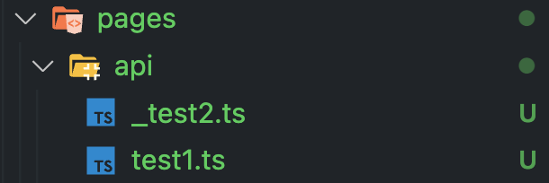
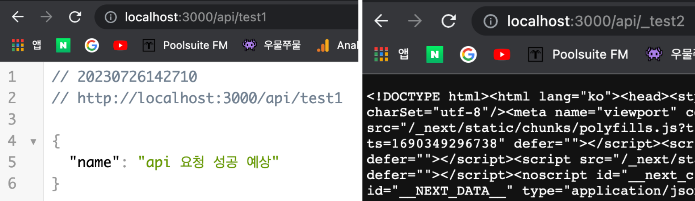
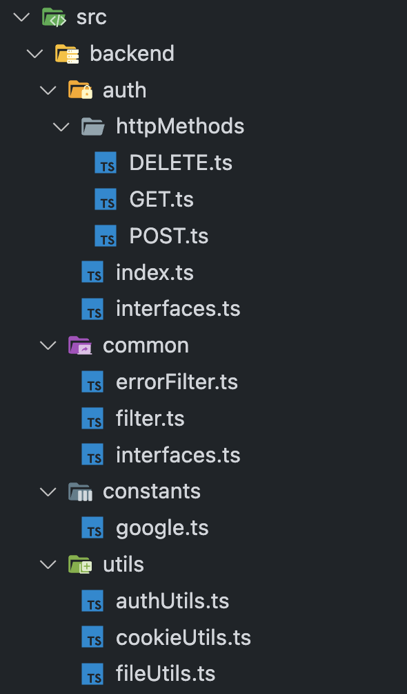
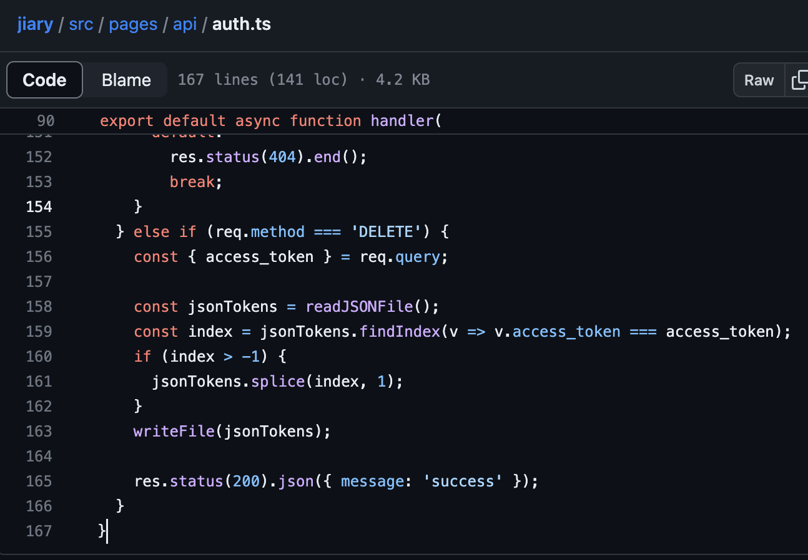

## 메타 프레임워크

Next.js는 react의 메타 프레임워크다. 메타 프레임워크는 프레임워크의 프레임워크라고도 말할 수 있는데, 프레임워크를 사용하기 위해 기본적으로 세팅해야 하는 환경이나, 필요한 기능을 추상화 한 코드 모듈을 제공해줘서 프레임워크를 더 쉽게 사용할 수 있도록 도와준다.

특히 react의 경우, [라이브러리의 정체성](https://pozafly.github.io/react/declarative-meaning-of-react-rendering-process/)을 어느정도 가지고 있기 때문에, 사용자에 따라 코드 스타일이나 환경 등이 제각각인 경우가 많았다. 메타 프레임워크는 Best Practice를 모아두어, 개발자가 시행착오를 거치지 않고 여러 통합 환경 및 기능을 사용할 수 있도록 한다. react의 메타 프레임워크로 **Next.js**, **Remix**, **Gatsby** 등의 프레임워크가 존재하며, Vue.js 같은 경우는 **Nuxt.js**라는 메타 프레임워크가 있다.

Next.js는 SSR 뿐 아니라 다양한 기능을 제공하고 있다. 번들링과 컴파일 같은 도구를 기본으로 제공한다. 또한, 리소스를 최적화 기능, 파일 시스템 기반 라우팅, 레이아웃, 배포 등 기능을 내장하고 있다.

아래는 Next.js 공식 홈페이지에서 자신을 설명하고 있는 문장이다.

> Used by some of the world's largest companies, Next.js enables you to create full-stack Web applications by extending the latest React features, and integrating powerful Rust-based JavaScript tooling for the fastest builds.

위 문장 중 **full-stack Web application**이라는 문구를 사용했다. full-stack은, 프론트엔드 뿐 아니라 백엔드 코드도 작성할 수 있다는 의미이다. 수 많은 웹 어플리케이션이 Node.js 환경에서 빌드되어 브라우저로 서빙되고 있다. Next.js는 Node.js로 react 기반 프론트엔드 코드를 번들링과 컴파일을 해주고 있으며, 또한 Node.js 런타임 환경에서 백엔드 코드를 실행시킬 수 있다. (조금 더 엄밀하게 말하면 백엔드를 실행시킨다기 보다는 Node.js 런타임 환경에서 API response를 내려주는 함수를 실행시킬 수 있다. 이는 Next.js의 API Routes로 쉽게 구현이 가능하다. 따라서 Next.js는 API Routes 기능과, SSR 기능을 사용할 수 있기 때문에 full-stack Web application이라는 네이밍이 붙었다고 예상할 수 있다.)

이번에 Next.js로 프로젝트를 진행하면서 백엔드 코드를 작성할 일이 생겼다. Google OAuth를 통해 사용자 인증을 하고 싶었다. Google OAuth를 통해 인증을 하려면 2가지 방법이 있는데 첫 번째는 **프론트엔드 단에서 연결**하는 방법과, **프론트엔드에서 백엔드 단을 통해 OAuth를 연결**하는 방법이다. 프론트엔드 단에서만 인증을 요청하면 Google 인증 서버에서 Refresh Token을 넘겨주지 않았다. 하지만, 검증된 백엔드를 통해 Google 인증 서버에 인증을 요청하게 되면 Refresh Token도 함께 받을 수 있다. Refresh Token을 받지 못한다면 Google의 인가된 서비스를 사용하기 위해, 사용자가 1시간에 한 번씩 로그인을 해주어야 하기 때문에 Next.js의 API Routes를 통해 인증을 받기로 했다.

하지만, API Routes를 사용하면 코드가 매우 지저분해진다. 그 이유는 아래의 API Routes에서 조금 더 알아볼 것이다. 아래 글은, API Routes를 사용하면서 어떻게 하면 코드를 보기 좋은 형태로 남길 수 있을지 고민한 흔적이 되겠다.

📌 _Next.js가 13 버전으로 올라가면서 서버 컴포넌트를 사용하기 위해 App Router가 도입 되었다. App Router가 도입 되면서 서버 코드를 작성할 수 있는 `API Router`는 `Route Handlers` 라는 이름으로 변경 되었으며, 아래의 내용 없이도 도메인 별로 서버 코드를 쉽게 작성할 수 있도록 변경되었다. 따라서 아래의 코드는 Next.js 12 버전 이하 또는 Page Route를 사용하는 Next.js 서버 코드라고 보면 된다._

<br/>

## API Routes

API Routes는 API를 호출할 수 있는 Endpoint를 생성해준다. Next.js의 파일 기반 routing과 마찬가지로 파일 기반으로 API Endpoint가 생성된다. `pages/api` 폴더 내부에 파일을 생성하고, 함수를 작성하면 함수를 기반으로 API를 내려줄 수 있다.

API Routes에는 주의점이 있다. API Routes의 **포지션**에 대해 생각해보자. Node.js로 백엔드를 구성한다면 Express를 사용할 수도 있고, NestJS도 사용할 수 있다. 반드시 서버 프레임워크 구성 환경이 반드시 Node.js가 아니라면 Spring과 같은 엔터프라이즈 급 프레임워크로 서버를 구성할 수도 있다. 하지만, API Routes는 서버 프레임워크로 구성 된 서버 코드보다 훨씬 가벼운 개념으로 탄생했다.

### Serverless Function

API Routes는 **Serverless Function**으로 구성되어 있다. Serverless Function의 컨셉은 요청(이벤트)이 들어올 때마다 지정된 함수를 실행시켜 원하는 API를 클라이언트에게 전달하는 것이다. 그렇기 때문에 web socket과 같은 연결은 가질 수 없다. 애초에 지속적인 커넥션을 잡고 있을 수 있게 설게된 모델이 아니기 때문이다.

Serverless Function은 인프라를 관리하지 않아도 되며, 요청이 들어올 때마다 함수를 실행시키기 때문에 적은 비용으로도 운영 가능하며, 동일한 값을 반환한다면 캐싱에도 유용하다. 여전히 물리적인 서버로 운영되고 있지만, 직접 서버의 인프라를 운영하지 않아도 되는 컨셉과 동시에, 함수 하나만 실행하기 때문에 Serverless Function이라는 이름이 붙었다. 이벤트 기반이기 때문에 Serverless에서 동작하는 코드는 상태를 가지고 있지 않다. 즉, 데이터를 유지하지 않는다. 이를 FaaS 라고도 한다.

[링크](https://github.com/vercel/next.js/discussions/17679)를 살펴보면, Next.js의 메인테이너가 API Routes에 대해 설명하고 있는데, API Routes는 Serverless Function 컨셉을 가지고 있지만 아주 큰 커넥션을 가지지 않는다면 DB 와의 통신은 가능하다. 왜냐하면 web socket과 같은 지속적인 커넥션을 맺는 것이 아니라, DB 인스턴스와 단기적인 통신을 통해 데이터를 저장하거나 가공하기 때문이다. 이는 vercel의 공식문서에서 배포된 Serverless Function의 제약조건으로 커넥션 타임이 지정되어 있는 이유이기도 하다.

또한, SSR을 위해 사용하는 `getStaticProps`, `getServerSideProps` 등의 함수 코드도 Serverless Function 형태로 배포된다. 당연히 client-side 번들에는 추가되지 않는다.

_📌 참고로 Edge API Routes와 API Routes는 다르다. Edge API Routes는 Edge Runtime을 사용하고, API Routes는 Node.js Runtime을 사용한다. 따라서, Edge Runtime에는 Node.js의 `fs`와 같은 Node API 사용이 불가능하다. Edge API Routes는 AWS 람다와 비슷한 환경이다. 또한, Serverless Function으로 사용하고 싶지 않다면 [custom server](https://nextjs.org/docs/pages/building-your-application/configuring/custom-server)로 변경해 사용할 수 있다._

### API Routes 코드 예시

따라서, Serverless Function은, 이벤트가 일어나면 함수 하나를 호출해주는 역할이다. 이런 컨셉에 맞게 API Routes도 마찬가지로 Endpoint당 함수 하나만 사용할 수 있도록 만들어졌다. [공식문서 api-routes](https://nextjs.org/docs/pages/building-your-application/routing/api-routes)의 예제를 보면, 아래 코드와 같이 `handler` 함수 하나만 달랑 존재한다.

```ts
export default function handler(req, res) {
  res.status(200).json({ name: 'John Doe' });
}
```

이렇게 함수가 하나만 존재할 경우 하나의 Endpoint에 **http method**들을 `if`문 혹은 `switch`문으로 분기를 태울 수 밖에 없는 상황이 발생한다. 위에서 말했듯, API Routes는 Serverless Function 컨셉에 맞게 handler 함수 하나만 작성하는 컨셉으로 만들어졌기 때문이다.

```ts
export default function handler(req, res) {
  if (req.method === 'POST') {
    // Process a POST request
  } else {
    // Handle any other HTTP method
  }
}
```

위와 같은 상황에서 로직이 길어지면, 코드를 보는 것이 매우 불편해진다. Utility 파일을 새로 생성해서 가독성을 좋게 만들기 위해 여러 시도를 해봤고, 내 기준 Best Practice를 찾았다.

<br/>

## API Routes 코드 위치

모듈화 되어 있지 않은 API관련 Utility 코드를 위치 시키는 방법은 2가지다.

1. `pages/api` 경로에 파일을 위치시키고, 파일 명에 `_` 또는 `.` 접두사를 넣어주는 방법.
2. `pages` 폴더 외부에 위치시키는 방법.

### 1. pages/api 경로에 파일을 위치시키고, 파일 명에 `_` 또는 `.` 접두사를 넣어주는 방법

Next.js에서 `pages/api` 경로에 파일을 위치시키는 경우 자동으로 API Routes 코드임을 인식하고, 파일 명으로 API Endpoint를 만들게 된다. 하지만, [링크](https://github.com/vercel/vercel/discussions/4983)에 따르면 Vercel에 배포할 경우, API Enpoint를 만들지 않도록 할 수 있다.

pages/api 폴더에 생성된 파일 명에 `_` 또는 `.` 접두사를 붙여 주면 API Endpoint를 만들지 않는다.



사진과 같이 `pages/api/` 경로에 `test1.ts` 파일과 `_test2.ts` 파일을 생성했다. 예상대로라면, `_test2`의 경로로 api를 요청했을 경우 오류가 발생해야 한다.

```ts
// test1.ts
import { NextApiRequest, NextApiResponse } from 'next';

export default function handler(req: NextApiRequest, res: NextApiResponse) {
  res.status(200).json({ name: 'api 요청 성공 예상' });
}
```

```ts
// _test2.ts
import { NextApiRequest, NextApiResponse } from 'next';

export default function handler(req: NextApiRequest, res: NextApiResponse) {
  res.status(200).json({ name: 'api 요청 실패 예상' });
}
```

그리고 브라우저에서 `http://localhost:3000/api/test1`, `http://localhost:3000/api/_test2`로 요청을 보내보았다. 결과는 아래 사진과 같다.



첫 번째 사진은 정상적으로 JSON이 반환된 것을 볼 수 있고, 두 번째 사진은 오류가 발생했다. 따라서, `_` 접두사를 붙인 파일은 Endpoint를 만들지 않은 것을 볼 수 있다.

하지만 접두사 `_`를 포함한 하나의 Utility 파일이면 상관 없지만, 코드를 폴더 구조로 나누고 싶을 수 있다. 공통으로 사용하는 Utility 코드가 생길 수 있기 때문이다. 즉 확장성이 떨어진다. 그리고 여러 개의 파일을 만들게 되면 폴더 명을 포함해, 파일 명에 매번 `_` 접두사를 붙여주어야 한다. 2번째 방법을 사용해보자.

### 2. pages 폴더 외부에 위치시키는 방법



사진과 같이 `backend` 폴더를 생성한다. 그리고 원하는 대로 코드를 파악하기 쉽도록 잘게 쪼개어 작성한다. Utils만 따로 작성해도 되지만, http method를 여러 개 사용하고 있었기 때문에 조금 더 세분화 했다.

Next.js 13 버전에서 App Router의 API Route 코드는 `Route Handlers` 라는 이름으로 변경되었다고 했는데, 그 구조는 아래와 같다.


`app/api` 폴더에 routes.ts 파일로 작성할 수 있다. 하지만, 기존 API Routes와 같이 하나의 함수만 존재하는 것은 아니다.

```ts
export async function GET(request: Request) {}
export async function POST(request: Request) {}
```

위와 같이 함수를 여러 개 정의할 수 있으며 `GET`, `POST` 와 같이 http methods 이름을 함수 명으로 작성하면 된다. Route Handlers의 http method 명을 함수 명으로 사용한 것을 착안해 `httpMethods` 폴더를 backend 폴더 하위에 두고 `GET.ts`, `POST.ts`, `DELETE.ts` 파일을 생성하고 필요한 로직을 작성했다. 예시인 `GET.ts` 파일의 코드다.

```ts
import { GOOGLE_INFO } from '@/backend/constants/google.ts';
import { oauth2Client } from '@/backend/utils/authUtils.ts';
import { NextApiRequest, NextApiResponse } from 'next';

const authorizationUrl: string = oauth2Client.generateAuthUrl({
  access_type: 'offline',
  scope: GOOGLE_INFO.SCOPE,
});

export function GET(
  req: NextApiRequest,
  res: NextApiResponse<GoogleUrl | AxiosError>
) {
  res.status(200).json({ location: authorizationUrl });
}
```

기존 API Routes 코드에서 분기분으로 GET 코드를 사용했던 것보다 훨씬 한 눈에 파악하기 쉬워졌다.

그리고, http methods 코드를 최종적으로 API Routes 코드에서 한 번에 불러오기 위해 `도메인/index.ts` 파일에서 GET.ts, POST.ts, DELETE.ts 파일들을 **re-export** 해준다.

```ts
// @/backend/auth/index.ts
export * from '@/backend/auth/httpMethods/GET.ts';
export * from '@/backend/auth/httpMethods/POST.ts';
export * from '@/backend/auth/httpMethods/DELETE.ts';
```

이제 마지막으로 실제 API Routes 코드인 `pages/api/auth.ts` 파일을 보자. 실제 API Routes를 실행시키고, API Endpoint를 생성해주던 파일이다.

```ts
// pages/api/auth.ts
import type { NextApiRequest, NextApiResponse } from 'next';
import * as AUTH from '@/backend/auth/index.ts';

type RouteMehtod = {
  [key: string]: typeof AUTH.GET | typeof AUTH.POST | typeof AUTH.DELETE;
};

export default async function handler(
  req: NextApiRequest,
  res: NextApiResponse
) {
  const method = req.method as string;
  const HttpFunctions: RouteMehtod = AUTH;
  HttpFunctions[method](req, res);
}
```

index.ts에서 re-export한 파일을 가져와, `req.method` (http 요청이 들어온 메서드 명)가 들어온 이름에 따라 함수를 실행해주도록 했다.

기존 auth.ts 파일의 코드는 아래 사진과 같이 167 라인이었고 그 길이 만큼 코드를 파악하기 어려웠었다. 이제는 auth.ts 파일은 단순히 통로가 되어, http 요청에 따라 실행 될 함수가 작성된 파일을 찾아 보면 되기 때문에 코드 파악이 훨씬 쉬워졌다.



하지만, 이렇게 리팩토링하면서 한 가지 아쉬운 부분이 존재했다. 공통 에러처리에 대한 부분이다. 백엔드의 코드에서 에러가 발생한다면 공통으로 잡아주고 싶었다. 또한, API Routes로 로깅을 해야하는 상황이 있을 수 있겠다는 생각이 들었다.

#### Filter 적용

Spring에는 filter와 interceptor가 존재한다. http 요청이 들어오면 먼저 filter를 거치고, interceptor를 거쳐 controller로 요청 데이터가 넘어오게 된다. 이 과정을 착안해서, filter 혹은 interceptor를 만들면 좋겠다고 생각했다. spring에서 filter는 실제 http 요청이 컨테이너로 넘어오기 전에 데이터를 가공하거나 XSS 공격을 막아주는 역할을 한다고 한다. 또한 filter는 체이닝이라는 특성을 가지고 있어, 체이닝 개념으로 사용하면 좋을 것 같다고 생각했다. interceptor와 비교했을 경우 filter라는 명칭이 더 어울릴 것 같아 filter를 만들게 되었다.

filter는 간단하게 HoF으로 handler를 감싸주기만 하면 된다.

```ts
// @/backend/common/filter.ts
import { Hanlder } from '@/backend/common/interfaces.ts';
import errorFilter from '@/backend/common/errorFilter.ts';

export default function filter(handler: Hanlder) {
  return errorFilter(handler);
}
```

위와 같이 HoF를 만들어주면 `return` 문에 `logFilter(errorFilter(handler))` 같은 방식으로 추후에 logFilter도 만들어 적용할 수 있다.

```ts
// pages/api/auth.ts

// import 문 생략
async function handler(req: NextApiRequest, res: NextApiResponse) {
  const method = req.method as string;
  const HttpFunctions: RouteMehtod = AUTH;
  HttpFunctions[method](req, res);
}

export default filter(handler);
```

handler 코드에 filter를 감싸주었다. 그러면, 무조건 http 요청이 오면 filter를 거쳐 실제 함수가 실행된다. `errorFilter.ts`를 보자.

```ts
// @/backend/common/errorFilter.ts
import { Hanlder } from '@/backend/common/interfaces.ts';
import { NextApiRequest, NextApiResponse } from 'next';
import { HTTP_METHODS } from 'next/dist/server/web/http';

export default function errorFilter(handler: Hanlder) {
  return async (req: NextApiRequest, res: NextApiResponse) => {
    if (!(HTTP_METHODS as ReadonlyArray<string>).includes(req.method!)) {
      return res
        .status(405)
        .json({ message: '허용되지 않는 http method 입니다.' });
    }
    // NOTE:  공통 에러 처리 추가 가능

    try {
      return handler(req, res);
    } catch (error) {
      return res
        .status(500)
        .json({ message: '알 수 없는 오류가 발생했습니다.' });
    }
  };
}
```

위 내용은 아래 커밋에서 볼 수 있다.

- [HTTP Method 별 파일 분리 커밋](https://github.com/pozafly/jiary/commit/d496003516c56a6f056b6991f62a5f2caafd8219)
- [공통 에러처리 및 필터 추가 커밋](https://github.com/pozafly/jiary/commit/d5b74a7331338e9a238f39ad09c650edd2cbe007)

<br/>

## 마치며

이번 글은 Next.js의 API Routes의 컨셉을 간단히 알아보고, API Routes로 백엔드 코드를 작성해보면서 코드를 어떻게 분리시킬지 개선한 부분을 작성했다. Next.js의 API Routes는 사실 그렇게까지 많이 사용되고 있지는 않다고 한다. heath 체크 정도로만 사용하지, 백엔드의 역할을 백엔드가 한다고 한다. 그래서 그런지 API Routes 코드를 제대로 모듈화 한 자료를 많이 찾지 못했고, 컨셉을 들여다보며 원하는 방향대로 리팩토링 해봤다.

Next.js를 사용한 곳의 프로젝트 사이즈가 크고, MSA 구조로 되어 있어서 BFF가 필요하다고 하면, API Routes를 데이터 가공 레이어로 활용해보면 좋겠다고 생각했다.

리팩토링 전 코드가 매우 지저분해서 마음에 걸렸었는데, 코드 구조가 보기 좋게 되었다. 이렇게 코드가 딱 깔끔하게 떨어졌을 때의 쾌감은 이루 말할 수 없다.

> 참고
>
> - https://nextjs.org/docs/app/building-your-application/routing/router-handlers
> - https://www.daleseo.com/meta-frameworks/
> - https://json.media/blog/proper_understading_of_nextjs
> - https://dev.to/wzulfikar/end-to-end-typing-for-nextjs-api-50kn
> - https://github.com/vercel/next.js/discussions/17832
> - https://github.com/microsoft/TypeScript/pull/52217
> - https://dev.to/sneakysensei/nextjs-api-routes-global-error-handling-and-clean-code-practices-3g9p
> - https://github.com/vercel/vercel/discussions/4983
