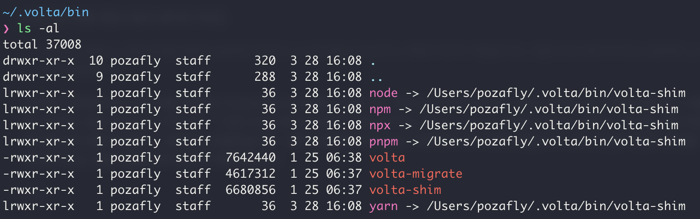
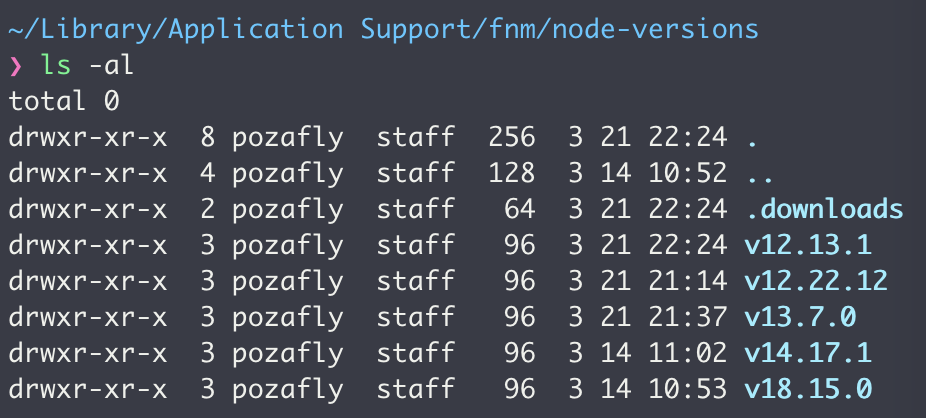
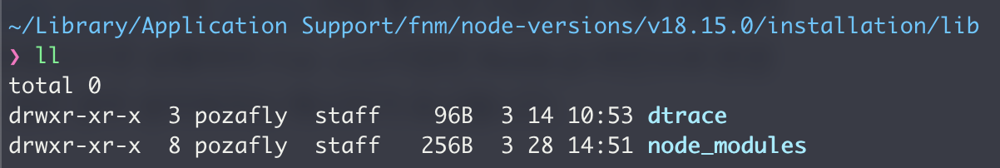
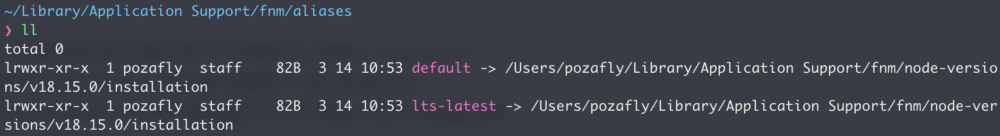
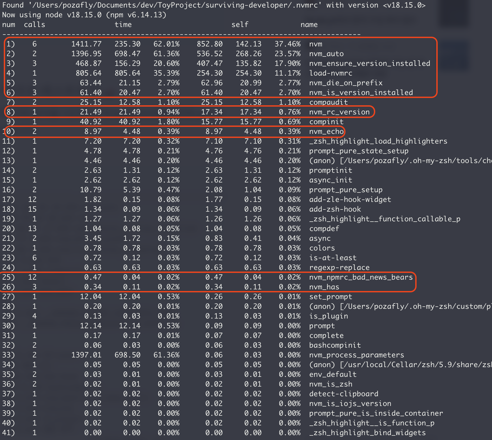
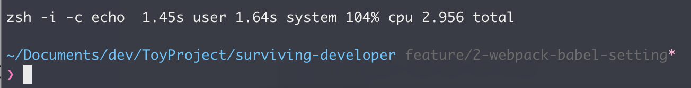
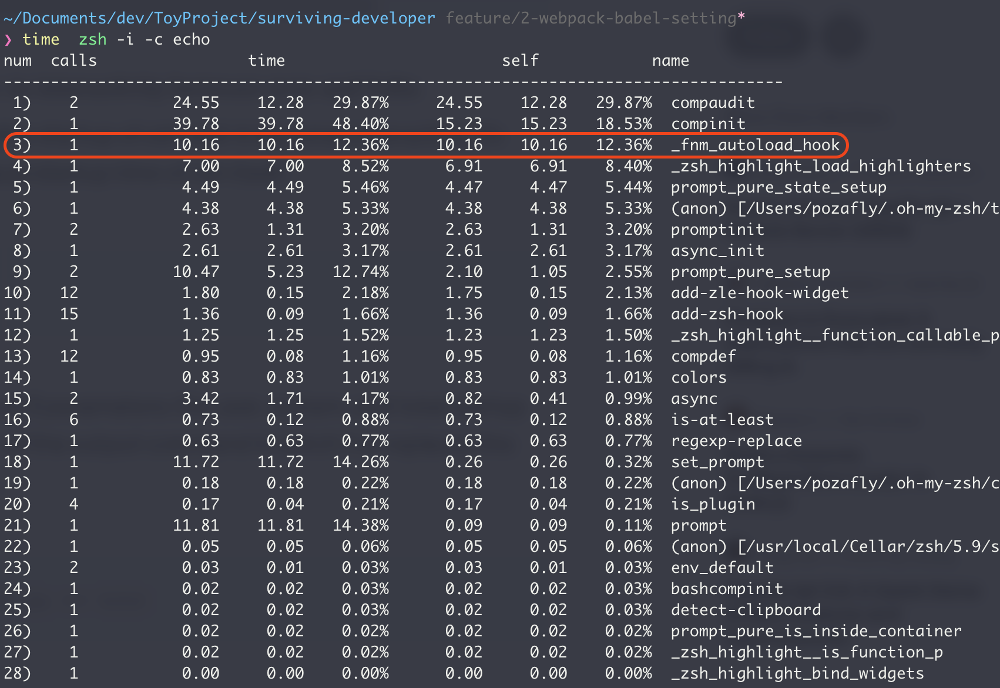
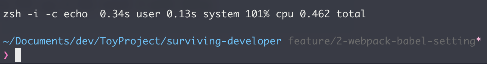

모두 Node.js의 버전을 관리하는 툴이다. 가장 먼저 nvm을 시작으로 Node.js 버전을 관리하다 fnm을 알게되었고, 추가로 Volta를 알게되어 세가지 툴의 속도 및 방식에 대해서 간략하게 알아본 정보를 정리해본다.

## nvm

먼저 nvm은 사용자별로 설치되고 shell 별로 호출되도록 설계된 node.js용 버전 관리자라고 한다. 즉 프로젝트 별로 생성 되었을 당시 기준으로 Node.js 버전을 관리하기 위해 탄생했다. Node.js를 업그레이드 하고 관리하는 가장 일반적인 방법이다.

설치할 수 있는 방법은 Shell Script를 통해 설치 후 `.bashrc` 혹은 `.zshrc` 에 nvm 관련 설정을 해주어야 한다. (앞으로 터미널 설정 파일은 .zshrc 파일로 이야기할 것이다) 또한 터미널을 통해 프로젝트의 디렉토리로 들어갔을 경우 자동으로 `.nvmrc` 파일을 찾고, 파일에 명시된 Node.js 버전으로 자동으로 변경시켜준다. nvm은 macOS 뿐 아니라 Windows, Linux도 지원하고 있다. 다른 OS에서 동일한 Node.js 버전을 맞추고 비교적 동일한 환경에서 Node.js를 실행시킬 수 있는 것은 마치 가상환경을 떠올리게 만든다.

간단하게는 아래의 명령어를 통해 Node.js 버전을 변경 및 관리할 수 있다. 자세한 사용 방법은 [이전 게시물](https://pozafly.github.io/node/setting-npm-differently-for-each-project/)을 통해 볼 수 있다.

```shell
$ nvm install 18.15.0 # Node.js 18.15.0 버전 설치
$ nvm use 18.15.0 # 현재 터미널에서 18.15.0 버전으로 변경
$ nvm alias default 18.15.0 # default 별칭 부여
$ nvm ls-remote # 설치할 수 있는 Node.js 버전 검색
$ nvm ls # 로컬 컴퓨터에 설치되어 있는 Node.js 버전 검색
```

처음 nvm을 사용했을 때 예전에 만들었던 프로젝트의 Node.js 버전을 자동으로 맞춰주고 터미널 탭 별로 적용되는 Node.js 버전이 다르니 굉장히 새롭고 신선했다. 일일이 Node.js 버전을 기억해야하고 다시 Node.js 버전을 깔지 않아도 되었다. 자동화를 이렇게 할 수 있구나.

### nvm 문제점

하지만 nvm은 생각보다 오래된 프로젝트다. 2023년 기준으로 11년 전에 만들어졌다. 물론 commit history를 봤을 때는 최근까지 잘 유지보수 되고있는 것으로 보인다. 문제는, 프로젝트 폴더로 이동하거나 프로젝트 경로로 설정된 터미널을 열었을 때다.

터미널은 `.zshrc` 파일의 nvm 설정 shell을 실행한다. 그리고 잠시동안 터미널은 멈추고, 프로젝트에 설정된 `.nvmrc` 파일을 찾고 명시된 버전으로 Node.js 버전을 맞춘다. 그리고 후에 터미널이 동작한다.

이 과정이 터미널 경로를 옮겨다닐 때마다 일어나기 때문에 nvm 동작이 느리다면 그 때마다 기다려야 한다. 이는 VSCode의 터미널을 열었을 때도 마찬가지다.

<br/>

## Volta와 fnm

nvm이 느리기 때문에 대안으로 나온 것이 오늘 알아볼 Volta와 fnm이다.

### Volta

[Volta](https://github.com/volta-cli/volta)를 clone 받아보면 언제 published 되었는지는 몰라도 2017에 첫 커밋이 있는 것을 알 수 있다. Volta의 github의 설명에 프로젝트의 철학이 잘 나와있다.

- Rust를 기반으로 만들어져 Node.js 버전 변경이 빠르다.
- 여러 사람이 작업할 때 동일한 Node.js 버전을 맞춘다.
- Node.js 버전을 직접 관리하지 않고 volta install 명령어 하나로 모든 것을 처리한다.

Volta가 빠른 것은 둘째치고 눈여겨봐야 할 부분은 `volta install` 명령어 하나로 모든 것을 처리한다는 철학이다. nvm은 앞에서 살펴본 것과 같이 많은 명령어를 가지고 있다. install, use, alias 등. volta는 이런 명령어 또한 신경쓰지 않도록 디자인 방향을 잡았다. 근데 사실은 2개로 봐야한다. 알아보자. [공식 홈페이지](https://docs.volta.sh/guide/understanding#managing-your-toolchain)

- install (설치)

```shell
$ volta install node@18.15.0 # 정확한 버전 설치
$ volta install node@18 # 알아서 적절한 14버전대 버전 설치
$ volta install node # LTS latest 버전 설치
```

위와 같은 명령어로 Node.js 버전을 설치할 수 있다.

- pin (버전 고정)

```shell
$ volta pin node@18.15.0
```

Volta는 pin 명령어가 있다. 현재 디렉토리의 Node.js 버전을 고정시킨다는 뜻이다. 위 명령어를 실행하면 디렉토리의 `package.json` 파일에 volta 관련 옵션이 생성된다.

```json
"volta": {
  "node": "18.15.0",
}
```

이 매커니즘을 통해 Volta는 Node.js 버전을 관리한다. 즉, Node.js 관련 명령어가 일어나면 package.json에 걸려있는 버전을 확인하고 버전에 맞는 Node.js를 실행한다. 이는 nvm의 `.nvmrc` 파일과 비슷한 역할을 한다. nvm은 `.nvmrc` 파일을 찾아서 버전을 shell 세션 별로 '변경' 시킨다. 하지만 Volta는 터미널이 특정 경로에 진입했을 때 Node.js 관련 명령어를 '실행' 시켰을 때 pin 되어 있는 node 버전을 실행시킨다.

또, 하나 특이한 점은, Volta는 shim 이란 것을 이용하는데, 이는 심볼링 링크이다. Windows의 '바로가기 아이콘' 을 떠올리면 쉽다. Volta의 [Issue](https://github.com/volta-cli/volta/issues/1135)를 보자. Volta에서 특정 경로를 지정해주고, 경로에 걸려있는 특정 Node.js 버전을 실행시킨다. 따라서, Volta는 자신이 Node.js를 관리하기보다는 특정 경로에 설치된 Node.js 버전만 가져다 쓴다.



volta가 설치된 곳을 따라서 들어가보면 이런 구조로 되어있는 것을 볼 수 있다. `->` 를 통해 특졍 경로를 가리키고 있는 것을 볼 수 있다. 따라서 전역으로 설치된 Node.js를 Volta는 사용만 하는 구조이다. 심볼릭 링크를 통해서.

그래서 터미널이 특정 경로로 들어갔을 때 Node.js 버전을 변경하지는 않는다. 단, `node -v` 을 통해 Node.js를 실행시켰기 때문에 노드 버전 자체는 그때 변경될 수 있다. 터미널이 nvm과 같이 정지하지 않는다.

정리하자면, volta는 아래와 같이 동작한다.

1. Node.js 명령이 실행된다.
2. package.json 파일의 버전을 확인한다.
3. shim 링크를 따라 전역에 설치된 Node.js의 경로를 찾는다.
4. 경로에 맞는 Node.js 버전의 명령어를 실행한다.

쉘 스크립트를 사용하지 않고 링크만 걸어주어 직접 Node.js를 관리하지 않고 전역에 설치된 패키지를 끌어 쓰는 방식을 택했다.

이렇게 보았을 때는 사실 큰 문제는 없어보이지만, [이곳](https://dev.to/jcayzac/goodbye-volta-494e)에서 Volta의 설계 방향에 대한 비판을 볼 수 있다. 전역적으로 설치된 패키지가 버전이 다른 환경에서 build 되면 패키지가 엉망이 된다는 내용이다. 이는 가급적이면 전역에 패키지를 설치하기 보다는 프로젝트별로 패키지를 설치해 관리해주면 되는 문제라고 생각한다. 또, Volta는 `.nvmrc` 파일을 지원하기 위한 시도가 있었던 것으로 보인다([링크](https://github.com/volta-cli/volta/issues/282#issuecomment-708584230)).

Volta는 npm뿐 아니라 yarn, pnpm 패키지도 다룰 수 있다는 장점이 있다.

### fnm

[fnm](https://github.com/Schniz/fnm)의 첫 커밋은 2019년이다. Volta와 마찬가지로 Rust를 사용한다고 하며 nvm에 비해 40배가 빠르다고 주장한다. 실제로 fnm을 설치해보니 꽤나 만족스러운 버전 변경이 일어났다. fnm은 nvm과 매우 비슷하다. 아래의 명령어를 보면, nvm과 거의 동일하다.

```shell
$ fnm install 18.15.0 # Node.js 18.15.0 버전 설치
$ fnm use 18.15.0 # 현재 터미널에서 18.15.0 버전으로 변경
$ fnm default <version> # default 별칭 부여
$ fnm ls-remote # 설치할 수 있는 Node.js 버전 검색
$ fnm ls # 로컬 컴퓨터에 설치되어 있는 Node.js 버전 검색
```

그리고 파일을 읽고 버전을 찾아 터미널 별로 Node.js 버전을 고정시키는 방법 또한 동일하다.

fnm은 nvm과 동일하게 파일을 통해서 쉘 세션 별로 버전을 변경시켜준다. 즉 터미널의 쉘 스크립트를 통해 버전을 변경한다. `.nvmrc`, `.node-version` 파일 중 하나라도 존재하면 그곳에 명시된 버전으로 변경시킨다. nvm과 동일한 방식이다. `.nvmrc` 파일까지 지원한다는 것은 nvm을 사용하는 사용자가 fnm으로 넘어와도 사이드 이펙트가 없게하는 배려 혹은 영리한 방법 같아 보인다.

그러면 fnm은 패키지를 어떻게 관리하고 있을까?



위 경로에 Node.js 버전 별로 fnm이 관리하는 Node.js 버전 디렉토리들이 있다. 한번 따라가보자.



하나의 버전을 지정해서 따라가보면 lib 안에 익숙한 `node_modules` 폴더가 보인다. 이곳에서 fnm은 패키지 관리를 하고 있다. 한가지 더 살펴볼 것은 fnm의 alias다. nvm에서 alias를 통해 버전에 명칭을 주어 명칭으로 버전 관리를 했다. 또 `default` 라는 alias를 주면 `.nvmrc` 파일이 없다면 default로 지정된 버전을 사용하듯, fnm도 shim을 통해 default를 관리한다.



volta와는 확실히 차이점이 있다. 전역 설치 패키지를 build 해도 쉘 세션 별 사용하는 버전이 다르기 때문에 volta의 문제점이 발생하지 않는다. 단순히 default alias만 shim으로 fnm이 관리하고 있는 버전에 연결시킨 구조이다.

단, nvm과 동일하게 터미널이 로드되면 Node.js 버전을 맞춰주어야 하기 때문에 잠깐 터미널을 사용할 수 없다. 하지만 Rust로 작성된 fnm은 빠르기 때문에 nvm 보다 속도 면에서 월등하다고 할 수 있다.

<br/>

## 속도 비교

nvm이 속도가 느리다고 하는데, 얼마나 느린지 실제로 측정해보자. 환경은 아래와 같다.

- MacBook Pro 2019 - 16-inch
- rem 32GB 메모리
- macOS Ventura 13.2.1
- iterm2
- zsh & oh-my-zsh

먼저 측정 방법이다.

zsh는 측정용 프로파일링 모듈을 가지고 있다. [zprof](https://zsh.sourceforge.io/Doc/Release/Zsh-Modules.html#The-zsh_002fzprof-Module)라는 모듈인데, `.zshrc` 파일에 설정만 해두면 사용할 수 있다.

1. `~/.zshrc` 파일 가장 상단에 `zmodload zsh/zprof` 를 적는다. (import라고 생각하자)
2. 그리고 가장 하단에 `zprof` 라고 적어두자. (이는 세션이 시작될 때 zprof 명령어를 실행한다는 의미와 같다.)
3. 세션 로드가 완료되면 `time zsh -i -c echo` 명령어를 사용해 측정 결과를 얻자.

먼저 nvm이다.



충격적이게도 터미널 전체 로드 중 약 97%가 nvm을 동작시키는데 사용되었다.



하단에는 최종적으로 2.956s가 걸렸다고 표현되고 있다.

이제 fnm을 보자.



터미널 전체 로드 중 약 12%가 사용되었다.



총 걸린 시간은 0.462s다. total 기준으로는 약 6배 차이다. 확실히 fnm이 nvm에 비해 빠르다. 이로서 fnm이 빠르다는 것이 증명되었다.

volta 같은 경우 쉘 스크립트를 사용하지 않기 때문에 터미널에서 사용 속도는 확인이 불가능하다. 즉, 터미널 로드 속도는 fnm, nvm을 사용하지 않은, 기본 환경과 동일하다고 여겨도 좋다.

---

위의 내용을 표로 정리해보자.

|                  | nvm       | fnm                   | Volta                |
| ---------------- | --------- | --------------------- | -------------------- |
| 크로스 플랫폼    | O         | O                     | O                    |
| env file(.nvmrc) | O         | O                     | X                    |
| 언어             | Shell     | Rust                  | Rust                 |
| 버전 자동 설정   | .nvmrc    | .nvmrc, .node-version | package.json > volta |
| 속도             | 가장 느림 | 빠름                  | 가장 빠름            |
| 패키지 매니저    | npm       | npm                   | npm, yarn, pnpm      |
| 터미널 멈춤 여부 | O         | O                     | X                    |

<br/>

사실 노드 패키지 매니저 관리 툴은 위 3가지 뿐 아니라 더 많다. fnm과 Volta가 Rust로 만들어져 있고, 빠른 장점을 갖고 있기 때문에 굳이 찾아서 비교해본 것인데 사실 어떤걸 쓰던 상관없다.

비교를 해보면서 알게 된 것은 같은 목적을 가지고 만들어진 툴이지만, 서로 구현 방향이 달랐다. 또한 가지고 있던 철학도 달랐다. node에 설치되는 라이브러리 하나를 고르더라도 서로 비교하고, 어떤 라이브러리가 퍼포먼스 혹은 사용성이 좋은지 판단하라는 가르침이 생각난다. ([npm transds](https://npmtrends.com/)에서 비교해봤지만, fnm과 volta는 다른 패키지가 나와서 비교가 불가능했다)

[이곳](https://github.com/Schniz/fnm/issues/270)은 fnm의 이슈에 volta 관리자가 와서 서로의 툴을 비교하는 장을 열었다. 그 중 [ljharb](https://github.com/ljharb)의 댓글이 인상깊다. 보통은 툴 제작자가 장단점과 함정에 대해 배우기 위해 기존 툴 관리자와 먼저 대화를 하는 경우는 드물다. 다른 사람이 불필요한 노력과 버그를 만나지 않게 하기 위해 서로 다른 툴 제작자가 대화를 하는 것은 좋아보인다는 말이다.

결국 나는 fnm을 쓸꺼다. 빠르고 안정적이어서다.

> 참고
>
> https://duncanlew.medium.com/a-better-node-version-manager-volta-vs-nvm-5917c1edd0a1
>
> https://callmemaru.com/posts/speeding-up-my-shell/
>
> https://www.honeybadger.io/blog/node-environment-managers/
