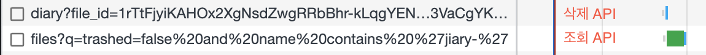
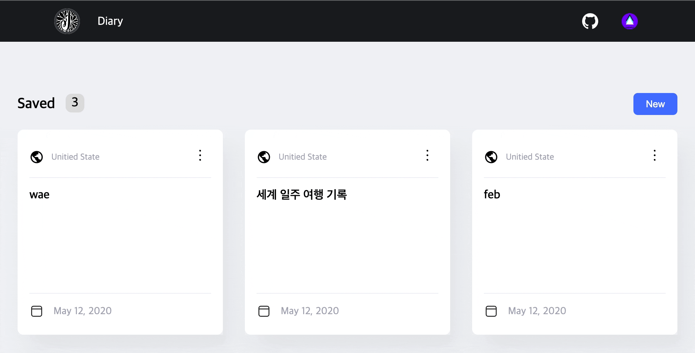

React Query는 데이터 fetching 라이브러리로 소개되지만, **서버 상태 가져오기, 캐싱, 동기화 및 업데이트**를 쉽게할 수 있는 라이브러리다. 즉, React Query를 사용하더라도 실제 API 요청을 보내는 것은 Axios 라이브러리 혹은 fetch 함수를 사용해야한다.

대부분의 상태 관리 라이브러리는 클라이언트 상태 작업에는 적합하지만, 비동기 또는 서버 상태 작업에는 적합하지 않다. 서버 상태가 완전히 다르기 때문이다.

React Query의 사용 목적은, 테마나 UI 등의 어플리케이션에서만 필요한 데이터를 Client State로 규정짓고, 서버에서 받아오는 데이터를 Server State로 규정지어 클라이언트 상태와, 서버 상태를 나누어서 생각할 수 있도록 도와주기 때문에 사용한다. React Query는 서버 데이터를 잘 다룰 수 있도록, 받아온 서버 데이터를 캐싱해주기도 하며 브라우저 창을 다시 포커스를 맞추었을 때 또는 요청 시 오류가 발생했을 때 이후에, API를 재조회 할 수 있는 좋은 옵션을 가지고 있다.

<br />

## mutation

React Query의 서버 데이터 관련 중요 컨셉 중 하나는, 서버 데이터를 조회하고 서버 데이터를 가공하는 개념을 나누어 사용하도록 한다는 것이다. `query` 는 서버 데이터를 **조회**(GET)할 수 있다. `useQuery` 훅을 사용한다. `mutation` 은 query와 다르게 **생성**(POST), **수정**(PUT or PATCH), **삭제**(DELETE)와 같은 데이터를 변경하는 작업을 할 수 있도록 하는 함수다. `useMutation` 훅을 사용한다.

### 왜 query와 mutation을 따로 나누어놨을까?

우선 용어부터 알아보자. mutation이란, '돌연변이' 혹은 '변형'이라는 뜻을 가지고 있다. '가변'이라고 불리기도 한다. 프로그래밍 세계에서 mutation은 사이드 이펙트를 일으키는 방법이다. ([링크](https://en.wikibooks.org/wiki/Scheme_Programming/Mutability)) 데이터를 변경시키는 것은 사이드 이펙트를 일으키며 데이터의 추적을 어렵게 만든다. 하지만 사이드 이펙트가 일어난다고 해서 데이터를 변경시켜서는 안된다는 말은 아니다. 클라이언트 및 서버에서 다루는 데이터는 변경이 일어나야하고, 변경이 일어나야 의미있는 데이터가 완성된다.

반면, 데이터를 조회하는 것은 사이드 이펙트를 발생시키지 않는다. React Query는 이 둘의 개념을 나누고, 사용하는 방법도 다르게 구성해두었다. query는 선언적으로 사용할 수 있으며, mutation은 명령형으로 밖에 사용하지 않도록 말이다.

```tsx
export function App() {
  // 마운트 즉시 서버와 통신 후 데이터를 받아옴. 선언적.
  const { data } = useQuery({ queryKey: ['todos'], queryFn: getTodos });

  // 뮤테이션 객체를 먼저 생성 후 이벤트가 일어났을 때 사용함. 명령적.
  const mutation = useMutation({ mutationFn: updateTodos });

  return (
    <>
      {data.something}
      {/* 이벤트 발생 시 사용 */}
      <button onClick={() => mutation.mutate({ something: 'some' })}></button>
    </>
  );
}
```

query는 컴포넌트가 마운트 될 때 즉시 실행되어 서버에서 데이터를 가져온다. 훅으로 선언만 해두면 알아서 데이터를 조회한다.

하지만 mutation은 서버 데이터를 변형시키는 것이기 때문에, 일반적으로 컴포넌트가 마운트 될 때 실행되면 안된다. 컴포넌트가 마운트 되자마자 물건이 결제가 되면 이상하듯이 말이다. 대신, useMutation 훅을 사용해 mutation 객체를 가져오고, 명령적으로 필요할 때 호출하도록 하고 있다.

따라서 query는 사이드 이펙트를 발생시키지 않으며, 선언적으로 사용할 수 있고, mutation은 사이드 이펙트를 발생시킬 수 있으며, 명령형으로 사용할 수 있다. React Query는 이런 차이점 때문에 둘을 나누어 사용하도록 했다.

<br />

## mutation 이후 동작

mutation이 실행된 이후 서버의 데이터는 변경되었지만(예. 서버의 DB 데이터 변경), React Query의 mutation 실행 이후 클라이언트의 서버 데이터는 변경 되지 않은 상태이다. 화면을 업데이트 하는 여러 가지 방법을 알아보면서, 어떤 상황에서 어떤 방법을 사용해야 하는지 알아보자. 클라이언트의 서버 데이터라함은, query로 조회해온 서버 데이터가 클라이언트의 상태로 넘어온 것을 말한다. 클라이언트로 넘어온 서버 데이터 기준으로 화면을 그려줄 수 있다.

> 📌 클라이언트의 서버 데이터는 처음 말했던 클라이언트 데이터(ui 혹은 theme와 같은)와는 다르다. 이제 아래에서 말하는 클라이언트 데이터란, 서버에서 클라이언트로 받아온 서버 데이터를 말한다.

아래의 예시들은 delete 기준으로 mutation 이후 어떻게 화면에 데이터가 업데이트 되는지를 설명한다. React Query가 제공하는 useMutation 훅을 통해 mutation을 할 수 있다.

```ts
export const useDeleteDoc = () => {
  return useMutation<DriveFile | string, AxiosError, string>({
    mutationKey: [DIARY_KEY],
    mutationFn: (fileId: string) => deleteDoc(fileId),
  });
};
```

- `mutationKey` : mutation을 식별할 수 있고, 후에 `useIsMutating` 훅을 통해 mutation 중인 작업을 로딩 스피너로 사용자에게 데이터를 처리하고 있다는 표시를 줄 수있다.
- `mutationFn` : axios나 fetch 함수를 사용해 서버에 API 요청을 보내는 함수가 실행된다.

※ useMutation 훅의 type은 [react-query에 typescript 적용하기](https://gusrb3164.github.io/web/2022/01/23/react-query-typescript/)를 참고했다.

하지만, 위 작업은 단지 서버에 API를 보내고 서버에 존재하는 데이터를 변경할 뿐, 클라이언트의 데이터를 변경시켜주지 않는다. 물론 클라이언트의 데이터가 변하지 않았기 때문에 화면이 변경되지도 않는다. 변경된 데이터를 다시 화면에 표시하려면 추가적인 작업이 필요하다.

1. **서버에서** 조회한 데이터로 클라이언트 데이터 업데이트
2. **클라이언트에서** 요청 데이터로 적용

<br />

## 1. 서버에서 조회한 데이터로 클라이언트 데이터 업데이트

클라이언트가 서버에 데이터를 요청한 후 변경된 데이터를 받아와서 클라이언트 데이터를 업데이트 하는 방법이다.

- response에 변경된 데이터를 받는 방법 (setQueryData)
- 요청 성공 후 재조회를 통해 데이터를 받는 방법 (invalidateQueries)

### 1.1 response에 변경된 데이터 받기 (setQueryData)

`setQueryData` 는 useQuery로 조회된 데이터가 캐시에 들어있을 경우, 캐시의 조회 데이터를 업데이트 해줄 수 있는 메서드다. redux로 생각해봤을 때, store에 있는 상태 값을 변경시켜줄 수 있는 함수다. mutation에서는 아래와 같이 사용할 수 있다.

```ts{5-7}
export const useDeleteDoc = () => {
  return useMutation<DriveFile | string, AxiosError, string>({
    mutationKey: [DIARY_KEY],
    mutationFn: (fileId: string) => deleteDoc(fileId),
    onSuccess(data) {
      queryClient.setQueryData<DriveFile>([DIARY_KEY, 'docList'], data);
    },
  });
};
```

`onSuccess` 메서드의 경우 mutation이 성공적으로 완료되면 호출되는 메서드다. 총 3개의 인자를 받을 수 있는데, 그 중 첫 번째는 서버에서 반환된 data를 인자로 받아올 수 있다.

이 방법을 사용하기 위해서는, 서버가 클라이언트 요청에 따라 자신의 데이터를 업데이트 한 후, **업데이트 된 데이터를 반드시 클라이언트에게 수정된 데이터를 내려**주어야만 한다. 수정된 데이터가 클라이언트의 캐시 데이터에 새롭게 들어가게 되고, 이는 반드시 서버 측이 데이터 처리 작업 후 처리된 데이터를 response에 담아 클라이언트에 전송해야 한다.

데이터 흐름은 아래와 같다.

- `클라이언트 -> 서버` : 데이터 변경 요청
- `서버` : DB 인스턴스에 데이터 변경
- `서버 -> 클라이언트` : 변경된 데이터 반환

### 1.2 재조회 (invalidateQueries)

하지만, 서버에서 변경된 데이터를 내려주지 않을 수도 있다. 그러면, 클라이언트에서는 서버에 변경된 데이터를 다시 조회해서 문제를 해결할 수 있다. 즉, 클라이언트는 순서에 맞게 서버에 데이터 변경 요청을 하고, 재조회 요청을 해서 원하는 결과를 얻는 것이다.

서버에서 재조회 하는 방법은, `queryClient.invalidateQueries` 메서드를 통해 할 수 있다.

```ts{8}
export const useDeleteDoc = () => {
  const queryClient = useQueryClient(); // queryClient를 가져와야 함

  return useMutation<DriveFile | string, AxiosError, string>({
    mutationKey: [DIARY_KEY],
    mutationFn: (fileId: string) => deleteDoc(fileId),
    onSuccess(data) {
      queryClient.invalidateQueries({ queryKey: [DIARY_KEY] });
    },
  });
};
```

`onSuccess` 메서드를 생성하고, 불러온 queryClient를 통해 `invlidateQueries` 메서드를 쿼리키와 함께 호출하면, 기존에 useQuery로 조회해온 데이터가 다시 조회가 되면서 기존 데이터가 변경된다.

데이터 흐름은 아래와 같다.

- `클라이언트 -> 서버` : 데이터 변경 요청
- `서버 -> DB` : DB에 데이터 변경
- `서버 -> 클라이언트` : **성공 message** 반환
- `클라이언트 -> 서버` : 변경된 데이터 조회 요청
- `서버 -> DB` : DB에 데이터 조회
- `서버 -> 클라이언트` : **변경된 데이터** 반환



네트워크 탭을 보면, 삭제 요청이 완료된 즉시 조회 요청이 간 것을 볼 수 있다. 이 방식을 사용할 경우, 서버 데이터가 새롭게 조회되어 클라이언트의 데이터가 변경되고 화면이 새롭게 그려진다.

하지만, 만약 서버에 여러 시스템이 연동되어 있을 경우 혹은 서버에서 데이터 변경에 딜레이가 걸린 경우에, 변경 내용이 반영되지 않은 채 변경 전 데이터가 조회될 가능성이 있다. 서버가 비동기로 동작하거나 적용 되는데 시간이 걸리는 경우이다.

가령, Google API에서 Drive File API에 삭제 요청을 했고, Drive File과 연동되어 있는 Doc File을 재조회 한다면 1초 미만의 텀을 주어야 정상적으로 파일이 삭제된 list를 받아올 수 있다. 이런 경우, 딜레이를 주어 재조회 해줄 수 있다.

```ts{2,4}
onSuccess() {
  setTimeout(() => {
    queryClient.invalidateQueries({ queryKey: [DIARY_KEY] });
  }, 800);
}
```

하지만, 이 작업을 할 경우 mutation시 동작했던, loading spinner가 한 번 나타나고, 다시 query할 때 나타나는 loading spinner가 이어서 나타난다.



loading spinner를 띄우는 조건을 다르게 주면 해결되겠지만, 따로 처리를 해주어야 하는 번거로움이 생긴다. 또 다른 문제도 있다. `800ms` 이 정확한 수치가 아니다. 서버의 상태에 따라 시간을 더 많이 줘야할 수도 있다. 서버의 데이터가 정합성을 맞추는데 시간이 걸리는 상태라면, 다시 변경되지 않은 데이터가 조회될 확률이 높기 때문이다.

---

2가지 중 서버 데이터로 클라이언트 데이터를 변경하는 방법을 알아봤다. Best Case는 서버에서 변경된 데이터를 정확하게 response에 담아 내려준다면 클라이언트에서 받아 화면을 새롭게 그려주는 `setQueryData` 메서드를 사용한 방법이다. 하지만 서버에서 데이터를 내려주지 못하는 상황이라면, 클라이언트에서 요청을 보낸 데이터를 기반으로 화면을 그려주는 방법도 존재한다.

<br />

## 2. 요청 데이터로 클라이언트 데이터 변경

요청 할 때 보내는 클라이언트의 데이터 기반으로 스스로의 데이터를 변경할 수 있다.

1. 직접 가공 (getQueryData & setQueryData 또는 setQueryData & Updater)
2. 낙관적 업데이트 (onMutate)

### 2.1 직접 가공

#### getQueryData & setQueryData

react-query의 `getQueryData`는 조회한 데이터 캐시의 데이터를 가져오는 작업이다. onSucess의 두 번째 인자로, 요청 시 보냈던 값을 받아올 수 있다.

```ts{2,5}
onSuccess(data, variables) { // variables는 mutate함수가 받는 변수다.
  const oldData = queryClient.getQueryData<DriveFile>([DIARY_KEY, 'docList']);
  queryClient.setQueryData<DriveFile>([DIARY_KEY, 'docList'], {
    ...oldData,
    files: oldData?.files.filter(file => file.id !== variables) as File[],
  });
}
```

`getQueryData`를 통해 변경되기 전 데이터를 캐시에서 조회한다. 그리고, `filter`와 같은 메서드로 캐시 데이터를 가공한다. 이후에, 가공한 데이터를 불변성을 지켜서 `setQueryData` 메서드의 인자로 넣어준다. 그러면, 클라이언트의 데이터가 변경되며, query를 선언한 컴포넌트가 리렌더링 되면서 화면이 새롭게 그려진다.

📌 주의점은 반드시 불변성을 지켜서 넣어주어야 한다. 불변성을 지켜주지 않으면 화면이 변경되지 않는다.

데이터 흐름은 아래와 같다.

- `클라이언트 -> 서버` : 데이터 변경 요청
- `서버 -> 클라이언트` : 성공 message 반환
- 클라이언트 데이터 스스로 가공 후 변경

#### setQueryData & Updater

getQueryData를 사용하지 않고 `setQueryData` 만 사용하는 방법이다. 이 방법은 캐시에서 다시 조회하는 로직이 없어도 useMutation 자체에서 제공하는 방법이다. 업데이터 함수를 선언하면 알아서 클라이언트 데이터를 변경시켜준다.

```ts{3-6}
onSuccess(_, variables) {
  queryClient.setQueryData<DriveFile>([DIARY_KEY, 'docList'],
    (oldData): DriveFile => ({
      ...oldData,
      files: oldData?.files.filter(file => file.id !== variables) as File[],
    })
  );
},
```

`setQueryData`의 두번째 인자로 함수를 넣어줄 수 있는데, 이것이 업데이터 함수이다. 업데이터 함수는 react의 setState 함수와 사용법이 동일하다. 인자로 기존 쿼리한 데이터를 가지고 오며, 쿼리한 데이터를 기반으로 가공한 값을 불변성을 지켜 반환하면, 캐시된 데이터가 업데이트 되고 화면이 리렌더링 된다.

첫번째 방법처럼, 조회 한 후 업데이트 하기보다는 업데이터 함수를 사용하는 방법이 좀 더 간편하다고 느껴진다. 데이터의 흐름은 동일하다.

### 2.2 낙관적 업데이트(onMutate)

낙관적 업데이트란 단어가 어색하게 느껴질 수 있지만, 낙관적이라는 말은 서버로 보낸 요청이 정상적일 것을 예상하고, 클라이언트의 데이터를 변경시켜 요청 response가 오기 전에 클라이언트의 데이터를 미리 변경시키는 작업을 말한다. 이는 useMutateion 훅에서 `onSuccess` 대신 `onMutate` 메서드와 `onError` 메서드를 조합하여 구현할 수 있다.

```ts
onMutate: async variables => {
  // refetch 메서드가 사용되지 않도록 미리 막아둠.
  await queryClient.cancelQueries({ queryKey: [DIARY_KEY] });

  const oldData = queryClient.getQueryData<DriveFile>([DIARY_KEY, 'docList']);
  queryClient.setQueryData<DriveFile>([DIARY_KEY, 'docList'], {
    ...oldData,
    files: oldData?.files.filter(file => file.id !== variables) as File[],
  });

  return { oldData };
},
onError: (err, newTodo, context: { oldData: DriveFile }) => {
  // 에러가 발생하면, 기존 데이터 폴백
  queryClient.setQueryData([DIARY_KEY, 'docList'], { ...context.oldData });
},
```

onMutate 메서드 안에는 API 요청이 성공했을 경우를 가정하고, 데이터를 가공해 화면을 업데이트 한다. 특이한 부분은 `cancelQueries` 를 사용한다는 점인데, cancelQueries는 API 요청 이후에 발생하는 요청을 취소하는 메서드이므로 요청이 Error가 발생했다면 refetch가 일어나지 않도록 방지하는 역할을 해준다.

onMutate 메서드의 아래 부분은 **캐시 데이터를 직접 가공**하는 부분과 동일하다.

onError 메서드는 API 요청을 보내 성공을 가정하고 화면은 업데이트 했지만, 실패한 사례에 대한 처리 로직이 들어간다. 만약 서버에서 에러를 반환했다면 기존 데이터로 폴백한다. `context` 에는 요청을 보냈을 당시의 데이터가 담겨있다.


데이터 흐름은 아래와 같다.

- `클라이언트 -> 서버` : 데이터 변경 요청
- 성공 response가 돌아오지 않아도, 클라이언트 데이터 스스로 가공 후 변경
  - 만약 실패 시 기존 데이터로 폴백

---

<br />

## 정리

React Query에서 mutation 이후 데이터를 통해 화면을 업데이트 하는 방법은 아래와 같다.

- **서버에서** 조회한 데이터로 클라이언트 데이터 업데이트
  - response에 변경된 데이터 받기
  - 재조회
- **클라이언트에서** 요청 데이터로 적용
  - 직접 가공
  - 낙관적 업데이트

각 방법에 따라 장단점이 있기 때문에 데이터의 중요도에 따라, 서버 개발자와의 커뮤니케이션을 통해 적절한 방법을 선택할 수 있다. 내가 생각하기에 어떤 상황에서 사용하면 좋을지 예상해보았다.

- response에 변경된 데이터 받기 : 가장 정확하고 신뢰할만한 업데이트. 따라서 중요한 데이터를 표시해주어야 한다면 이 방법을 선택할 것이다. 예를 들어 로그인 처리 혹은 결제 처리.
- 재조회, 직접 가공 : 서버의 상황이 좋지 않거나, response가 확실하다고 보장하지 못할 때.
- 낙관적 업데이트 : 데이터가 크게 중요하지 않지만, 사용자에게 빠른 피드백을 보여주고 싶을 때. 예를 들어 SNS의 좋아요 기능.

<br />

## 마치며

React Query의 mutation 이후 데이터 처리 방법에 대해서 알아봤다.

React Query를 사용하지 않고 이전에 개발할 때는, 데이터를 페칭할 때 무조건 로딩 표시를 통해 사용자에게 기다리게 했다. 하지만 중요도에 따라, 또 서버의 상태에 따라 여러 UX를 구현할 수 있다는 점을 알게 되었다.

서버 데이터와 클라이언트 데이터를 서로 격리 시켜 다룬다는 개념도 신선했지만 데이터 페칭과 관련된 라이브러리로 특화되어 있기 때문에 UX와 관련된 다양한 기능이 개발되지 않았나 생각한다. 특히 사용자의 디바이스 성능이 올라감에 따라 여러 UX를 표현할 수 있게 되었고, 데이터를 캐싱하거나 서버와의 데이터를 '연동' 한다는 개념이 생긴 것 같다. (엄밀히 말하면 연동은 아님. React Query에서는 request와 response가 지속적으로 일어나는 매커니즘을 갖고 있기 때문이며 커넥션을 계속 가지고 있지 않기 때문이다.)

> 참고
>
> - https://tkdodo.eu/blog/mastering-mutations-in-react-query
> - https://tanstack.com/query/latest/docs/react/guides/optimistic-updates
