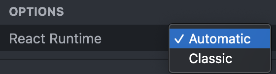
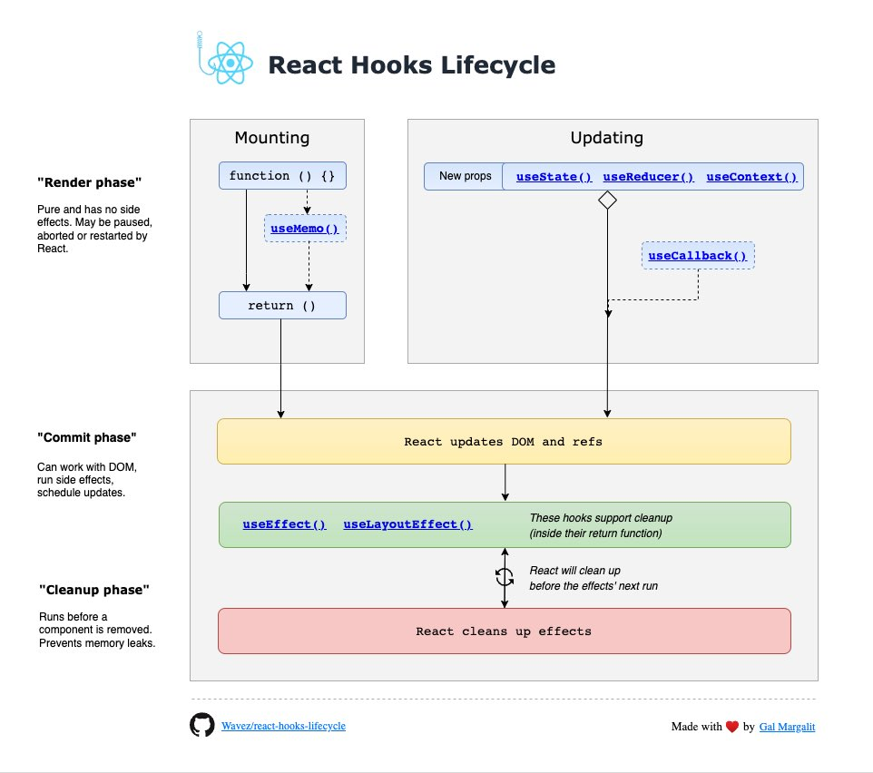
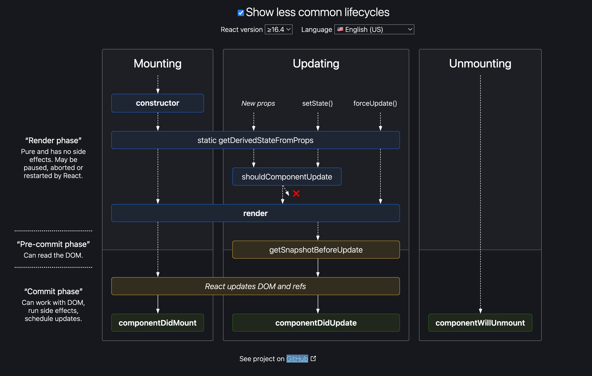

## 라이브러리와 프레임워크

> "The library for web and native user interfaces" (웹 및 네이티브 사용자 인터페이스용 라이브러리)

새로 개편된 React [공식 홈페이지](https://react.dev/)에 있는 문구이다. 개편 되기 전 React 공식 홈페이지에서는 'A JavaScript library for building user interfaces'라고 되어있다. 기존 공식 홈페이지 문구와 비교해 `JavaScript` 단어가 빠졌고, `web and native` 라는 구절이 추가되었다.

라이브러리의 정체성은 그대로 가져간다. React를 접했을 때 라이브러리이기보다는 프레임워크 같다고 생각했다. 왜냐하면 React를 사용하기 위해서는 규칙이 있고, 제약사항이 있으며, 알아야 할 개념이 많다고 느꼈기 때문이다.

Vue.js는 **"The Progressive JavaScript Framework"** 라고 공식 홈페이지에서 소개하고 있다. 나는 React를 접하기 전 Vue.js를 통해 웹 어플리케이션을 만들었었기 때문에 Vue.js의 소개와 같이 React 또한 프레임워크의 성격이 강하다는 생각이었다.

라이브러리는 코드를 개발자가 제어한다. 라이브러리에서 개발자는 원하는 기능을 가져다 쓸 수 있으며, 작은 기능을 위한 작은 조각이기 때문에 코드를 개발자가 충분히 제어할 수 있다. 반면, 프레임워크는 코드를 개발자가 아닌 프레임워크가 제어한다. 프레임워크 위에서 개발자는 정해진 규칙에 맞게 코드를 작성하며, 작성된 코드는 프레임워크에서 관리하고, 어플리케이션 혹은 객체의 생명주기를 프레임워크에서 제어한다.

React는 코드를 선언적으로 작성하도록 강제하고 있고, 많은 제약 사항과 규칙이 존재한다(그중 한 규칙 - [이전 게시물](https://pozafly.github.io/react/react-is-managing-hooks-as-an-array/)). 코드의 생명 주기 또한 React가 관리하고 있다. 따라서, React는 프레임워크라고 규정지었지만, 또 다른 이유로 프레임워크라고 규정짓기 어렵다는 생각이 들었다.

```jsx{1,2}
import React from 'react';
import ReactDOM from 'react-dom/client';
import App from './App.jsx';

ReactDOM.createRoot(document.getElementById('root')).render(
  <React.StrictMode>
    <App />
  </React.StrictMode>
);
```

코드는 React를 설치하면 어플리케이션의 엔트리 파일에는 위와 같은 코드가 생성된다. `react` 와, `react-dom` 패키지를 가져오고 있다. 왜 react 패키지와 react-dom 패키지를 나누었을까? 어짜피 React를 사용하려면 react-dom의 내부 기능이 필요할 것이고 이는 react 패키지에 하나로 묶어두면 안되나?

결론은, React는 라이브러리이기 때문에 나누어 둔 것이다. 무슨말인지 조금 더 알아보자.

### 호스트 객체

React는 공식 홈페이지에 명시되어 있는 것처럼 UI(user interfaces) 라이브러리다. UI는, 다양한 환경에서 표현될 수 있다. Web 환경에서의 UI는 DOM으로 표현될 수 있다. 따라서 Web 환경에서 DOM을 조작하고 배치하며 이벤트를 관리한다. Mobile 환경에서의 UI는 IOS와 Android의 UI 요소를 계층 구조로 가지고 있다. 즉, 브라우저와 IOS, Android 모두 화면을 트리 구조로 가지고 있으며 계층 관계를 통해 표현이 가능하다. 이것을 호스트 트리라고 하며, 호스트 트리는 호스트 객체로 표현할 수 있다.

react-dom은 web 즉, 브라우저에서 사용하기 위해 사용하기 위해 사용하는 패키지다. react native는 IOS, Android를 동시에 개발할 수 있는 라이브러리이다. react-dom 패키지를 사용하지 않으며 `react-native` 패키지를 사용한다.

그러면 개편된 React 공식 홈페이지의 문구의 'web and native' 가 추가된 이유가 더 확실해졌다. React가 라이브러리를 명시하고 있는 이유도 확실해졌다. 관심사를 분리한 것이다.

web 환경에서의 DOM을 조작하기 위해 react-dom 패키지를 사용하며, native(mobile) 환경에서의 view tree를 조작하기 위해 react-native 패키지를 사용한다. 추상화 된 view tree들을 조작할 수 있다. 그리고, 이를 다루는 핵심 기능은 react 패키지에 묶어두어 두 곳에서 사용할 수 있도록 했다. 따라서 아래의 문장을 이제 어느정도 이해할 수 있다.

하지만, 여전히 UI 라이브러리 역할을 하고 있지만 React에서 개발자의 코드를 제어하고 있기 때문에 라이브러리와 프레임워크 그 어디 중간이라고 할 수도 있겠다.

그 한 예로, React가 코드를 제어하고 있는 렌더링 프로세스를 함께 살펴보며, 추가로 선언적으로 에러를 처리할 수 있는 Error Boundary 개념에 대해 살펴보자.

<br />

## 렌더링 프로세스

위키피디아에서는 렌더링을 컴퓨터 프로그램을 사용하여 모델로부터 영상을 만들어내는 과정을 말한다고 한다. 하지만, React에서의 렌더링이란 조금 다르게 표현된다. React에서 렌더링이란, 컴포넌트가 props와 state를 통해 UI를 어떻게 구성할지 컴포넌트에게 **요청**하는 작업을 말한다.

일반적으로 말하는 렌더링은, 화면에 바로 나타나는 것처럼 표현되고, React에서는 화면에 나타내기전 어떤 과정을 시작하는 듯한 어조이다. 따라서, 주의해야 할 점은 React에서 렌더링은 DOM 업데이트가 아니다. 즉, 렌더링은 실질적 화면 업데이트가 아니라는 점이다.

[공식-렌더링하고 커밋하기](https://react-ko.dev/learn/render-and-commit) 문서에서는 React가 코드를 어떻게 화면에 표시되는지 총 3단계로 나누어 말하고 있다.

1. Trigger - 렌더링 **촉발**
2. Rendering - 컴포넌트 **렌더링**
3. Commit - DOM에 **커밋**

Trigger는 state가 변경되었을 때 일어난다. Trigger 되면, Rendering이 일어나는데, 이 때 화면에 표시될 DOM이 생성된다. Commit이 일어나면 Rendering에서 생성된 DOM이 브라우저의 DOM으로 그려진다.

### Trigger

Trigger 되는 조건은 간단하다. state로 저장된 값이 변경되면 되는데, 이는 `Object.is()` 메서드를 사용해 state 값이 [불변](https://pozafly.github.io/javascript/shallo-copy-and-deep-copy/)을 지켜 대체되었는지만 확인한다. 화면이 변경되는 것은 '리렌더링' 과정을 거쳐야만 다시 그려진다. 리렌더링은 상태 값에 의존해 새로운 데이터로 새로운 화면을 그린다. 따라서 React가 데이터가 변경 되었다는 것을 알아야 하며 그 과정이 Trigger 과정이다. 반드시 상태 값을 setState 함수로 업데이트 해야하는 이유다. React가 렌더링이 될 것인지 되지 않을 것인지 판단하기 위해서다. 리렌더링 되는 조건은 아래와 같다.

- 부모 컴포넌트 리렌더링
- state 변경
- context API의 state 변경

setState의 함수는 Queue에 순차적으로 등록된다. 이 과정은 Rendering 과정에서 다시 활용된다.

### Rendering

Render phase라고도 한다. 이곳에서 흔히 말하는 재조정(Reconciliation)이 일어난다. JSX가 바벨으로 부터 `React.createElement()`(react 16 버전 이하) 혹은 `_jsx()`(react 17 이상) 로 변환된 객체를 비교하는 단계다.

> ※ React 17 import 구문을 사용하지 않아도 되는 이유는 \_jsx() 함수로 JSX가 변환되기 때문이다. [Babel](https://babeljs.io/repl#?browsers=defaults%2C%20not%20ie%2011%2C%20not%20ie_mob%2011&build=&builtIns=false&corejs=false&spec=false&loose=false&code_lz=JYWwDg9gTgLgBAbzgVwM4FMDKMCGN1wC-cAZlBCHAORTo4DGMVA3AFCvoAekscAJuhI5kAG3glkAO0bAIkuAEEwYABQBKRKzhx6c1PADaANxwjk6ADRwMMAGqnzAXTgBeFBmx50KgAxq2WnC0MMhQ8iqB2gA8AHyR2ogmZuiE8dEARsgwMHJwcgDCIsD0ANYuCOquMdbodg7eSeZVcI0EANRwAIxqhDGFxSVwALLoUQD0mdlycQlw4zNw_qyEQA&debug=false&forceAllTransforms=false&modules=false&shippedProposals=false&circleciRepo=&evaluate=false&fileSize=false&timeTravel=false&sourceType=module&lineWrap=true&presets=env%2Creact&prettier=true&targets=&version=7.22.4&externalPlugins=%40babel%2Fplugin-syntax-jsx%407.21.4&assumptions=%7B%7D)에서 테스트해볼 수 있다. options의 React Runtime 옵션을 변경해보면 알 수 있다.
>
> 
>
> 'Automatic'은 16버전 이하 ( `React.createElement()` )이여, Classic은 17버전 이상 ( `_jsx()` )이다.

#### Reconciliation

Reconciliation(재조정)이란, 앞으로 그려질 DOM과 그려지기 전 DOM의 부분을 비교해 달라진 부분을 찾아내 계산하는 과정을 말한다. 여기서 사용되는 알고리즘을 Diffing 알고리즘이라고 한다. Diffing 알고리즘은 아래와 같은 작업을 한다.

- React Element의 타입(JSX 태그 종류) 비교
- 타입이 동일할 경우 속성(attribute) 비교
- key 값 비교
- 재귀적으로 자식 Element 비교

처음 렌더링 할 경우 React는 가상 DOM을 그려놓는다. 그리고, Trigger가 발생하면, 새롭게 가상 DOM을 그린다. 그리고 Diffing 알고리즘을 통해 위 과정을 거쳐 어떤 부분을 업데이트 할지 결정하는 것이다. 왜 이런 과정을 거칠까? 굳이 리렌더링 되지 않아도 되는 부분은 제외시키고 변경되어야 하는 부분만 변경하기 위해서이다. 즉, 효율성을 위함이다.

web 혹은 native 환경에서의 DOM 조작은 비용이 비싸다. 하지만, 가상 DOM을 비교하거나 조작하는 일은 실제 DOM을 조작하는 것에 비해 가격이 저렴하다. 가상 DOM은 JavaScript로 조작할 수 있는 가벼운 메모리이기 때문이다. 또한, 모든 DOM을 새로 그리게 될 경우 focus가 없어질 수 있고, select 요소에서 선택했던 option 값이 사라졌을 수도 있으며 스크롤 정보도 없어질 수 있다. 이 과정은, [이곳](https://www.youtube.com/watch?v=BYbgopx44vo)에서 영상으로 직관적으로 볼 수 있다.

※ 참고로, setState의 `Object.is()` 메서드는 이곳의 비교와는 다르게 생각해야 한다. Object.is() 비교는, Trigger를 일으킬 뿐이다.

#### Batching

React는 최대한 렌더링을 적게 일으키기 위해 작업을 한번에 묶어서 일괄 처리(Batching)한다. Trigger 단계에서 setState의 함수는 Queue에 순차적으로 들어간다고 했다. 이제, Diffing 알고리즘으로 어떤 DOM이 변경되어야 하는지 알았기 때문에, 변경되어야 할 DOM의 state 값을 Queue에 들어갔던 함수를 실행하면서 계산한다.

Batching은 React가 성능 향상을 위해 여러 상태 업데이트를 단일 리랜더링으로 그룹화하는 것을 말한다.

브라우저에서의 렌더링 과정은 간략하게, HTML을 파싱하여 DOM Tree를 만들고, CSSOM Tree 생성, 합쳐서 Render Tree를 만들고, 렌더 트리의 각 요소 위치와 크기를 계산하는 layout과정, 레이어 별로 실제 그리기 작업을 수행하는 painting 과정, 레이어를 합성해 화면에 출력하는 composition 과정이 있다.

layout, painting 과정은 요소가 변경되거나 레이아웃이 변경되었을 때 다시 실행되는 과정인데 이 과정은 비용이 비싼 작업이다. layout이 다시 일어나면 reflow라고 하는데, paint가 다시 일어나는 것(repaint) 보다 비싼 과정이다. React에서 setState를 호출할 때마다 리렌더링이 일어나게 되면, repaint, reflow가 계속해서 일어나게 되기 때문에 Batching을 통해 한 번만 일어나도록 한 것이다.

React 18 버전부터는 Promise, setTimeout, EventHandler 등도 함께 일괄 처리된다. [Automatic batching for fewer renders in React 18](https://github.com/reactwg/react-18/discussions/21)에서 확인할 수 있다. 이 과정을 통해 리렌더링은 setState가 호출될 때마다 실행되는 것이 아니라, 마지막에 한번만 실행 되도록 했다.

### Commit

Rendering에서 재조정된 가상 DOM을 DOM에 적용하고 라이프사이클을 실행하는 단계다. 여기서도 DOM에 마운트 된다는 뜻이지 paint 된다는 뜻이 아니다. 이 단계는 항상 일관적 화면 업데이트를 위해 동기적으로 실행된다. 동기적으로 실행된다는 것은 콜 스택을 비우지 않고, DOM 조작을 Batching 처리 한다는 뜻이다.

Commit 단계가 끝나면, 브라우저에서 실제 DOM을 업데이트하며 화면을 그려준다.

React가 상태를 기반으로 효율적으로 화면을 그려내기 위한 동작은 아래와 같다.

- setState의 `Object.is()` 메서드로 상태 값 비교
- Reconciliation(재조정)의 가상 DOM으로 부분 리렌더링
- Batching(일괄 처리)를 통해 여러 번이 아닌 한 번만 리렌더링

렌더링 과정에는 효율적으로 UI를 조작하기 위해 많은 작업이 뒤에서 일어나고 있다. 이 매커니즘을 어느정도 숙지하지 못하면 개발자가 원하는대로 동작하지 않을 수 있기 때문에 공식 문서에서도 이런 매커니즘에 대해 잘 설명해주며, 개발자로 하여금 규칙을 지키도록 하고 있다.

렌더링 과정 중 Hooks나 라이프 사이클 메서드가 어느 시점에 어떻게 동작하는지 아는 것도 코드를 작성하는데 도움을 줄 수 있다.

### 라이프 사이클 실행 과정

React에는 함수 컴포넌트가 있고, 지금은 잘 쓰이지는 않는 클래스 컴포넌트가 있다. 둘의 라이프 사이클을 그려놓은 사진을 보자.



[출처](https://github.com/Wavez/react-hooks-lifecycle)

함수 컴포넌트의 Hooks를 phase에 맞게 순서대로 그려놓았다.



[출처](https://projects.wojtekmaj.pl/react-lifecycle-methods-diagram/)

클래스 컴포넌트으 라이프사이클 메서드를 phase에 맞게 순서대로 그려놓았다.

<br/>

## ErrorBoundary와 IoC

### IoC (Inversion of Control)

살펴보았던 렌더링 과정에서, 간단한 코드를 작성하면 백그라운드에서 React가 수많은 일을 하고, 원하는 결과를 나타낸다. 이 개념은 제어의 역전이라고도 말한다. 처음 말했던, React가 프레임워크의 성격을 가지고 있다고 생각했던 이유가 여기에 있다. JSX도 마찬가지다. JSX를 일반 JavaScript 함수로 변환하는 과정은 우리가 잘 모르지만 JSX로 선언해주기만 하면 원하는 결과를 얻는다.

이것을 IoC(Inversion of Control) -**제어의 역전**이라고 한다. React에서는 개발자가 작성한 코드가 React에 의해 관리되고 평가된다. 즉, 제어권은 React에 있으며 프레임워크의 성격을 가지고 있다고 볼 수 있다. 이는 선언형 프로그래밍과 연관이 있다고 할 수 있는데, React가 동작하기 위해서는 선언형으로 작성된 코드를 사용하도록 제어하고 있기 때문이다.

### 선언형 프로그래밍

일반적으로 명령형 프로그래밍에서는 개발자가 제어 흐름을 직접 제어하고 구현 세부 사항에 초점을 맞추는 방식이다. 반면에 선언형 프로그래밍은 "무엇(What)"을 표현하는 것에 중점을 둔다. 개발자는 원하는 결과를 선언하고, 시스템이 그 결과를 달성하기 위해 필요한 모든 세부 사항을 처리한다.

JavaScript에서는 배열과 관련된 메서드로 forEach, filter, map 등이 있는데, 이는 선언적이다. 함수의 인자로 함수가 들어가게 되는데, 내부 구현은 모르더라도, 콜백 함수를 선언해주면 선언된 함수의 결과로 우리가 원하는 결과를 얻을 수 있기 때문이다.

선언형으로 코드를 작성하면 아래와 같은 장점이 있다.

- 가독성이 좋다. 코드의 의도를 명확하게 표현할 수 있기 때문이다.
- 재사용성이 좋다. 코드를 모듈화하고 재사용 가능한 단위로 분리하기 쉽게 만든다.
- 유지보수 하기 좋다. 작업의 세부 사항을 추상화하고 숨김으로써 코드의 유지보수를 용이하게 만들기 때문이다.
- 테스트 하기 좋다. 의존성을 명시적으로 표현하고 숨기기 때문에 테스트하기 쉽다.
- 예측 가능하다. 명시적인 규칙과 제약 조건을 따르도록 유도하기 때문에 오류를 방지하고 예측 가능한 동작을 유지하는 데 도움이 된다.

선언적으로 UI를 나타낼 수 있는 예로 ErrorBoundary가 있다.

### ErrorBoundary

ErrorBoundary 개념은, 사용자가 원하는 fallback UI만 던져주면 에러가 발생했을 때 이를 명령형이 아닌, 선언적으로 UI를 표현할 수 있다. 먼저 ErrorBoundary를 사용하지 않고 에러를 표현하는 방법으로 구현해보자.

```jsx
function Child({ errorValue, isError, setIsError }) {
  try {
    if (!isError) {
      return <div>{errorValue.toPrecision()}</div>;
    }
    return <p style={{ color: 'red' }}>Error 발생!</p>;
  } catch (error) {
    setIsError(true);
  }
}

export default function ErrorComponent() {
  const [errorValue, setErrorValue] = useState(0);
  const [isError, setIsError] = useState(false);

  return (
    <div>
      <button onClick={() => setErrorValue('1')}>클릭하면 에러 발생</button>
      <Child
        errorValue={errorValue}
        isError={isError}
        setIsError={setIsError}
      />
    </div>
  );
}
```

`toPrecision()` 메서드는 숫자형 타입의 값에만 적용되고, 다른 타입이 들어오게 되면 Error가 발생한다. 상태 값이 변경되면, 리렌더링이 일어나고, 새로운 값 문자열 타입인 `'1'`이 상태 값으로 들어가게 되므로 에러가 발생한다.

try catch 문으로, Error가 발생하면 `setIsError()`로 상태 값을 업데이트 해주고, if 문으로 어떤 UI를 보여줄지 조건부 렌더링을 했다. 이는 명령형으로 UI를 표현했다고 할 수 있다.

ErrorBoundary를 사용해보자.

```jsx
import ErrorBoundary from './ErrorBoundary.jsx';

// ErrorBoundary에서 fallback이 발생하게 하려면 반드시 하위 컴포넌트에서 error가 발생해야 함.
function Child({ errorValue }) {
  return <div>{errorValue.toPrecision()}</div>;
}

export default function ErrorComponent() {
  const [errorValue, setErrorValue] = useState(0);

  return (
    <div>
      <ErrorBoundary fallback={<p style={{ color: 'red' }}>Error 발생!</p>}>
        <button onClick={() => setErrorValue('1')}>클릭하면 에러 발생</button>
        <Child errorValue={errorValue} />
      </ErrorBoundary>
    </div>
  );
}
```

에러가 발생할 만한 곳에 Wrapper 컴포넌트로 ErrorBoundary 컴포넌트를 선언했다. 그리고 보여주고 싶은 fallback UI를 fallback props로 명시했다. 선언한 JSX는 ErrorBoundary를 제외하면, 성공했을 모습만 그려주고 있기 때문에 코드 파악도 훨씬 쉬워졌다.

가독성이 훨씬 직관적으로 변했다. 에러가 발생할 경계를 JSX로 명확하게 지정해주었고, 만약 에러가 발생할 모습을 직관적으로 알 수 있다. fallback props도 컴포넌트로 분리해, 실패했을 경우의 모습만 그려주면 되기 때문에 훨씬 역할 분리가 잘 되었다고 말할 수 있다.

이제, ErrorBoundary 컴포넌트를 구현해보자.

```jsx
import React from 'react';

export default class ErrorBoundary extends React.Component {
  constructor(props) {
    super(props);
    this.state = {
      hasError: false,
    };
  }

  static getDerivedStateFromError(error) {
    console.log('getDerivedStateFromError', error);
    return { hasError: true };
  }

  componentDidCatch(error, info) {
    console.log('componentDidCatch', error, info);
  }

  render() {
    if (this.state.hasError) {
      return this.props.fallback;
    }
    return this.props.children;
  }
}
```

특이한 부분은 클래스 컴포넌트로 작성 되었다는 점이다. ErrorBoundary 컴포넌트는 클래스 컴포넌트로 밖에 작성할 수 없다. 이유는, 에러를 감지하기 위해 라이프사이클 메서드를 활용해야 하기 때문이다. 앞으로 React에서 함수 컴포넌트에서 ErrorBoundary에 활용할 수 있는 메커니즘을 도입할 예정인지는 잘 모르겠다.

사용된 라이프 사이클 메서드는 `static getDerivedStateFromError()`, `componentDidCatch()` 라이프 사이클 메서드다.

- getDerivedStateFromError : error의 상태 값을 변경하는 용도
- componentDidCatch : 에러를 추적하고, sentry 등의 에러를 포착해 에러 리포트 서비스로 전송하는 용도

하지만 왜 이렇게 두개로 나눠놨을까?

getDerivedStateFromError, componentDidCatch 둘 다, 렌더링 도중 자식 컴포넌트에서 Error가 발생하면 호출된다. 하지만 차이점은 아래와 같다.

- `getDerivedStateFromError`
  - **Render phase**에서 호출한다.
  - render 함수를 호출하기 전에 호출한다. 따라서 error와 관련된 state를 업데이트 해주어야 한다. 자식이 먼저 렌더링 되면 안되며, fallback UI가 보여야 하기 때문이다.
  - 추가로 다른 상태 값을 업데이트 할 수도 있다. 위와 동일 이유.
  - 부수효과가 포함되면 안된다.
- `componentDidCatch`
  - **Commit phase**에서 호출한다.
  - error와 info(어떤 컴포넌트가 오류를 발생시켰는지) 알 수 있다.
  - 에러 리포팅 서비스에 에러를 기록할 수 있다.
  - 부수효과가 포함될 수 있다.

어느 phase에서 실행되는지는 위에 사진으로 살펴봤던 '라이프 사이클 실행 과정'을 보면 이해가 쉽다.

getDerivedStateFromError 라이프 사이클 메서드는 위에서 살펴봤던 Render phase에서 호출되기 때문에 상태 값이 변경되면, 재조정 과정을 통해 업데이트 하기 용이하다. 즉, 효율적이다. 만약 componentDidCatch에서 상태 값을 변경하게 되면 다시 Render phase가 실행되어야 하기 때문에 효율적이지 않다.

기존에는 componentDidCatch로만 이 작업을 했었지만, 16 버전 이상부터는 getDerivedStateFromError과 함께 사용한다.

[Github 이슈](https://github.com/facebook/react/issues/16130#issuecomment-521637592)에서 댄 아브라모브는 이렇게 이야기 하고 있다. **렌더링은 side effect가 없어야 한다**. 즉, componentDidCatch에서 상태 값을 변경하고 side effect가 발생해, 다시 렌더링이 되어 다시 에러가 발생하게 되면, componentDidCatch가 계속해서 호출 될 우려가 있다는 뜻이다.

선언적으로 코드를 작성하는 것은 side effect가 발생하지 않도록 하는 것이 굉장히 중요하다. 이는 함수를 만들 때 외부 요인을 변경시키면 안되며, 몇 번을 실행하던지 동일한 input에 동일한 output이 나와야 함을 의미한다.

컴포넌트를 선언할 때도 순수 컴포넌트(순수 함수)로 만들어야 함을 강조한다. 순수 함수가 되어야 하는 이유는, 외부 결과를 변경시킨다면 함수를 실행(렌더링)할 때마다 다른 값이 나오며 이를 제어하기 어려워지기 때문이다.

순수성을 지키기 위해 React는 개발 단계에서 strict mode를 도입해 초기 렌더링 시 컴포넌트가 두 번 호출되도록 했다. side effect가 없다면 동일한 UI 모습이 나타날 것이기 때문이다. 또한 side effect를 처리하기 위해 side Effect와 관련된 `useEffect` Hooks를 제공한다. 따라서 외부 요인과 연동이 필요할 때는 useEffect에서만 처리할 것을 React는 강조하고 있다.

ErrorBoundary외에 Suspense 개념이 있다. Suspense는 React 18의 동시성 모델과도 연관이 있다. 비동기로 처리되는 네트워크 요청과 청크로 분리되어 컴포넌트를 지연로딩할 때, 보여줄 fallback UI를 선언적으로 다룰 수 있는 개념이다.

---

## 마치며

처음 React가 라이브러리인지, 프레임워크인지에 대한 이야기를 했었다. React를 사용하는데 라이브러리인지, 프레임워크인지는 크게 중요하지 않다. 도구를 어떻게 활용할 수 있고 어떻게 가치를 창출할 수 있을지가 중요하기 때문이다.

어쨌든 React는 선언적으로 코드를 작성하게 하며, 선언적으로 작성하지 못했던 부분을 계속해서 업데이트하고 있다. 함수 컴포넌트가 나온 것도, Hook를 활용하는 것도, 그리고 ErrorBoundary 및 Suspense가 나온 것도 계속해서 React가 선언적으로 코드를 작성하게끔 의도하고 있는 것이다.

뭐든 그렇지만 어떤 개념이나 실제적으로 작성하는 것들은 처음 배울 때는 익숙하지 않아 어렵다. 하지만, 익숙해지면 따라오는 효과는 꽤 커 보인다. 일반 JavaScript 코드로 UI를 만드는 일은 이제 JSX가 없어 어색하다는 글을 본 적이 있다. 나도 Vue.js를 사용하면서 바닐라 JavaScript로 UI를 만들 때, template 코드를 작성하지 않아 매우 어색했다. 맨 처음 프로그래밍을 접했을 때 사용하던 `for` 문을 이제는 forEach, map, filter, reduce 등의 Array 메서드를 손쉽게 사용한다. 패러다임에 갖히면 안되겠지만 이를 적절히 활용할 줄 알아야겠다.

> 참고
>
> - https://velog.io/@superlipbalm/blogged-answers-a-mostly-complete-guide-to-react-rendering-behavior
> - https://overreacted.io/ko/react-as-a-ui-runtime/
> - https://projects.wojtekmaj.pl/react-lifecycle-methods-diagram/
> - https://twitter.com/rickhanlonii/status/1531333842770006017
> - https://stackoverflow.com/questions/52962851/whats-the-difference-between-getderivedstatefromerror-and-componentdidcatch
