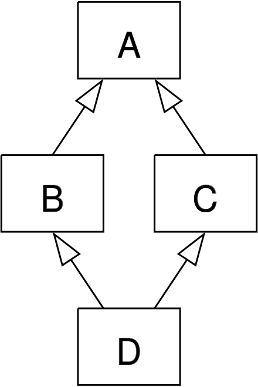

React는 Hooks을 배열(`Linked List`)로 관리하고 있다. 이는 Hooks를 관리하고 있는 배열에 index로 접근할 수 있다는 뜻이며, 이는 호출 순서에 의존하고 있다는 뜻이다. (아래에서 예시로 든 코드는 보기 쉽게 Linked List가 아닌 배열 형태로 표현했다)

[공식문서 - 첫 번째 훅 만나기](https://react-ko.dev/learn/state-a-components-memory#meet-your-first-hook)에 따르면, Hooks는 '컴포넌트의 최상위 레벨' 또는 커스텀 훅에서만 호출할 수 있다고 한다. 조건문, 반복문 또는 기타 중첩된 함수 내부에서는 훅을 호출할 수 없다고 한다. React는 JavaScript라는 말을 들었다. 매직이 없다는 뜻이다.

하지만, 왜 Hooks에 이런 제약 조건을 걸었을까? 상태 값을 조건을 통해 생성하고 싶을 때도 있고, 반복문으로 필요한 데이터를 그때 그때 선언해 사용하면 편리하지 않을까? 그렇다면 매직이 있다는 뜻인가?

먼저 Hooks가 어떤 방식으로 동작하는지 알아보자.

```jsx
function App() {
  const [value1, setValue1] = useState('');
  const [value2, setValue2] = useState(0);

  return <button onClick={() => setValue1('react')}>Click Me</button>;
}
```

상태 값은 2개다. 각각 `useState`의 인자로 초기값을 받아 배열 구조분해 할당으로 state 변수와 state 설정자(setter) 함수를 받고 있다.

이제 어플리케이션이 실행되면 React는 내부 공간에 state와 설정자 함수를 묶어 index를 가진 배열에 집어 넣는다. 아래는 임의로 만들어본 상태 값 관리 배열이다.

```js
// 임의 상태 값 관리 배열
[
  [value1, setValue1],
  [value2, setValue2],
];
```

버튼을 클릭하면 `() => setValue1('react')` 코드가 실행 될 것이다. 그러면 위 배열 묶음의 setValue1 설정자 함수가 실행된 것인데, setValue1은 임의로 만든 상태 값 관리 배열에서 index가 `0` 이다. 그렇다면 setValue1의 인자로 넘어온 값은, 다시 상태 값 관리 배열에서 index가 0인 state를 업데이트 한다.

이제 아래 코드를 보자.

```jsx
let firstRender = true;

function App() {
  let value3;
  if (firstRender) {
    [value3] = useState('dont');
    firstRender = false;
  }

  const [value1, setValue1] = useState('');
  const [value2, setValue2] = useState(0);

  return <button onClick={() => setValue1('react')}>Click Me</button>;
}
```

React에서 Hooks를 조건문에 넣지 말라고 했지만, 조건에 따라 넣었다. 상태 값 관리 배열을 만들어보면,

```js{3}
// 임의 상태 값 관리 배열
[
  [value3, undefined],
  [value1, setValue1],
  [value2, setValue2],
];
```

if 문이 true였기 때문에 예상하던대로 잘 들어왔다. 이제, 사용자는 버튼을 클릭해 `setValue1`을 실행시켰다. 상태 값이 변경되었으므로 리렌더링이 일어난다. `App()` 함수가 새로 호출 될 것이다. `firstRender` 의 값은 `false`가 되었고 `[value3]`을 반환하는 useState가 호출되지 않았다. 이 부분을 상태 값 관리 배열로 표현해보자.

```js{5}
// 임의 상태 값 관리 배열
[
  [value3, setValue1],
  [value1, setValue2],
  [value2, undefined],
];
```

React에서 state는 컴포넌트가 리렌더링 한 후에도 변수를 '기억'한다고 한다. 따라서 리렌더링 된 상태 값인 `value3`는 기억 되기 때문에 index 0번 자리로 들어간다. 그러면 `setValue1` 설정자 함수를 다시 호출했을 때 `value1` 값을 변경시키게 되는 것이다.

물론 `App()` 컴포넌트에서 사용자 이벤트가 일어났을 경우에 런타임 에러가 발생하며 실행은 되지 않는다.

이렇게 임의 상태 값 관리 배열을 만들어보면서 React가 Hooks를 어떤 방식으로 배열로 다루고 있는지를 봤을 뿐이다. 그렇다면 왜 React는 Hooks를 배열로 다루고 있을까?

<br/>

## 이름 충돌

```js
const [value1, setValue1] = useState(true);
const [value2, setValue2] = useState(true);
```

2개의 상태 값에 `true` 값이 세팅되었다. 그러면 코드를 작성하는 개발자는 그 상태 값이 `value1`과 `value2`라는 것을 알고 있다. 하지만 React 입장에서는 이를 알 수 없다. 만약 상태 값이 배열로 저장되지 않고 이름으로 접근하고 싶다면 useState에 상태 값에 대한 이름을 명확하게 작성해주어야 할 것이다. 이를 표현해보면 아래와 같다.

```js
const [value1, setValue1] = useState('value1', true);
const [value2, setValue2] = useState('value2', true);
```

useState의 첫번째 인자로 상태 값을 가리키는 고유 식별자 이름을 넣어주고, 뒤에는 초기 값을 넣도록 해주는 것이다. 그러면 이제 호출 순서에 상관없이 상태 값에 대한 이름이 붙어있으므로 배열로 관리되지 않아도 상관 없다. 하지만 이는 '문자열'을 key로 사용했다. 만약 두 상태 값 모두 `value1`이라고 이름을 지으면 어떨까? 오류가 발생할 충분한 소지가 있다.

또, 사용자 정의 커스텀 Hook을 사용할 때, 이 Hook을 사용할 컴포넌트를 돌아다니면서 첫 번째 인자로 들어간 식별자와 겹치지 않는 값을 상태 값을 가리키는 고유 식별자로 만들기 위해 고심해야 할 것이다.

<br/>

## 동일한 Hooks를 두 번 호출할 수 없다

만약 위에서 발생한 식별자 자체를 `Symbol`로 만들면 어떨까? 그렇다면 첫 번째 인자로 이름을 계속 줄 필요는 없으며, 각 useState마다 충돌할 수 없을 것이다.

```js
const symbol1 = Symbol();
const symbol2 = Symbol();

function App() {
  const [value1, setValue1] = useState(symbol1);
  const [value2, setValue2] = useState(symbol2);
  // ...
```

하지만 커스텀 Hook이 존재한다면?

```js
const symbol1 = Symbol();

function useCustomHook() {
  const [value, setValue] = useState(symbol1);
  return [value, setValue];
}

function App() {
  const [value1, setValue1] = useCustomHook();
  const [value2, setValue2] = useCustomHook();
  // ...
```

Symbol은 고유한 값이다. 그리고 `useCustomHook` 을 여러번 사용하기 시작하면 문제가 생긴다. 왜냐하면 `symbol1` 이라는 값은 함수 외부의 공간에 생성되었고, useCustomHook을 호출하고 상태 값을 변경하는 순간 `symbol1` 의 값이 동기화 되어 있어 모든 커스텀 훅의 상태 값이 symbol1을 바라보고 있기 때문에 격리되지 않은 같은 값에 접근하고 있기 때문이다.

`useState`는 독립적인 상태 값이다. 이는 격리되어 있고, 컴포넌트를 재사용할 때마다 각기 다른 메모리 주소를 가지고 있어 따로 동작한다. 하지만 Symbol을 함수 위 멤버 변수로 둔다면 모두 동일 값을 참조하고 있기 때문에 충돌이 발생한다.

### 복사 붙여넣기 어려움

위에서 문제가 되었던 것은 Symbol 값이 격리되지 않았기 때문이다. 그러면 Wrapper 함수를 만들어 값을 격리 시키고, Symbol을 사용해 네임스페이스를 만들어보자. (여전히 useState 첫번째 인자로 들어가는 값은 state를 구분할 수 있는 값이라는 가정)

```jsx
function createUseCustomHook() {
  const symbol = Symbol(); // 클로저가 생성되고 격리됨. 즉, 호출 할 때마다 새로운 값이 생성.

  return function useCustomHook() {
    const [value, setValue] = useState(symbol);
    return [value, setValue];
  };
}
```

그러면, createUseCustomHook 함수를 호출해 커스텀 훅을 다시 '생성' 후 사용할 수 있다.

```js
const useNameFormInput = createUseCustomHook();
const useSurnameFormInput = createUseCustomHook();

// Component
export default function Component() {
  const name = useNameFormInput();
  const surname = useNameFormInput();
  // ...
}
```

이렇게 사용하면 문제가 해결되었다. 동시에 컴포넌트 상위에 `useNameFormInput`, `useSurnameFormInput` 은 `createUseCustomHook` 고차 함수를 매번 호출하여 return된 커스텀 Hook을 선언해야 한다. 그러면 복사 붙여넣기에 편리하지 않다.

그리고 매번 이름을 정확하게 만들어야 한다. useNameFormInput, useSurnameFormInput로 말이다.

근데 위 코드를 다시 한번 보자. Component 내부에서 사용한 커스텀 Hook, `useSurnameFormInput` 이 녀석이 빠져있다. `const surname = useNameFormInput();` 코드를 보라. 실수로 `useNameFormInput` 를 두번 선언한 것이다. 즉, 개발자가 커스텀 Hook을 호출하기 위해 이름을 잘못 부른 것이다.

이렇게 Wrapper 함수를 두어 이름 변수를 격리시킨다면 이름 자체가 생겨 구분하기는 쉬워지지만, 연속해서 편리하게 호출할 수 없는 불편함이 생긴다.

<br/>

## 믹스인 다중 상속 문제(다이아몬드 문제)

상속이란, 부모로부터 자식 객체에 필드 혹은 메서드를 사용할 수 있게 하는 기능이다. 이는 재사용성을 높여준다. 그리고 [다중 상속](https://en.wikipedia.org/wiki/Multiple_inheritance#The_diamond_problem)이란, 객체 또는 클래스가 둘 이상의 부모로부터 상속할 수 있는 기능이다. ES6 class에서는 기본적으로 다중 상속을 지원하지 않는다.

```js
class A {};
class B {};
class C extends A, B {}; // Error! 클래스는 단일 클래스만 확장할 수 있습니다.
```

다중 상속이 가능한 언어가 있는데, 다중 상속에는 다이아몬드 문제가 존재한다.



사진과 같이 B, C가 A로부터 상속되고, D가 B, C로 부터 상속받을 경우 어떤 속성이 상속되었는지, 어떤 필드가 존재하는지 모호해지는 경우다.

JavaScript는 기본적으로 class에서 다중 상속을 지원하지 않지만, 객체를 통한 [mixin](https://ko.javascript.info/mixins) 기법을 사용하면 다중 상속을 구현할 수 있다. JavaScript는 prototpye을 기반으로 한 언어이기 때문에 이것이 가능하다.

믹스인을 쉽게 설명하면, 상속 받을 필요 없이 다른 클래스에 구현되어 있는 메서드를 사용할 수 있게 해주는 기법이다. 실제로 ES6의 class로 이런 prototype 기반을 통해 내부적으로 구현되어 있다. 자세한 것은, [이전 포스팅](https://pozafly.github.io/javascript/prototype/)(객체지향 프로그래밍으로 알아보는 prototype)을 참고하자.

prototype으로 사용하고자 하는 메서드가 있는 class를 `Object.assign` 으로 prototype 자체를 복사해 넣어주면 된다.

```js
const A = {
  sayHi() {
    console.log(this.name);
  },
};

const B = {
  sayHello() {
    console.log('hello');
  },
  sayHi() {
    console.log(`${this.name} hi!`);
  },
};

class C {
  constructor(name) {
    this.name = name;
  }
}

Object.assign(C.prototype, A, B);
new C('st').sayHi(); // st hi!
new C('st').sayHello(); // hello
```

실제로 C는 `extends` 키워드를 사용하지 않았지만, A와 B를 상속 받았다. class C로 부터 새로 생성된 인스턴스는 `sayHi()`, `sayHello()` 라는 메서드를 사용할 수 없지만, C의 prototype으로 객체를 합치면서 상속을 구현했기 때문에 메서드를 사용할 수 있는 것이다. 다시 말하면, class C는 A, B를 **다중 상속** 받았다.

여기서 주의 깊게 봐야 할 것은 `sayHi()` 라는 메서드다. A와 B는 모두 `sayHi()` 라는 메서드를 가지고 있고, 실제로 실행 된 것은 B의 `sayHi()` 가 실행되어 'st hi!'가 출력 된 것이다. 만약 `Object.assign(C.prototype, B, A);` 이렇게 A와 B를 반대로 적어주었다면 A의 메서드를 실행했을 것이다.

즉, 믹스인은 이렇게 메서드 **이름이 겹칠 경우 어떤 메서드를 실행하는지 개발자가 파악하기 어려운** 문제가 있다.

React Mixin은 위와 [동일한 문제](https://legacy.reactjs.org/blog/2016/07/13/mixins-considered-harmful.html#mixins-cause-name-clashes)를 겪었다. React의 Mixin은 라이프 사이클 메서드나, 메서드를 상속한 것처럼 재사용할 수 있다. 또한, Vue에서도 마찬가지다. [Vue Mixin](https://vuejs.org/api/options-composition.html#mixins) 공식 문서에서도 권장되지 않는다고 나와 있다. 이름 겹침 문제 뿐아니라 실제로 사용했을 경우, 한 파일 내부에서 어떤 메서드가 어떤 방식으로 호출되고 있는지, 어떤 상태 값을 변경했는지 잊어버리거나 디버깅 하기가 무척 어려웠다.

React에서는 커스텀 Hook과, HoC로, Vue에서는 Composition API를 통해 이 문제를 해결했다. -> 정확하지 않음. HoC 검증 필요.

커스텀 Hook에서 상태 값은 React 내부의 배열로 다루어지며 호출 순서에 의존하고 있다. 따라서, 어디에서 어떻게 호출하든지 간에 다이아몬드 문제(이름 충돌)를 신경쓸 필요가 없다. 커스텀 Hook 내부에서 선언한 값은 그 자체로 context를 가지기 때문(렉시컬 스코프를 가짐)에 다른 이름과 상관 없이 커스텀 훅 안에서 편안하게 사용할 수 있다.

상태 값(Hooks)이 배열로 다루어지지 않았다면, 커스텀 Hook에서 사용한 상태 값 이름이 컴포넌트에 있는 hook과 겹치지 않을지, 다이아몬드 문제가 있지 않을지 조심해서 작성해야 했을 것이다. 과거 Mixin이 그랬듯.

<br/>

## 조건부로 선언하면 코드 파악이 어려움

```jsx{2,3}
function Counter(props) {
  if (props.isActive) {
    const [count, setCount] = useState('count');
    return (
      <p onClick={() => setCount(count + 1)}>
        {count}
      </p>;
    );
  }
  return null;
}
```

이 코드가 허용되었다면, props로 떨어지는 `isActive` 값에 의해 상태 값이 생성되고, 생성되지 않는데, 상태 값이 언제 초기화 되는지 알 수 없다.

useEffect를 넣어보자.

```jsx{4-6}
function Counter(props) {
  if (props.isActive) {
    const [count, setCount] = useState('count');
    useEffect(() => {
      const id = setInterval(() => setCount(c => c + 1), 1000);
      return () => clearInterval(id);
    }, []);
    return (
      <p onClick={() => setCount(count + 1)}>
        {count}
      </p>;
    );
  }
  return null;
}
```

초기 렌더링 시에 useEffect가 실행될지 안될지 알 수 없다. 만약 `isAcitve` 값이 true 라면 초기에는 실행 될 것이고, false로 변경되었다고 하면 useEffect가 실행이 될까? 아니면 다시 초기화가 될까? 혼란스럽다.

```jsx
function Counter(props) {
  if (props.isActive) {
    // Clearly has its own state
    return <TickingCounter />;
  }
  return null;
}
```

이 코드가 훨씬 깔끔한 코드다.

<br/>

## Hooks 간에 값을 전달할 수 없음

```js
const [value, setValue] = useState(1);
const state = useCustomHook(value); // state값 전달
```

Hooks 호출 순서에 따라 동작하도록 만들면 연쇄적인 반응이 가능해진다. 예를 들어, [React Spring을](https://medium.com/@drcmda/hooks-in-react-spring-a-tutorial-c6c436ad7ee4) 사용하면 서로 연쇄되는 여러 값의 애니메이션을 만들 수 있다.

```jsx
const [{ pos1 }, set] = useSpring({ pos1: [0, 0], config: fast });
const [{ pos2 }] = useSpring({ pos2: pos1, config: slow });
const [{ pos3 }] = useSpring({ pos3: pos2, config: slow });
```

Hooks 초기화(구분할 수 있는 key)를 인자로 넣게 되면 이렇게 서로 연쇄되는 동작을 할 수 없다.

---

이렇게 React Hooks가 왜 배열로 만들어져 있는지를 알아봤다. 또한, 왜 호출 순서에 의존적이도록 구현되어있는지도 알 수 있었다.

이 글은 5년전 작성된 Dan Abramov의 글을 일부 재편집 해서 작성했다. 꽤 오래전 작성된 글이지만, 궁금증을 해소하기에는 충분했다. 그러면서 어떻게 React가 문제를 해결해왔는지 방향성을 살짝 알아볼 수 있었다. 웃긴 것은 Hooks의 매커니즘을 옹호하면서 Hooks에 제약조건을 걸 수밖에 없는 것을 짜증 섞인 말투로 이야기하고 있다. 아마 많은 사람들이 Hooks의 제약조건에 대해 의구심을 품고, 질문과 함께 추가적인 해결책을 제시했나보다.

React가 인기를 끈 것은 최대한 '매직'이 없기 때문이었다. [이글](https://medium.com/@dan_abramov/making-sense-of-react-hooks-fdbde8803889)에 보면 Hooks에 아래와 같은 코드(실제 코드는 아님)로 Hooks의 구조를 설명하고 있다. Hooks가 매직이 아니라는 것도 강조하면서.

```js
let hooks = null;

export function useHook() {
  hooks.push(hookData);
}

function reactsInternalRenderAComponentMethod(component) {
  hooks = [];
  component();
  let hooksForThisComponent = hooks;
  hooks = null;
}
```

아주 친절하게 구조를 설명하고 있다. SPA 시대를 연 Angular는 매직이 많았고, Vue는 Angular와 React를 적절히 섞어 일부 매직을 갖고 있다. 이번에 React를 공부하면서 [개편된 React 공식 문서](https://react-ko.dev/)를 읽었다. 확실히 Vue 보다는 꽤 상세하며 동작 원리와, 어떻게 코드를 작성해야 좋은 코드인지 코드를 고쳐볼 수 있는 공간을 마련해서 알려주고 있다.

내가 느낀 React는 최대한 친절하려고 노력하는 것 같다는 점이다. 또한 매직을 없애기 위해 JavaScript로 명시적인 처리를 할 수 있도록 해주기를 원한다는 점이다. 그 이유는 아래와 같다.

- `useEffect` 의 의존성 배열에 어떤 값이 들어가야 하는지 이미 알고 있지만, 개발자가 직접 넣도록 해줘야 한다는 점이다. useEffect 함수의 콜백에서 사용되는 상태 값 혹은 prop 값이 의존성 배열에 들어있지 않으면 lint로 알려준다.
  - lint로 알려줄 수 있다면 이는 자동화 할 수 있다는 의미이며 React에서 굳이 개발자로 하여금 의존성 배열을 넣도록 했다.
  - 물론, 개발자가 의도적으로 리렌더링 되지 않도록 의존성 배열에서 값을 배재시킬 수는 있지만, 실험적 API인, [`useEffectEvent`](https://react-ko.dev/learn/separating-events-from-effects#declaring-an-effect-event)를 사용하면 곧 해결 된다.
- [`forwordRef`](https://react-ko.dev/reference/react/forwardRef)를 감싸주어 사용자가 만든 컴포넌트에 ref를 달 때 명시적으로 달 수 있도록 처리했다.
  - JSX에서 컴포넌트 자체에 ref가 달리면 React가 알아서 처리하게 할 수도 있었다.

위 내용은 내가 느낀 것이지, 주장하고 싶은 것은 아니다. React가 인기를 얻을 수 있었던 철학에 반해 보이는 제약 조건이 궁금했다. 단순하게 생각했을 때, 생성 된 Hooks를 객체로 다루면 key로 쉽게 구분할 수 있으며 필요할 때 뽑아오기 좋을 것 같다고 생각했는데, 꽤 많은 이유가 있었다.

그리고 문서에서는 커스텀 Hooks를 매우 강조하고 있는데, 많은 제안들이 커스텀 Hook에 대해 간과한 제안을 했고 React에서 정말 중요하게 생각하는 것이 커스텀 Hook을 통한 코드 재사용성을 강조하고 있다.

> 참고
>
> - https://overreacted.io/why-do-hooks-rely-on-call-order/
> - https://medium.com/@ryardley/react-hooks-not-magic-just-arrays-cd4f1857236e
