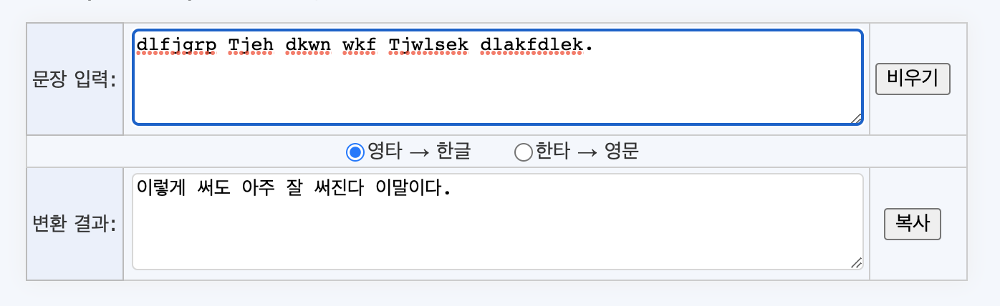
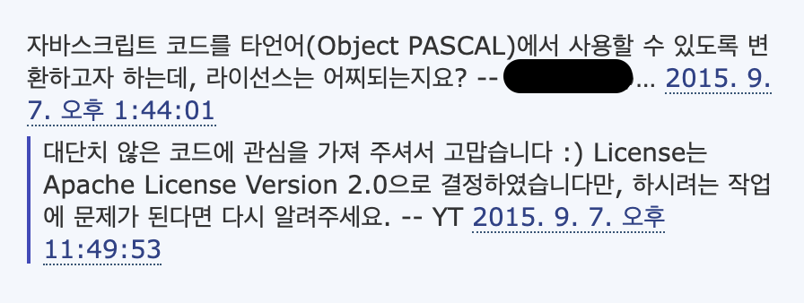
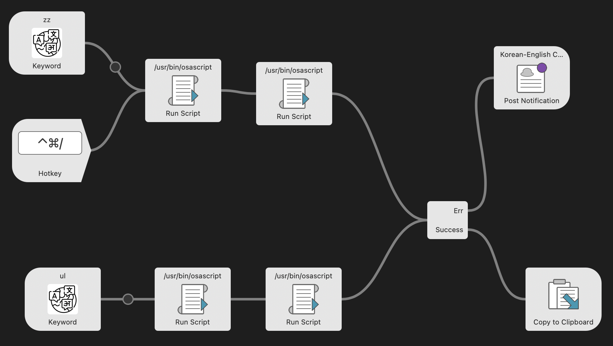
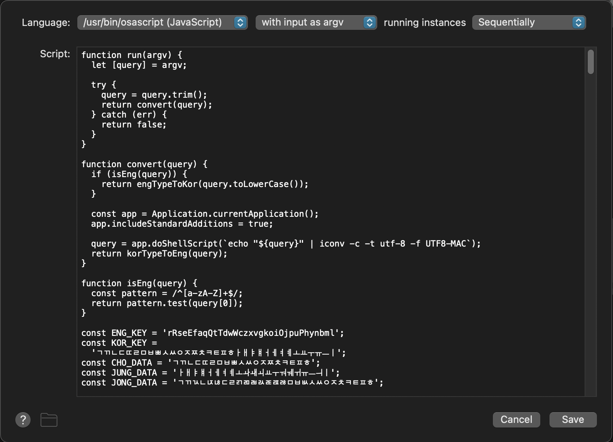
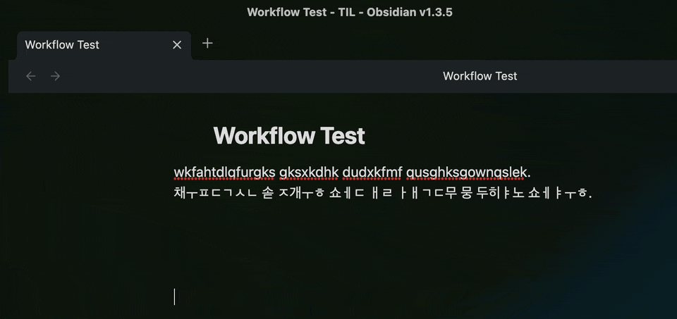

## 요구사항

문서를 정독할 때 때로는 타이핑해서 옮겨 적는 것도 큰 도움이 되는 편이다. 편집기랑 창을 양쪽으로 분할 한 뒤 이해한 부분을 타이핑 하다보면 한글 타자와 영어 타자가 원하는대로 타이핑 되지 않는 상황이 꽤나 많았다.

내 맥은 CapsLock을 통해 한글과 영어를 전환한다. macOS의 단점인데, 이게 딜레이가 있다. 한글을 입력하다가 CapsLock이 동시에 눌려지면 모드 전환이 되지 않거나 약간 딜레이가 걸렸다. dlfjgrp Tjwlseks akfdlek. dlrp sjan Qkrclseks akfdlek. zzzz...

그래서 이 문제를 해결하기 위해 유명한 [karabiner](https://karabiner-elements.pqrs.org/)를 깔아 쓰기도 해봤다. karabiner는 키매핑 프로그램이다. macOS의 키보드 key를 원하는 대로 매핑해서 사용할 수 있는 macOS 어플리케이션이다.

쓰다보니, karabiner는 키매핑을 실시간으로 입력 받아 사용해야하기 때문에 백그라운드에서 돌고 있는 것이 무척 신경쓰였다. 사실 큰 문제는 아니지만, 내 취향이 그렇다. 그냥 웬만하면 백그라운드에서 무언가 돌고 있지 않고, 가용 메모리가 넉넉한 상태에 있는게 마음이 편하다.

어쨌든, 잘못 입력된 영타 및 한타가 원하는 타자로 변환되기를 바랐고, [한영타변환기](https://theyt.net/wiki/%ED%95%9C%EC%98%81%ED%83%80%EB%B3%80%ED%99%98%EA%B8%B0) 페이지를 찾아냈다.



여기에도 조금 불편한 문제가 있었다. 매번 크롬에 즐겨찾기 해놓은 한영타변환기 페이지로 들어가서, 내가 잘못 작성한 문장을 복사해서 여기에 붙여넣고 변환 결과를 다시 편집기에 붙여넣기 해야 한다는 점이다.

1. 틀린 문구를 드래그나 shift key로 선택함.
2. 복사함.
3. 한영타변환기 즐겨찾기 버튼을 클릭함.
4. 문장 입력란에 붙여넣기 함.
5. `영타 -> 한글` 인지, `한타 -> 영문` 인지 선택함.
6. 변환 결과를 복사함.
7. 에디터에 잘못된 부분을 지움.
8. 그 자리에 붙여넣음.

잘못 입력된 문장을 보는 것도 짜증이 났지만, 이렇게 반복하고 나니, 이 단계를 더 간단하게 할 수 없을까?

<br />

## Alfred

맥북을 구입했을 때 제일 써보고 싶었던 소프트웨어는 [Alfred](https://www.alfredapp.com/)다. Alfred는 macOS에서 Spotlight 형태의 bar가 나타나고, 그곳에 원하는 명령어나 workflow를 사용할 수 있다. 다른 사람이 직접 만들어둔 workflow를 install 할 수도 있다.

Alfred에 잘못 입력한 구문을 던져주면 한영타변환기처럼 모드가 변환된 것처럼 다시 작성해서 나에게 던져주면 되지 않을까? 그러면 한영타변환기 페이지에 들어갈 일 없이 즉시 변환 되면 좋겠다고 생각했다. 만약 된다면 아래와 같은 단계로 줄여질 것이다.

1. 틀린 문구를 드래그나 shift key로 선택함.
2. 복사함.
3. Command-Spacebar 키를 눌러 Alfred 창을 띄움.
4. 짧은 명령어(`zz` 같은)를 침.

후에는 Alfred가 알아서 편집기에 변환된 문구를 넣어주는 것을 생각했다.

단계도 훨씬 줄고 마우스로 즐겨찾는 페이지를 찾아들어가지 않아도 되니, 마우스 동선도 거의 없다. 심지어, 드래그 해서 선택하지 않고 키보드로만 shift key를 이용해서 문구를 선택하면 마우스를 아예 건들지 않아도 된다. 그리고 8단계에서 4단계로 줄어든다.

<br />

## 조사

한영타를 변환해주는 과정이 너무 유용했기 때문에 어떤 방식으로 원하는 문구를 만들어주는지 파악이 필요했다. 한영타변환기 페이지를 까보면서 JavaScript로 만들어진 내부 로직을 발견했다.

`<script>` 태그로 되어 있는 코드뭉치를 긁어다가 IDE에서 테스트 해봤다. 이걸 활용하면 Alfred workflow를 만들 수 있을 것 같았다. 하지만 다른 분께서 만든 코드이기 때문에 조심스러웠다.



위의 댓글을 발견했다. Apache License Version 2.0을 사용하신다고 하셨다. Apache License Version 2.0는 누구나 해당 소프트웨어에서 파생된 프로그램을 제작할 수 있으며 저작권을 양도, 전송할 수 있는 라이선스 규정을 의미한다고 한다.

<br />

## 만들기

Alfred workflow는 이전에 한번 만들어본 경험이 있었다. 맥북을 집에서 모니터에 연결해 사용할 때는 마우스를 사용하고, 외부 카페에 가서 사용할 때는 트랙패드를 사용하는데 매번 설정에 들어가 스크롤 방향을 바꿔주어야 하기 때문에 이를 자동화 해주는 workflow였다.

Alfred workflow를 작성하는 것은 어렵지 않다. 빈 workflow를 생성하고 시작점과 trigger, notification 등을 순서에 맞게 나열한다. 그리고 각 아이템을 선으로 이어주면 완성이다.



이제, 실제 core가 될 코드를 넣어 변환 기능을 입혀주자. 예전에 만든 workflow는 인터넷에 돌아다니는 AppleScript 조각을 사용했지만, 이번엔 JavaScript다. Alfred는 workflow를 만들 때 JavaScript 코드도 함께 사용할 수 있다.



workflow 편집기에 osascript(JavaScript)를 선택하고 코드를 넣어주면 된다. osascript는 아래와 같다.

> ※ osascript
>
> AppleScripts 및 기타 OSA 언어 스크립트를 실행합니다. 지정된 스크립트 파일을 실행하거나, 지정되지 않은 경우 표준 입력을 실행합니다. 스크립트는 일반 텍스트이거나 컴파일된 스크립트일 수 있습니다. osascript는 AppleScript와 함께 사용하도록 설계되었지만 모든 OSA(Open Scripting Architecture) 언어에서 작동합니다.
>
> 출처 - [ss64](https://ss64.com/osx/osascript.html)

이제, 한영타변환기 페이지의 로직을 읽어보고, 몇몇 함수로 문구가 변환 되는 것을 파악했다. `영타 → 한글`, `한타 → 영문` 부분을 선택해서 변환하는게 아니라 입력된 문구가 한글인지 영어인지를 판단해 전체를 변경하는 분기로 변경할 것이다. 소스에서 판단해 원하는 변환 함수를 실행하기로 했다.

문제점이 발생했다. 영타를 한글로 바꾸는 것은 문제가 없지만, 한타를 영어로 바꾸는 부분에서 문제가 생겼다. IDE에서 log를 찍어봤을 때 생기지 않은 문제였다. 그렇다면, Alfred에서 한글 문자열을 입력받을 때 문제가 생겼다는 사실을 알 수 있다. 이 과정을 해결하는데만 2일 정도 걸린 것 같다.

구글링 후 찾아낸 것은, osascript에서 문자열 인코딩 방식이 `UTF8-MAC` 기반으로 동작하기 때문에, `UTF-8` 인코딩 방식을 `UTF8-MAC`으로 변경한 후 함수를 태워 변환해야한다는 것이었다. - [stackoverflow](https://stackoverflow.com/questions/13177602/how-to-use-utf-8-encoded-command-in-applescripts-do-shell-script-on-os-x-10-4)

유명한 개발자이신 태곤님께서 작성해주신 [네이버 카페 검색용 알프레드 워크플로우 v2](https://taegon.kim/archives/10419) 글을 통해 힌트를 얻을 수 있었다. 내 코드는 아래와 같다.

```js
query = app.doShellScript(`echo "${query}" | iconv -c -t utf-8 -f UTF8-MAC`);
```

`iconv` 라이브러리를 사용해 인코딩을 바꾼다. 참고로 iconv 라이브러리는 문자열 인코딩 변경 라이브러리인데, 맥에는 기본적으로 깔려있는 라이브러리다. 이 코드를 통해 함수를 태우기 전에 인코딩을 변경하여 실행하니 그제서야 잘 동작했다.

<br />

## 사용성 개선

### 사용자의 복사 과정 제거

다른 사람도 필요하지 않을까 해서, 이걸 좀 알려보고 싶었다. 예전에 커뮤니티에서 Alfred workflow 괜찮은 소개글이 있었다는걸 떠올려서 거기에 한번 올려봤다.

첫 번째로 달린 댓글은, **파워포인트 타이핑 할때 처럼 자동으론 안되는건가요.** 음. 아무래도 사용성에 문제가 있나 싶었다. 맞다. 파워포인트에서는 스페이스바를 누르면 소프트웨어가 이상하다 판단하면 바로 바꿔주는데.. 하지만, 이렇게 만들기에는 내가 실력이 부족하다고 판단. 그러면, 조금 더 개선을 해볼 수 있는 부분을 찾아 개선해보고 싶었다.

1. 틀린 문구를 드래그나 shift key로 선택함.
2. 복사함.

복사하는 과정이 반드시 필요한 과정일까? 복사하지 않고 문구만 선택해주면 Alfred에서 선택된 부분 text를 가져와 가공할 수는 없을까? AppleScript를 키워드로 검색했다.

```apl
tell application "System Events" to key code 8 using command down
```

macOS 시스템에 command + keyCode8 을 누르라는 명령어다. 즉, 의미로는 복사하라는 의미이다. 클립보드에 복사한 text를 query로 JavaScript에 넘기면 된다.

이 과정을 통해 굳이 복사하지 않아도, Alfred 명령어로 자동 복사하도록 변경할 수 있었다. 그리고 추가로 명령어 이후 편집기에 개행이 일어나는데, 이를 방지할 수 있는 처리도 추가적으로 해주었다.

### 단축키 추가

또 사용자가 줄일 수 있는 과정이 있을까?

3. Command-Spacebar 키를 눌러 Alfred 창을 띄움.
4. 짧은 명령어(`zz` 같은)를 침.

이 과정이 굳이 필요한가? 필요 없을 것 같다. 그러면, 이 과정을 생략할 수 있도록 하고 단축키를 매핑시켜주자. 문자를 드래그로 선택 후 `command` + `control` + `/` 키를 누르면 자동 변환되는 단축키를 할당했다. 혹시 단축키가 겹칠 수도 있으니 이는 optional 하게 Alfred 창에서 명령어를 입력할 수도 있고, 단축키를 사용할 수도 있게 두 기능 모두 넣어두었다.

### 테스트 코드 추가

커뮤니티에 또 다른 댓글이 달렸다. **맨처음의 한글자가 잘 변경이 안되는 버그가 있는거 같아요.** 원인은, 코드에서 대문자 처리가 되어있지 않은 이유였다. IDE에서 매번 다른 문자로 log로 확인 하는 과정이 번거로웠다. jest를 써보기로 했다. 얼른 jest에 대해 구글링 후 정말 간단한 테스트 코드를 만들어 넣고 watch 모드로 검사하며 수정해봤다.

<br/>

## 끝

잘못 입력한 한/영타를 한글 or 영문으로 변환하는 과정을 정리해보면 이렇다.

### workflow를 만들기 전

1. 틀린 문구를 드래그나 shift key로 선택함.
2. 복사함.
3. 한영타변환기 즐겨찾기 버튼을 클릭함.
4. 문장 입력란에 붙여넣기 함.
5. `영타 -> 한글` 인지, `한타 -> 영문` 인지 선택함.
6. 변환 결과를 복사함.
7. 에디터에 잘못된 부분을 지움.
8. 그 자리에 붙여넣음.

### workflow를 만들기 후

1. 틀린 문구를 드래그나 shift key로 선택함.
2. `command` + `control` + `/` 키.

사용성이 많이 개선되었다.



---

한영타변환기 workflow를 다운 받고 싶다면 [alfred-korean-english-converter](https://github.com/pozafly/alfred-korean-english-converter)에 가서 다운 받을 수 있다. 그리고 퀄리티는 낮지만 스크롤 방향 전환 workflow인 [alfred-scroll-toggler](https://github.com/pozafly/alfred-scroll-toggler)도 있다.
