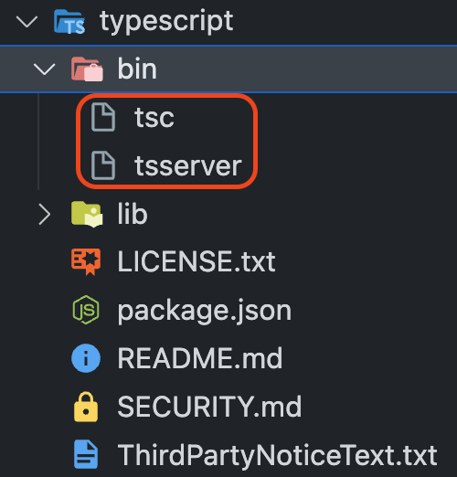

TypeScript를 사용해 개발 하는 단계는 크게 3가지로 나눌 수 있다.

1. Lint stage
2. Compile stage
3. Runtime stage

Lint stage는 개발자가 코드를 작성하는 시점이다. Compile stage는 코드를 모두 작성한 후 ts 파일을 js 파일로 변환하는 단계이다. Runtime stage는 컴파일 된 코드가 JavaScript 런타임 환경에서 실제로 동작하는 시점이다.

각 단계를 거쳐 어플리케이션이 실행된다. 위 단계로 부터 TypeScript가 어떻게 동작하는지, 어떤 환경설정이 필요한지 알아보자.

<br/>

## tsc, tsserver

TypeScript는 기존 JavaScript가 동적 타입 언어로써 코드가 실행될 때 타입 에러가 발생할 가능성이 있기 때문에 나온 언어다. TypeScript는 크게 2가지 기능을 제공한다.

1. 타입체크
2. 컴파일

타입체크는 Lint stage에서 이루어진다. 개발을 위해 사용하는 IDE에서 코드를 작성하는 순간마다 타입을 체크해주며, 타입 오류가 있을 경우에는 lint 메시지로 이를 개발자에게 알려준다. IDE에서는 어떻게 우리의 코드가 에러가 있는지 판별하는 걸까?

흔히 사용하는 VSCode는 Microsoft 사가 만든 IDE다. 그리고 TypeScript 또한 Microsoft 사가 만든 언어다. VSCode에서 TypeScript를 사용하면 TypeScript의 버전에 맞는 `TSServer`를 설정하고 VSCode는 서버로 부터 정보를 받아들이는 클라이언트 역할을 한다.

따라서 IDE는 TSServer를 이용해 TypeScript의 타입 체킹을 실시간으로 해주고, 개발자는 어떤 부분에서 타입 오류가 있는지 쉽게 알 수 있다.

컴파일은, 개발자가 TypeScript로 작성한 파일을 `tsc`를 이용해 js 파일로 변환하는 것을 말한다. tsc는 TypeScript Compiler의 줄임말이자, TypeScript CLI 명령어다.

```sh
$ npm i -D typescript
```

npm을 이용해 typescript를 설치하면 tsserver와 tsc 두가지가 함께 설치된다.



사진은 node_modules 내부에 있는 typescript 패키지 안의 모습이다. tsc, tsserver가 설치된 모습을 볼 수 있다.

> ※ Microsoft사는 Web 개발 측면에서 다른 기업에 밀리고 있다는 생각 때문에 TypeScript와 VSCode를 만들어 제공했다.
>
> TypeScript는 2012년 10월에 처음 공개되었고, Visual Studio Code는 2015년 4월에 공개되었다. VSCode에서 TypeScript를 기본 언어로 사용하는 것은 TypeScript의 개발과 사용을 촉진하고, TypeScript로 개발된 어플리케이션을 더욱 쉽게 개발할 수 있도록 지원하는 것을 목적으로 하고 있다.
>
> 즉, 개발자들이 TypeScript를 사용하게끔 유도하기위해 DX가 좋은 VSCode를 만들어 제공하면서 TypeScript 점유율을 높인 것이다.

컴파일은 Compile stage에서 이루어지는데, 또다시 컴파일에서 이루어지는 프로세스는 2가지다.

1. 타입체크
2. 트랜스파일

컴파일 전에 이미 타입체크가 진행되었다. 그 때 타입체크는 tsserver를 통해 코드 작성 시점에 체크된 것이다. 후에 컴파일 될 때도 tsc에서 타입체크를 한번 더 한다. 왜냐하면 tsserver를 통해 코드를 작성하지 않았을 수 있기 때문이다.

컴파일러는 ts 파일에 작성된 '타입 관련 코드' 모두를 제거해 실제로 동작할 수 있는 JavaScript 코드로 변환한다. 브라우저는 TypeScript의 존재를 알 수 없고 오로지 JavaScript 파일으로 동작하기 때문이다.

여기서 타입 관련 코드 모두 제거된다는 사실에 주의해서 TypeScript 코드를 작성해야 한다. 코드를 작성할 때 '타입 영역', '값 영역'을 정확히 인지해야 한다. 이는 타입 가드 등의 기법을 사용할 경우 컴파일 시점에 사라지는 '타입 영역' 코드를 타입 가드 역할로 잘못 작성할 수 있기 때문이다.

```sh
$ tsc [ts파일 위치]
```

명령을 실행하면, 타입스크립트 파일이 타입이 제거되어 자바스크립트로 변환되어 파일이 생성된다.

Runtime stage에서는 컴파일된 TypeScript, 즉 js 파일이 실행된다.

<br/>

## webpack을 통해 컴파일하기

모던 웹 개발에서 TypeScript 컴파일 과정은 크게 2가지로 볼 수 있다.

1. ts-loader(webpack) + tsc
2. babel-loader(webpack) + [@babel/preset-typescript](https://babeljs.io/docs/babel-preset-typescript)

모던 프레임워크 환경에서 번들러는 필수다. webpack은 Node.js 위에서 동작하며, tsc, tsserver도 Node.js 위에서 동작한다.

TypeScript가 tsc를 이용해 트랜스파일링 시 tsconfig.json의 `target 옵션`을 통해 ECAMScript 버전도 구버전으로 변경 시켜준다. 그렇다면 2번째 방법으로 babel을 사용한다면 트랜스파일링이 두번 들어가게 되는 것 아닌가?

`@babel/preset-typescript`가 나오기 전에는 ts-loader로 ts 파일을 webpack으로 가져와 tsc로 `타입체크 + 구버전 트랜스파일링` 후 babel로 다시 `트랜스파일링 + 폴리필 제공`의 역할을 했다고 한다.

이렇게 트랜스파일링이 두번 들어가면서 개발자들은 트랜스파일링이 두번 거치는 것을 원하지 않았고, TypeScript 팀과 Babel이 합작하여 나온 라이브러리가 `@babel/preset-typescript`다. 라이브러리를 사용하면 tsc가 아니라, babel에서 ts 파일을 변환하고 구버전으로 트랜스파일링을 진행한다. 단, `@babel/preset-typescript`는 타입 체크를 지원하지는 않기 때문에 타입 체크가 컴파일 시점에 필요하다면 tsc(ts-loader)가 필요하다.

프론트엔드에서 TypeScript를 통해 개발할 경우, Lint stage에서 tsserver가 타입체크를 해주고 있기 때문에 요즘은 Babel을 통해 트랜스파일링만 하는 추세라고 한다. ※ 백엔드를 TypeScript + Node.js 조합으로 사용하는 경우에는 babel을 사용할 필요가 없기 때문에 경우가 다르다.

### TypeScript의 컴파일 과정에 따라 tsconfig.json 파일의 참조 여부가 결정된다

⭐️ babel-loader를 이용해 TypeScript를 컴파일(트랜스파일) 할 경우 tsconfig.json 파일을 기본적으로는 참조하지 **않는다**. tsc를 사용하지 않기 때문이다. ts-loader는 tsc를 사용하므로 참조한다.

babel-loader를 통해 컴파일 할 경우, tsconfig.json 파일 전체를 주석 처리 하고 build 해도 정상적으로 컴파일이 되는 이유는 @babel/preset-typescript을 사용하기 때문이다. 정확하게, @babel/preset-typescript는 내부적으로 [@babel/plugin-transform-typescript](https://babeljs.io/docs/babel-plugin-transform-typescript)를 사용하는데, 해당 페이지의 [TypeScript Compiler Options](https://babeljs.io/docs/babel-plugin-transform-typescript#typescript-compiler-options)를 보면 tsconfig.json에 지정한 옵션이 있는 것을 볼 수 있다. 따라서 @babel/preset-typescript를 이용하면 .babelrc(또는 babel.config.js) 파일에 필요한 옵션을 추가하거나 덮어쓰기 할 수 있다.

@babel/preset-typescript를 사용해 컴파일 한다고 해도, Lint stage에서 `tsserver`가 돌고 있다. 따라서 tsserver가 tsconfig.json 파일을 참조해, IDE의 타입체크 도움을 받으며 코드를 작성 해야하기 때문에 tsconfig.json 파일은 필요하다.

<br/>

## tsconfig.json

타입스크립트를 설치하면 CLI 명령어와(ex. `$ tsc --noEmit`) 옵션을 조합해 컴파일 할 수도 있지만, tsconfig.json 파일을 만들어 compileOptions를 정해두면 `tsc` 명령어를 사용할 경우 tsconfig.json 파일의 옵션을 의존해 컴파일을 실행한다.

```sh
$ tsc --init
```

위 명령어를 사용하면 프로젝트 루트에 TypeScript에서 권장되는 옵션이 켜진 상태로 `tsconfig.json` 파일이 생성된다. 중요한 tsconfig.json 옵션에 대해서 알아보자.

<br/>

### target, lib

target은, TypeScript가 tsc를 이용해 `.ts` 파일을 `.js` 파일로 컴파일(트랜스파일) 할 때 ECMAScript 어느 버전으로 변경할지를 지정하는 옵션이다. 예를 들어, 'es5'로 설정하면 es5 문법에는 화살표 함수가 없기 때문에 `() => null` 코드를 `function() { return null }` 으로 변경해준다. 하지만, 'es6'로 설정하면 `() => null` 코드를 `() => null` 그대로 사용한다.

target의 역할은 한가지 더 있다. target에 지정한 ECMAScript 버전에 해당하는 lib 옵션을 자동으로 설정 한다.

lib 옵션은, 우리가 작성하는 타입스크립트의 Type Definition 라이브러리를 어떤 것을 사용할 것인지 설정한다. `.d.ts` 파일이 타입이 정의된 Type Definition 파일이다. IDE의 tsserver가 이 파일들을 참조하여 타입스크립트에서 자바스크립트의 타입을 추론하거나 타입을 체크한다.

아래 사진과 같이 타입스크립트 파일에 `Math`를 치고 `Command + 클릭` 해보면 아래 사진과 같이 interface가 정의된 Type Definition 파일을 보여준다.


lib를 지정하지 않으면, target을 지정함에 따라 자동으로 lib가 암묵적 선택된다.

- target이 'ES3' 이면, 디폴트로 lib.d.ts 를 사용
- target이 'ES5' 이면 , 디폴트로 dom, es5, scripthost 를 사용
- target이 'ES6' 이면, 디폴트로 dom, es6, dom.iterable, scripthost 를 사용

따라서 target에 따라 지정된 lib가 사용되는데, 이를 커스텀하게 바꾸고 싶을 때 lib를 지정해줄 수 있다. `.d.ts` 파일은 실제로 node_modules의 lib 폴더에 존재한다.


또 한가지 짚고 넘어갈 부분은, target을 설정하면서 기본 값인 lib를 사용하고 있을 때, lib를 추가로 정의하면, target에 설정된 기본 값 위에 추가적인 lib가 생기는게 아니라 다시 모두 지정해주어야 한다는 점이다. 예를 들어 target이 ES5 이면서, lib를 `esnext`로 설정한다고 했을 경우, 기본으로 사용하고 있는 dom, es5, scripthost은 위의 배열에 다시 넣어주어야 한다.

브라우저 런타임 환경이 아닌 Node.js 환경같은 경우 DOM Type이 필요없기 때문에 lib에 필요한 라이브러리만 명시해서 제외시켜줄 수 있다.

나는 아래와 같이 선언해주었다.

```json
"lib": [
  "dom",
  "dom.iterable",
  "esnext"
],
```

- dom은 흔히 브라우저에서 사용하는 DOM API 관련 라이브러리다. `let a: HTMLBodyElement;` 와 같은 interface를 에러 없이 사용할 수 있다.
- dom.iterable 내부에는 `NodeList` 같은 interface가 정의되어 있다.
- esnext는 조금 특이하다.

lib.esnext.d.ts에 들어가보면 아래와 같이 적혀있다.


이는 es2023, esnext.intl 파일을 참조하고 있다. es2023은, es2022를, es2022는 es2021을 ... es5 까지 이어지는데, 사이 사이에는 각 버전의 또다른 파일을 참조하고 있다. 즉, ESMAScript 버전 관련 lib 파일 모두를 참조하고 있다. TypeScript 버전이 업그레이드 될 때마다 lib 파일이 변경되거나 추가될텐데 이를 적절히 나누어 참조하고 있다는 것을 알 수 있다.

esnext를 설정해주면 소스코드에서 JavaScript 최신 문법에 대한 타입을 지원받을 수 있다.

<br/>

### noEmit

noEmit 설정은 `tsc` 를 사용해 컴파일 할 때, 트랜스파일링 된 JavaScript 출력 파일을 만들지 않는다. 아래에서 알아볼 allowImportingTsExtensions 옵션과 함께 사용하려면 반드시 true로 설정해야 하므로, true로 설정하는것이 좋다.

※ tsc 명령어는 `src/index.ts` 와 같이 파일을 지정해주면 tsconfig.json 파일을 무시하고 컴파일한다. 따라서 noEmit에 대해 tsc로 테스트 해보고 싶다면 `$ tsc src/index.ts --noEmit` 로 테스트 해볼 수 있다.

<br/>

### module

> 📌 JavaScript 생태계의 모듈에 대해서
>
> 웹 어플리케이션을 만들기 위해 흔히 번들러를 사용한다. 번들러는 Node.js 환경에서 동작한다. 그리고 Node.js는 CommonJS 모듈 시스템을 사용하며, 브라우저 환경에서는 ESM 모듈 시스템을 사용한다. 그 역사는 **[자바스크립트 모듈의 안타깝고(?) 치열한 역사](https://youtu.be/Mah0QakFaJk)**에서 확인해볼 수 있다.
>
> 마찬가지로 TypeScript도 Node.js 환경에서 동작하는데, 간단하게 CommonJS 문법과 ESM 문법을 비교해보자.
>
> - CommonJS
>
> ```js
> //importing
> const doSomething = require('./doSomething.js');
>
> //exporting
> module.exports = function doSomething(n) {
>   // do something
> };
> ```
>
> - ESM
>
> ```ts
> //importing
> import doSomthing from './doSomthing.js';
>
> //exporting
> export const doSomething = () => {
>   //do something
> };
> ```
>
> ESM에서는 CommonJS를 import 할 수 있지만, CommonJS에서 ESM을 require 할 수는 없다. CommonJS는 Top-level Await를 지원하지 않기 때문이다. 따라서 두 모듈 시스템은 서로 호환되기 어렵다.

module 옵션은 TypeScript가 컴파일 될 때, 코드의 모듈 시스템을 설정한다. 정확히는 tsc로, TypeScript 코드가 컴파일된 `후` 생성되는 JavaScript 모듈 형식을 지정하는 옵션이다. 몇가지 옵션이 있지만 `CommonJS`, `ESNext` 두가지만 알아보자.

`module: CommonJS` 일 경우

```js
'use strict';
Object.defineProperty(exports, '__esModule', { value: true });
const person_1 = require('./person');
console.log(person_1.ps);
```

`module: ESNext` 일 경우

```js
import { ps } from './person';
console.log(ps);
```

CommonJS는 `require` 함수가 사용되었고, ESNext는 `import` 키워드가 사용되었다. 어느 환경에 사용하는지에 따라 지정해주면 된다. 프론트엔드 개발자라면, `ESNext`로, 서버 Node.js 개발자라면 `CommonJS`로 설정해주면 된다.

※ ES6, ES2020, ESNext로 ESM 방식은 3가지가 있는데, 모두 동일하게 import 키워드를 사용하며, ES6와 ES2020의 차이점은 다이나믹 import를 지원하는지, 그리고 `import.meta`를 지원하는지 차이가 있다.

target이 지정되어 있다면 아래 값이 default로 선택된다.

- target이 'ES5' 이하면, `commonjs` 를 사용
- target이 'ES6' 이면, `ES6` 을 사용

<br/>

### esModuleInterop

npm으로 설치한 라이브러리에서 ESM 방식이 아닌 CommonJS 방식으로 모듈을 내보낼 수도 있다. 대표적으로는 lodash가 그렇다.


사진은 lodash 라이브러리를 설치하고 ESM 방식으로 import 해온 모습이다. 에러가 존재한다. 왜냐하면 lodash는 CommonJS의 export 방식을 사용하고, 프로젝트에서는 ESM 방식을 사용하고 있기 때문이다.

위에서 살펴봤듯, ESM에는 require() 함수를 사용하지 않고 import/export 키워드로 모듈을 가져온다. 하지만, CommonJS 모듈 시스템에서 ESM 모듈을 사용하기 위해 require() 함수를 사용해야 하는 경우가 있는데 `import` 구문과 호환되도록 변환해주는 도구가 `esModuleInterop` 이다.

CommonJS와 같은 기존의 모듈 시스템에서 ESM 모듈을 사용하기 위해서는 `require()` 함수를 사용해야 하는 경우가 바로 이 경우다. 이때 `require()` 함수를 사용할 수 있도록 `import` 구문과 호환되도록 변환해주는 도구가 `esModuleInterop`다.

즉, `esModuleInterop`을 true로 설정하면 TypeScript는 `import` 구문을 사용해도 CommonJS 모듈을 사용할 수 있도록 require 함수와 함께 사용된다.

<br/>

### allowImportingTsExtensions (TypeScript version 5 부터)

#### tsc

TypeScript에서는 import 구분에 `./app` 과 같이 `.ts` 확장자가 없어야만 해당 파일을 가져올 수 있다. `.ts` 확장자가 붙는다면 tsc로 컴파일 했을 때 error를 뿜는다. 또, 확장자가 없이 사용하거나 `.js` 확장자를 붙여주어야 정상적으로 컴파일 된다.

```ts
import { some } from './index.ts'; // 오류
import { some } from './index'; // 성공
import { some } from './index.js'; // 성공
```

타입스크립트 파일에서 다른 타입스크립트 파일(.ts)을 가져오는데 왜 에러가 날까? [typescript-issues](https://github.com/microsoft/TypeScript/issues/27481#issuecomment-426026215) 페이지에서 그 이유를 찾을 수 있다.

```ts
a.ts: import * as b from "./b.ts";
b.ts: export const b: number = 0;
```

a, b 두 ts 파일이 있고, b라는 변수를 export 하고 있다. a.ts를 컴파일 할 때 `import` 구문은 변경하지 않는다. 즉, ts 파일이 컴파일 되면, js 파일이 되는데, import 구문은 변경하지 않기 때문에 `a.js` 파일에서 `b.ts` 파일을 가져오려고 시도할 것이다.

하지만 `b.ts` 파일도 `b.js` 파일로 이미 변환 되었기 때문에 `b.ts` 파일이 없으므로 에러가 나는 것이다. 따라서, `./b` 또는 `./b.js` 로 명시를 해주어야 한다. `./b` 와 같은 확장자가 없는 파일 경로를 TypeScript가 알 수 있는 이유는, Node.js의 CommonJS에서 경로가 없어도 모듈을 가져올 수 있는 특징 때문이다. tsc는 Node.js 위에서 동작한다.

이제, 5버전 부터는 `.ts` 확장자도 tsc에서 사용할 수 있게 변경되었다. tsconfig.json에 `allowImportingTsExtensions`을 사용하면 된다.

allowImportingTsExtensions 옵션은, TypeScript에서 `.ts`, `.mts`, `.tsx`와 같은 명시적인 확장자가 붙은 파일을 import 할 수 있게 한다. 단, `noEmit` 옵션이 true일 경우에만 사용이 가능하다.

noEmit 옵션은 컴파일 된 파일이 실제 `js` 파일로 변환되어 출력될 것인지의 여부를 결정하는 옵션이다. 원래 tsc를 사용해 js 파일로 변환하는 것이 typescript의 한가지 역할이기 때문에 이를 막는 옵션을 주는 것이 의아하게 여겨질 수 있는데, 실제 js파일로 변환하는 과정은 tsc가 하지 않고, Babel 혹은 swc같은 트랜스파일러를 사용해서 할 경우 tsc는 따로 해주지 않아도 되기 때문에 이 옵션이 존재한다.

앞서 살펴보았던 `.ts` 확장자 오류는 js로 변환되는 과정에서 import 구문은 그대로 남아 있기 때문에 문제가 되었다. 따라서 그 문제는 noEmit으로 js 파일을 생성하지 않는 것으로 TypeScript는 해결했다.

> ※ 터미널에서 작업할 경우 tsc version을 잘 확인해야한다. `$ tsc -v` 명령어를 사용해 버전을 확인하자. allowImportingTsExtensions 옵션은 5버전 이상에서 인식한다.
>
> ※ 만약 작업 디렉토리의 node_modules에 5버전 이상의 버전이 깔려있지만 tsc가 낮은 버전이라면, 컴퓨터의 Global에 설치된 npm의 tsc 버전이 낮기 때문이다. `$ npm -g upgrade typescript` 를 통해 버전을 높여주거나, 그래도 tsc 버전이 낮은 상태로 유지된다면 package.json의 script에 `"build": "tsc"` 를 명시해주고, `$ npm run build` 명령어를 통해 tsc를 돌려주도록 하자.

#### Webpack

Webpack 환경에서는 `.ts` 확장자 모듈을 읽기 위해서 webpack.config.js 파일에 추가적인 설정이 필요하다.

```json
// webpack.config.js
module.exports = {
  (...)
  resolve: {
    extensions: ['.ts', '.js'],
  },
}
```

---

TypeScript에서 `.ts` 확장자를 사용하는 이유 중 하나는, 이를 통해 ESM(ES Modules)를 지원하기 위함이다. ESM은 일반적으로 `.mjs` 확장자를 사용하지만, Node.js 12 버전부터는 `.js` 확장자도 지원하게 되었고, TypeScript에서도 마찬가지로 `.ts` 확장자를 사용하도록 권장하고 있다. ESM은 반드시 확장자가 있어야 인식하기 때문이다.

이는 TypeScript 코드를 ESM으로 작성할 수 있게 하여, 더 나은 모듈화 및 브라우저 및 Node.js 환경에서의 호환성을 제공하기 위함인데, TypeScript에서 ESM으로 작성한 코드를 브라우저에서 사용하기 위해서는 `.js` 파일로 컴파일하고, 노드에서 사용하기 위해서는 `.mjs` 파일로 컴파일해야 하는데, `.ts` 확장자를 사용하면서 이러한 작업이 간단해진다.

ESM이 중요한 이유는 아래와 같다.

1. **정적 분석**(Static analysis) ESM은 정적 분석을 가능하게 하기 때문에 컴파일 시점에 타입 체크를 할 수 있다.
2. **트리 셰이킹**(Tree shaking) ESM은 트리 셰이킹을 지원한다. 이는 코드에서 실제로 사용되지 않는 모듈을 제거하여 번들 크기를 줄이고 초기 로딩 속도를 높일 수 있다. (CommonJS에서는 트리쉐이킹이 안된다.)

따라서, 모던 웹 어플리케이션에서 ESM을 사용하는 것은 코드 품질을 향상시키고 번들 크기를 줄이는 등 다양한 이점을 가져올 수 있기 때문에 중요한 추세이며, Vite에서도 ESM을 이용한 번들링을 한다. TypeScript가 `allowImportingTsExtensions` 옵션을 버전 5에서부터 지원한다는 것은, `.ts`를 반드시 붙여야하는 ESM 때문이다.

<br/>

## webpack 환경에서 @babel/preset-typescript 환경 설정

```sh
$ npm i -D @babel/core @babel/preset-env @babel/preset-typescript babel-loader core-js
```

위 명령어로 패키지를 설치하고, .babelrc 파일에 @babel/preset-typescript 설정하자.

```json
// .babelrc
{
  "presets": [
    ["@babel/preset-typescript"],
    [
      "@babel/preset-env",
      {
        "useBuiltIns": "usage", // 폴리필 사용 방식 지정
        "corejs": {
          "version": 3 // 폴리필 버전 지정
        }
      }
    ]
  ]
}
```

webpack.common.js

```js
// webpack.common.js
const path = require('path');

module.exports = {
  entry: './index.ts',
  mode: 'production',
  module: {
    rules: [
      {
        test: /\.(j|t)s$/,
        exclude: /node_modules/,
        use: {
          loader: 'babel-loader',
          options: {
            cacheDirectory: true,
          },
        },
      },
    ],
  },
  resolve: {
    extensions: ['.tsx', '.ts', '.js'],
  },
  output: {
    filename: 'bundle.js',
    path: path.resolve(__dirname, 'dist'),
  },
};
```

<br/>

## eslint 설정

이전 TypeScript를 사용할 때 lint는, tslint가 따로 있었지만 지금은 eslint로 통합되었다. 이제 TypeScript 팀은 ESLint에서 TypeScript 지원을 개선하기로 결정하여 TSLint 프로젝트를 중단하고 ESLint를 사용하는 것을 권장하고 있다.

이유는, 주로 ESLint가 다양한 언어의 Linting을 지원하는 플러그인 기반 구조를 가지고 있어 TypeScript와 함께 사용하기 좋기 때문이다.

```sh
$ npm i -D @typescript-eslint/parser @typescript-eslint/eslint-plugin
```

이제 .eslintrc.js 파일에 다음과 같이 설정하면 된다.

```ts
// .eslintrc.js
extends: [
  (...)
  'plugin:@typescript-eslint/recommended',
],
parser: '@typescript-eslint/parser',
```

---

tsconfig.json의 `noImplicitAny` 옵션과, `strict(strictNullChecks)` 옵션도 굉장히 중요한데 이는 레퍼런스가 많았기 때문에 굳이 넣지는 않았다.

TypeScript를 설정하면서, 모던 웹 개발의 과거와 앞으로의 추세를 조금 알 수 있었다. 아직까지 TypeScript를 공부하는 입장에서 그 효과가 얼마나 큰지는 알 수 없지만, 타입이 부재한 JavaScript에서 많은 사람들이 JS + TS 조합을 사용하는 이유가 있을 것 같다.

근데 한가지 아쉬운 것은, TypeScript가 JavaScript의 런타임을 모델링하여 만들어진 언어이기 때문에 타입을 지정할 때, 생각보다 strict 하지 않은 부분들 때문에 헷갈리는 부분이 존재했다. 그리고 공식 문서가 친절하다는 느낌은 받지 못했다. 쉽게 interface, type을 입히는 것은 간단해보이지만, 깊게 들어가면 알아야 할 개념이 많은 것 같다. 이런 고민이 해소될 만큼 체득해야겠다.

> 참고
>
> - [내 import 문이 그렇게 이상했나요?](https://www.youtube.com/watch?v=mee1QbvaO10)
> - [바벨과 타입스크립트의 아름다운 결혼](https://ui.toast.com/weekly-pick/ko_20181220)
> - [CommonJS와 ESM에 모두 대응하는 라이브러리 개발하기-토스](https://toss.tech/article/commonjs-esm-exports-field)
> - [Tree Shaking과 Module System](https://so-so.dev/web/tree-shaking-module-system/)
> - [ES모듈방식과 CommonJS 모듈 방식을 섞어 사용하기(esModuleInterop)](https://simsimjae.medium.com/es%EB%AA%A8%EB%93%88%EB%B0%A9%EC%8B%9D%EA%B3%BC-commonjs-%EB%AA%A8%EB%93%88-%EB%B0%A9%EC%8B%9D%EC%9D%84-%EC%84%9E%EC%96%B4-%EC%82%AC%EC%9A%A9%ED%95%98%EA%B8%B0-esmoduleinterop-65529471948e)
> - [[TypeScript] 컴파일 옵션 살펴 보기 (TSConfig Reference)](https://it-eldorado.tistory.com/128)
