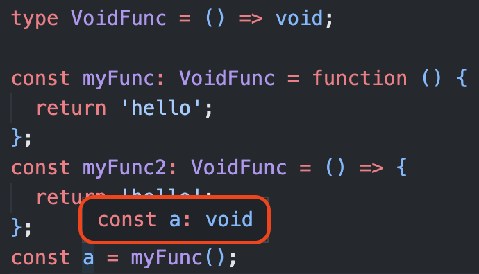

## void의 기본 선언 방식

void는 TypeScript에서 흔하게 사용하거나 추론되는 타입이다. 주로, 함수에서 `return`이 없을 경우 return 타입으로 void를 사용한다.

> `void`는 값을 반환하지 않는 함수의 반환 값을 의미합니다. 함수에 `return`문이 없거나, 명시적으로 값을 반환하지 않을 때, 추론되는 타입입니다. [공식문서](https://www.typescriptlang.org/ko/docs/handbook/2/functions.html#void)

따라서 아래와 같이 사용할 수 있다.

```ts{6}
function func(): void {
  console.log('a');
}

function errorfunc(): void {
  return 'a'; // 👾error! : 'string' 형식은 'void' 형식에 할당할 수 없습니다.
}
```

func 함수를 실행하면 값이 반환되는 것이 아니라 console을 찍고 함수는 종료된다. 하지만, errorFunc 함수를 실행하면 리턴 타입으로 `void`를 명시해 주었기 때문에 return 문에서는 에러가 발생한다.

아래의 코드도 함께 보자.

```ts
function func(): void {
  return; // 성공
}
function func2(): void {
  return undefined; // 성공
}
```

`undefined`를 return 하면 아무 에러가 발생하지 않는다. JavaScript에서는 아무것도 반환하지 않는 함수는 암묵적으로 undefined 값을 반환하기 때문이다. 하지만, void는 undefined 타입은 다르다. 단지 void 반환 값으로 undefined가 허용될 뿐이다.

※ tsconfig.json의 strictNullChecks 옵션을 false로 주면 반환 값으로 undefined 뿐 아니라 null도 허용한다.

<br/>

## void 타입은 다른 타입의 값을 return 할 수도 있다

void를 반환 타입으로 지정했을 때, undefined 외에 다른 타입의 값도 반환 할 수도 있다. 공식문서를 조금 더 살펴보도록 하자.

> `void` 반환 타입으로의 문맥적 타이핑은 함수를 아무것도 반환하지 **않도록** 강제하지 **않습니다**. [공식문서](https://www.typescriptlang.org/ko/docs/handbook/2/functions.html#%ED%95%A8%EC%88%98%EC%9D%98-%ED%95%A0%EB%8B%B9%EA%B0%80%EB%8A%A5%EC%84%B1)

위와 같이 번역 되어 있다. 조금 더 쉬운 말로 바꾸어보면, ' `void` 반환 타입은 함수가 다른 값을 반환할 수도 있다.'라는 의미이다.

### 함수 표현식에서 void

```ts
type VoidFunc = () => void;

const myFunc: VoidFunc = function () {
  return 'hello'; // 성공
};
const myFunc2: VoidFunc = () => {
  return 'hello'; // 성공
};
```

VoidFunc라는 함수를 정의하는 타입을 만들고, 함수 `표현식`에 타입을 지정해 사용했다. 반환 타입이 void 임에도 에러가 발생하지 않는 코드다.

뭔가 이상하다. `VoidFunc` 타입은, 함수의 반환 타입이 `void` 이고, **myFunc**, **myFunc2** 변수에 string 타입을 반환하는 함수가 할당되었다.



반환 값을 변수에 할당하고 마우스를 올려보면 사진과 같이 TypeScript는 반환 값을 `void`로 추론하고 있다. 그렇다면 method는 어떨까?

### 메서드에서 void

```ts{3,6}
const car = {
  move(): void {
    return 'move!'; // 👾error! : 'string' 형식은 'void' 형식에 할당할 수 없습니다.
  },
  break: function (): void {
    return []; // 👾error! : 'never[]' 형식은 'void' 형식에 할당할 수 없습니다.
  },
};
```

메서드의 return 타입으로 선언했을 경우는 에러가 발생했다. 하지만, type 혹은 interface로 메서드의 함수 형태의 타입을 만들고, 이를 객체에 타이핑 해 사용했을 경우에는 에러가 발생하지 않는다.

```ts
// interface로 선언해도 마찬가지
type Car = {
  move: () => void;
  break: () => void;
};

const car: Car = {
  // 메서드 축약 표현
  move() {
    return 'move!'; // 성공
  },
  // ES5 메서드
  break: function () {
    return 'break!'; // 성공
  },
};
```

TypeScript는 JavaScript가 런타임에서 발생하는 에러를 방지하기 위해 만들어졌다. 그렇다면, void가 반환 타입으로 사용하면 undefined를 제외하고 어떤 값로 return 하면 안되는 것이 TypeScript의 의도에 맞을 것이다. 그렇다면 TypeScript에서 왜 이런 void 타입에 대한 예외를 두었을까?

## void에 예외를 둔 이유

```ts
const src = [1, 2, 3];
const dst = [0];

src.forEach(el => dst.push(el));
```

단순한 `Array.prototype.forEach` 메서드와 `Array.prototype.push` 메서드다. 하지만, push 메서드는 **배열의 길이**를 반환한다. 우선 push 메서드를 간단하게 TypeScript로 구현해보자.

```ts{17,20}
type MyArrayLike<T> = {
  length: number;
  [key: number]: T;
};

const arr: MyArrayLike<string> = { 0: 'one', length: 1 };
const value = 'two';

function myPush(array: MyArrayLike<unknown>, arg: unknown) {
  if (array.length) {
    array[array.length] = arg;
    array.length += 1;
  } else {
    array[0] = arg;
    array.length = 1;
  }
  return array.length;
}

console.log(myPush(arr, value)); // 2
console.log(Array.from(arr)); // [ 'one', 'two' ]
```

myPush 메서드는 array에 값을 추가하고, 추가한 값을 return 한다. (ArrayLike는 그냥 넣어보았다..) 이는 실제 `push` 메서드를 모방해서 만든 것인데, 따라서 `src.forEach((el) => dst.push(el));` 이 코드의 forEach 메서드 내부에서의 콜백 함수는 length의 타입인, number 타입의 값을 반환하고 있다.

`lib.es5.d.ts` 파일에 forEach가 어떻게 정의되어 있는지 확인해보자.

```ts
forEach(callbackfn: (value: T, index: number, array: T[]) => void, thisArg?: any): void;
```

void가 총 두번 사용되었는데, 콜백 함수에서 반환 타입인 void와 forEach 메서드 자체에서 반환 타입으로 사용된 void다. 즉, callback 함수 내부의 push 메서드는 number 타입의 값을 반환하는데도 error가 발생하지 않았다.

이제, forEach를 본따 `myPush`를 사용하는 `myForEach`를 만들어보자.

```ts{3,9}
type MyForEach<T> = (
  target: MyArrayLike<T>,
  callbackfn: (value: T, index: number, array: T[]) => void, // void 반환
  thisArg?: any
) => void;

const myForEach: MyForEach<string> = (target, callbackfn, thisArg = null) => {
  for (let i = 0; i < target.length; i++) {
    callbackfn(target[i], i, Array.from(target)); // 이 부분에서 number 타입인 length가 반환된다.
  }
};

const newArr = { length: 0 };
myForEach({ 0: '0', 1: '1', 2: '2', 3: '3', length: 4 }, (v, i) =>
  myPush(newArr, `${v}입니다.`)
);

console.log(Array.from(newArr));
// [ '0입니다.', '1입니다.', '2입니다.', '3입니다.' ]
```

`callbackfn`의 반환 타입은 void 이지만, myForEach 함수 내부에서 실행된 `callbackfn`인, `myPush`는 number 타입을 반환한다. 하지만 문제 없이 실행되었다. 정리해보자.

- forEach 함수 내부의 콜백 함수의 반환 타입 void : 값을 반환할 수 있다.
- forEach 함수 자체의 반환 타입 void : 값을 반환할 수 없다.(undefined만 가능)

이를 통해 생각해보면, TypeScript는 JavaScript를 문제 없이 구현하기 위해 void 반환 타입에 예외를 둔 것이다. 콜백 함수를 단순화 해서 살펴보면 아래와 같다.

```ts
function callbackWrapper(callback: () => void): void {}
callbackWrapper(() => {
  return 10; // 성공
});
```

class에서는 경우가 조금 다르다.

### class에서의 void

```ts{10,14}
class MyClass {
  instanceMethod: () => void;
  constructor() {
    this.instanceMethod = () => {
      return 10; // 성공
    };
  }

  prototypeMethod(): void {
    return 'prototype'; // 👾error! : 'string' 형식은 'void' 형식에 할당할 수 없습니다.
  }

  static staticMethod(): void {
    return false; // 👾error! : 'boolean' 형식은 'void' 형식에 할당할 수 없습니다.
  }
}
```

- 인스턴스 메서드 : 값 반환 **가능**
- 프로토타입 메서드 : 값 반환 **불가능**
- 스태틱 메서드 : 값 반환 **불가능**

인스턴스 메서드만 값을 반환해도 사용할 수 있다. 인스턴스 메서드를 선언하고, 할당하는 형태가 마치 '**함수 표현식**'과 비슷하게 생겼다. 타이핑 형태의 차이점은 아래와 같다.

- 인스턴스 메서드는 필드에서 타입이 선언 되었고, 할당 될 때 그 타입을 **따른다**.
- 프로토타입, 스태틱 메서드는 선언과 동시에 그 자리에 반환 타입이 **선언 되었다**.

### void의 2가지 형태

정리하자면, 타입스크립트에서 void는 2가지 형태로 사용할 수 있다.

1. 반환 값이 존재하면 안된다. (undefind만 가능하다)
2. return에 어떤 값이 와도 상관은 없지만, 사용하지 않는다는 뜻으로 해석한다.

그렇다면, 정확히 언제 void가 값을 반환할 수 있고 값을 반환할 수 없을까?

1. 타입으로 분리되지 않은 함수 자체에 붙어 있는 void 값은 return 값이 존재하면 안된다.
2. 타입으로 분리되거나 타입이 선언과 할당이 따로 나뉘어 있는 void 값은 값이 존재해도 된다.

<br/>

## 그럼에도 void 사용하기

TypeScript는 컴파일 시점에 JavaScript 파일로 변환되어, 타입과 관계 없이 void 타입을 지정했더라도 정상적으로 값이 반환 될 것이다. 즉, return 문을 지정했더라도 그것을 활용할 수 있다. 사라지는 타입 영역이 아닌, 값 영역이기 때문이다.

그럼에도 void를 명시적으로 선언하기를 추천한다.

```ts{7}
type VoidFunc = () => void;
const myFunc: VoidFunc = () => {
  return 'hello'; // 성공
};

let myString = myFunc(); // myString은 void 타입으로 추론된다.
myString = 'something'; // 👾error! : 'string' 형식은 'void' 형식에 할당할 수 없습니다.
```

void로 반환 타입을 설정했고, void 타입의 값이 반환되어 `myString` 변수에 할당 되었다. 그리고, myString에 string 타입의 리터럴 값을 할당했다. 그랬더니 에러가 발생했다. `VoidFunc`의 반환 타입을 보고 TypeScript가 `myString` 변수에 void 타입으로 반환 되었다고 추론하고 있기 때문이다.

따라서 반환 타입이 타입으로 명시되어 있기 때문에 실제 값을 반환한다 하더라도 타입 검사에서 이를 체크해주기 때문에 안전한 타이핑이 가능하다. 하지만, 아래와 같이 타입을 `void -> unknown -> string` 으로 단언해주면 사용은 가능하다.

```ts
let myString = myFunc() as unknown as string; // 타입 단언으로 우회
myString = 'something'; // 성공
```

하지만, 타입 단언은 위험하기 때문에 웬만하면 사용하면 안된다. 정말 불가피하게 사용해야 한다면 `as unknown as [원하는타입]` 으로 사용하자.

※ void는 타입단언으로 바로 원하는 타입으로 변경할 수 없고, 모든 타입의 상위 타입인 unknown으로 단언 후 단언할 수 있다.

---

void와 같이 어떨 때는 값을 반환해도 오류가 발생하지 않고, 어떨 때는 발생하는 지점이 있다. 이는 JavaScript의 기존 동작을 헤치지 않고 타입을 보장해주어야 하기 때문인데, TypeScript에서 이런 부분이 꽤나 많다. 예를 들면, 잉여 타입 체크라는 개념도 이와 비슷하다.

void 반환 타입을 사용했는데 값을 반환 했음에도 타입 오류가 나지 않는다면 void 선언 위치를 잘 살펴보자.

> 참고
>
> - [TypeScript 공식 문서](https://www.typescriptlang.org/ko/docs/handbook/2/functions.html#void)
> - [TypeScript Wiki Github](https://github.com/Microsoft/TypeScript/wiki/FAQ#why-are-functions-returning-non-void-assignable-to-function-returning-void)
> - [stack overflow](https://stackoverflow.com/questions/49202813/typescript-return-type-void)
